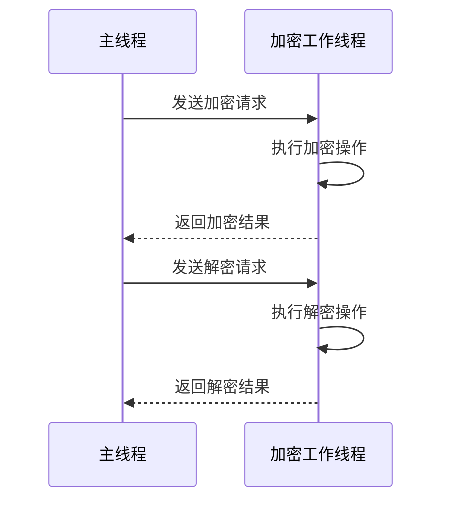
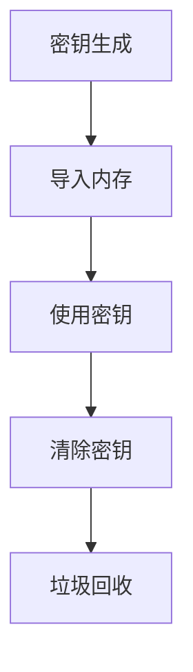
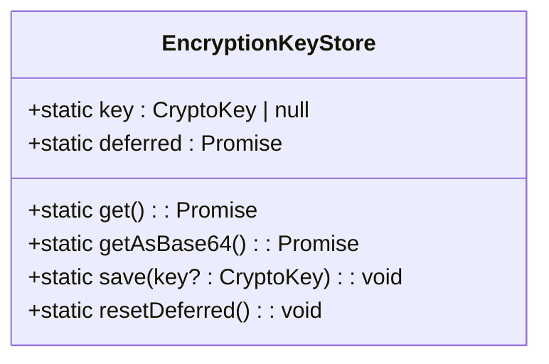

# 密钥存储

<cite>
**本文档中引用的文件**  
- [crypto.worker.ts](file://src/lib/crypto/crypto.worker.ts)
- [keyStore.ts](file://src/lib/passcode/keyStore.ts)
- [utils.ts](file://src/lib/passcode/utils.ts)
- [actions.ts](file://src/lib/passcode/actions.ts)
- [mtproto.worker.ts](file://src/lib/mtproto/mtproto.worker.ts)
- [localStorage.ts](file://src/lib/localStorage.ts)
- [sessionStorage.ts](file://src/lib/sessionStorage.ts)
- [passcodeLockScreenController.tsx](file://src/components/passcodeLock/passcodeLockScreenController.tsx)
</cite>

## 目录
1. [引言](#引言)
2. [密钥存储与内存管理机制](#密钥存储与内存管理机制)
3. [加密工作线程与主线程的安全通信](#加密工作线程与主线程的安全通信)
4. [内存中的密钥保护措施](#内存中的密钥保护措施)
5. [passcode模块中的keyStore持久化存储方案](#passcode模块中的keystore持久化存储方案)
6. [不同浏览器环境下的密钥存储安全性差异](#不同浏览器环境下的密钥存储安全性差异)
7. [密钥生命周期管理最佳实践](#密钥生命周期管理最佳实践)
8. [结论](#结论)

## 引言
本文档详细记录了密钥存储和内存管理机制，重点说明加密工作线程（crypto.worker.ts）与主线程之间的安全通信机制，包括密钥数据的隔离存储和访问控制策略。文档还解释了密钥在内存中的保护措施，如及时清除、防止内存转储和垃圾回收优化。此外，文档描述了passcode模块中keyStore对加密密钥的持久化存储方案，包括与用户密码的绑定机制和存储加密。最后，文档分析了不同浏览器环境下密钥存储的安全性差异和应对策略，并提供了密钥生命周期管理的最佳实践。

## 密钥存储与内存管理机制

密钥存储和内存管理机制是确保应用安全性的核心部分。通过加密工作线程（crypto.worker.ts）与主线程之间的安全通信，密钥数据被隔离存储并受到严格的访问控制。

**Section sources**
- [crypto.worker.ts](file://src/lib/crypto/crypto.worker.ts#L1-L74)
- [keyStore.ts](file://src/lib/passcode/keyStore.ts#L1-L39)

## 加密工作线程与主线程的安全通信

加密工作线程（crypto.worker.ts）与主线程之间的安全通信机制通过MessagePort实现，确保密钥数据在传输过程中的安全性。加密工作线程负责执行加密和解密操作，而主线程则通过MessagePort与加密工作线程进行通信。

**Diagram sources**
- [crypto.worker.ts](file://src/lib/crypto/crypto.worker.ts#L1-L74)
- [cryptoMessagePort.ts](file://src/lib/crypto/cryptoMessagePort.ts#L1-L68)

**Section sources**
- [crypto.worker.ts](file://src/lib/crypto/crypto.worker.ts#L1-L74)
- [cryptoMessagePort.ts](file://src/lib/crypto/cryptoMessagePort.ts#L1-L68)

## 内存中的密钥保护措施

密钥在内存中的保护措施包括及时清除、防止内存转储和垃圾回收优化。通过使用Web Crypto API，密钥在内存中以CryptoKey对象的形式存在，确保密钥不会被直接访问或转储。

**Diagram sources**
- [keyStore.ts](file://src/lib/passcode/keyStore.ts#L1-L39)
- [utils.ts](file://src/lib/passcode/utils.ts#L1-L46)

**Section sources**
- [keyStore.ts](file://src/lib/passcode/keyStore.ts#L1-L39)
- [utils.ts](file://src/lib/passcode/utils.ts#L1-L46)

## passcode模块中的keyStore持久化存储方案

passcode模块中的keyStore通过EncryptionKeyStore类实现，该类负责存储和管理加密密钥。密钥与用户密码绑定，并通过PBKDF2算法进行存储加密，确保密钥的安全性。

**Diagram sources**
- [keyStore.ts](file://src/lib/passcode/keyStore.ts#L1-L39)
- [utils.ts](file://src/lib/passcode/utils.ts#L1-L46)

**Section sources**
- [keyStore.ts](file://src/lib/passcode/keyStore.ts#L1-L39)
- [utils.ts](file://src/lib/passcode/utils.ts#L1-L46)

## 不同浏览器环境下的密钥存储安全性差异

不同浏览器环境下密钥存储的安全性存在差异。现代浏览器支持Web Crypto API，提供了安全的密钥存储和管理功能。然而，旧版浏览器可能不支持这些功能，需要使用降级方案。

**Section sources**
- [crypto.worker.ts](file://src/lib/crypto/crypto.worker.ts#L1-L74)
- [environment.ts](file://src/environment/index.ts#L1-L50)

## 密钥生命周期管理最佳实践

密钥生命周期管理的最佳实践包括密钥的生成、使用、存储和销毁。密钥在使用后应立即清除，并通过垃圾回收机制确保内存中的密钥数据被彻底清除。

**Section sources**
- [actions.ts](file://src/lib/passcode/actions.ts#L1-L169)
- [mtproto.worker.ts](file://src/lib/mtproto/mtproto.worker.ts#L1-L298)

## 结论
本文档详细记录了密钥存储和内存管理机制，说明了加密工作线程与主线程之间的安全通信机制，包括密钥数据的隔离存储和访问控制策略。文档还解释了密钥在内存中的保护措施，如及时清除、防止内存转储和垃圾回收优化。通过分析passcode模块中keyStore的持久化存储方案，文档提供了密钥生命周期管理的最佳实践，确保了应用的安全性。