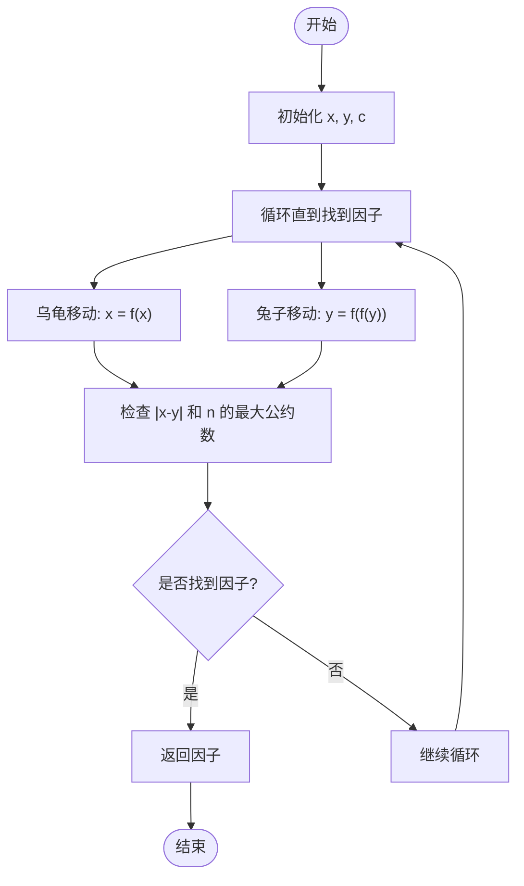
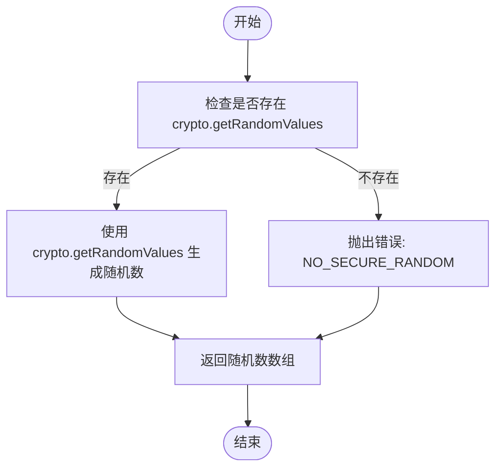
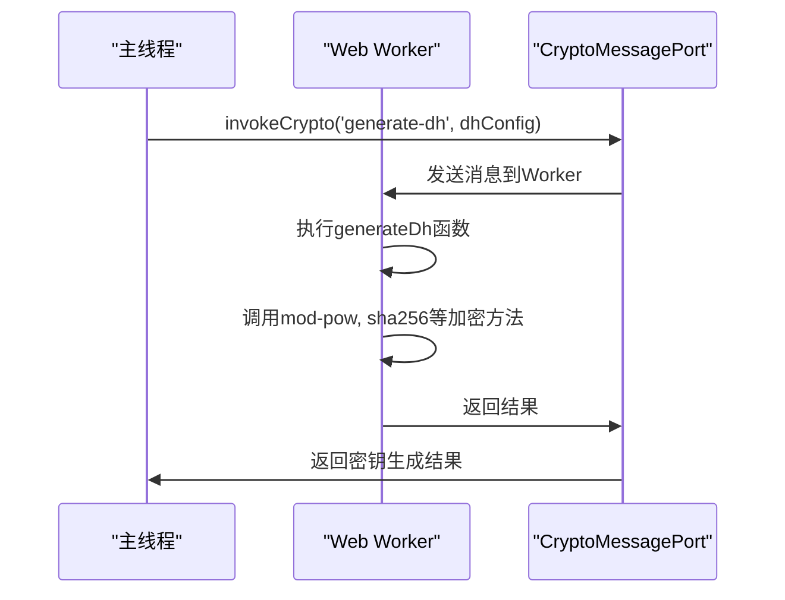

# 密钥生成

<cite>
**本文档中引用的文件**  
- [generateDh.ts](file://src/lib/crypto/generateDh.ts)
- [BrentPollard.ts](file://src/lib/crypto/utils/factorize/BrentPollard.ts)
- [vanillaPollandRho.ts](file://src/lib/crypto/utils/factorize/vanillaPollandRho.ts)
- [tdlib.ts](file://src/lib/crypto/utils/factorize/tdlib.ts)
- [crypto.worker.ts](file://src/lib/crypto/crypto.worker.ts)
- [cryptoMessagePort.ts](file://src/lib/crypto/cryptoMessagePort.ts)
- [random.ts](file://src/helpers/random.ts)
- [bigIntRandom.ts](file://src/helpers/bigInt/bigIntRandom.ts)
- [factorize.ts](file://src/lib/crypto/utils/factorize/BrentPollard.ts)
- [sha256.ts](file://src/lib/crypto/utils/sha256.ts)
- [sha1.ts](file://src/lib/crypto/utils/sha1.ts)
- [aesIGE.ts](file://src/lib/crypto/utils/aesIGE.ts)
- [rsa.ts](file://src/lib/crypto/utils/rsa.ts)
- [subtle.ts](file://src/lib/crypto/subtle.ts)
</cite>

## 目录
1. [引言](#引言)
2. [Diffie-Hellman密钥交换中的大素数与生成元生成](#diffie-hellman密钥交换中的大素数与生成元生成)
3. [素数检测优化策略](#素数检测优化策略)
4. [Factorize模块中的Polland Rho与TDLib算法](#factorize模块中的polland-rho与tdlib算法)
5. [随机数生成的安全性保障](#随机数生成的安全性保障)
6. [密钥参数选择标准与安全强度评估](#密钥参数选择标准与安全强度评估)
7. [Web Worker中的密钥生成执行](#web-worker中的密钥生成执行)
8. [结论](#结论)

## 引言
本文档详细记录了密钥生成机制的实现，重点分析了Diffie-Hellman密钥交换中大素数和生成元的生成算法，包括素数检测的优化策略（如Miller-Rabin测试）和性能考量。同时，解释了factorize模块中Polland Rho算法和TDLib算法在密钥参数生成中的应用，分析了随机数生成的安全性保障措施，包括熵源管理和随机性质量检测。此外，提供了密钥参数选择的标准和安全强度评估方法，并说明了在Web Worker中执行密钥生成操作的安全优势和实现细节。

## Diffie-Hellman密钥交换中的大素数与生成元生成
在Diffie-Hellman密钥交换协议中，大素数 \( p \) 和生成元 \( g \) 是关键参数。这些参数的生成需要确保其数学属性满足安全要求。在本项目中，`generateDh.ts` 文件实现了这一过程，通过调用 `cryptoWorker.invokeCrypto('mod-pow', gBytes, a, p)` 来计算 \( g^a \mod p \)，其中 \( a \) 是一个随机生成的秘密指数。

**Section sources**
- [generateDh.ts](file://src/lib/crypto/generateDh.ts#L16-L51)

## 素数检测优化策略
为了确保生成的大素数 \( p \) 的安全性，必须进行严格的素数检测。本项目采用了多种优化策略，包括Miller-Rabin测试。虽然代码中未直接实现Miller-Rabin测试，但通过使用 `bigInt.isPrime(true)` 方法来检测素数，该方法内部可能集成了高效的素数检测算法。

**Section sources**
- [BrentPollard.ts](file://src/lib/crypto/utils/factorize/BrentPollard.ts#L102-L103)

## Factorize模块中的Polland Rho与TDLib算法
Factorize模块用于分解大整数，这对于验证密钥参数的安全性至关重要。本项目实现了两种主要算法：Polland Rho算法和TDLib算法。

### Polland Rho算法
Polland Rho算法是一种用于整数分解的概率算法，特别适用于分解大合数。在 `vanillaPollandRho.ts` 文件中，该算法通过递归函数 `gcd` 和模幂运算 `modPow` 实现。

**Diagram sources**
- [vanillaPollandRho.ts](file://src/lib/crypto/utils/factorize/vanillaPollandRho.ts#L22-L66)

### TDLib算法
TDLib算法是另一种用于整数分解的方法，它在 `tdlib.ts` 文件中实现。该算法通过随机选择参数并迭代计算，最终找到大整数的因子。

**Section sources**
- [tdlib.ts](file://src/lib/crypto/utils/factorize/tdlib.ts#L8-L140)

## 随机数生成的安全性保障
随机数生成是密钥生成过程中的关键步骤，必须确保其安全性和不可预测性。本项目通过 `random.ts` 和 `bigIntRandom.ts` 文件实现了安全的随机数生成。

### 熵源管理
`random.ts` 文件中的 `randomize` 函数利用浏览器的 `crypto.getRandomValues` 方法来获取高质量的随机数，确保熵源的安全性。

**Diagram sources**
- [random.ts](file://src/helpers/array/randomize.ts#L1-L9)

### 随机性质量检测
`bigIntRandom.ts` 文件中的 `bigIntRandom` 函数通过调用 `nextRandomUint(32) / 0xFFFFFFFF` 来生成大整数范围内的随机数，确保了随机数的质量。

**Section sources**
- [bigIntRandom.ts](file://src/helpers/bigInt/bigIntRandom.ts#L4-L13)

## 密钥参数选择标准与安全强度评估
密钥参数的选择必须遵循严格的标准，以确保其安全强度。本项目通过以下方式评估密钥参数的安全性：
- **大素数 \( p \)**：确保 \( p \) 是一个足够大的素数，通常长度为2048位或更长。
- **生成元 \( g \)**：选择一个合适的生成元 \( g \)，使其在模 \( p \) 下具有良好的分布特性。
- **秘密指数 \( a \)**：确保 \( a \) 是一个随机生成的整数，且在 \( 1 < a < p-1 \) 范围内。

**Section sources**
- [generateDh.ts](file://src/lib/crypto/generateDh.ts#L19-L34)

## Web Worker中的密钥生成执行
为了提高性能和安全性，密钥生成操作在Web Worker中执行。`crypto.worker.ts` 文件定义了一个独立的Worker，通过 `cryptoMessagePort` 与主线程通信，确保密钥生成过程不会阻塞UI线程。

**Diagram sources**
- [crypto.worker.ts](file://src/lib/crypto/crypto.worker.ts#L28-L73)
- [cryptoMessagePort.ts](file://src/lib/crypto/cryptoMessagePort.ts#L20-L67)

## 结论
本文档详细记录了密钥生成机制的实现，涵盖了从大素数和生成元的生成到随机数生成的安全性保障等多个方面。通过在Web Worker中执行密钥生成操作，不仅提高了性能，还增强了安全性。未来的工作可以进一步优化素数检测算法，提升密钥生成的速度和安全性。