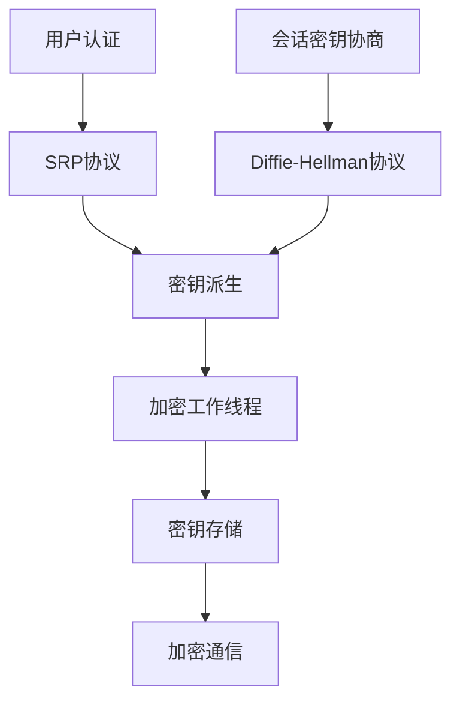
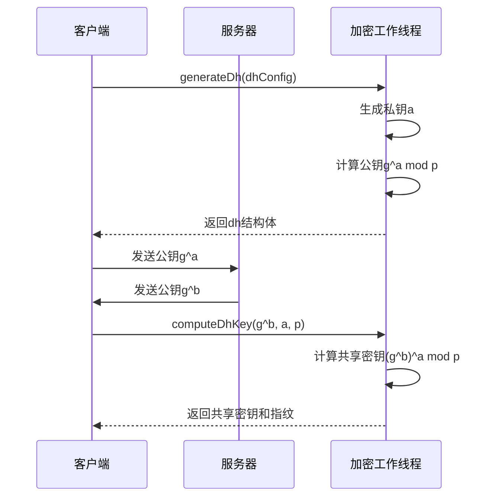
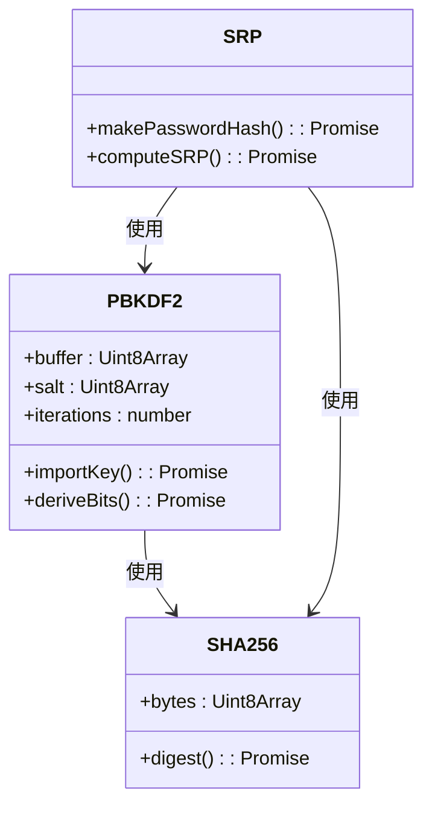
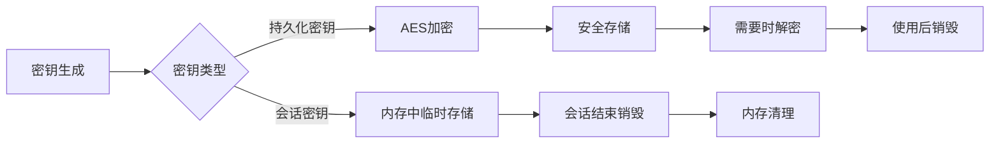

# 密钥管理

<cite>
**本文档中引用的文件**  
- [srp.ts](file://src/lib/crypto/srp.ts)
- [generateDh.ts](file://src/lib/crypto/generateDh.ts)
- [computeDhKey.ts](file://src/lib/crypto/computeDhKey.ts)
- [crypto_methods.ts](file://src/lib/crypto/crypto_methods.ts)
- [crypto.worker.ts](file://src/lib/crypto/crypto_worker.ts)
- [cryptoMessagePort.ts](file://src/lib/crypto/cryptoMessagePort.ts)
- [pbkdf2.ts](file://src/lib/crypto/utils/pbkdf2.ts)
- [sha256.ts](file://src/lib/crypto/utils/sha256.ts)
- [sha1.ts](file://src/lib/crypto/utils/sha1.ts)
- [bytesModPow.ts](file://src/helpers/bytes/bytesModPow.ts)
- [bigIntConversion.ts](file://src/helpers/bigInt/bigIntConversion.ts)
- [srp.test.ts](file://src/tests/srp.test.ts)
- [srp.ts](file://src/mock/srp.ts)
</cite>

## 目录
1. [引言](#引言)
2. [密钥生成与交换机制](#密钥生成与交换机制)
3. [Diffie-Hellman密钥交换协议实现](#diffie-hellman密钥交换协议实现)
4. [SRP协议在用户认证中的应用](#srp协议在用户认证中的应用)
5. [密钥派生函数实现与安全性分析](#密钥派生函数实现与安全性分析)
6. [加密工作线程与主线程间的密钥安全传递](#加密工作线程与主线程间的密钥安全传递)
7. [密钥存储策略与内存保护措施](#密钥存储策略与内存保护措施)
8. [密钥轮换与撤销流程](#密钥轮换与撤销流程)
9. [结论](#结论)

## 引言
本文件全面记录了项目中的密钥生成、交换和管理机制。重点分析了Diffie-Hellman密钥交换协议和SRP（安全远程密码协议）的实现细节，以及密钥派生函数、密钥传递、存储和生命周期管理的安全机制。

## 密钥生成与交换机制
系统实现了基于Diffie-Hellman和SRP协议的双重密钥管理机制，分别用于会话密钥协商和用户身份认证。密钥操作在独立的加密工作线程中执行，通过安全的消息端口进行通信，确保主执行环境与敏感密钥材料的隔离。



**图示来源**  
- [srp.ts](file://src/lib/crypto/srp.ts)
- [generateDh.ts](file://src/lib/crypto/generateDh.ts)

**本节来源**  
- [srp.ts](file://src/lib/crypto/srp.ts#L1-L167)
- [generateDh.ts](file://src/lib/crypto/generateDh.ts#L1-L52)

## Diffie-Hellman密钥交换协议实现
系统实现了完整的Diffie-Hellman密钥交换协议，用于安全地协商会话密钥。协议实现包括大素数生成、模幂运算优化和中间人攻击防护机制。

### 大素数与生成元管理
系统使用预定义的大素数p和生成元g进行密钥交换。这些参数在协议初始化时由服务器提供，并经过严格验证以确保其符合安全要求。

### 模幂运算优化
通过`bytesModPow`函数实现高效的模幂运算，该函数利用`big-integer`库进行大数运算，并通过`bigIntFromBytes`和`bigIntToBytes`进行字节数组与大整数之间的转换。



**图示来源**  
- [generateDh.ts](file://src/lib/crypto/generateDh.ts#L1-L52)
- [computeDhKey.ts](file://src/lib/crypto/computeDhKey.ts#L1-L18)

**本节来源**  
- [generateDh.ts](file://src/lib/crypto/generateDh.ts#L1-L52)
- [computeDhKey.ts](file://src/lib/crypto/computeDhKey.ts#L1-L18)
- [bytesModPow.ts](file://src/helpers/bytes/bytesModPow.ts#L1-L10)

## SRP协议在用户认证中的应用
系统采用SRP（安全远程密码协议）进行用户身份认证，该协议允许在不传输密码的情况下验证用户身份，有效防止中间人攻击和字典攻击。

### 认证流程
SRP认证流程包括密码哈希计算、验证值生成和会话密钥协商三个阶段。客户端使用用户密码和服务器提供的盐值生成密码哈希，然后参与SRP协议完成身份验证。

### 中间人攻击防护
协议通过以下机制防止中间人攻击：
1. 使用SHA-256哈希函数生成会话密钥的验证消息M1
2. 在密钥计算中包含双方的公钥和参数哈希
3. 对生成的密钥进行指纹验证

```mermaid
flowchart TD
A[开始] --> B[输入密码]
B --> C[计算密码哈希x = H(salt1|password|salt1)]
C --> D[计算验证值v = g^x mod p]
D --> E[生成随机数a]
E --> F[计算公钥A = g^a mod p]
F --> G[验证A的有效性]
G --> H{A有效?}
H --> |是| I[计算u = H(A|B)]
H --> |否| E
I --> J[计算S = (B - k*v)^(a + u*x) mod p]
J --> K[计算K = H(S)]
K --> L[生成验证消息M1]
L --> M[发送srp_id, A, M1到服务器]
M --> N[认证完成]
```

**图示来源**  
- [srp.ts](file://src/lib/crypto/srp.ts#L1-L167)

**本节来源**  
- [srp.ts](file://src/lib/crypto/srp.ts#L1-L167)
- [srp.test.ts](file://src/tests/srp.test.ts#L1-L26)

## 密钥派生函数实现与安全性分析
系统实现了基于PBKDF2-HMAC-SHA512的密钥派生函数，用于从密码生成加密密钥。

### PBKDF2实现
密钥派生函数使用Web Crypto API的`SubtleCrypto`接口，通过`deriveBits`方法生成512位的密钥材料。迭代次数设置为100,000次，以增加暴力破解的难度。

### 安全性分析
- 使用双盐值（salt1和salt2）增加密码哈希的复杂性
- 采用SHA-256进行初始哈希计算
- 高迭代次数有效抵御暴力破解攻击
- 密钥材料在加密工作线程中生成和处理



**图示来源**  
- [pbkdf2.ts](file://src/lib/crypto/utils/pbkdf2.ts#L1-L40)
- [sha256.ts](file://src/lib/crypto/utils/sha256.ts#L1-L24)
- [srp.ts](file://src/lib/crypto/srp.ts#L1-L167)

**本节来源**  
- [pbkdf2.ts](file://src/lib/crypto/utils/pbkdf2.ts#L1-L40)
- [sha256.ts](file://src/lib/crypto/utils/sha256.ts#L1-L24)
- [srp.ts](file://src/lib/crypto/srp.ts#L17-L28)

## 加密工作线程与主线程间的密钥安全传递
系统采用加密工作线程模式，将所有密钥操作隔离在独立的执行环境中，通过安全的消息传递机制与主线程通信。

### 工作线程架构
`crypto.worker.ts`文件定义了加密工作线程的主逻辑，注册了包括SHA-1、SHA-256、PBKDF2、模幂运算等在内的多种加密方法。工作线程通过`MessageChannel`与主线程通信。

### 消息端口机制
`cryptoMessagePort.ts`实现了安全的消息端口，使用`SuperMessagePort`封装底层通信。`invokeCrypto`方法允许主线程调用工作线程中的加密函数，确保密钥材料不会暴露在主执行环境中。

```mermaid
graph LR
A[主线程] < --> B[CryptoMessagePort]
B < --> C[MessageChannel]
C < --> D[CryptoWorker]
D --> E[SHA-1]
D --> F[SHA-256]
D --> G[PBKDF2]
D --> H[模幂运算]
D --> I[SRP]
```

**图示来源**  
- [crypto.worker.ts](file://src/lib/crypto/crypto_worker.ts#L1-L74)
- [cryptoMessagePort.ts](file://src/lib/crypto/cryptoMessagePort.ts#L1-L68)

**本节来源**  
- [crypto.worker.ts](file://src/lib/crypto/crypto_worker.ts#L1-L74)
- [cryptoMessagePort.ts](file://src/lib/crypto/cryptoMessagePort.ts#L1-L68)
- [crypto_methods.ts](file://src/lib/crypto/crypto_methods.ts#L1-L43)

## 密钥存储策略与内存保护措施
系统实施了严格的密钥存储策略和内存保护措施，确保密钥材料的安全性。

### 内存保护
- 密钥材料仅在加密工作线程的隔离环境中存在
- 使用`Uint8Array`而非字符串存储敏感数据，避免JavaScript字符串的不可控内存管理
- 在操作完成后及时清理临时变量

### 存储策略
- 会话密钥在内存中临时存储，随会话结束而销毁
- 持久化密钥使用AES本地加密后存储
- 密钥指纹用于验证密钥完整性而不暴露密钥本身



**本节来源**  
- [crypto.worker.ts](file://src/lib/crypto/crypto_worker.ts#L28-L51)
- [aesLocal.ts](file://src/lib/crypto/utils/aesLocal.ts)
- [computeDhKey.ts](file://src/lib/crypto/computeDhKey.ts#L13-L14)

## 密钥轮换与撤销流程
系统实现了密钥轮换和撤销机制，确保长期安全性。

### 密钥轮换
- 定期更新会话密钥
- 支持用户主动更改密码和2FA设置
- 新密码哈希通过SRP协议安全传输

### 撤销流程
- 支持用户注销和账户删除
- 相关密钥材料立即从内存中清除
- 服务器端同步撤销密钥访问权限

**本节来源**  
- [srp.ts](file://src/lib/crypto/srp.ts#L83-L86)
- [accountPassword](file://src/mock/srp.ts#L36-L52)

## 结论
本系统实现了完整的密钥管理机制，包括Diffie-Hellman密钥交换、SRP用户认证、PBKDF2密钥派生等核心功能。通过加密工作线程架构，有效隔离了密钥操作与主执行环境，确保了密钥材料的安全性。系统采用了多层次的安全措施，包括大素数验证、高迭代次数密钥派生、消息验证等，能够有效抵御各种密码学攻击。