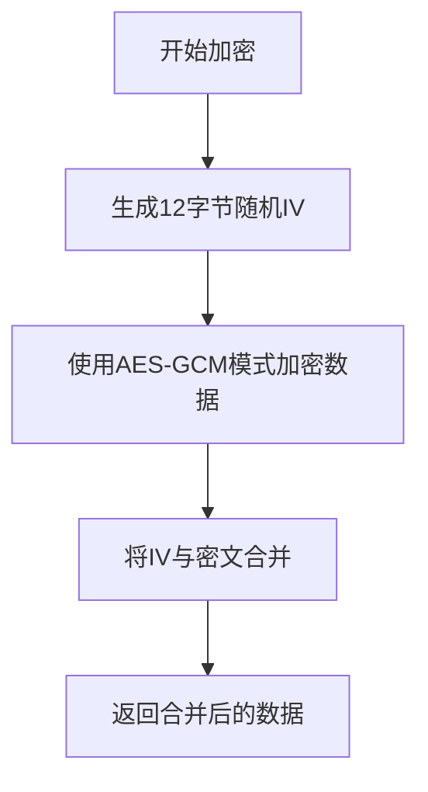
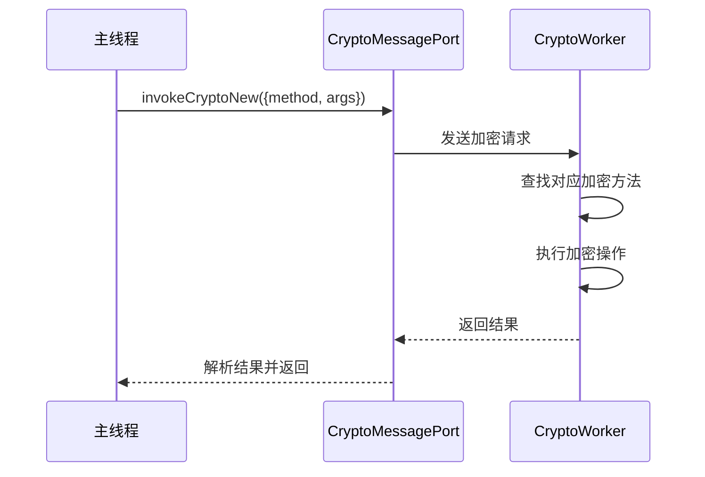
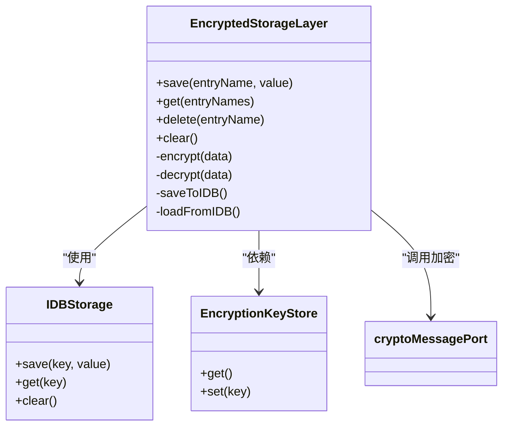
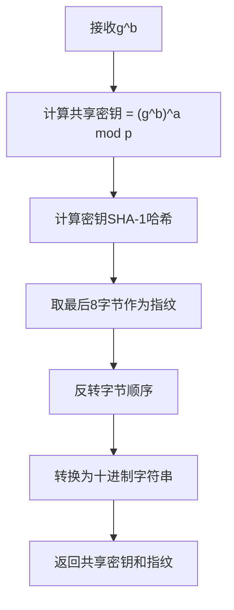

# 数据加密

<cite>
**本文档引用的文件**
- [crypto.worker.ts](file://src/lib/crypto/crypto.worker.ts)
- [encryptedStorageLayer.ts](file://src/lib/encryptedStorageLayer.ts)
- [cryptoMessagePort.ts](file://src/lib/crypto/cryptoMessagePort.ts)
- [aesLocal.ts](file://src/lib/crypto/utils/aesLocal.ts)
- [sha256.ts](file://src/lib/crypto/utils/sha256.ts)
- [rsa.ts](file://src/lib/crypto/utils/rsa.ts)
- [pbkdf2.ts](file://src/lib/crypto/utils/pbkdf2.ts)
- [computeDhKey.ts](file://src/lib/crypto/computeDhKey.ts)
- [generateDh.ts](file://src/lib/crypto/generateDh.ts)
- [srp.ts](file://src/lib/crypto/srp.ts)
- [keyStore.ts](file://src/lib/passcode/keyStore.ts)
</cite>

## 目录
1. [引言](#引言)
2. [加密算法实现](#加密算法实现)
3. [加密工作线程架构](#加密工作线程架构)
4. [本地存储加密机制](#本地存储加密机制)
5. [密钥生成与交换流程](#密钥生成与交换流程)
6. [加密数据生命周期与密钥轮换](#加密数据生命周期与密钥轮换)
7. [性能优化与安全审计建议](#性能优化与安全审计建议)

## 引言
本文档全面记录了本地数据加密策略和实现，重点分析crypto模块的加密算法、加密工作线程架构、本地存储加密保护机制以及密钥管理流程。系统采用多层次加密策略，结合AES、RSA、SHA系列算法和Diffie-Hellman密钥交换协议，确保数据在存储和传输过程中的安全性。

## 加密算法实现

### AES加密算法
系统主要采用AES-GCM模式进行本地数据加密，使用256位密钥和12字节IV。加密过程在`aesLocal.ts`中实现，通过Web Crypto API的`crypto.subtle.encrypt`方法执行。加密时生成随机IV，并将其与密文合并存储，确保每次加密的唯一性。

**Diagram sources**
- [aesLocal.ts](file://src/lib/crypto/utils/aesLocal.ts#L11-L24)

### RSA加密算法
RSA算法用于公钥加密，主要在安全通信初始化阶段使用。实现基于模幂运算，通过`bytesModPow`函数执行加密操作。公钥包含指数和模数，加密时将明文转换为大整数后进行模幂运算。

**Section sources**
- [rsa.ts](file://src/lib/crypto/utils/rsa.ts#L5-L7)

### SHA系列哈希算法
系统实现了SHA-1和SHA-256哈希算法，用于数据完整性验证和密钥派生。SHA-256通过Web Crypto API的`subtle.digest`方法实现，提供256位哈希输出，用于密码哈希、密钥指纹生成等场景。

**Section sources**
- [sha256.ts](file://src/lib/crypto/utils/sha256.ts#L5-L9)

### PBKDF2密钥派生
PBKDF2算法用于从用户密码派生加密密钥，采用SHA-512哈希函数，迭代100,000次。该高迭代次数增加了暴力破解的难度，提高了密码安全性。密钥派生过程使用盐值防止彩虹表攻击。

**Section sources**
- [pbkdf2.ts](file://src/lib/crypto/utils/pbkdf2.ts#L3-L38)

## 加密工作线程架构

### 工作线程消息传递机制
加密工作线程(`crypto.worker.ts`)采用消息端口(MessagePort)与主线程通信，实现加密操作的异步处理。工作线程注册了多种加密方法，通过方法名调用相应的加密函数，确保加密操作不会阻塞主线程。

**Diagram sources**
- [crypto.worker.ts](file://src/lib/crypto/crypto.worker.ts#L30-L51)
- [cryptoMessagePort.ts](file://src/lib/crypto/cryptoMessagePort.ts#L29-L53)

### 加密方法注册
工作线程通过`cryptoMethods`对象注册所有可用的加密方法，包括哈希、对称加密、非对称加密和密钥交换算法。这种设计模式实现了加密功能的模块化和可扩展性。

**Section sources**
- [crypto.worker.ts](file://src/lib/crypto/crypto.worker.ts#L30-L51)

## 本地存储加密机制

### 加密存储层设计
`EncryptedStorageLayer`类负责本地数据的加密存储，使用IndexedDB作为底层存储引擎。所有数据在存储前通过AES-GCM加密，读取时自动解密，为上层应用提供透明的加密存储服务。

**Diagram sources**
- [encryptedStorageLayer.ts](file://src/lib/encryptedStorageLayer.ts#L29-L229)
- [IDBStorage](file://src/lib/files/idb)
- [EncryptionKeyStore](file://src/lib/passcode/keyStore.ts)

### 数据加密流程
数据加密流程包括：获取加密密钥、序列化数据、调用加密工作线程进行AES加密、将IV与密文合并存储。解密流程则相反，先分离IV和密文，然后使用密钥和IV进行解密，最后反序列化数据。

**Section sources**
- [encryptedStorageLayer.ts](file://src/lib/encryptedStorageLayer.ts#L66-L97)

## 密钥生成与交换流程

### Diffie-Hellman密钥交换
系统实现了Diffie-Hellman密钥交换协议，用于安全地建立共享密钥。`computeDhKey.ts`文件中的`computeDhKey`函数计算共享密钥，通过模幂运算结合对方的公钥和自己的私钥生成共享密钥，并使用SHA-1生成密钥指纹用于验证。

**Diagram sources**
- [computeDhKey.ts](file://src/lib/crypto/computeDhKey.ts#L10-L16)

### DH参数生成
`generateDh.ts`文件实现了DH参数的生成流程，包括生成私钥a、计算公钥g^a、添加填充和计算哈希值。系统使用大整数库确保数学运算的准确性，同时通过随机数生成器保证私钥的随机性。

**Section sources**
- [generateDh.ts](file://src/lib/crypto/generateDh.ts#L16-L51)

### SRP安全远程密码协议
SRP协议用于安全的身份验证，防止密码在传输过程中被窃取。实现包括密码哈希生成、验证值计算和会话密钥派生。系统使用多层哈希和PBKDF2增强安全性，确保即使攻击者截获通信也无法获取原始密码。

**Section sources**
- [srp.ts](file://src/lib/crypto/srp.ts#L31-L166)

## 加密数据生命周期与密钥轮换

### 密钥存储与管理
系统通过`EncryptionKeyStore`管理加密密钥，密钥存储在安全的存储区域，仅在需要时加载到内存中。密钥的获取和设置都通过异步方法实现，确保密钥管理的安全性和一致性。

**Section sources**
- [keyStore.ts](file://src/lib/passcode/keyStore.ts)

### 数据生命周期管理
加密数据的生命周期包括：创建时加密存储、读取时自动解密、更新时重新加密、删除时清除内存中的明文副本。系统通过`saveToIDBThrottled`方法实现写操作的节流，避免频繁的磁盘I/O操作。

**Section sources**
- [encryptedStorageLayer.ts](file://src/lib/encryptedStorageLayer.ts#L149-L152)

### 密钥轮换策略
系统支持密钥轮换，通过`reEncrypt`方法可以使用新密钥重新加密所有数据。密钥轮换通常在用户更改密码或系统检测到安全风险时触发，确保即使旧密钥泄露，数据仍然安全。

**Section sources**
- [encryptedStorageLayer.ts](file://src/lib/encryptedStorageLayer.ts#L171-L173)

## 性能优化与安全审计建议

### 性能优化措施
1. 使用Web Worker进行加密操作，避免阻塞主线程
2. 对写操作进行节流，减少磁盘I/O频率
3. 使用Transferable对象在主线程和工作线程间高效传递数据
4. 采用AES-GCM模式，同时提供加密和认证，减少额外的哈希计算

### 安全审计建议
1. 定期审查加密算法的强度，及时升级到更安全的算法
2. 实施严格的密钥管理策略，包括密钥生成、存储、使用和销毁
3. 增加安全日志记录，监控异常的加密操作
4. 定期进行安全审计和渗透测试，发现潜在的安全漏洞
5. 考虑实现前向安全性，确保长期密钥泄露不会影响过去通信的安全性