# MTProto协议安全

<cite>
**本文档中引用的文件**  
- [mtprotoworker.ts](file://src/lib/mtproto/mtprotoworker.ts)
- [messageKeyUtils.ts](file://src/lib/mtproto/messageKeyUtils.ts)
- [crypto_methods.ts](file://src/lib/crypto/crypto_methods.ts)
- [mtproto_config.ts](file://src/lib/mtproto/mtproto_config.ts)
- [computeDhKey.ts](file://src/lib/crypto/computeDhKey.ts)
- [generateDh.ts](file://src/lib/crypto/generateDh.ts)
- [srp.ts](file://src/lib/crypto/srp.ts)
- [mtproto.worker.ts](file://src/lib/mtproto/mtproto.worker.ts)
</cite>

## 目录
1. [引言](#引言)
2. [MTProto安全架构](#mtproto安全架构)
3. [消息加密与密钥生成](#消息加密与密钥生成)
4. [端到端加密与密钥协商](#端到端加密与密钥协商)
5. [消息完整性与重放攻击防护](#消息完整性与重放攻击防护)
6. [消息序列号与确认机制](#消息序列号与确认机制)
7. [安全连接的建立与维护](#安全连接的建立与维护)
8. [错误处理与调试](#错误处理与调试)
9. [配置选项与安全实践](#配置选项与安全实践)
10. [结论](#结论)

## 引言

MTProto协议是Telegram使用的专有通信协议，旨在提供高效、安全的消息传输。本文档详细记录了MTProto协议的安全机制，包括消息加密、密钥生成、完整性保护和重放攻击防护等核心安全特性。通过分析mtprotoworker中的实现，我们将深入探讨协议层的安全通信流程和端到端加密的实现方式。

**本文档中引用的文件**  
- [mtprotoworker.ts](file://src/lib/mtproto/mtprotoworker.ts)

## MTProto安全架构

MTProto协议的安全架构基于分层设计，将加密操作与网络通信分离。在代码实现中，`mtprotoworker.ts`文件定义了`ApiManagerProxy`类，该类通过`MTProtoMessagePort`与工作线程通信，实现了加密操作与主应用逻辑的隔离。

安全架构的关键组件包括：
- **mtprotoworker**: 主要的安全协调器，处理所有与MTProto协议相关的安全操作
- **cryptoMessagePort**: 与加密工作线程通信的端口，确保加密操作在隔离环境中执行
- **messageKeyUtils**: 负责消息密钥的生成和验证
- **crypto_methods**: 提供底层加密算法的实现

这种架构设计确保了加密密钥和敏感数据不会暴露在主应用上下文中，提高了整体安全性。

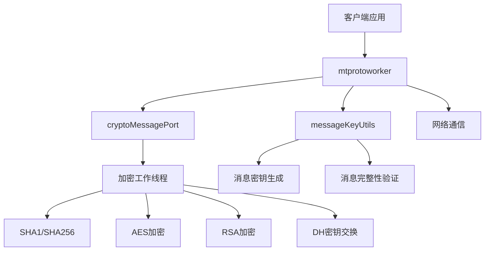

**图源**  
- [mtprotoworker.ts](file://src/lib/mtproto/mtprotoworker.ts)
- [messageKeyUtils.ts](file://src/lib/mtproto/messageKeyUtils.ts)
- [crypto_methods.ts](file://src/lib/crypto/crypto_methods.ts)

**本文档中引用的文件**  
- [mtprotoworker.ts](file://src/lib/mtproto/mtprotoworker.ts)
- [messageKeyUtils.ts](file://src/lib/mtproto/messageKeyUtils.ts)
- [crypto_methods.ts](file://src/lib/crypto/crypto_methods.ts)

## 消息加密与密钥生成

MTProto协议使用AES-256加密算法保护消息内容的安全。消息加密过程涉及消息密钥（msg_key）的生成和AES密钥/IV的派生。

### 消息密钥生成

消息密钥是基于消息内容和认证密钥（auth_key）生成的，用于验证消息的完整性和正确性。在`messageKeyUtils.ts`文件中，`getMsgKey`方法实现了消息密钥的生成逻辑：

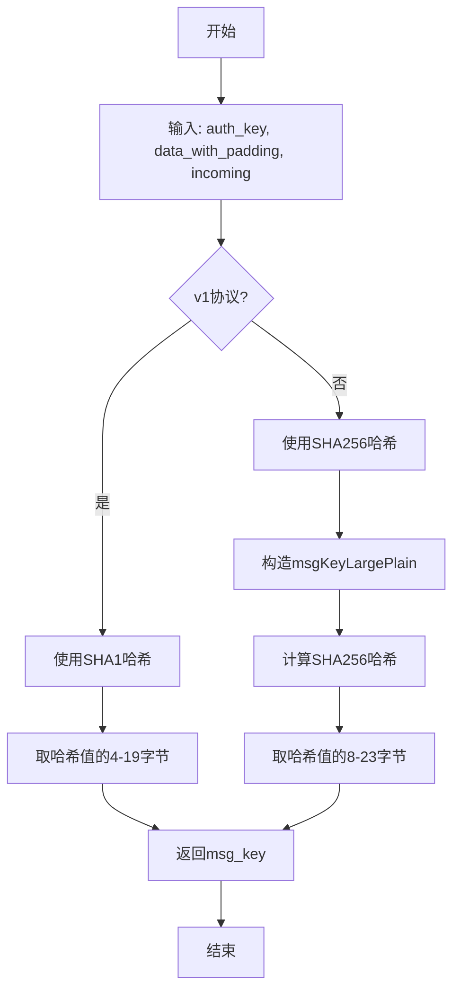

**图源**  
- [messageKeyUtils.ts](file://src/lib/mtproto/messageKeyUtils.ts#L50-L61)

### AES密钥派生

AES密钥和初始化向量（IV）是基于认证密钥和消息密钥派生的。`getAesKeyIv`方法实现了这一过程：

```mermaid
flowchart TD
A[开始] --> B[输入: auth_key, msg_key, incoming, v1]
B --> C{v1协议?}
C --> |是| D[使用SHA1计算四个哈希值]
C --> |否| E[使用SHA256计算两个哈希值]
D --> F[组合哈希值生成aes_key和aes_iv]
E --> G[组合哈希值生成aes_key和aes_iv]
F --> H[返回{aes_key, aes_iv}]
G --> H
H --> I[结束]
```

**图源**  
- [messageKeyUtils.ts](file://src/lib/mtproto/messageKeyUtils.ts#L4-L47)

消息加密过程确保了即使攻击者截获了加密消息，也无法解密内容或篡改消息而不被发现。

**本文档中引用的文件**  
- [messageKeyUtils.ts](file://src/lib/mtproto/messageKeyUtils.ts)

## 端到端加密与密钥协商

MTProto协议支持端到端加密，通过Diffie-Hellman密钥交换协议实现安全的密钥协商。这一过程确保了通信双方可以在不安全的信道上建立共享密钥。

### Diffie-Hellman密钥交换

在`generateDh.ts`文件中，`generateDh`函数实现了DH密钥交换的客户端部分：

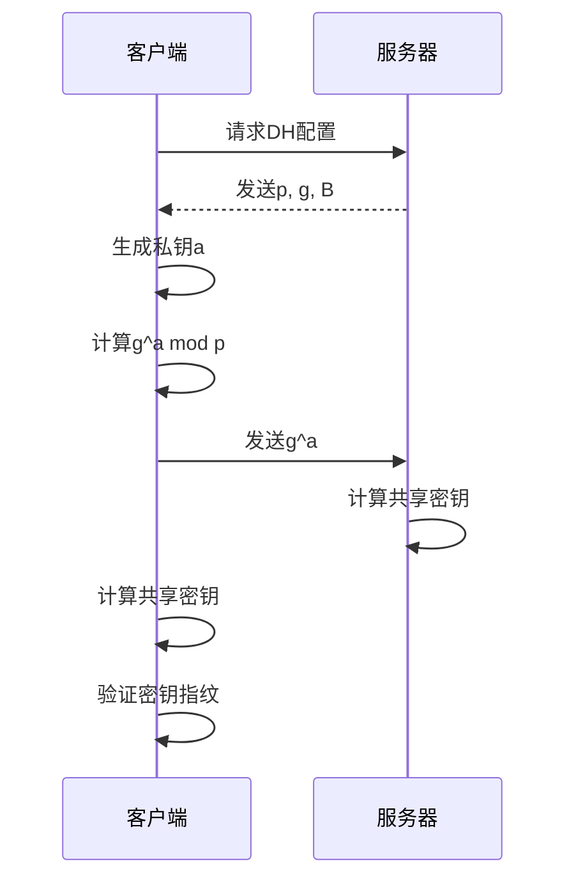

**图源**  
- [generateDh.ts](file://src/lib/crypto/generateDh.ts#L16-L51)

### 共享密钥计算

`computeDhKey.ts`文件中的`computeDhKey`函数负责计算最终的共享密钥：

```mermaid
flowchart TD
A[开始] --> B[输入: g_b, a, p]
B --> C[计算共享密钥: key = g_b^a mod p]
C --> D[计算SHA1哈希]
D --> E[取哈希值的最后8字节作为指纹]
E --> F[将指纹转换为有符号整数]
F --> G[返回{key, key_fingerprint}]
G --> H[结束]
```

**图源**  
- [computeDhKey.ts](file://src/lib/crypto/computeDhKey.ts#L10-L16)

### SRP密码验证

对于用户密码验证，协议使用安全远程密码（SRP）协议，避免在传输过程中暴露密码。`srp.ts`文件实现了SRP协议：

```mermaid
flowchart TD
A[开始] --> B[输入: password, client_salt, server_salt]
B --> C[计算密码哈希]
C --> D[使用PBKDF2进行密钥派生]
D --> E[计算x = hash(password)]
E --> F[计算v = g^x mod p]
F --> G{设置新密码?}
G --> |是| H[返回v的填充版本]
G --> |否| I[执行SRP验证流程]
I --> J[生成随机数a]
J --> K[计算A = g^a mod p]
K --> L[计算u = hash(A, B)]
L --> M[计算S = (B - k*v)^(a + u*x) mod p]
M --> N[派生会话密钥K]
N --> O[计算验证消息M1]
O --> P[返回SRP验证参数]
H --> Q[结束]
P --> Q
```

**图源**  
- [srp.ts](file://src/lib/crypto/srp.ts#L31-L166)

端到端加密机制确保了只有通信双方能够解密消息内容，即使服务器也无法访问明文消息。

**本文档中引用的文件**  
- [generateDh.ts](file://src/lib/crypto/generateDh.ts)
- [computeDhKey.ts](file://src/lib/crypto/computeDhKey.ts)
- [srp.ts](file://src/lib/crypto/srp.ts)

## 消息完整性与重放攻击防护

MTProto协议通过多种机制确保消息的完整性和防止重放攻击。

### 消息完整性保护

消息完整性通过消息密钥（msg_key）和认证密钥（auth_key）的组合验证来实现。每个消息都包含一个消息密钥，接收方使用相同的算法重新计算消息密钥，并与接收到的消息密钥进行比较。

在`messageKeyUtils.ts`中，消息完整性验证流程如下：

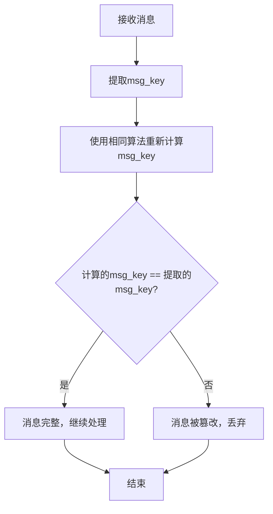

### 重放攻击防护

MTProto协议通过以下机制防止重放攻击：

1. **消息序列号**: 每个消息都有唯一的序列号，接收方会检查序列号的单调递增性
2. **时间戳验证**: 消息包含时间戳，接收方会验证时间戳在合理范围内
3. **会话密钥**: 每个会话使用不同的认证密钥，限制了重放攻击的有效期

在`mtprotoworker.ts`中，通过维护消息状态和序列号来实现重放攻击防护：

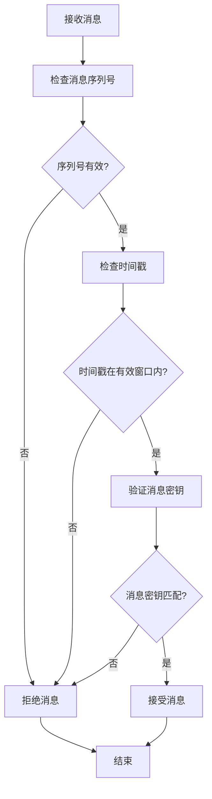

这些机制共同确保了消息的完整性和新鲜性，防止了中间人攻击和重放攻击。

**本文档中引用的文件**  
- [messageKeyUtils.ts](file://src/lib/mtproto/messageKeyUtils.ts)
- [mtprotoworker.ts](file://src/lib/mtproto/mtprotoworker.ts)

## 消息序列号与确认机制

MTProto协议使用消息序列号和确认机制来确保消息的有序传输和可靠交付。

### 消息序列号

每个消息都有一个序列号，用于标识消息的顺序和类型。序列号包含以下信息：

- **消息类型**: 区分普通消息、服务消息等
- **消息方向**: 区分发送和接收的消息
- **消息顺序**: 确保消息按正确顺序处理

在`mtproto_config.ts`中定义了序列号相关的常量：

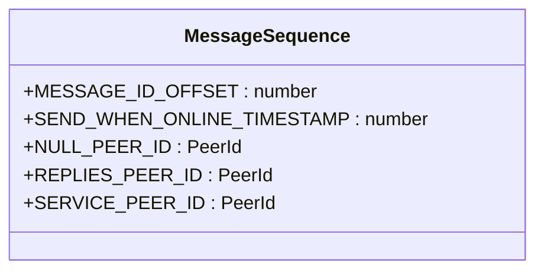

**图源**  
- [mtproto_config.ts](file://src/lib/mtproto/mtproto_config.ts#L28-L32)

### 消息确认机制

MTProto协议使用确认机制确保消息的可靠传输。当客户端接收到消息后，会发送确认消息给服务器。

在`mtprotoworker.ts`中，消息确认的实现如下：

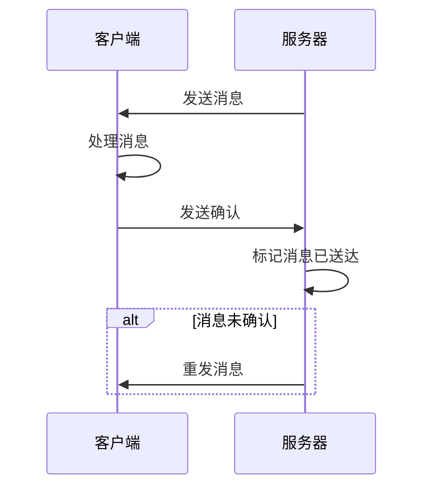

消息确认机制确保了即使在网络不稳定的情况下，消息也能可靠地送达。

**本文档中引用的文件**  
- [mtproto_config.ts](file://src/lib/mtproto/mtproto_config.ts)
- [mtprotoworker.ts](file://src/lib/mtproto/mtprotoworker.ts)

## 安全连接的建立与维护

MTProto协议的安全连接建立和维护过程确保了通信的持续安全性。

### 连接建立

安全连接的建立过程包括以下步骤：

1. **传输层连接**: 建立TCP或WebSocket连接
2. **协议握手**: 交换协议版本和能力
3. **密钥交换**: 执行DH密钥交换或使用现有密钥
4. **身份验证**: 验证用户身份
5. **会话建立**: 建立安全会话

在`mtprotoworker.ts`中，连接建立的流程如下：

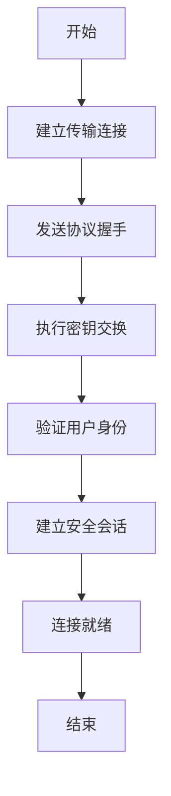

### 连接维护

安全连接的维护包括：

- **心跳机制**: 定期发送心跳包保持连接活跃
- **密钥轮换**: 定期更新会话密钥
- **状态同步**: 同步客户端和服务器的状态
- **错误恢复**: 处理连接中断和恢复

在`mtprotoworker.ts`中，通过`setInterval`和`clearInterval`方法管理连接维护任务：

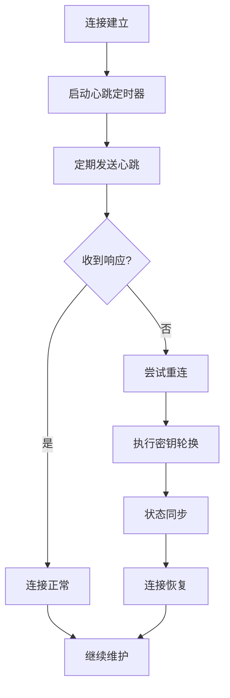

这些机制确保了安全连接的稳定性和持续性。

**本文档中引用的文件**  
- [mtprotoworker.ts](file://src/lib/mtproto/mtprotoworker.ts)

## 错误处理与调试

MTProto协议实现了完善的错误处理和调试机制，确保系统的稳定性和可维护性。

### 错误处理

协议定义了多种错误类型和处理策略：

- **网络错误**: 连接中断、超时等
- **协议错误**: 消息格式错误、序列号错误等
- **加密错误**: 密钥验证失败、解密失败等
- **身份验证错误**: 密码错误、会话过期等

在`mtprotoworker.ts`中，通过事件监听器处理各种错误：

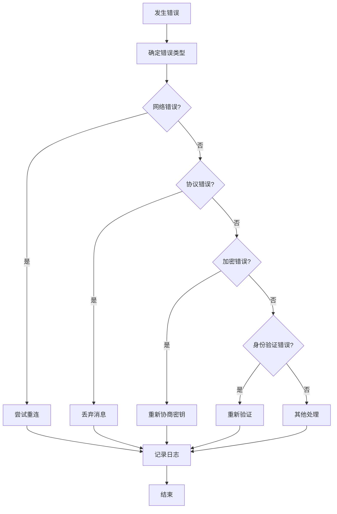

### 调试机制

协议提供了多种调试选项：

- **日志记录**: 详细的日志输出
- **状态监控**: 实时监控连接状态
- **性能分析**: 监控加密和网络性能
- **诊断工具**: 提供诊断接口

在`mtprotoworker.ts`中，通过`log`方法实现调试输出：

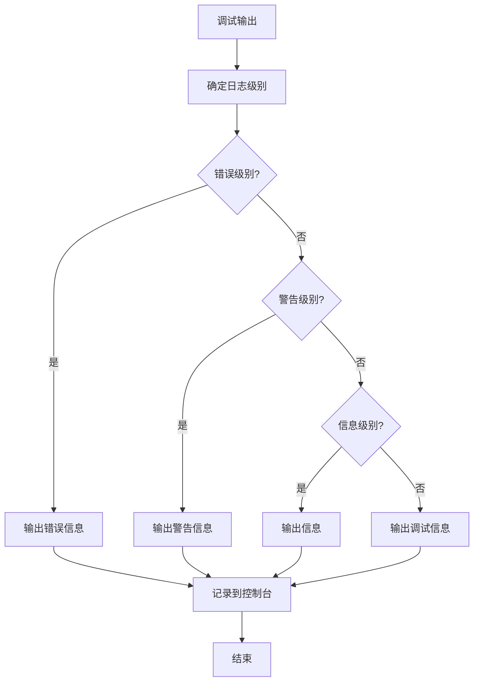

这些机制帮助开发人员快速定位和解决问题。

**本文档中引用的文件**  
- [mtprotoworker.ts](file://src/lib/mtproto/mtprotoworker.ts)

## 配置选项与安全实践

MTProto协议提供了多种配置选项和安全实践，以适应不同的安全需求。

### 安全配置选项

在`mtproto_config.ts`中定义了多种安全相关的配置：

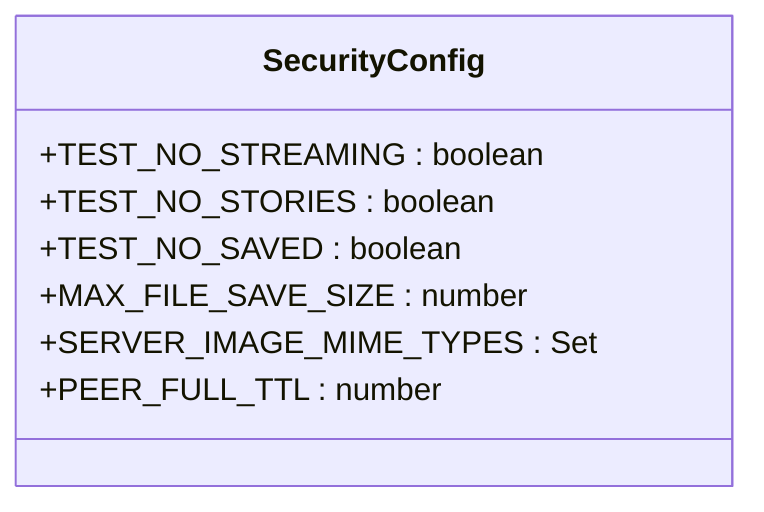

**图源**  
- [mtproto_config.ts](file://src/lib/mtproto/mtproto_config.ts#L47-L50)

### 安全实践

推荐的安全实践包括：

1. **密钥管理**: 安全存储和管理加密密钥
2. **会话管理**: 及时清理过期会话
3. **输入验证**: 严格验证所有输入数据
4. **错误处理**: 妥善处理各种错误情况
5. **日志安全**: 避免在日志中记录敏感信息

在`mtprotoworker.ts`中，通过`EncryptionKeyStore`和`PasscodeLockScreenController`实现密钥和会话管理：

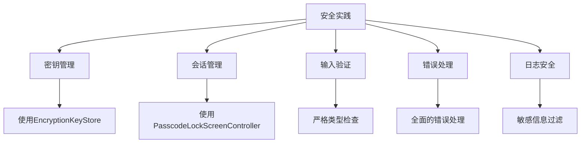

这些配置选项和安全实践帮助开发者构建更安全的应用。

**本文档中引用的文件**  
- [mtproto_config.ts](file://src/lib/mtproto/mtproto_config.ts)
- [mtprotoworker.ts](file://src/lib/mtproto/mtprotoworker.ts)

## 结论

MTProto协议通过多层次的安全机制，为Telegram提供了强大的安全保障。协议的安全特性包括：

1. **强大的加密算法**: 使用AES-256、SHA256等现代加密算法
2. **安全的密钥交换**: 通过DH密钥交换和SRP协议实现安全的密钥协商
3. **完整的消息保护**: 通过消息密钥和序列号确保消息的完整性和新鲜性
4. **可靠的连接管理**: 通过心跳机制和错误恢复确保连接的稳定性
5. **完善的错误处理**: 提供全面的错误处理和调试机制

在实现层面，mtprotoworker通过工作线程隔离加密操作，确保了敏感数据的安全。代码结构清晰，模块化设计良好，便于维护和扩展。

建议开发者在使用MTProto协议时，遵循最佳安全实践，合理配置安全选项，确保应用的整体安全性。

**本文档中引用的文件**  
- [mtprotoworker.ts](file://src/lib/mtproto/mtprotoworker.ts)
- [messageKeyUtils.ts](file://src/lib/mtproto/messageKeyUtils.ts)
- [crypto_methods.ts](file://src/lib/crypto/crypto_methods.ts)
- [mtproto_config.ts](file://src/lib/mtproto/mtproto_config.ts)
- [computeDhKey.ts](file://src/lib/crypto/computeDhKey.ts)
- [generateDh.ts](file://src/lib/crypto/generateDh.ts)
- [srp.ts](file://src/lib/crypto/srp.ts)