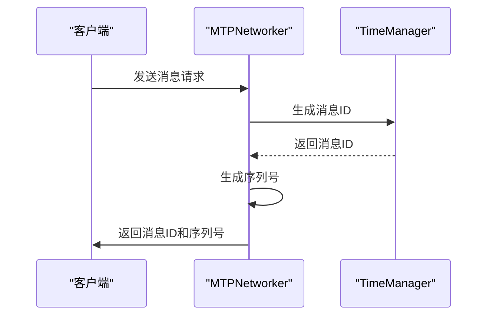
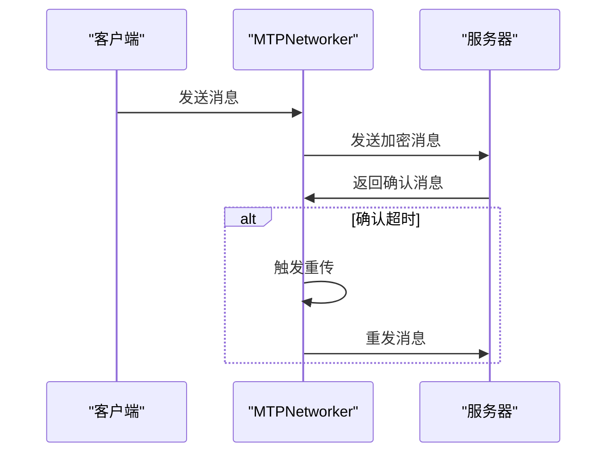
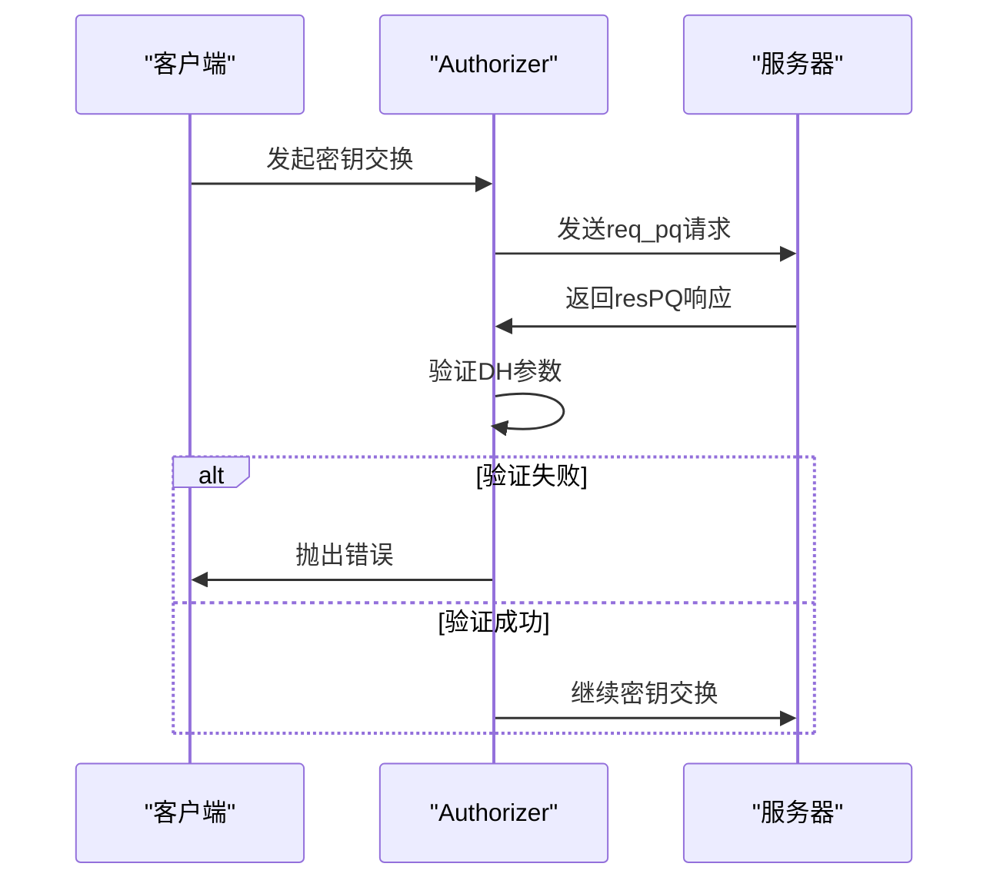
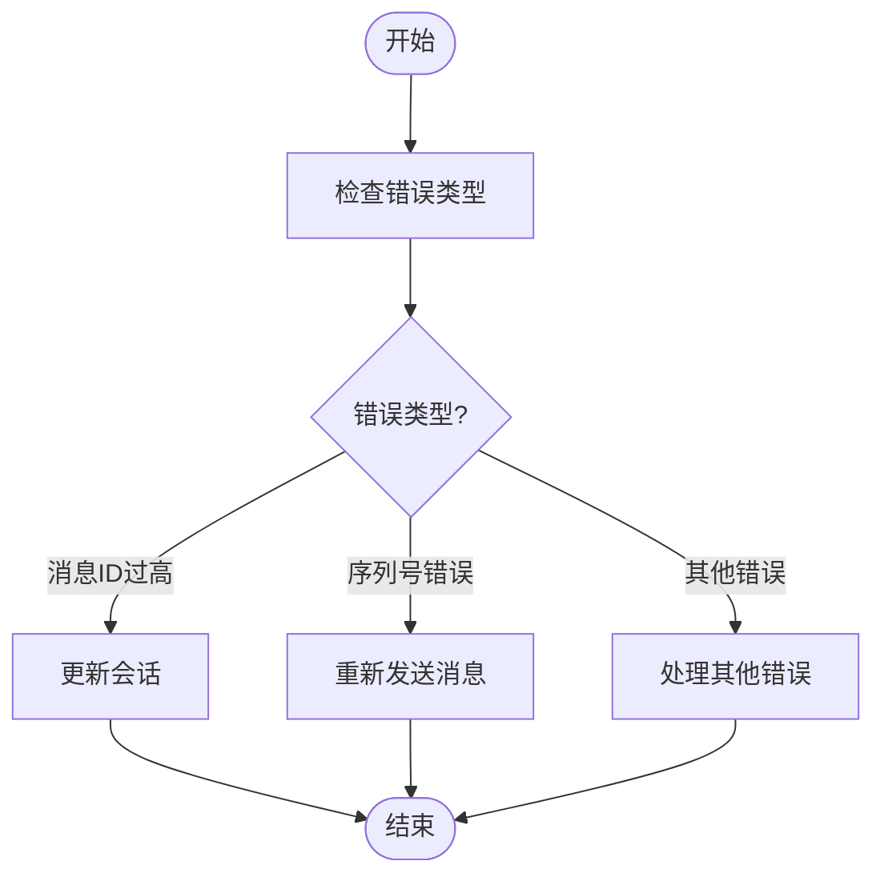
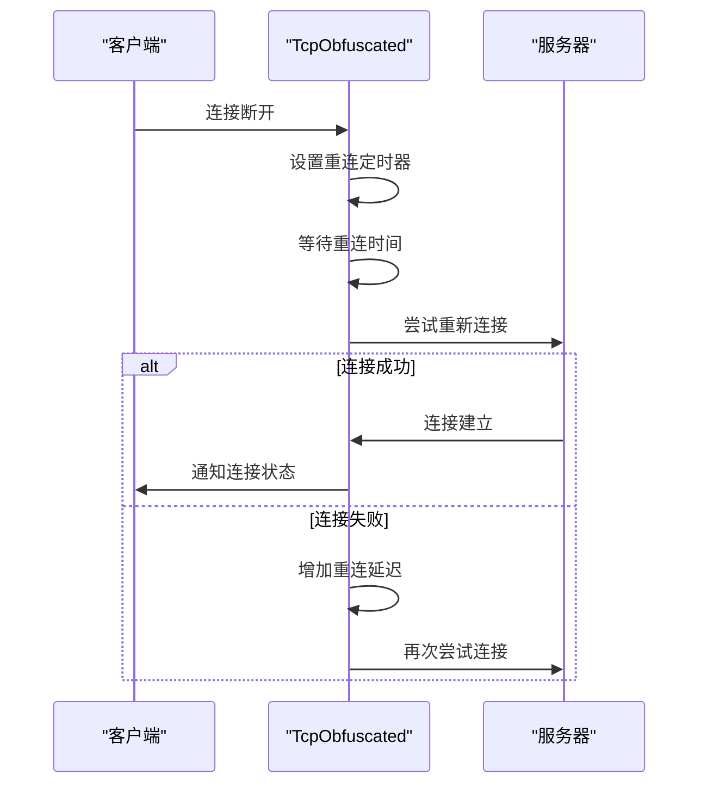

# 协议完整性

<cite>
**本文档引用的文件**   
- [networker.ts](file://src/lib/mtproto/networker.ts)
- [authorizer.ts](file://src/lib/mtproto/authorizer.ts)
- [messageKeyUtils.ts](file://src/lib/mtproto/messageKeyUtils.ts)
- [timeManager.ts](file://src/lib/mtproto/timeManager.ts)
- [tcpObfuscated.ts](file://src/lib/mtproto/transports/tcpObfuscated.ts)
- [mtprotoworker.ts](file://src/lib/mtproto/mtprotoworker.ts)
</cite>

## 目录
1. [消息序列号与顺序性保证](#消息序列号与顺序性保证)
2. [消息确认与重传机制](#消息确认与重传机制)
3. [消息重放攻击防护](#消息重放攻击防护)
4. [错误检测与恢复机制](#错误检测与恢复机制)
5. [网络异常处理与连接恢复](#网络异常处理与连接恢复)
6. [协议完整性配置与调试](#协议完整性配置与调试)

## 消息序列号与顺序性保证

MTProto协议通过消息序列号（seq_no）和消息ID（msg_id）机制确保消息的完整性和顺序性。在`networker.ts`文件中，`generateSeqNo`方法负责生成消息序列号，该方法根据消息是否与内容相关来决定序列号的生成方式。对于与内容相关的消息，序列号会递增，确保消息的顺序性。

**图源**
- [networker.ts](file://src/lib/mtproto/networker.ts#L297-L306)
- [timeManager.ts](file://src/lib/mtproto/timeManager.ts#L73-L97)

**节源**
- [networker.ts](file://src/lib/mtproto/networker.ts#L297-L306)
- [timeManager.ts](file://src/lib/mtproto/timeManager.ts#L73-L97)

## 消息确认与重传机制

为了确保消息的可靠传输，MTProto协议实现了消息确认和重传机制。当客户端发送消息后，服务器会返回确认消息。如果客户端在一定时间内未收到确认消息，将触发重传机制。`networker.ts`文件中的`pushResend`方法负责处理消息的重传逻辑。

**图源**
- [networker.ts](file://src/lib/mtproto/networker.ts#L998-L1033)

**节源**
- [networker.ts](file://src/lib/mtproto/networker.ts#L998-L1033)

## 消息重放攻击防护

MTProto协议通过多种机制防止消息重放攻击。首先，消息ID和序列号的组合确保了每条消息的唯一性。其次，`authorizer.ts`文件中的`verifyDhParams`方法在密钥交换过程中验证Diffie-Hellman参数，防止中间人攻击。

**图源**
- [authorizer.ts](file://src/lib/mtproto/authorizer.ts#L454-L498)

**节源**
- [authorizer.ts](file://src/lib/mtproto/authorizer.ts#L454-L498)

## 错误检测与恢复机制

MTProto协议实现了完善的错误检测和恢复机制。当检测到错误时，系统会根据错误类型采取相应的恢复措施。例如，当消息ID过高或序列号不正确时，系统会更新会话并重新发送消息。

**图源**
- [networker.ts](file://src/lib/mtproto/networker.ts#L1797-L1814)

**节源**
- [networker.ts](file://src/lib/mtproto/networker.ts#L1797-L1814)

## 网络异常处理与连接恢复

在网络异常情况下，MTProto协议通过自动重连和连接状态管理机制确保服务的连续性。`tcpObfuscated.ts`文件中的`reconnect`方法负责处理连接的重新建立。

**图源**
- [tcpObfuscated.ts](file://src/lib/mtproto/transports/tcpObfuscated.ts#L161-L185)

**节源**
- [tcpObfuscated.ts](file://src/lib/mtproto/transports/tcpObfuscated.ts#L161-L185)

## 协议完整性配置与调试

MTProto协议提供了多种配置选项和调试方法，以确保协议的完整性和安全性。开发者可以通过配置文件调整协议参数，并使用日志记录功能进行调试。

**图源**
- [mtprotoworker.ts](file://src/lib/mtproto/mtprotoworker.ts#L1-L800)

**节源**
- [mtprotoworker.ts](file://src/lib/mtproto/mtprotoworker.ts#L1-L800)