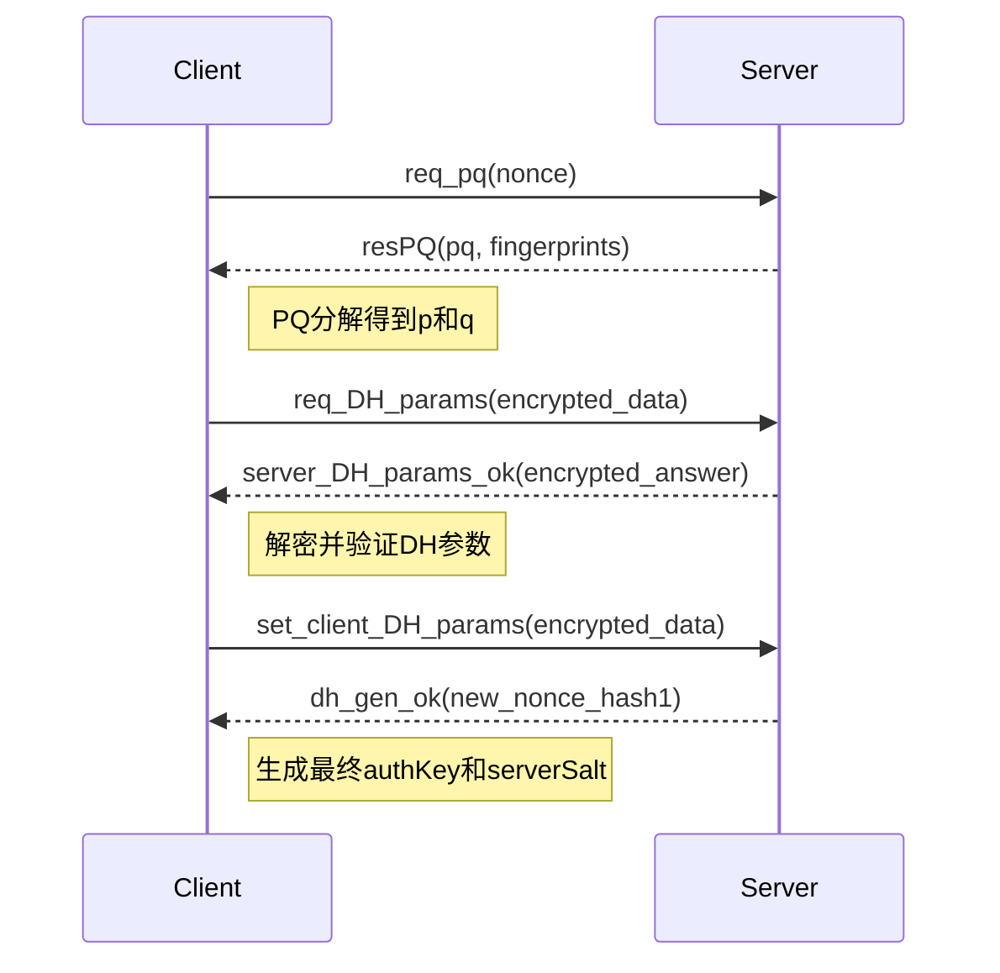
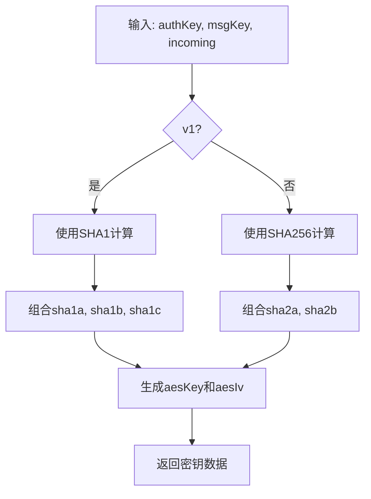

# 密钥管理

<cite>
**本文档中引用的文件**  
- [authorizer.ts](file://src/lib/mtproto/authorizer.ts)
- [networker.ts](file://src/lib/mtproto/networker.ts)
- [messageKeyUtils.ts](file://src/lib/mtproto/messageKeyUtils.ts)
- [cryptoMessagePort.ts](file://src/lib/crypto/cryptoMessagePort.ts)
- [rsaKeysManager.ts](file://src/lib/mtproto/rsaKeysManager.ts)
</cite>

## 目录
1. [引言](#引言)
2. [密钥生成流程](#密钥生成流程)
3. [密钥存储机制](#密钥存储机制)
4. [密钥更新与销毁](#密钥更新与销毁)
5. [密钥派生函数实现](#密钥派生函数实现)
6. [密钥协商安全措施](#密钥协商安全措施)
7. [配置选项与调试方法](#配置选项与调试方法)
8. [总结](#总结)

## 引言
本文档详细记录MTProto协议中的密钥管理机制，包括密钥的生成、存储、更新和销毁流程。重点分析mtprotoworker中如何安全地管理会话密钥和长期密钥，解释密钥派生函数的实现和安全性。同时说明密钥协商过程中的安全措施，包括防止密钥泄露和重放攻击的机制，并描述密钥管理的配置选项和调试方法。

## 密钥生成流程
MTProto协议使用Diffie-Hellman密钥交换算法来生成安全的会话密钥。密钥生成过程分为以下几个步骤：

1. **初始请求（req_pq）**：客户端向服务器发送随机生成的nonce值，服务器返回包含pq值和服务器公钥指纹的响应。
2. **PQ分解**：客户端对pq值进行质因数分解，得到p和q两个质数。
3. **DH参数请求（req_DH_params）**：客户端使用RSA加密包含新生成的nonce和p、q值的数据包，并发送给服务器。
4. **DH参数响应处理**：服务器返回加密的DH参数，客户端使用临时AES密钥解密并验证参数。
5. **客户端DH参数设置（set_client_DH_params）**：客户端生成自己的私钥b和公钥g^b，并发送给服务器。
6. **最终密钥生成**：双方通过Diffie-Hellman算法计算出共享密钥authKey。

在整个过程中，系统使用了多种安全验证机制，如SHA1哈希校验、nonce匹配检查等，确保密钥交换的安全性。

**图示来源**
- [authorizer.ts](file://src/lib/mtproto/authorizer.ts#L215-L662)

## 密钥存储机制
系统采用分层的密钥存储架构，确保密钥的安全性和可访问性：

1. **内存存储**：当前活动的会话密钥存储在内存中，由MTAuthKey类管理。
2. **持久化存储**：长期密钥通过加密存储层保存在IndexedDB中。
3. **密钥标识**：每个authKey都有唯一的64位ID，用于快速查找和验证。

MTAuthKey类是密钥存储的核心数据结构，包含以下属性：
- key：256字节的密钥数据
- id：密钥的唯一标识符
- expiresAt：密钥过期时间戳

系统还实现了密钥绑定机制，将临时授权密钥与永久授权密钥关联，确保密钥使用的连续性和安全性。

**本节来源**
- [authorizer.ts](file://src/lib/mtproto/authorizer.ts#L111-L127)
- [encryptedStorageLayer.ts](file://src/lib/encryptedStorageLayer.ts#L33-L65)

## 密钥更新与销毁
密钥更新和销毁机制确保系统的安全性和健壮性：

1. **会话更新**：当检测到bad_server_salt错误时，系统会自动调用updateSession方法，生成新的sessionId并重置序列号。
2. **密钥过期处理**：临时授权密钥有固定的过期时间（86400秒），过期后需要重新进行授权流程。
3. **异常恢复**：在网络中断或连接失败时，系统会尝试重新连接并恢复密钥状态。

密钥销毁主要通过以下方式实现：
- 显式调用destroy方法清理资源
- 在切换账户或注销时清除相关密钥
- 定期清理不再使用的旧会话密钥

这些机制共同保证了密钥生命周期的完整管理，防止陈旧密钥带来的安全风险。

**本节来源**
- [networker.ts](file://src/lib/mtproto/networker.ts#L250-L255)
- [authorizer.ts](file://src/lib/mtproto/authorizer.ts#L109-L110)

## 密钥派生函数实现
密钥派生函数是MTProto安全体系的核心组成部分，主要由MessageKeyUtils类实现：

1. **AES密钥和IV生成**：根据authKey和msgKey生成用于消息加密的AES密钥和初始化向量。
2. **消息密钥计算**：通过SHA256哈希函数计算消息的校验密钥。
3. **双版本支持**：同时支持v1和v2两种密钥派生算法，确保向后兼容性。

对于v2算法，密钥派生过程如下：
- 使用SHA256对msgKey与authKey的不同部分进行哈希运算
- 将结果组合成32字节的AES密钥和32字节的IV
- 根据消息方向（incoming/outgoing）选择不同的authKey偏移量

这种设计既保证了密钥的随机性，又实现了高效的密钥派生。

**图示来源**
- [messageKeyUtils.ts](file://src/lib/mtproto/messageKeyUtils.ts#L4-L48)

## 密钥协商安全措施
系统实施了多层次的安全措施来保护密钥协商过程：

1. **参数验证**：
   - 验证dhPrime的值是否符合官方标准
   - 检查gA的范围是否在合理区间内
   - 确保gA不小于2^(2048-64)

2. **防重放攻击**：
   - 使用随机生成的nonce值
   - 通过new_nonce_hash验证响应的完整性
   - 每次协商使用新的会话ID

3. **中间人攻击防护**：
   - 使用预置的RSA公钥进行加密
   - 通过指纹匹配验证服务器身份
   - 实施严格的SHA1哈希校验

4. **错误处理机制**：
   - 对各种异常情况（如dh_gen_retry）进行重试
   - 在验证失败时立即终止协商过程
   - 记录详细的日志用于调试和审计

这些安全措施共同构建了一个可靠的密钥协商通道，有效抵御了常见的网络攻击。

**本节来源**
- [authorizer.ts](file://src/lib/mtproto/authorizer.ts#L454-L498)
- [rsaKeysManager.ts](file://src/lib/mtproto/rsaKeysManager.ts#L60-L143)

## 配置选项与调试方法
系统提供了灵活的配置选项和完善的调试支持：

1. **调试模式**：通过DEBUG常量控制日志输出级别，便于跟踪密钥协商过程。
2. **传输类型选择**：支持WebSocket和HTTPS两种传输方式，可根据网络环境自动选择最优方案。
3. **测试模式**：提供专门的测试公钥和配置，方便开发和测试。

调试方法包括：
- 使用详细的日志记录关键步骤
- 提供可配置的延迟和超时参数
- 支持强制重新连接和会话更新

这些配置和调试工具使得密钥管理系统既适合生产环境，也便于开发和维护。

**本节来源**
- [authorizer.ts](file://src/lib/mtproto/authorizer.ts#L19-L20)
- [networker.ts](file://src/lib/mtproto/networker.ts#L95-L96)

## 总结
本文档全面分析了MTProto协议中的密钥管理机制。系统通过Diffie-Hellman密钥交换算法实现了安全的密钥协商，采用分层存储架构管理密钥生命周期，并实施了多重安全措施防止各种攻击。密钥派生函数的设计兼顾了安全性和效率，而丰富的配置选项和调试工具则确保了系统的可维护性。整体架构体现了现代密码学协议的最佳实践，为即时通讯应用提供了坚实的安全基础。