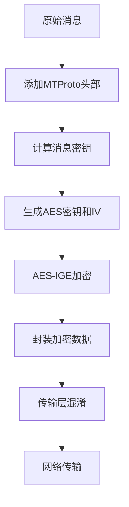
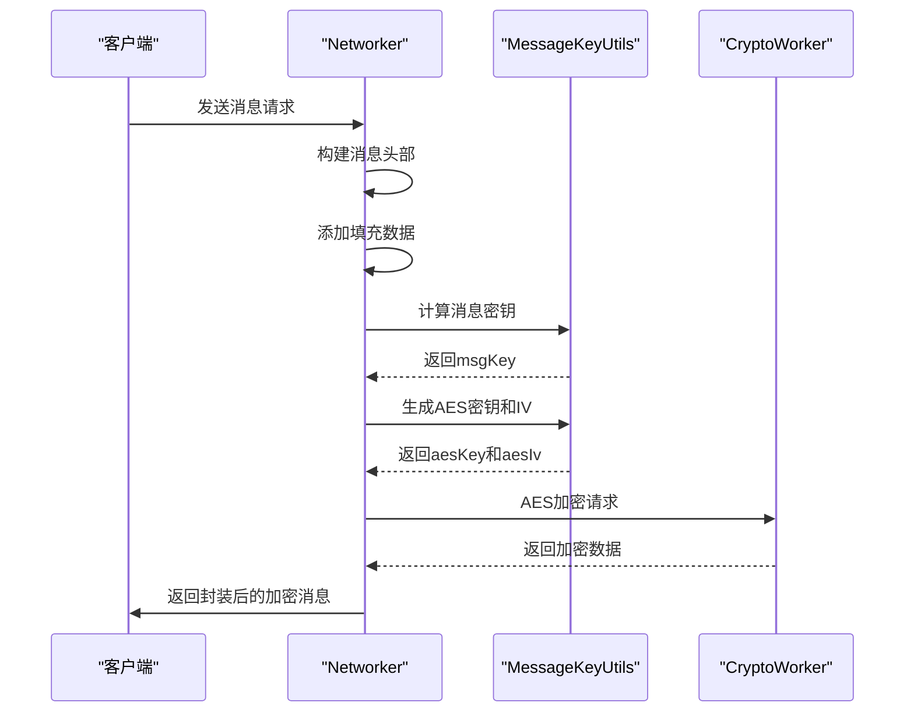
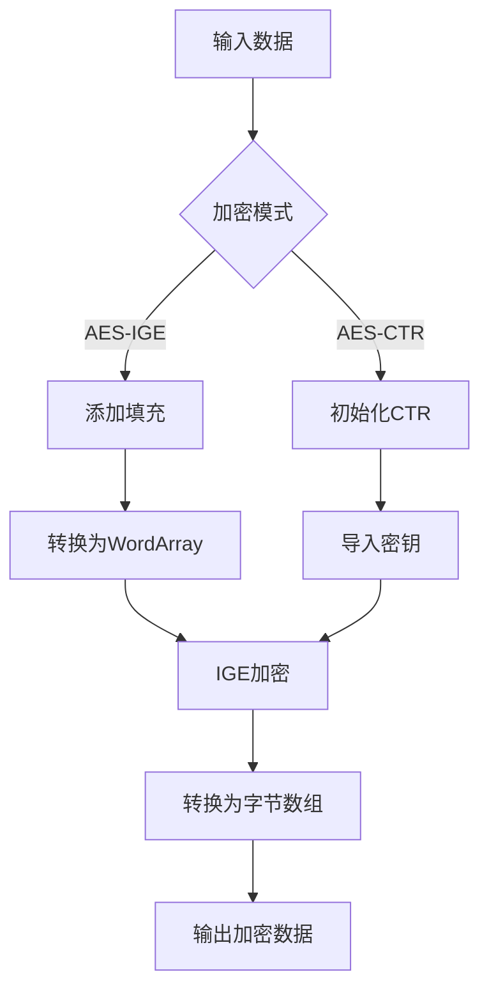
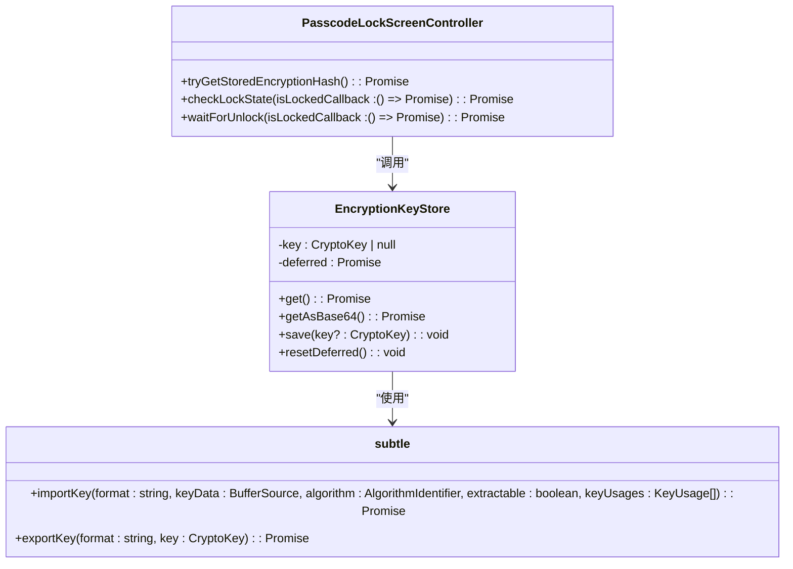
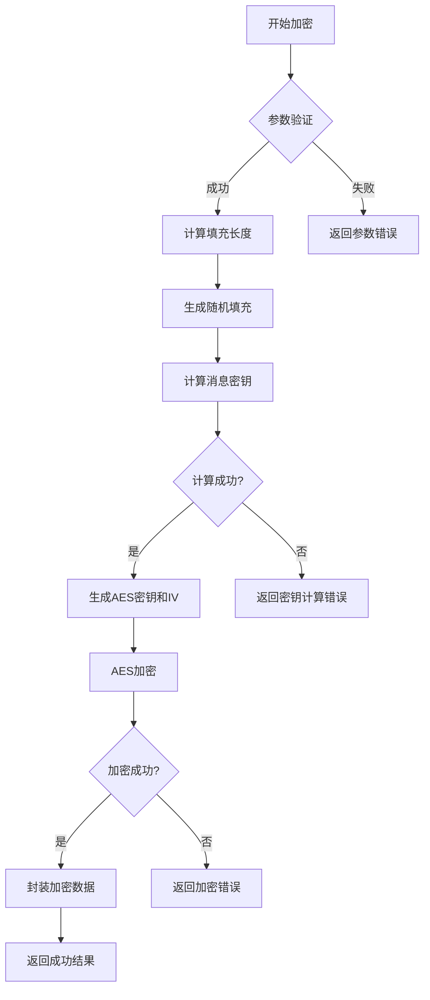
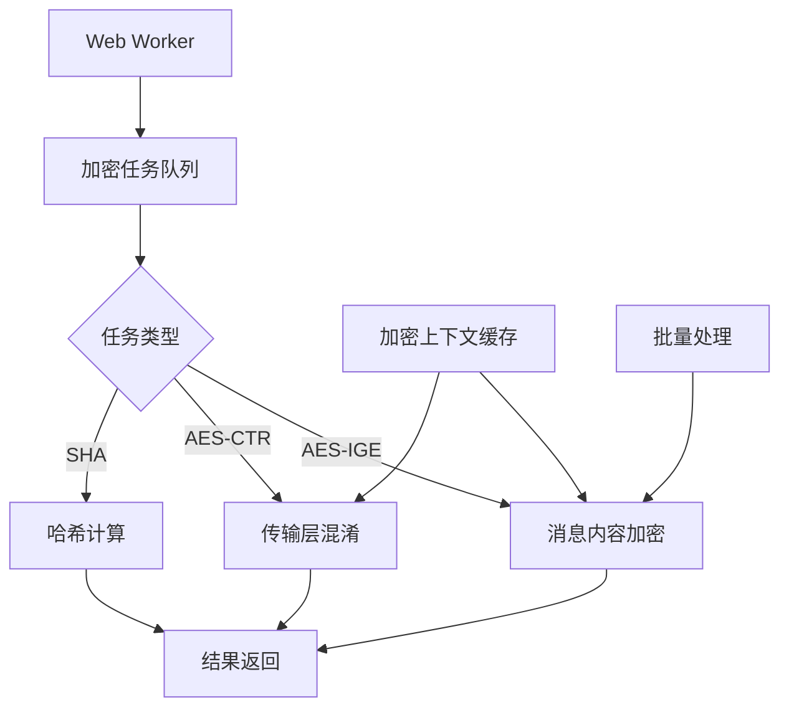

# 消息加密

<cite>
**本文档中引用的文件**  
- [networker.ts](file://src/lib/mtproto/networker.ts)
- [messageKeyUtils.ts](file://src/lib/mtproto/messageKeyUtils.ts)
- [crypto.worker.ts](file://src/lib/crypto/crypto.worker.ts)
- [cryptoMessagePort.ts](file://src/lib/crypto/cryptoMessagePort.ts)
- [aesIGE.ts](file://src/lib/crypto/utils/aesIGE.ts)
- [mtprotoworker.ts](file://src/lib/mtproto/mtprotoworker.ts)
- [obfuscation.ts](file://src/lib/mtproto/transports/obfuscation.ts)
- [aesCtrUtils.ts](file://src/lib/crypto/aesCtrUtils.ts)
- [keyStore.ts](file://src/lib/passcode/keyStore.ts)
- [passcodeLockScreenController.tsx](file://src/components/passcodeLock/passcodeLockScreenController.tsx)
</cite>

## 目录
1. [引言](#引言)
2. [MTProto消息加密机制概述](#mtproto消息加密机制概述)
3. [加密算法选择与实现](#加密算法选择与实现)
4. [mtprotoworker中的加密解密流程](#mtprotoworker中的加密解密流程)
5. [AES加密实现细节](#aes加密实现细节)
6. [密钥管理与安全性保障](#密钥管理与安全性保障)
7. [参数配置与错误处理](#参数配置与错误处理)
8. [性能优化策略](#性能优化策略)
9. [结论](#结论)

## 引言

本文档详细记录了MTProto协议中的消息加密机制，包括加密算法的选择、加密流程的实现、密钥的使用方式以及安全性保障措施。通过分析代码库中的核心组件，重点阐述了`mtprotoworker`如何处理消息的加密和解密过程，深入探讨了AES加密的实现细节和性能优化策略。文档还说明了防止中间人攻击和数据泄露的安全机制，描述了加密过程中涉及的参数配置和错误处理，并提供了实际代码示例来展示加密流程的实现。

**Section sources**
- [mtprotoworker.ts](file://src/lib/mtproto/mtprotoworker.ts#L1-L100)

## MTProto消息加密机制概述

MTProto协议采用分层加密机制来确保消息传输的安全性。该机制主要由两部分组成：消息内容加密和传输层混淆。消息内容加密使用AES-IGE（Infinite Garble Extension）模式对消息体进行加密，而传输层混淆则使用AES-CTR（Counter）模式对整个数据包进行二次加密，以防止流量分析。

消息加密流程始于客户端生成消息体，随后添加必要的MTProto头部信息，包括服务器盐值（server salt）、会话ID（session ID）、消息ID（msg_id）和序列号（seq_no）。在添加填充数据后，系统计算消息密钥（msg_key），并基于授权密钥（auth_key）和消息密钥生成AES加密所需的密钥和初始化向量（IV）。最终，使用AES-IGE模式对消息进行加密，并将加密后的数据与授权密钥ID和消息密钥一起封装发送。



**Diagram sources**
- [networker.ts](file://src/lib/mtproto/networker.ts#L1292-L1334)
- [messageKeyUtils.ts](file://src/lib/mtproto/messageKeyUtils.ts#L50-L62)

## 加密算法选择与实现

MTProto协议在加密算法的选择上采用了AES（Advanced Encryption Standard）作为核心加密算法，具体实现包括AES-IGE和AES-CTR两种模式。AES-IGE模式用于消息内容的加密，而AES-CTR模式则用于传输层的混淆处理。

在代码实现中，AES-IGE加密通过`crypto.worker.ts`中的`aes-encrypt`方法调用，该方法使用`@cryptography/aes`库的IGE模式实现。加密过程首先对输入数据进行填充，确保其长度为16字节的倍数，然后使用提供的密钥和IV进行加密。解密过程则相反，先进行AES-IGE解密，然后移除填充数据。

```mermaid
classDiagram
class CryptoWorker {
+invokeCrypto(method : string, ...args : any[]) : Promise<any>
+aesEncryptSync(bytes : Uint8Array, keyBytes : Uint8Array, ivBytes : Uint8Array) : Uint8Array
+aesDecryptSync(bytes : Uint8Array, keyBytes : Uint8Array, ivBytes : Uint8Array) : Uint8Array
}
class MessageKeyUtils {
+getAesKeyIv(authKey : Uint8Array, msgKey : Uint8Array, incoming : boolean, v1? : boolean) : Promise<{aesKey : Uint8Array, aesIv : Uint8Array}>
+getMsgKey(authKey : Uint8Array, dataWithPadding : Uint8Array, incoming : boolean, v1? : boolean) : Promise<Uint8Array>
}
class CryptoMethods {
+aes-encrypt : typeof aesEncryptSync
+aes-decrypt : typeof aesDecryptSync
+aes-ctr-prepare : typeof aesCtrPrepare
+aes-ctr-process : typeof aesCtrProcess
+aes-ctr-destroy : typeof aesCtrDestroy
}
CryptoWorker --> CryptoMethods : "使用"
MessageKeyUtils --> CryptoWorker : "调用"
```

**Diagram sources**
- [crypto.worker.ts](file://src/lib/crypto/crypto.worker.ts#L30-L51)
- [aesIGE.ts](file://src/lib/crypto/utils/aesIGE.ts#L6-L22)
- [messageKeyUtils.ts](file://src/lib/mtproto/messageKeyUtils.ts#L5-L47)

## mtprotoworker中的加密解密流程

`mtprotoworker`作为MTProto协议的核心组件，负责处理消息的加密和解密流程。加密流程从`getEncryptedOutput`方法开始，该方法首先创建包含MTProto头部信息的数据结构，包括服务器盐值、会话ID、消息ID和序列号。随后，系统计算适当的填充长度，生成随机填充数据，并将原始数据与填充数据合并。

加密流程的关键步骤是调用`getEncryptedMessage`方法，该方法首先使用`MessageKeyUtils.getMsgKey`计算消息密钥，然后使用`MessageKeyUtils.getAesKeyIv`生成AES加密所需的密钥和IV。最后，通过`CryptoWorker.invokeCrypto`调用AES加密方法完成加密过程。



**Diagram sources**
- [networker.ts](file://src/lib/mtproto/networker.ts#L1248-L1334)
- [mtprotoworker.ts](file://src/lib/mtproto/mtprotoworker.ts#L728-L794)

## AES加密实现细节

AES加密在本项目中通过多个层次的封装实现，确保了加密操作的安全性和效率。核心加密功能由`crypto.worker.ts`中的`cryptoMethods`对象提供，其中包含了`aes-encrypt`和`aes-decrypt`方法。这些方法通过Web Crypto API或第三方库`@cryptography/aes`实现底层加密算法。

在`aesIGE.ts`文件中，`aesSync`函数实现了AES-IGE模式的核心逻辑。该函数接受输入数据、密钥和IV，使用`bytesToWordss`将字节数组转换为WordArray格式，然后通过IGE模式进行加密或解密。加密完成后，使用`bytesFromWordss`将结果转换回字节数组格式。

对于传输层混淆，系统使用AES-CTR模式，通过`aesCtrUtils.ts`中的`aesCtrPrepare`、`aesCtrProcess`和`aesCtrDestroy`函数实现。`aesCtrPrepare`函数初始化加密上下文，导入密钥并创建CTR实例；`aesCtrProcess`函数执行实际的加密或解密操作；`aesCtrDestroy`函数则负责清理资源。



**Diagram sources**
- [aesIGE.ts](file://src/lib/crypto/utils/aesIGE.ts#L6-L22)
- [aesCtrUtils.ts](file://src/lib/crypto/aesCtrUtils.ts#L18-L54)
- [subtle.ts](file://src/lib/crypto/subtle.ts#L1-L4)

## 密钥管理与安全性保障

系统的密钥管理机制通过多层次的安全措施来保障数据安全。授权密钥（auth_key）在客户端和服务器之间通过安全的密钥交换协议生成，并存储在内存中。为了防止密钥泄露，系统实现了基于密码的二次加密机制，使用`EncryptionKeyStore`类管理加密密钥。

`EncryptionKeyStore`类提供了密钥的存储、获取和保存功能。当用户设置密码锁时，系统生成一个AES-GCM密钥，并将其存储在`sessionStorage`中。该密钥用于加密本地存储的敏感数据，包括授权密钥和其他加密材料。通过`crypto.subtle.importKey`和`crypto.subtle.exportKey`方法，系统实现了密钥的安全导入和导出。

为了防止中间人攻击，MTProto协议采用了消息密钥（msg_key）机制。每个消息都有唯一的msg_key，该密钥基于消息内容和授权密钥计算得出。服务器在接收消息时会验证msg_key的正确性，任何篡改都会导致验证失败。此外，系统还实现了会话ID和服务器盐值的定期更新，进一步增强了安全性。



**Diagram sources**
- [keyStore.ts](file://src/lib/passcode/keyStore.ts#L5-L38)
- [passcodeLockScreenController.tsx](file://src/components/passcodeLock/passcodeLockScreenController.tsx#L31-L48)
- [subtle.ts](file://src/lib/crypto/subtle.ts#L1-L4)

## 参数配置与错误处理

消息加密过程中的参数配置主要涉及填充长度、加密模式选择和密钥管理。系统通过`getEncryptedOutput`方法中的逻辑动态计算填充长度，确保数据长度为16字节的倍数，并添加随机长度的额外填充以增加安全性。对于不同的协议版本（v1/v2），系统采用不同的填充策略。

错误处理机制贯穿整个加密流程。在密钥计算阶段，系统通过`try-catch`块捕获可能的加密错误，并返回适当的错误信息。在消息验证阶段，系统检查授权密钥ID和消息密钥的有效性，任何不匹配都会导致消息被拒绝。此外，系统还实现了超时机制和重试策略，以应对网络不稳定导致的传输错误。

在`networker.ts`文件中，`parseResponse`方法负责处理服务器响应的解析和验证。该方法首先检查响应中的授权密钥ID是否与本地存储的一致，如果不匹配则抛出错误。随后，系统提取消息密钥并进行解密操作，任何解密失败都会被记录并处理。



**Section sources**
- [networker.ts](file://src/lib/mtproto/networker.ts#L1376-L1400)
- [messageKeyUtils.ts](file://src/lib/mtproto/messageKeyUtils.ts#L50-L62)

## 性能优化策略

为了提高加密性能，系统采用了多项优化策略。首先，通过Web Worker实现加密操作的并行处理，将计算密集型的加密任务从主线程中分离，避免阻塞用户界面。`crypto.worker.ts`作为独立的Worker线程，专门处理所有加密相关的计算任务。

其次，系统实现了加密上下文的复用机制。在`aesCtrUtils.ts`中，`aesCTRs` Map对象缓存了已创建的CTR实例，避免了重复的密钥导入和初始化操作。当需要加密多个数据块时，系统可以复用现有的加密上下文，显著减少了初始化开销。

此外，系统还采用了批量处理和内存优化策略。通过`bufferConcats`函数高效地合并多个字节数组，减少了内存分配和复制的次数。在处理大量消息时，系统使用容器消息（container message）将多个小消息打包加密，减少了网络传输的开销和加密操作的次数。



**Diagram sources**
- [crypto.worker.ts](file://src/lib/crypto/crypto.worker.ts#L53-L67)
- [aesCtrUtils.ts](file://src/lib/crypto/aesCtrUtils.ts#L10-L11)
- [networker.ts](file://src/lib/mtproto/networker.ts#L1215-L1246)

## 结论

本文档详细分析了MTProto协议中的消息加密机制，涵盖了从算法选择到具体实现的各个方面。通过分析代码库中的核心组件，我们了解到系统采用了AES-IGE和AES-CTR两种加密模式，分别用于消息内容加密和传输层混淆。`mtprotoworker`作为核心组件，协调了整个加密解密流程，确保了消息传输的安全性和可靠性。

密钥管理机制通过多层次的安全措施防止密钥泄露，包括基于密码的二次加密和安全的密钥存储。系统还实现了完善的安全性保障措施，如消息密钥验证、会话ID更新和中间人攻击防护。在性能方面，通过Web Worker并行处理、加密上下文复用和批量处理等策略，有效提升了加密操作的效率。

总体而言，该消息加密系统设计合理，实现了安全性与性能的平衡，为即时通讯应用提供了可靠的安全保障。