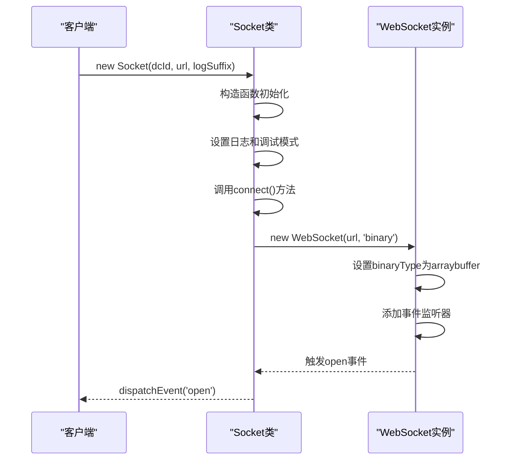
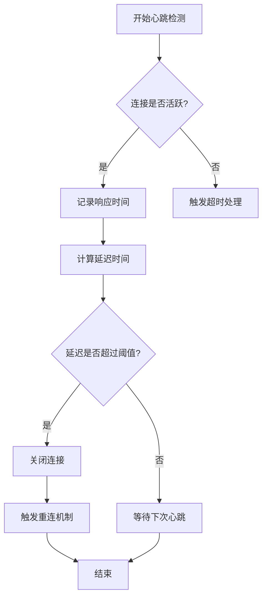
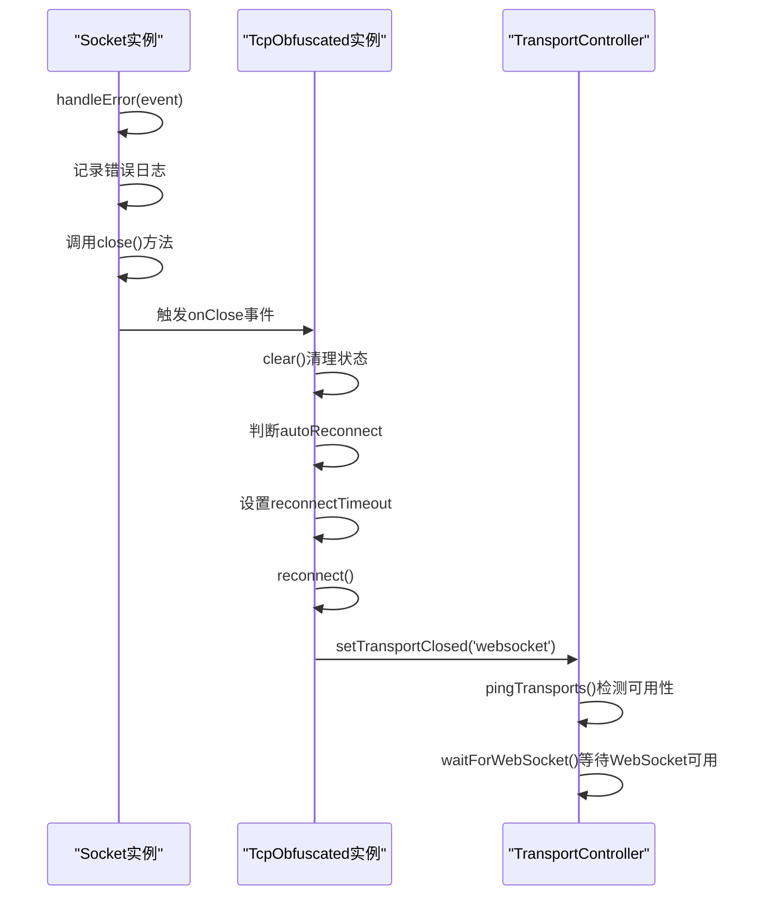

# WebSocket安全传输

<cite>
**本文档引用的文件**   
- [websocket.ts](file://src/lib/mtproto/transports/websocket.ts)
- [networker.ts](file://src/lib/mtproto/networker.ts)
- [tcpObfuscated.ts](file://src/lib/mtproto/transports/tcpObfuscated.ts)
- [controller.ts](file://src/lib/mtproto/transports/controller.ts)
- [transport.ts](file://src/lib/mtproto/transports/transport.ts)
- [obfuscation.ts](file://src/lib/mtproto/transports/obfuscation.ts)
- [http.ts](file://src/lib/mtproto/transports/http.ts)
</cite>

## 目录
1. [引言](#引言)
2. [WebSocket连接建立](#websocket连接建立)
3. [心跳维护与连接状态监控](#心跳维护与连接状态监控)
4. [数据帧加密与MTProto协议集成](#数据帧加密与mtproto协议集成)
5. [错误处理与自动重连机制](#错误处理与自动重连机制)
6. [安全配置选项](#安全配置选项)
7. [性能表现与安全加固建议](#性能表现与安全加固建议)
8. [结论](#结论)

## 引言

WebSocket安全传输机制是现代Web应用中实现实时通信的关键技术。本文档详细记录了WebSocket在MTProto协议下的安全传输实现，包括连接建立、心跳维护、数据帧加密和错误处理等核心机制。通过分析TLS加密通道、连接状态监控和自动重连机制，阐述了WebSocket与MTProto协议的深度集成方式，以及消息分帧和重组过程。同时，提供了WebSocket的安全配置选项，包括超时设置、重试策略和网络异常处理，并说明了在不同网络环境下WebSocket的性能表现和安全加固建议。

**Section sources**
- [websocket.ts](file://src/lib/mtproto/transports/websocket.ts#L1-L114)
- [networker.ts](file://src/lib/mtproto/networker.ts#L1-L299)

## WebSocket连接建立

WebSocket连接的建立过程始于`Socket`类的构造函数，该类继承自`EventListenerBase`并实现了`MTConnection`接口。在构造函数中，首先根据调试模式设置日志类型，然后调用`connect()`方法建立连接。连接建立时使用`wss://`协议确保TLS加密通道的安全性，并设置二进制数据类型为`arraybuffer`。



**Diagram sources**
- [websocket.ts](file://src/lib/mtproto/transports/websocket.ts#L26-L37)
- [websocket.ts](file://src/lib/mtproto/transports/websocket.ts#L54-L61)

**Section sources**
- [websocket.ts](file://src/lib/mtproto/transports/websocket.ts#L17-L66)

## 心跳维护与连接状态监控

心跳维护机制通过`MTPNetworker`类中的`pingDelayDisconnect`方法实现，该方法定期发送ping消息以检测连接状态。心跳间隔和超时时间在`delays`配置对象中定义，客户端连接的默认心跳间隔为2000毫秒，最大延迟时间为5秒。连接状态通过`ConnectionStatus`枚举进行监控，包括`Connecting`、`Connected`和`Closed`等状态。



**Diagram sources**
- [networker.ts](file://src/lib/mtproto/networker.ts#L623-L670)
- [networker.ts](file://src/lib/mtproto/networker.ts#L101-L124)

**Section sources**
- [networker.ts](file://src/lib/mtproto/networker.ts#L623-L670)
- [networker.ts](file://src/lib/mtproto/networker.ts#L101-L124)

## 数据帧加密与MTProto协议集成

数据帧加密采用MTProto协议的2.0版本安全机制，通过`getEncryptedMessage`方法实现。加密过程包括生成消息密钥（msg_key）、计算AES密钥和IV，然后使用AES-256-CTR模式进行加密。消息分帧通过`TLSerialization`类实现，将消息体、消息ID、序列号等信息序列化后进行加密传输。数据重组在`parseResponse`方法中完成，包括验证auth_key_id、解密数据和验证msg_key等步骤。

```mermaid
classDiagram
class MTPNetworker {
+dcId : number
+authKey : MTAuthKey
+serverSalt : Uint8Array
+sessionId : Uint8Array
+sendEncryptedRequest(message : MTMessage) : Promise~Uint8Array~
+parseResponse(responseBuffer : Uint8Array) : Promise~Response~
}
class MessageKeyUtils {
+getMsgKey(authKey : Uint8Array, data : Uint8Array, isServer : boolean) : Promise~Uint8Array~
+getAesKeyIv(authKey : Uint8Array, msgKey : Uint8Array, isServer : boolean, v1? : boolean) : Promise~{aesKey : Uint8Array, aesIv : Uint8Array}~
}
class CryptoWorker {
+invokeCrypto(method : string, data : Uint8Array, key : Uint8Array, iv : Uint8Array) : Promise~Uint8Array~
}
MTPNetworker --> MessageKeyUtils : 使用
MTPNetworker --> CryptoWorker : 使用
MessageKeyUtils --> CryptoWorker : 使用
```

**Diagram sources**
- [networker.ts](file://src/lib/mtproto/networker.ts#L1248-L1334)
- [networker.ts](file://src/lib/mtproto/networker.ts#L1382-L1454)
- [messageKeyUtils.ts](file://src/lib/mtproto/messageKeyUtils.ts)

**Section sources**
- [networker.ts](file://src/lib/mtproto/networker.ts#L1248-L1454)

## 错误处理与自动重连机制

错误处理机制在`Socket`类的`handleError`方法中实现，当WebSocket发生错误时会记录错误日志并调用`close()`方法关闭连接。自动重连机制由`TcpObfuscated`类的`reconnect`方法管理，通过`setAutoReconnect`方法控制重连开关。重连间隔时间根据上次连接关闭时间动态调整，最小间隔为7秒，最大间隔为20秒。连接控制器`transportController`负责协调HTTP和WebSocket传输方式的切换。



**Diagram sources**
- [websocket.ts](file://src/lib/mtproto/transports/websocket.ts#L90-L93)
- [tcpObfuscated.ts](file://src/lib/mtproto/transports/tcpObfuscated.ts#L124-L138)
- [controller.ts](file://src/lib/mtproto/transports/controller.ts#L44-L87)

**Section sources**
- [websocket.ts](file://src/lib/mtproto/transports/websocket.ts#L90-L93)
- [tcpObfuscated.ts](file://src/lib/mtproto/transports/tcpObfuscated.ts#L124-L171)
- [controller.ts](file://src/lib/mtproto/transports/controller.ts#L44-L87)

## 安全配置选项

安全配置选项主要包括超时设置、重试策略和网络异常处理。超时设置在`delays`对象中定义，包含连接超时、断开延迟最小/最大时间等参数。重试策略通过`retryTimeout`参数控制，网络异常处理则通过`TEST_HTTP_DROPPING_REQUESTS`等测试标志进行模拟。配置还支持多传输方式自动切换，当WebSocket不可用时自动降级到HTTPS长轮询。

```mermaid
erDiagram
CONFIGURATION ||--o{ TIMEOUT : 包含
CONFIGURATION ||--o{ RETRY : 包含
CONFIGURATION ||--o{ NETWORK : 包含
class CONFIGURATION {
string name
string description
}
class TIMEOUT {
int connectionTimeout
int disconnectDelayMin
int disconnectDelayMax
int pingInterval
int pingMaxTime
}
class RETRY {
int retryTimeout
boolean autoReconnect
}
class NETWORK {
boolean hasWebSocket
boolean hasHttp
boolean httpPollingNeededForFiles
}
```

**Diagram sources**
- [networker.ts](file://src/lib/mtproto/networker.ts#L101-L124)
- [networker.ts](file://src/lib/mtproto/networker.ts#L96-L98)
- [controller.ts](file://src/lib/mtproto/transports/controller.ts)

**Section sources**
- [networker.ts](file://src/lib/mtproto/networker.ts#L101-L124)
- [networker.ts](file://src/lib/mtproto/networker.ts#L96-L98)

## 性能表现与安全加固建议

在不同网络环境下，WebSocket的性能表现受网络延迟、带宽和稳定性影响。安全加固建议包括：始终使用`wss://`协议确保传输加密；定期更新auth_key和session_id防止会话劫持；实施消息完整性验证防止数据篡改；限制消息大小防止缓冲区溢出攻击；使用Obfuscation层增加协议混淆度。性能优化方面，建议合理设置心跳间隔，在移动网络下适当延长以节省电量。

**Section sources**
- [websocket.ts](file://src/lib/mtproto/transports/websocket.ts)
- [networker.ts](file://src/lib/mtproto/networker.ts)
- [obfuscation.ts](file://src/lib/mtproto/transports/obfuscation.ts)

## 结论

WebSocket安全传输机制通过TLS加密通道、MTProto协议加密、心跳检测和自动重连等多重安全措施，确保了通信的安全性和可靠性。连接建立过程简洁高效，数据帧加密采用行业标准的AES-256-CTR模式，配合消息完整性验证机制，有效防止了中间人攻击和数据篡改。错误处理和自动重连机制保证了在网络不稳定情况下的连接持久性。通过合理的安全配置和性能优化，WebSocket能够在各种网络环境下提供稳定、安全的实时通信服务。