# 传输层安全

<cite>
**本文档中引用的文件**  
- [websocket.ts](file://src/lib/mtproto/transports/websocket.ts)
- [tcpObfuscated.ts](file://src/lib/mtproto/transports/tcpObfuscated.ts)
- [http.ts](file://src/lib/mtproto/transports/http.ts)
- [obfuscation.ts](file://src/lib/mtproto/transports/obfuscation.ts)
- [networker.ts](file://src/lib/mtproto/networker.ts)
- [crypto_methods.ts](file://src/lib/crypto/crypto_methods.ts)
- [transport.ts](file://src/lib/mtproto/transports/transport.ts)
- [connectionStatus.ts](file://src/lib/mtproto/connectionStatus.ts)
- [cryptoMessagePort.ts](file://src/lib/crypto/cryptoMessagePort.ts)
- [aesCtrUtils.ts](file://src/lib/crypto/aesCtrUtils.ts)
</cite>

## 目录
1. [引言](#引言)
2. [传输协议安全特性](#传输协议安全特性)
3. [流量混淆算法实现原理](#流量混淆算法实现原理)
4. [连接状态监控与安全连接恢复机制](#连接状态监控与安全连接恢复机制)
5. [传输层与协议层加密协同工作](#传输层与协议层加密协同工作)
6. [安全配置选项与性能优化](#安全配置选项与性能优化)
7. [不同网络环境下的传输安全策略](#不同网络环境下的传输安全策略)
8. [结论](#结论)

## 引言

本项目实现了多层传输安全机制，包括WebSocket加密传输、TCP流量混淆和HTTP安全传输。系统采用MTProto协议作为核心通信协议，通过多种传输方式确保在不同网络环境下的连接稳定性和安全性。传输层安全设计旨在防止流量被检测和拦截，同时保证数据的机密性和完整性。

**传输层安全架构**  
系统实现了三种主要传输方式：WebSocket、TCP混淆和HTTP。每种方式都有其特定的安全特性和适用场景。WebSocket提供全双工通信，TCP混淆用于绕过网络审查，HTTP则作为备用传输方式确保连接的可靠性。

## 传输协议安全特性

### WebSocket加密传输

WebSocket传输通过WSS（WebSocket Secure）协议实现端到端加密。客户端与服务器之间建立安全的WebSocket连接，所有数据传输都经过TLS加密。WebSocket连接在建立时进行身份验证，并在整个会话期间保持加密状态。

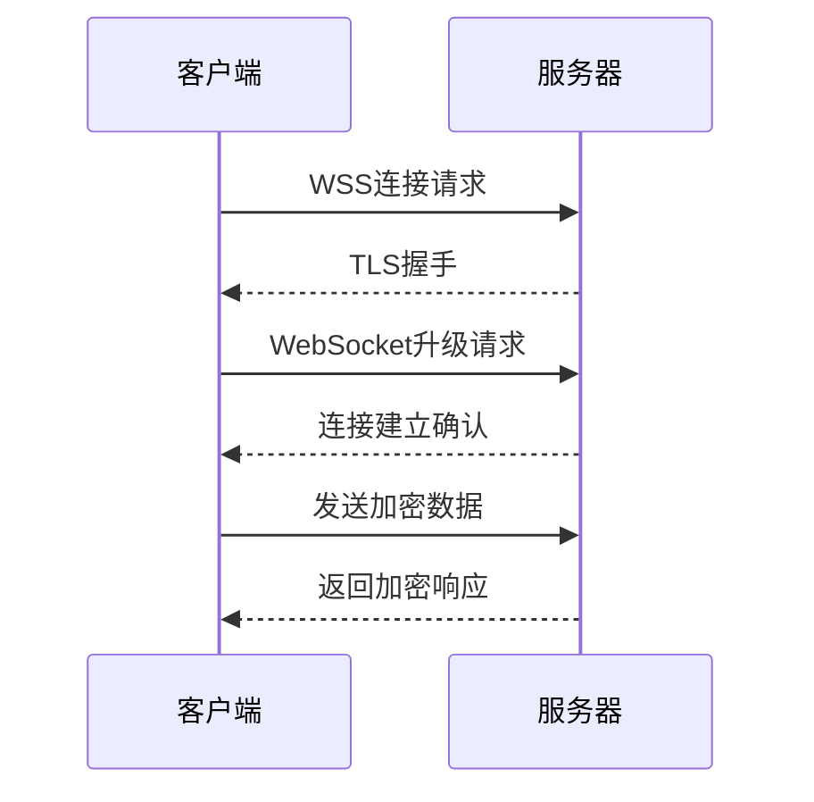

**图示来源**  
- [websocket.ts](file://src/lib/mtproto/transports/websocket.ts#L1-L114)

**本节来源**  
- [websocket.ts](file://src/lib/mtproto/transports/websocket.ts#L1-L114)

### TCP流量混淆

TCP流量混淆通过在数据包前添加随机字节和AES-CTR加密来隐藏真实的通信内容。混淆算法生成64字节的初始化负载，其中包含随机数据和加密密钥。接收方使用反向的密钥和初始化向量进行解密，从而恢复原始数据。

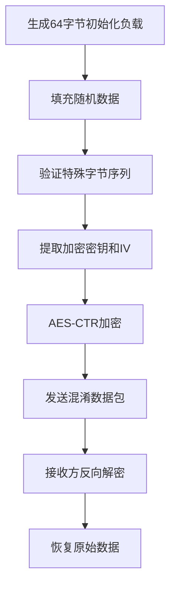

**图示来源**  
- [obfuscation.ts](file://src/lib/mtproto/transports/obfuscation.ts#L1-L227)
- [tcpObfuscated.ts](file://src/lib/mtproto/transports/tcpObfuscated.ts#L1-L351)

**本节来源**  
- [obfuscation.ts](file://src/lib/mtproto/transports/obfuscation.ts#L1-L227)
- [tcpObfuscated.ts](file://src/lib/mtproto/transports/tcpObfuscated.ts#L1-L351)

### HTTP安全传输

HTTP传输使用POST请求发送加密数据，通过长轮询机制保持连接的活跃性。系统在HTTP连接中实现了心跳检测和自动重连机制，确保在网络不稳定的情况下仍能维持通信。

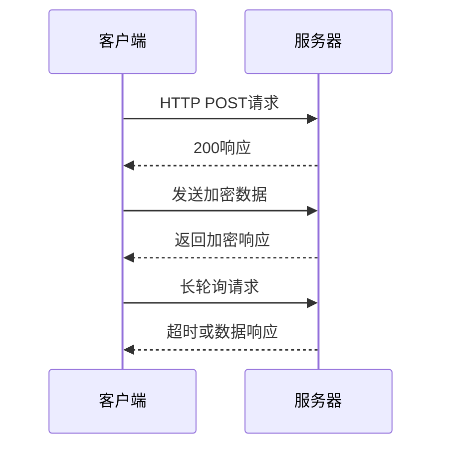

**图示来源**  
- [http.ts](file://src/lib/mtproto/transports/http.ts#L1-L138)

**本节来源**  
- [http.ts](file://src/lib/mtproto/transports/http.ts#L1-L138)

## 流量混淆算法实现原理

### 混淆初始化过程

流量混淆算法的初始化过程包括生成64字节的随机负载，其中前8字节用于验证，中间32字节作为加密密钥，后16字节作为初始化向量。算法确保生成的负载不包含特定的字节序列，以避免被识别为明文协议。

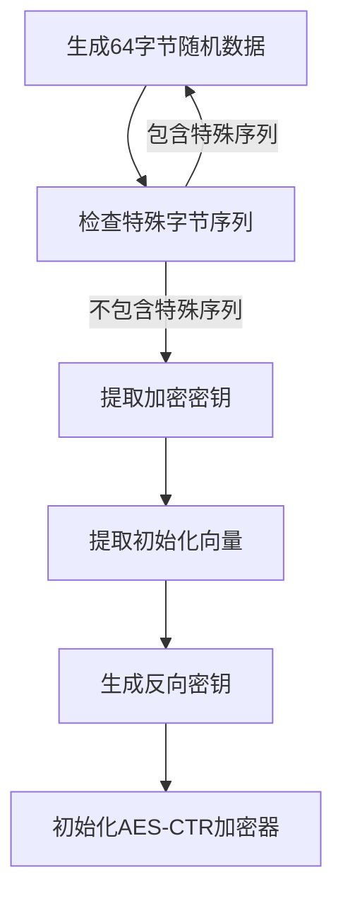

**图示来源**  
- [obfuscation.ts](file://src/lib/mtproto/transports/obfuscation.ts#L32-L87)

**本节来源**  
- [obfuscation.ts](file://src/lib/mtproto/transports/obfuscation.ts#L32-L87)

### 抗检测能力分析

流量混淆算法通过以下机制实现抗检测能力：
1. **随机化特征**：每次连接生成不同的随机负载，避免固定的流量模式
2. **加密伪装**：使用AES-CTR模式加密，使数据包看起来像随机噪声
3. **协议伪装**：混淆后的数据包不包含明显的协议特征，难以被深度包检测识别

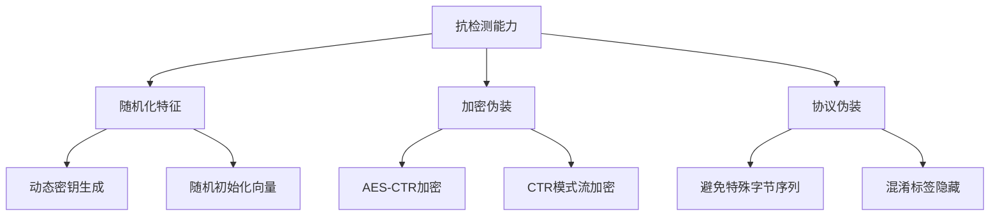

**图示来源**  
- [obfuscation.ts](file://src/lib/mtproto/transports/obfuscation.ts#L1-L227)

**本节来源**  
- [obfuscation.ts](file://src/lib/mtproto/transports/obfuscation.ts#L1-L227)

## 连接状态监控与安全连接恢复机制

### 连接状态管理

系统实现了完整的连接状态机，包括连接、断开、重连等状态。连接状态通过`ConnectionStatus`枚举定义，包括`Closed`、`Connecting`和`Connected`三种状态。状态变化通过事件监听器通知相关组件。

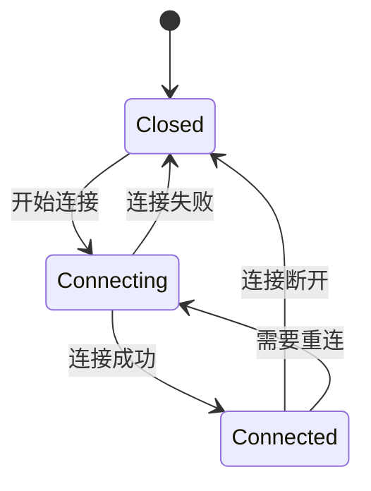

**图示来源**  
- [connectionStatus.ts](file://src/lib/mtproto/connectionStatus.ts)
- [tcpObfuscated.ts](file://src/lib/mtproto/transports/tcpObfuscated.ts#L117-L138)

**本节来源**  
- [connectionStatus.ts](file://src/lib/mtproto/connectionStatus.ts)
- [tcpObfuscated.ts](file://src/lib/mtproto/transports/tcpObfuscated.ts#L117-L138)

### 安全连接恢复

安全连接恢复机制包括自动重连和连接超时管理。系统在连接断开后会根据退避算法计算重连时间，避免频繁重连导致服务器压力过大。重连过程包括清理现有连接、重新建立传输通道和恢复未完成的请求。

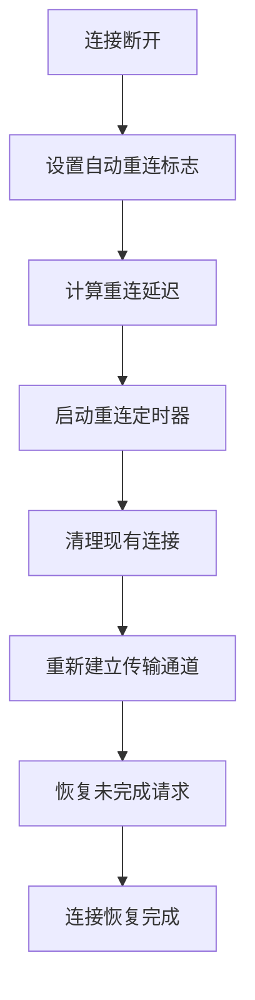

**图示来源**  
- [tcpObfuscated.ts](file://src/lib/mtproto/transports/tcpObfuscated.ts#L161-L185)
- [networker.ts](file://src/lib/mtproto/networker.ts#L520-L521)

**本节来源**  
- [tcpObfuscated.ts](file://src/lib/mtproto/transports/tcpObfuscated.ts#L161-L185)
- [networker.ts](file://src/lib/mtproto/networker.ts#L520-L521)

## 传输层与协议层加密协同工作

### 加密层次结构

系统实现了多层加密机制，包括传输层加密和协议层加密。传输层加密负责保护数据在传输过程中的安全性，协议层加密则确保数据内容的机密性。两层加密协同工作，提供端到端的安全保障。

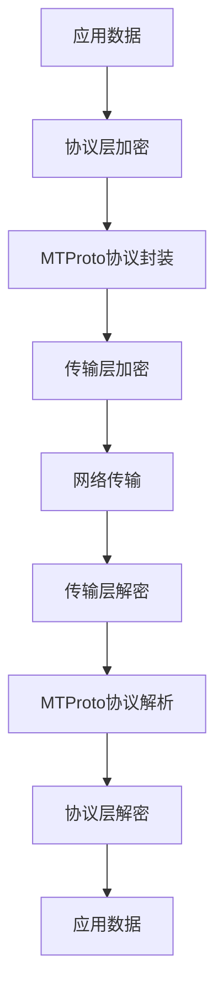

**图示来源**  
- [networker.ts](file://src/lib/mtproto/networker.ts#L436-L441)
- [cryptoMessagePort.ts](file://src/lib/crypto/cryptoMessagePort.ts)

**本节来源**  
- [networker.ts](file://src/lib/mtproto/networker.ts#L436-L441)
- [cryptoMessagePort.ts](file://src/lib/crypto/cryptoMessagePort.ts)

### 协同工作机制

传输层和协议层加密通过`cryptoMessagePort`进行协同工作。协议层加密使用`aes-ctr-prepare`方法初始化加密上下文，传输层加密则使用相同的上下文进行数据加密。这种设计确保了加密密钥的一致性和安全性。

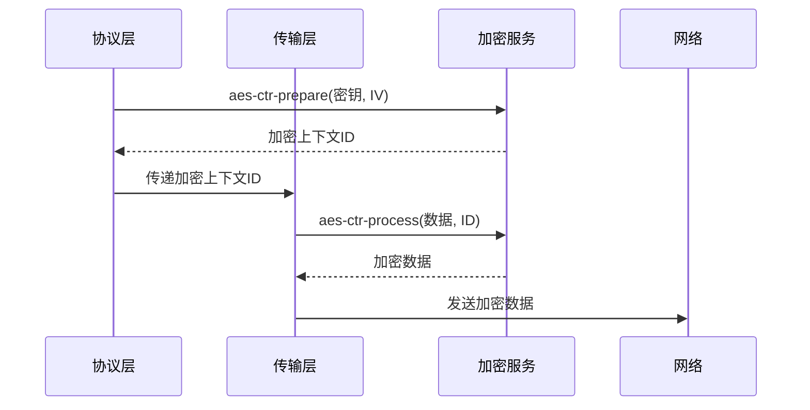

**图示来源**  
- [obfuscation.ts](file://src/lib/mtproto/transports/obfuscation.ts#L74-L80)
- [cryptoMessagePort.ts](file://src/lib/crypto/cryptoMessagePort.ts)
- [aesCtrUtils.ts](file://src/lib/crypto/aesCtrUtils.ts)

**本节来源**  
- [obfuscation.ts](file://src/lib/mtproto/transports/obfuscation.ts#L74-L80)
- [cryptoMessagePort.ts](file://src/lib/crypto/cryptoMessagePort.ts)
- [aesCtrUtils.ts](file://src/lib/crypto/aesCtrUtils.ts)

## 安全配置选项与性能优化

### 配置选项

系统提供了多种安全配置选项，包括调试模式、传输方式选择和连接超时设置。这些配置通过`Modes`和环境变量进行管理，允许在不同环境下调整安全策略。

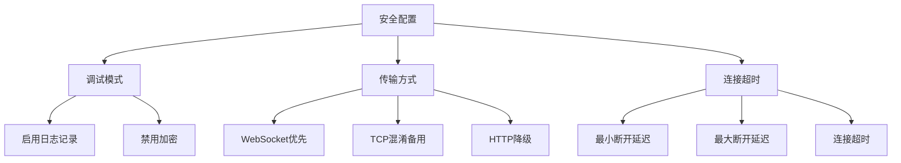

**图示来源**  
- [networker.ts](file://src/lib/mtproto/networker.ts#L96-L124)
- [Modes.ts](file://src/config/modes.ts)

**本节来源**  
- [networker.ts](file://src/lib/mtproto/networker.ts#L96-L124)
- [Modes.ts](file://src/config/modes.ts)

### 性能优化建议

为了在保证安全性的同时优化性能，系统采用了以下策略：
1. **连接复用**：保持长连接，减少握手开销
2. **批量处理**：将多个小请求合并为单个大请求
3. **异步处理**：使用Promise和异步操作避免阻塞
4. **资源管理**：及时释放加密上下文和连接资源

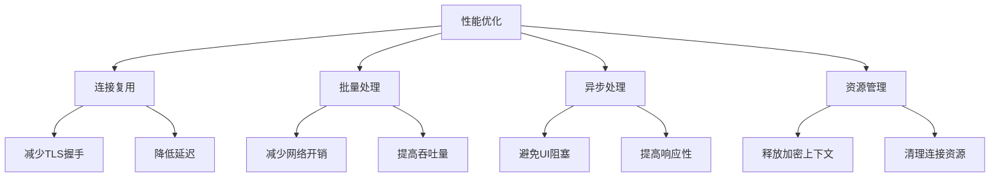

**图示来源**  
- [networker.ts](file://src/lib/mtproto/networker.ts#L270-L288)
- [tcpObfuscated.ts](file://src/lib/mtproto/transports/tcpObfuscated.ts#L291-L348)

**本节来源**  
- [networker.ts](file://src/lib/mtproto/networker.ts#L270-L288)
- [tcpObfuscated.ts](file://src/lib/mtproto/transports/tcpObfuscated.ts#L291-L348)

## 不同网络环境下的传输安全策略

### 网络环境适应性

系统能够根据网络环境自动选择最优的传输策略。在正常网络环境下优先使用WebSocket，在受限网络环境下切换到TCP混淆，最后降级到HTTP作为备用方案。

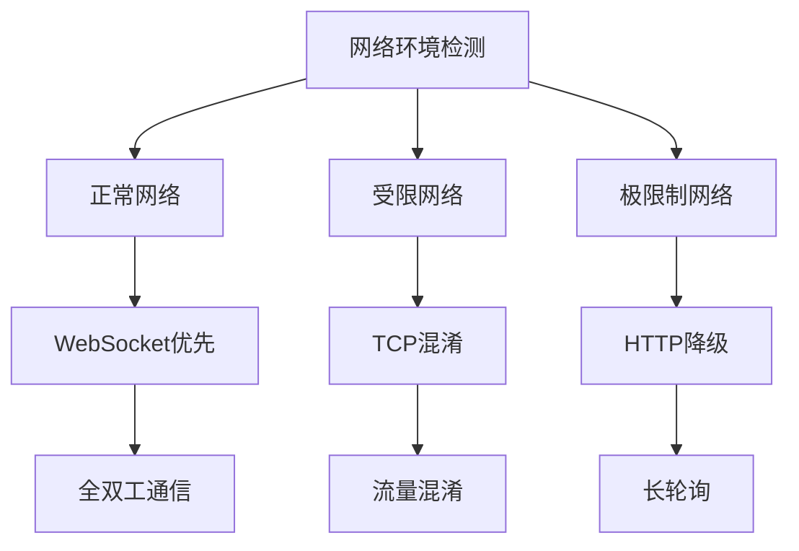

**图示来源**  
- [networker.ts](file://src/lib/mtproto/networker.ts#L456-L503)
- [transportController.ts](file://src/lib/mtproto/transports/controller.ts)

**本节来源**  
- [networker.ts](file://src/lib/mtproto/networker.ts#L456-L503)
- [transportController.ts](file://src/lib/mtproto/transports/controller.ts)

### 策略切换机制

传输策略切换通过`transportController`进行管理。系统监控连接状态和网络质量，当主传输方式失败时自动切换到备用方案。切换过程保持会话状态，确保用户体验的连续性。

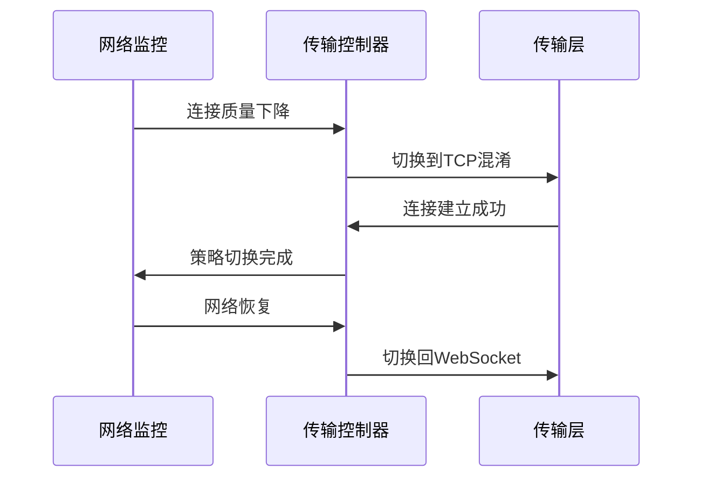

**图示来源**  
- [networker.ts](file://src/lib/mtproto/networker.ts#L456-L503)
- [transportController.ts](file://src/lib/mtproto/transports/controller.ts)

**本节来源**  
- [networker.ts](file://src/lib/mtproto/networker.ts#L456-L503)
- [transportController.ts](file://src/lib/mtproto/transports/controller.ts)

## 结论

本项目实现了全面的传输层安全机制，通过WebSocket加密、TCP流量混淆和HTTP安全传输三种方式确保通信的安全性和可靠性。系统采用多层加密架构，将传输层加密与协议层加密有机结合，提供端到端的安全保障。连接状态监控和自动恢复机制确保在网络不稳定的情况下仍能维持通信。通过灵活的配置选项和性能优化策略，系统能够在不同网络环境下提供最佳的安全性和性能平衡。