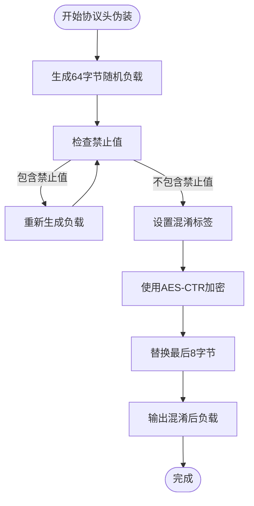
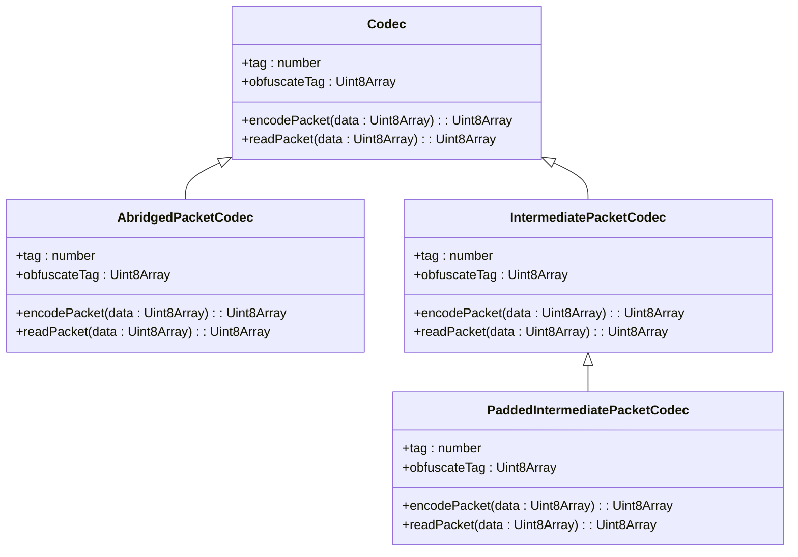
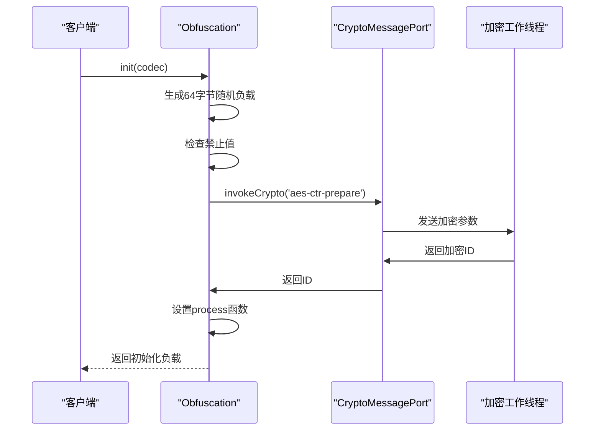
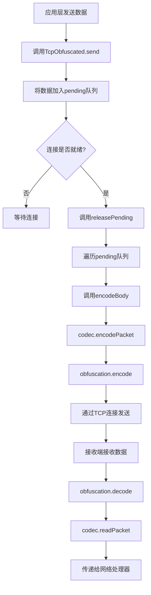
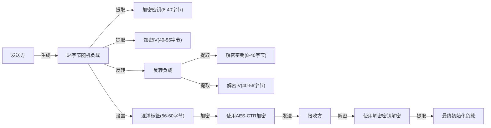

# 流量混淆技术

<cite>
**本文档中引用的文件**  
- [obfuscation.ts](file://src/lib/mtproto/transports/obfuscation.ts)
- [tcpObfuscated.ts](file://src/lib/mtproto/transports/tcpObfuscated.ts)
- [padded.ts](file://src/lib/mtproto/transports/padded.ts)
- [abridged.ts](file://src/lib/mtproto/transports/abridged.ts)
- [intermediate.ts](file://src/lib/mtproto/transports/intermediate.ts)
- [codec.ts](file://src/lib/mtproto/transports/codec.ts)
- [cryptoMessagePort.ts](file://src/lib/crypto/cryptoMessagePort.ts)
- [aesCTRJs.ts](file://src/lib/crypto/utils/aesCTRJs.ts)
- [controller.ts](file://src/lib/mtproto/transports/controller.ts)
</cite>

## 目录
1. [引言](#引言)
2. [协议头伪装机制](#协议头伪装机制)
3. [数据包填充技术](#数据包填充技术)
4. [流量模式混淆](#流量模式混淆)
5. [混淆算法工作机制](#混淆算法工作机制)
6. [TCP流量混淆实现](#tcp流量混淆实现)
7. [混淆参数生成与协商](#混淆参数生成与协商)
8. [混淆模式安全性分析](#混淆模式安全性分析)
9. [性能开销评估](#性能开销评估)
10. [配置选项与使用场景](#配置选项与使用场景)
11. [应对网络审查策略](#应对网络审查策略)
12. [与端到端加密的协同作用](#与端到端加密的协同作用)

## 引言
流量混淆技术是一种用于规避网络审查和流量识别的安全机制，通过伪装协议特征、添加随机填充和改变流量模式来隐藏通信的真实性质。本技术文档深入分析了在MTProto协议中实现的流量混淆机制，包括协议头伪装、数据包填充和流量模式混淆等关键技术。文档详细解释了obfuscation算法的工作机制和抗检测能力，描述了TCP流量混淆的具体实现步骤，并分析了不同混淆模式的安全性和性能开销。

**Section sources**
- [obfuscation.ts](file://src/lib/mtproto/transports/obfuscation.ts#L1-L227)
- [tcpObfuscated.ts](file://src/lib/mtproto/transports/tcpObfuscated.ts#L1-L351)

## 协议头伪装机制
协议头伪装是流量混淆的核心技术之一，通过修改数据包的初始字节来避免被识别为特定协议。在本实现中，`Obfuscation`类负责处理协议头的伪装过程。初始化时，系统生成一个64字节的随机负载，然后检查其前几个字节是否与已知的禁止值匹配，包括0xEF、0x44414548（"HEAD"）、0x54534f50（"POST"）、0x20544547（"GET "）、0x4954504f（"OPTI"）、0xeeeeeeee和0xdddddddd等。

如果检测到这些禁止值，系统会重新生成随机负载，直到满足安全条件。这种设计确保了混淆后的流量不会以常见的HTTP方法或特殊标记开头，从而有效规避基于签名的检测系统。协议头伪装还通过设置特定的混淆标签（obfuscateTag）来标识使用的编码模式，如Abridged模式使用0xEF标签，Intermediate模式使用0xEE标签，Padded Intermediate模式使用0xDD标签。

**Diagram sources**
- [obfuscation.ts](file://src/lib/mtproto/transports/obfuscation.ts#L37-L55)
- [abridged.ts](file://src/lib/mtproto/transports/abridged.ts#L11-L12)
- [intermediate.ts](file://src/lib/mtproto/transports/intermediate.ts#L10-L11)
- [padded.ts](file://src/lib/mtproto/transports/padded.ts#L12-L13)

## 数据包填充技术
数据包填充技术通过在数据包中添加随机长度的填充字节来改变流量的统计特征，使其更难被识别。在本实现中，`PaddedIntermediatePacketCodec`类实现了这一技术。该编码器继承自`IntermediatePacketCodec`，在编码数据包时会添加0到3字节的随机填充。

填充过程首先生成一个随机长度的填充字节序列，然后计算包含填充的总长度。编码后的数据包由4字节的长度头、原始数据和填充字节组成。解码时，系统根据数据包总长度对4取模的结果来确定填充长度，并从数据包末尾移除相应数量的字节。这种方法确保了数据包长度的随机性，同时保持了数据对齐的要求。

**Diagram sources**
- [padded.ts](file://src/lib/mtproto/transports/padded.ts#L15-L32)

## 流量模式混淆
流量模式混淆通过改变数据包的结构和传输模式来隐藏通信的真实特征。本实现支持多种编码模式，每种模式都有不同的流量特征：

1. **Abridged模式**：使用单字节长度头，对于小于127*4字节的数据包，长度直接编码在第一个字节中；对于更大的数据包，使用0x7F作为标志，后跟3字节的小端序长度。
2. **Intermediate模式**：使用4字节小端序长度头，数据包长度直接编码。
3. **Padded Intermediate模式**：在Intermediate模式基础上添加随机填充。

这些不同的编码模式产生了不同的流量模式，使得基于流量模式分析的检测系统难以准确识别。`Codec`接口定义了所有编码器必须实现的`encodePacket`和`readPacket`方法，以及`tag`和`obfuscateTag`属性，确保了编码器的统一性和可扩展性。

**Diagram sources**
- [codec.ts](file://src/lib/mtproto/transports/codec.ts#L7-L13)
- [abridged.ts](file://src/lib/mtproto/transports/abridged.ts#L10-L27)
- [intermediate.ts](file://src/lib/mtproto/transports/intermediate.ts#L9-L25)
- [padded.ts](file://src/lib/mtproto/transports/padded.ts#L11-L23)

## 混淆算法工作机制
混淆算法的核心是基于AES-CTR模式的加密机制，结合了密钥派生和异或操作来实现数据混淆。`Obfuscation`类的初始化过程首先生成加密和解密所需的密钥材料。系统创建一个64字节的随机初始化负载，然后从中提取加密密钥（encKey）和初始化向量（encIv），同时从反转的负载中提取解密密钥（decKey）和初始化向量（decIv）。

加密过程通过`cryptoMessagePort`与独立的加密工作线程通信，使用`aes-ctr-prepare`方法准备加密上下文，然后通过`aes-ctr-process`方法执行实际的加密操作。这种设计将加密操作与主应用逻辑分离，提高了安全性和性能。`_process`方法作为加密和解密操作的统一入口，通过`operation`参数区分加密和解密操作。

**Diagram sources**
- [obfuscation.ts](file://src/lib/mtproto/transports/obfuscation.ts#L32-L88)
- [cryptoMessagePort.ts](file://src/lib/crypto/cryptoMessagePort.ts#L29-L54)

## TCP流量混淆实现
TCP流量混淆的具体实现由`TcpObfuscated`类完成，该类实现了`MTTransport`接口。当建立TCP连接时，系统首先调用`obfuscation.init()`方法生成混淆初始化负载，然后通过连接发送这个负载。这个初始化过程完成了混淆参数的协商，为后续的加密通信建立基础。

数据发送过程通过`send`方法实现，该方法将待发送的数据体放入待处理队列，然后在连接就绪时通过`releasePending`方法批量发送。每个数据包首先通过`codec.encodePacket`方法进行编码，然后通过`obfuscation.encode`方法进行混淆。接收数据时，系统先通过`obfuscation.decode`方法解混淆，然后通过`codec.readPacket`方法解码，最终将原始数据传递给网络处理器。

**Diagram sources**
- [tcpObfuscated.ts](file://src/lib/mtproto/transports/tcpObfuscated.ts#L270-L348)

## 混淆参数生成与协商
混淆参数的生成与协商是建立安全通信通道的关键步骤。在连接初始化阶段，系统生成64字节的随机负载，其中前8字节用于避免已知的禁止模式，第8-40字节作为加密密钥，第40-56字节作为加密初始化向量。解密参数则从反转的负载中提取，确保了加密和解密密钥的独立性。

参数协商过程通过发送初始化负载完成。发送方使用自己的加密密钥和初始化向量加密整个负载，然后将加密后的数据发送给接收方。接收方使用自己的解密密钥和初始化向量解密数据，从而完成参数同步。这种设计确保了即使攻击者截获了初始化负载，也无法直接获取加密密钥，因为密钥材料被加密保护。

**Diagram sources**
- [obfuscation.ts](file://src/lib/mtproto/transports/obfuscation.ts#L37-L122)

## 混淆模式安全性分析
不同的混淆模式具有不同的安全特性。Abridged模式由于使用单字节长度头，对于小数据包效率较高，但可能暴露数据包大小的统计特征。Intermediate模式使用固定4字节长度头，提供了更好的数据对齐，但长度信息直接可见。Padded Intermediate模式通过添加随机填充，有效隐藏了真实数据长度，提高了抗流量分析能力。

所有模式都基于AES-CTR加密，提供了强大的加密保护。CTR模式的优势在于其并行性和随机访问能力，同时避免了ECB模式的重复模式问题。密钥材料的生成过程通过随机化和禁止值检查，确保了密钥的随机性和不可预测性。初始化向量的使用防止了相同明文产生相同密文，增强了安全性。

从抗检测角度来看，协议头伪装有效规避了基于签名的检测，数据包填充增加了流量模式的随机性，而多种编码模式的选择使得检测系统难以建立准确的识别模型。然而，长期使用单一混淆模式仍可能被高级的机器学习检测系统识别，因此建议定期轮换混淆模式。

**Section sources**
- [abridged.ts](file://src/lib/mtproto/transports/abridged.ts#L1-L42)
- [intermediate.ts](file://src/lib/mtproto/transports/intermediate.ts#L1-L35)
- [padded.ts](file://src/lib/mtproto/transports/padded.ts#L1-L36)
- [obfuscation.ts](file://src/lib/mtproto/transports/obfuscation.ts#L1-L227)

## 性能开销评估
流量混淆技术引入了一定的性能开销，主要体现在计算开销和网络开销两个方面。计算开销主要来自AES-CTR加密操作，虽然CTR模式相对高效，但仍需要消耗CPU资源进行加密和解密。通过将加密操作委托给独立的工作线程，系统实现了计算任务的并行化，减少了对主线程的影响。

网络开销方面，Abridged模式对于小数据包最为高效，因为它使用单字节长度头。Intermediate模式由于使用4字节长度头，增加了4字节的开销。Padded Intermediate模式的开销最大，因为它不仅有4字节长度头，还可能增加最多3字节的随机填充。

在实际应用中，`TcpObfuscated`类通过批量发送机制优化了性能。待发送的数据被放入队列，然后在连接就绪时批量处理，减少了频繁的系统调用。`releasePending`方法的异步执行也避免了阻塞主线程。对于高频率的小数据包通信，建议使用Abridged模式以最小化开销；对于安全性要求更高的场景，可以接受Padded Intermediate模式带来的额外开销。

**Section sources**
- [tcpObfuscated.ts](file://src/lib/mtproto/transports/tcpObfuscated.ts#L291-L348)
- [padded.ts](file://src/lib/mtproto/transports/padded.ts#L15-L23)

## 配置选项与使用场景
系统提供了多种配置选项来适应不同的使用场景。通过`transportController`可以管理和监控不同传输类型的可用性，实现自动故障转移和负载均衡。`setAutoReconnect`方法允许控制连接的自动重连行为，`changeUrl`方法支持动态更改服务器地址。

对于不同的使用场景，建议采用相应的配置策略：
1. **普通用户场景**：使用Abridged模式，平衡性能和安全性。
2. **高审查环境**：使用Padded Intermediate模式，最大化抗检测能力。
3. **移动网络环境**：启用自动重连，优化网络中断恢复。
4. **企业级应用**：结合多种模式，实现灵活的流量管理。

`MTTransportController`类提供了传输控制功能，可以监控WebSocket和HTTPS传输的可用性，并根据网络状况自动选择最佳传输方式。这种动态适应能力使得系统能够在不同网络环境下保持稳定连接。

**Section sources**
- [controller.ts](file://src/lib/mtproto/transports/controller.ts#L1-L129)
- [tcpObfuscated.ts](file://src/lib/mtproto/transports/tcpObfuscated.ts#L227-L238)

## 应对网络审查策略
流量混淆技术是应对网络审查的有效策略，通过多层伪装和随机化来规避检测。协议头伪装避免了基于HTTP方法的简单检测，数据包填充破坏了基于流量模式的分析，而多种编码模式的选择增加了识别难度。

系统通过动态传输选择机制进一步增强了抗审查能力。`transportController`定期检测WebSocket和HTTPS传输的可用性，当检测到WebSocket被阻断时，可以自动切换到HTTPS传输。这种多路径冗余设计确保了通信的持续性。

对于高级的深度包检测（DPI）系统，建议采用以下策略：
1. 定期轮换混淆模式，避免模式固化。
2. 结合随机延迟发送，破坏流量的时间特征。
3. 使用Padded模式增加数据包长度的随机性。
4. 实现连接伪装，使流量看起来像正常的HTTPS流量。

通过这些综合策略，系统能够有效应对各种层次的网络审查，保持通信的隐蔽性和可靠性。

**Section sources**
- [controller.ts](file://src/lib/mtproto/transports/controller.ts#L44-L87)
- [tcpObfuscated.ts](file://src/lib/mtproto/transports/tcpObfuscated.ts#L117-L138)

## 与端到端加密的协同作用
流量混淆与端到端加密形成了多层次的安全防护体系。流量混淆在传输层工作，主要目的是隐藏通信的存在和性质，而端到端加密在应用层工作，确保数据内容的机密性。两者协同作用，提供了从传输隐蔽到内容保护的完整安全解决方案。

在本实现中，流量混淆作为第一道防线，使通信流量看起来像随机数据，避免被识别和阻断。即使攻击者能够截获流量，由于端到端加密的存在，也无法获取有意义的内容。这种分层安全模型符合"纵深防御"原则，即使某一层防护被突破，其他层仍能提供保护。

值得注意的是，流量混淆并不替代端到端加密，而是作为其补充。两者在不同的协议层工作，解决不同的安全问题。流量混淆关注"通信是否被发现"，而端到端加密关注"内容是否被读取"。通过结合使用，系统实现了既隐蔽又安全的通信。

**Section sources**
- [obfuscation.ts](file://src/lib/mtproto/transports/obfuscation.ts#L1-L227)
- [tcpObfuscated.ts](file://src/lib/mtproto/transports/tcpObfuscated.ts#L1-L351)