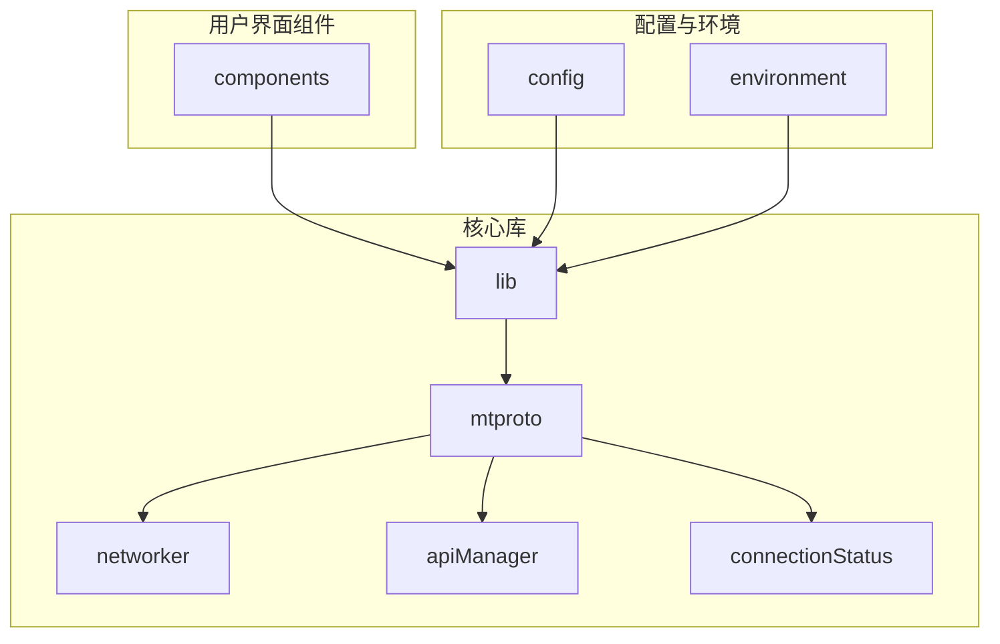
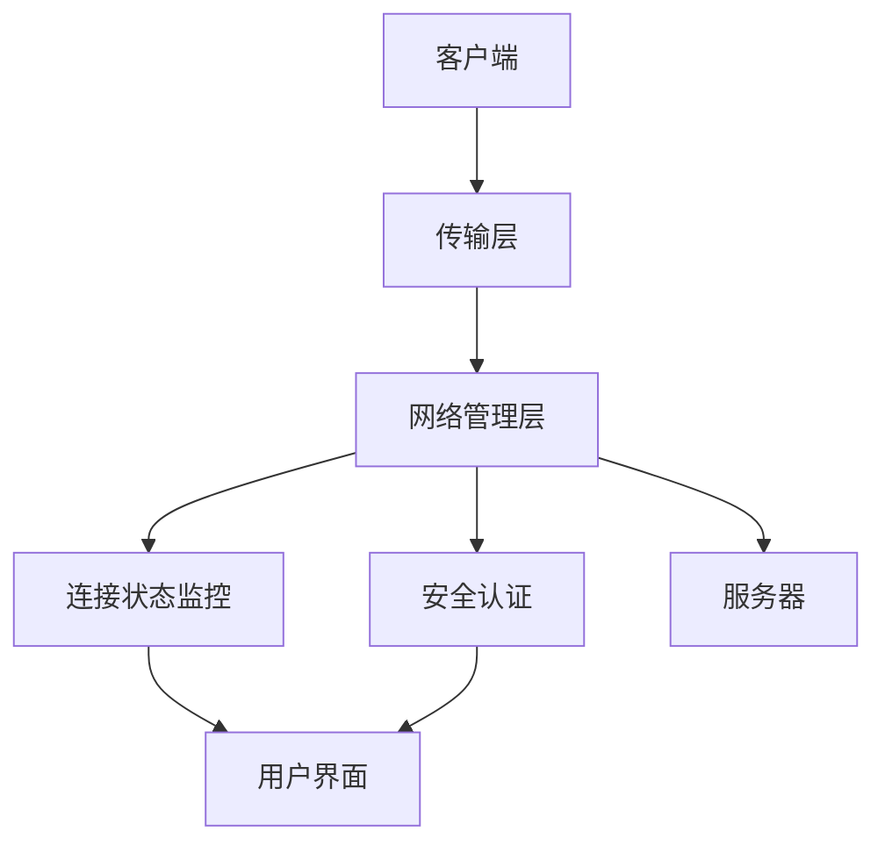
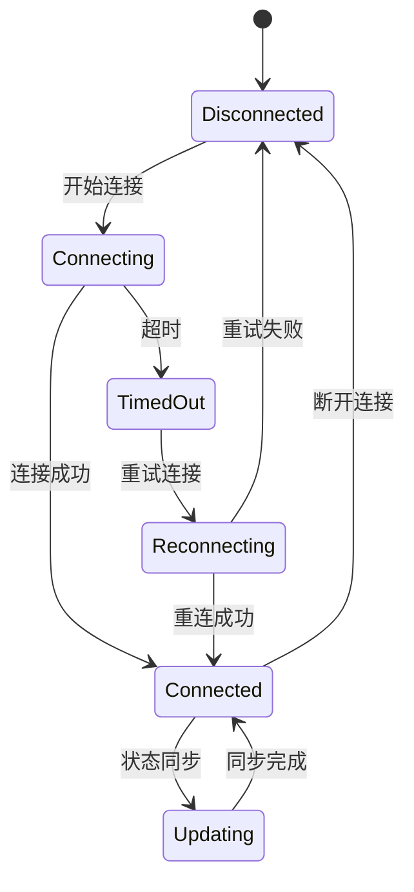
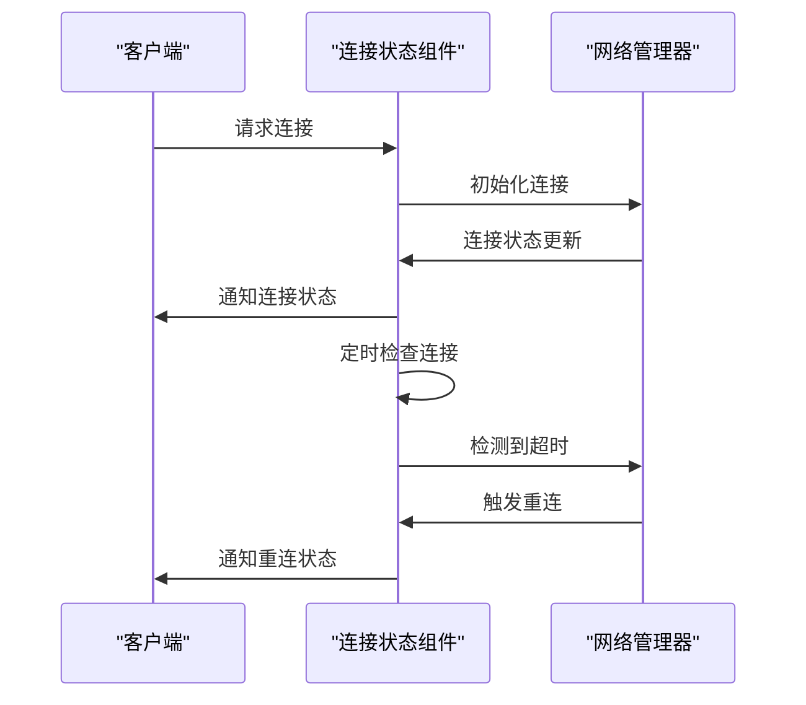
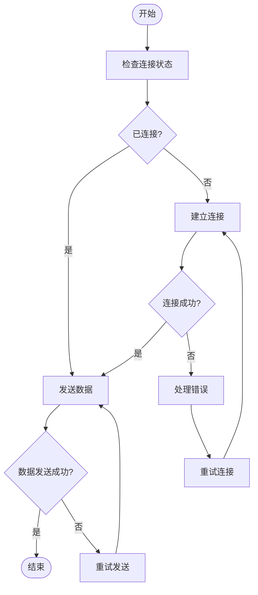
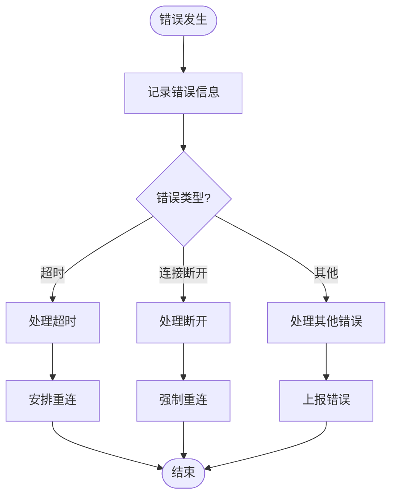
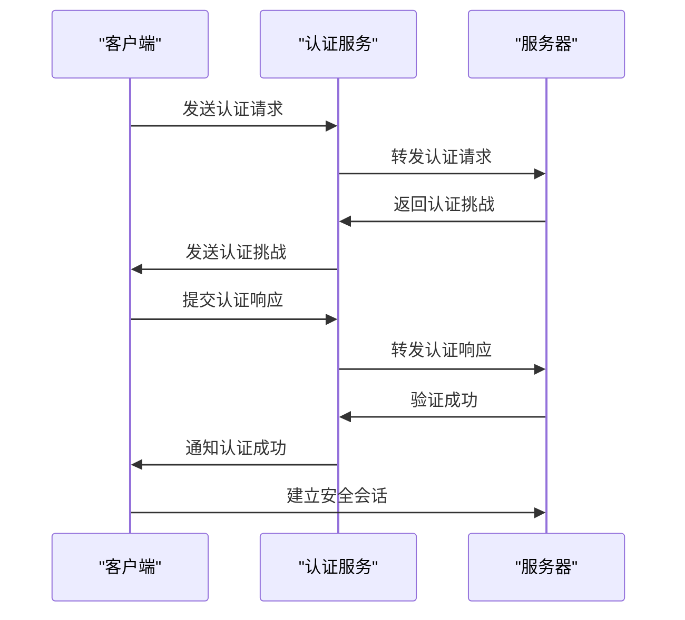
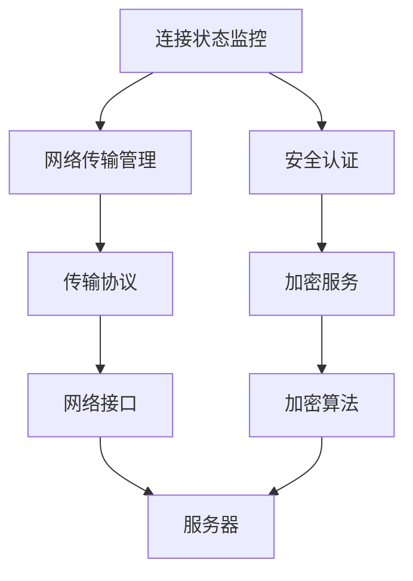

# 连接安全管理

<cite>
**本文档引用的文件**  
- [connectionStatus.ts](file://src/components/connectionStatus.ts)
- [connectionStatus.ts](file://src/lib/mtproto/connectionStatus.ts)
- [networker.ts](file://src/lib/mtproto/networker.ts)
- [apiManager.ts](file://src/lib/mtproto/apiManager.ts)
- [networkerFactory.ts](file://src/lib/mtproto/networkerFactory.ts)
- [controller.ts](file://src/lib/mtproto/transports/controller.ts)
</cite>

## 目录
1. [引言](#引言)
2. [项目结构](#项目结构)
3. [核心组件](#核心组件)
4. [架构概述](#架构概述)
5. [详细组件分析](#详细组件分析)
6. [依赖分析](#依赖分析)
7. [性能考虑](#性能考虑)
8. [故障排除指南](#故障排除指南)
9. [结论](#结论)

## 引言
本文档全面记录了连接安全管理机制，包括连接状态监控、安全连接恢复和网络适应性调整。详细描述了连接状态机的各个阶段及其安全考量，解释了网络切换时的安全连接迁移策略。分析了连接超时、断线重连和拥塞控制的安全实现。说明了连接安全性的评估指标和监控方法，提供了连接安全的诊断工具和故障排查指南。讨论了多网络环境下的连接安全最佳实践。

## 项目结构
该项目是一个基于Web的Telegram客户端实现，具有复杂的连接管理和安全机制。项目结构清晰地分为多个组件，包括用户界面组件、核心库、配置、环境检测、帮助函数等。连接安全管理主要集中在`src/lib/mtproto`目录下，涉及网络传输、连接状态监控、安全认证等关键功能。

**图示来源**  
- [connectionStatus.ts](file://src/components/connectionStatus.ts)
- [networker.ts](file://src/lib/mtproto/networker.ts)
- [apiManager.ts](file://src/lib/mtproto/apiManager.ts)

**本节来源**  
- [project_structure](file://project_structure)

## 核心组件
连接安全管理的核心组件包括连接状态监控、网络传输管理、安全认证和连接恢复机制。这些组件协同工作，确保连接的安全性和稳定性。

**本节来源**  
- [connectionStatus.ts](file://src/components/connectionStatus.ts#L1-L224)
- [connectionStatus.ts](file://src/lib/mtproto/connectionStatus.ts#L1-L24)
- [networker.ts](file://src/lib/mtproto/networker.ts#L1-L200)

## 架构概述
连接安全管理的架构基于MTProto协议，采用分层设计，包括传输层、网络管理层、连接状态监控层和安全认证层。各层之间通过明确定义的接口进行通信，确保系统的模块化和可维护性。

**图示来源**  
- [apiManager.ts](file://src/lib/mtproto/apiManager.ts#L1-L200)
- [networkerFactory.ts](file://src/lib/mtproto/networkerFactory.ts#L1-L105)

## 详细组件分析

### 连接状态监控分析
连接状态监控组件负责实时跟踪和报告连接状态的变化。它通过监听网络事件和定时检查连接状态来确保连接的可用性。

#### 连接状态机

**图示来源**  
- [connectionStatus.ts](file://src/components/connectionStatus.ts#L1-L224)
- [connectionStatus.ts](file://src/lib/mtproto/connectionStatus.ts#L7-L12)

#### 连接状态变化处理

**图示来源**  
- [connectionStatus.ts](file://src/components/connectionStatus.ts#L103-L134)
- [networker.ts](file://src/lib/mtproto/networker.ts#L956-L974)

**本节来源**  
- [connectionStatus.ts](file://src/components/connectionStatus.ts#L1-L224)
- [networker.ts](file://src/lib/mtproto/networker.ts#L900-L1100)

### 网络传输管理分析
网络传输管理组件负责处理所有网络通信，包括数据的发送和接收、连接的建立和断开、以及网络错误的处理。

#### 网络传输流程

**图示来源**  
- [networker.ts](file://src/lib/mtproto/networker.ts#L880-L903)
- [apiManager.ts](file://src/lib/mtproto/apiManager.ts#L182-L576)

#### 网络传输错误处理

**图示来源**  
- [networker.ts](file://src/lib/mtproto/networker.ts#L910-L944)
- [networkerFactory.ts](file://src/lib/mtproto/networkerFactory.ts#L90-L103)

**本节来源**  
- [networker.ts](file://src/lib/mtproto/networker.ts#L1-L200)
- [apiManager.ts](file://src/lib/mtproto/apiManager.ts#L182-L576)

### 安全认证分析
安全认证组件负责处理用户的身份验证和会话管理，确保通信的安全性。

#### 安全认证流程

**图示来源**  
- [authorizer.ts](file://src/lib/mtproto/authorizer.ts#L543-L578)
- [apiManager.ts](file://src/lib/mtproto/apiManager.ts#L503-L514)

**本节来源**  
- [authorizer.ts](file://src/lib/mtproto/authorizer.ts#L543-L578)
- [apiManager.ts](file://src/lib/mtproto/apiManager.ts#L503-L514)

## 依赖分析
连接安全管理组件依赖于多个其他组件和外部服务，包括网络传输、安全认证、状态管理等。

**图示来源**  
- [apiManager.ts](file://src/lib/mtproto/apiManager.ts#L182-L576)
- [networkerFactory.ts](file://src/lib/mtproto/networkerFactory.ts#L1-L105)

**本节来源**  
- [apiManager.ts](file://src/lib/mtproto/apiManager.ts#L182-L576)
- [networkerFactory.ts](file://src/lib/mtproto/networkerFactory.ts#L1-L105)

## 性能考虑
连接安全管理在设计时考虑了多种性能优化策略，包括连接复用、异步处理、资源管理等，以确保在各种网络条件下都能提供良好的用户体验。

## 故障排除指南
当遇到连接问题时，可以按照以下步骤进行排查：

1. 检查网络连接是否正常
2. 查看连接状态组件的日志信息
3. 检查安全认证是否成功
4. 尝试强制重连
5. 如果问题持续存在，联系技术支持

**本节来源**  
- [connectionStatus.ts](file://src/components/connectionStatus.ts#L160-L189)
- [networkerFactory.ts](file://src/lib/mtproto/networkerFactory.ts#L90-L103)

## 结论
本文档详细介绍了连接安全管理的各个方面，包括连接状态监控、网络传输管理、安全认证和故障排除。通过深入分析各个组件的工作原理和相互关系，为开发人员提供了全面的理解和指导，有助于提高系统的安全性和稳定性。