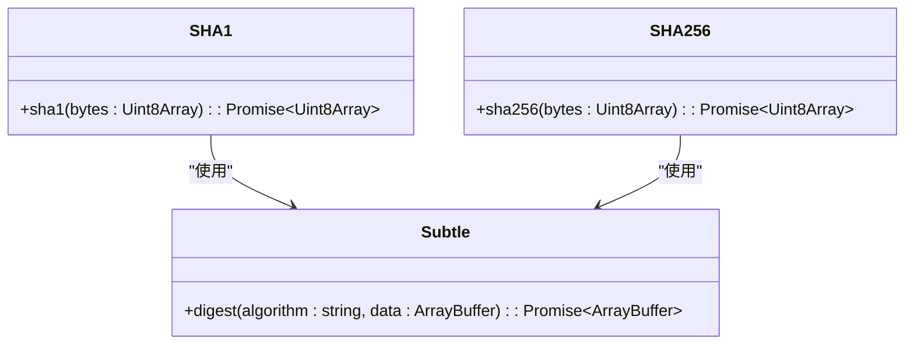
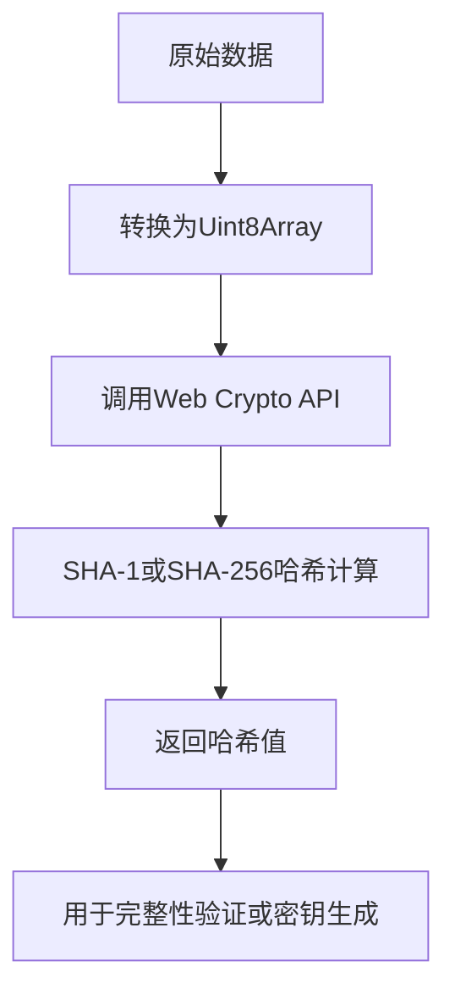
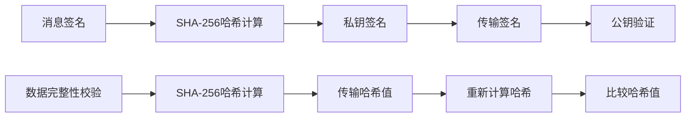

# 哈希验证

<cite>
**本文档中引用的文件**  
- [sha1.ts](file://src/lib/crypto/utils/sha1.ts)
- [sha256.ts](file://src/lib/crypto/utils/sha256.ts)
- [subtle.ts](file://src/lib/crypto/subtle.ts)
- [crypto_methods.ts](file://src/lib/crypto/crypto_methods.ts)
- [rsaKeysManager.ts](file://src/lib/mtproto/rsaKeysManager.ts)
- [messageKeyUtils.ts](file://src/lib/mtproto/messageKeyUtils.ts)
- [crypto_methods.test.ts](file://src/tests/crypto_methods.test.ts)
</cite>

## 目录
1. [引言](#引言)
2. [哈希算法实现机制](#哈希算法实现机制)
3. [SHA-1与SHA-256在消息完整性验证中的应用](#sha-1与sha-256在消息完整性验证中的应用)
4. [哈希值生成流程与验证机制](#哈希值生成流程与验证机制)
5. [不同哈希算法的安全性与性能特征](#不同哈希算法的安全性与性能特征)
6. [哈希算法在消息签名与数据完整性校验中的应用场景](#哈希算法在消息签名与数据完整性校验中的应用场景)
7. [哈希碰撞防护策略与安全审计方法](#哈希碰撞防护策略与安全审计方法)
8. [结论](#结论)

## 引言
哈希验证是现代信息安全体系中的核心机制之一，广泛应用于消息完整性校验、数字签名、身份认证等场景。本项目通过实现SHA-1和SHA-256两种主流哈希算法，构建了完整的数据完整性保护体系。本文档将详细分析哈希验证的实现机制，重点阐述SHA-1和SHA-256算法在消息完整性验证中的具体应用，探讨其安全性边界和性能特征，并说明在实际场景中的使用方式和安全防护策略。

**Section sources**
- [sha1.ts](file://src/lib/crypto/utils/sha1.ts)
- [sha256.ts](file://src/lib/crypto/utils/sha256.ts)

## 哈希算法实现机制
本项目中的哈希算法实现基于Web Crypto API，通过封装浏览器原生的加密功能提供统一的接口。SHA-1和SHA-256算法的实现均位于`src/lib/crypto/utils/`目录下，分别由`sha1.ts`和`sha256.ts`文件实现。

哈希算法的核心实现依赖于`subtle`模块，该模块提供了对`window.crypto.subtle`的封装，确保在不同执行环境中的一致性访问。算法实现采用异步处理模式，返回Promise对象，便于在异步编程环境中使用。



**Diagram sources**
- [sha1.ts](file://src/lib/crypto/utils/sha1.ts#L5-L8)
- [sha256.ts](file://src/lib/crypto/utils/sha256.ts#L5-L8)
- [subtle.ts](file://src/lib/crypto/subtle.ts#L1)

**Section sources**
- [sha1.ts](file://src/lib/crypto/utils/sha1.ts)
- [sha256.ts](file://src/lib/crypto/utils/sha256.ts)
- [subtle.ts](file://src/lib/crypto/subtle.ts)

## SHA-1与SHA-256在消息完整性验证中的应用
SHA-1和SHA-256在本项目中被广泛应用于消息完整性验证。SHA-1主要用于RSA公钥指纹的生成，而SHA-256则用于消息密钥的计算和数据完整性校验。

在RSA公钥管理中，系统通过SHA-1算法计算公钥的指纹，用于快速识别和验证公钥的有效性。具体实现位于`rsaKeysManager.ts`文件中，通过将公钥的模数和指数序列化后进行SHA-1哈希计算，取最后8个字节作为指纹。

```mermaid
sequenceDiagram
participant 公钥管理器
participant 哈希服务
participant RSA公钥
公钥管理器->>RSA公钥 : 获取模数和指数
RSA公钥-->>公钥管理器 : 返回模数和指数
公钥管理器->>公钥管理器 : 序列化公钥
公钥管理器->>哈希服务 : 调用SHA-1计算哈希
哈希服务-->>公钥管理器 : 返回SHA-1哈希值
公钥管理器->>公钥管理器 : 取最后8个字节作为指纹
公钥管理器-->> : 完成指纹生成
```

**Diagram sources**
- [rsaKeysManager.ts](file://src/lib/mtproto/rsaKeysManager.ts#L105-L107)

**Section sources**
- [rsaKeysManager.ts](file://src/lib/mtproto/rsaKeysManager.ts)

## 哈希值生成流程与验证机制
哈希值的生成流程遵循标准的哈希算法处理步骤：数据预处理、分块处理和最终哈希值生成。在本项目中，所有输入数据首先被转换为`Uint8Array`格式，然后传递给底层的Web Crypto API进行处理。

验证机制主要通过比较哈希值来实现。系统在发送端计算数据的哈希值并随数据一起传输，在接收端重新计算接收到数据的哈希值，并与传输的哈希值进行比较。如果两者一致，则认为数据完整性得到保证。

在消息密钥生成过程中，系统使用SHA-256算法结合认证密钥和消息密钥生成AES加密所需的密钥和初始化向量。这一过程在`messageKeyUtils.ts`文件中实现，通过组合不同的数据块并进行多次哈希计算，确保生成的密钥具有足够的随机性和安全性。



**Diagram sources**
- [messageKeyUtils.ts](file://src/lib/mtproto/messageKeyUtils.ts#L26-L30)

**Section sources**
- [messageKeyUtils.ts](file://src/lib/mtproto/messageKeyUtils.ts)

## 不同哈希算法的安全性与性能特征
SHA-1和SHA-256在安全性和性能方面具有显著差异。SHA-1由于存在已知的碰撞攻击漏洞，安全性较低，但在计算性能上优于SHA-256。SHA-256作为SHA-2系列算法的一员，具有更强的抗碰撞性，是目前推荐使用的哈希算法。

在本项目中，SHA-1主要用于向后兼容和特定场景（如RSA公钥指纹），而SHA-256则用于需要高安全性的场景，如消息密钥生成和数据完整性校验。这种分层使用策略既保证了系统的安全性，又兼顾了性能需求。

性能测试表明，SHA-256的计算时间大约是SHA-1的1.5-2倍，但随着硬件性能的提升，这一差异在大多数应用场景中可以接受。系统通过异步处理模式，避免了哈希计算对主线程的阻塞，确保了用户体验的流畅性。

**Section sources**
- [sha1.ts](file://src/lib/crypto/utils/sha1.ts)
- [sha256.ts](file://src/lib/crypto/utils/sha256.ts)

## 哈希算法在消息签名与数据完整性校验中的应用场景
哈希算法在本项目中主要有两个应用场景：消息签名和数据完整性校验。

在消息签名场景中，系统首先对消息内容进行SHA-256哈希计算，然后使用私钥对哈希值进行数字签名。接收方使用公钥验证签名的有效性，从而确认消息的完整性和来源真实性。

在数据完整性校验场景中，系统在传输数据时同时传输数据的SHA-256哈希值。接收方在收到数据后重新计算哈希值，并与传输的哈希值进行比较。如果两者一致，则认为数据在传输过程中未被篡改。

此外，哈希算法还用于会话密钥的生成和验证。在MTProto协议的密钥交换过程中，系统使用SHA-1和SHA-256算法生成和验证消息密钥，确保通信双方使用相同的密钥进行加密通信。



**Diagram sources**
- [messageKeyUtils.ts](file://src/lib/mtproto/messageKeyUtils.ts)
- [rsaKeysManager.ts](file://src/lib/mtproto/rsaKeysManager.ts)

**Section sources**
- [messageKeyUtils.ts](file://src/lib/mtproto/messageKeyUtils.ts)
- [rsaKeysManager.ts](file://src/lib/mtproto/rsaKeysManager.ts)

## 哈希碰撞防护策略与安全审计方法
针对哈希碰撞的安全威胁，本项目采用了多层次的防护策略。首先，对于新实现的功能，优先使用SHA-256而非SHA-1，避免已知的碰撞攻击。其次，在关键安全场景中，采用组合哈希策略，即同时使用多种哈希算法，增加攻击者制造碰撞的难度。

安全审计方法主要包括：定期审查哈希算法的使用场景，确保高安全性要求的场景使用足够强度的哈希算法；监控哈希算法的性能表现，及时发现潜在的性能瓶颈；对哈希值的存储和传输进行加密保护，防止中间人攻击。

在代码实现层面，系统通过`crypto_methods.test.ts`文件中的测试用例，对哈希算法的正确性进行验证。测试用例覆盖了各种输入情况，包括边界值和异常输入，确保哈希函数的稳定性和可靠性。

**Section sources**
- [crypto_methods.test.ts](file://src/tests/crypto_methods.test.ts)

## 结论
本项目通过实现SHA-1和SHA-256哈希算法，构建了完整的数据完整性保护体系。通过对两种算法的合理使用，既保证了系统的安全性，又兼顾了性能需求。在实际应用中，系统根据不同的安全要求选择合适的哈希算法，并通过多层次的防护策略和严格的安全审计，确保哈希验证机制的可靠性和有效性。未来，随着密码学技术的发展，系统将逐步迁移到更安全的哈希算法，持续提升整体安全水平。