# 密钥派生

<cite>
**本文档中引用的文件**   
- [pbkdf2.ts](file://src/lib/crypto/utils/pbkdf2.ts)
- [srp.ts](file://src/lib/crypto/srp.ts)
- [utils.ts](file://src/lib/passcode/utils.ts)
- [generateDh.ts](file://src/lib/crypto/generateDh.ts)
- [computeDhKey.ts](file://src/lib/crypto/computeDhKey.ts)
- [cryptoMessagePort.ts](file://src/lib/crypto/cryptoMessagePort.ts)
- [constants.ts](file://src/lib/passcode/constants.ts)
- [passwordManager.ts](file://src/lib/mtproto/passwordManager.ts)
- [authorizer.ts](file://src/lib/mtproto/authorizer.ts)
- [keyStore.ts](file://src/lib/passcode/keyStore.ts)
- [localStorage.ts](file://src/lib/localStorage.ts)
- [encryptedStorageLayer.ts](file://src/lib/encryptedStorageLayer.ts)
</cite>

## 目录
1. [引言](#引言)
2. [PBKDF2密钥派生机制](#pbkdf2密钥派生机制)
3. [SRP协议实现](#srp协议实现)
4. [DH密钥交换协议](#dh密钥交换协议)
5. [密钥派生参数配置](#密钥派生参数配置)
6. [密钥生命周期管理](#密钥生命周期管理)
7. [安全防护与异常处理](#安全防护与异常处理)
8. [性能分析](#性能分析)
9. [结论](#结论)

## 引言
本文档详细记录了密钥派生的实现机制，重点描述了PBKDF2、SRP和DH密钥交换协议在加密密钥生成过程中的应用。系统分析了不同密钥派生方法的安全特性和性能表现，说明了密钥存储、更新和销毁的完整生命周期管理。

## PBKDF2密钥派生机制

PBKDF2（Password-Based Key Derivation Function 2）是一种基于密码的密钥派生函数，用于从密码生成加密密钥。在本项目中，PBKDF2被用于多种安全场景，包括密码哈希和加密密钥派生。

### PBKDF2实现细节
PBKDF2函数通过多次迭代哈希运算来增强安全性，防止暴力破解攻击。实现中使用了SHA-512作为底层哈希算法，通过多次迭代增加计算成本。

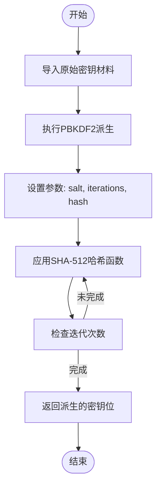

**图源**
- [pbkdf2.ts](file://src/lib/crypto/utils/pbkdf2.ts#L3-L39)

### 密码保护实现
在密码保护场景中，系统使用PBKDF2派生加密密钥和验证哈希。通过不同的盐值分离加密和验证功能，增强安全性。

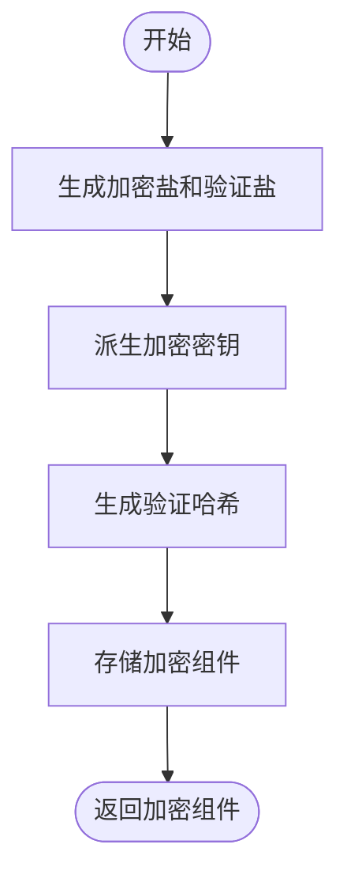

**图源**
- [utils.ts](file://src/lib/passcode/utils.ts#L36-L45)

**节源**
- [utils.ts](file://src/lib/passcode/utils.ts#L5-L45)

## SRP协议实现

安全远程密码协议（Secure Remote Password, SRP）是一种安全的认证协议，允许客户端和服务器在不传输密码的情况下进行相互认证。

### SRP认证流程
SRP协议实现了零知识证明认证，确保密码不会在网络上传输。协议使用大素数和模幂运算来建立安全会话。

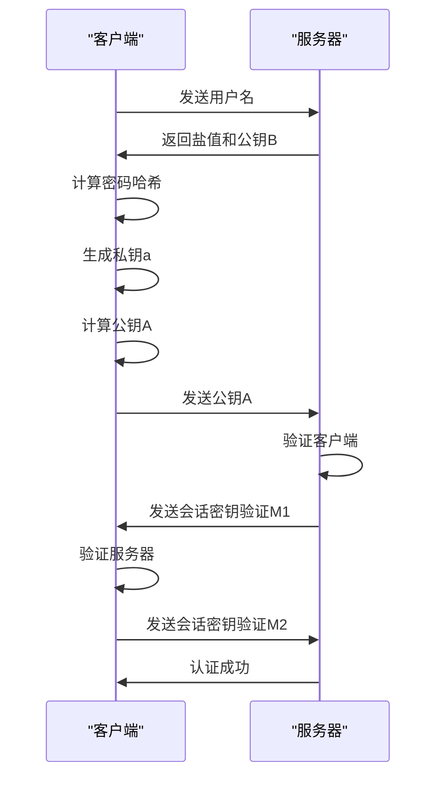

**图源**
- [srp.ts](file://src/lib/crypto/srp.ts#L31-L166)

### SRP密码哈希计算
SRP协议中的密码哈希计算采用了多层哈希处理，增强了安全性。

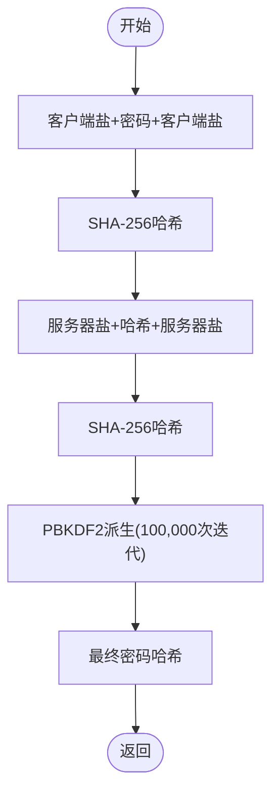

**图源**
- [srp.ts](file://src/lib/crypto/srp.ts#L17-L28)

**节源**
- [srp.ts](file://src/lib/crypto/srp.ts#L17-L29)

## DH密钥交换协议

Diffie-Hellman（DH）密钥交换协议允许双方在不安全的通信渠道上建立共享密钥。

### DH密钥交换流程
DH协议通过数学难题实现安全密钥交换，即使通信被监听也无法推导出共享密钥。

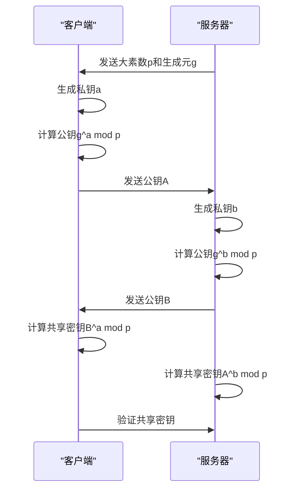

**图源**
- [generateDh.ts](file://src/lib/crypto/generateDh.ts#L16-L51)
- [computeDhKey.ts](file://src/lib/crypto/computeDhKey.ts#L10-L17)

### DH密钥生成实现
DH密钥生成过程包括参数验证和密钥计算，确保安全性。

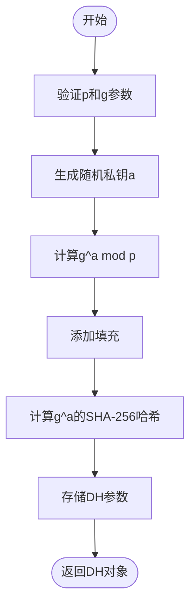

**图源**
- [generateDh.ts](file://src/lib/crypto/generateDh.ts#L16-L51)

**节源**
- [generateDh.ts](file://src/lib/crypto/generateDh.ts#L16-L51)

## 密钥派生参数配置

### 迭代次数选择
系统采用100,000次迭代的PBKDF2派生，平衡了安全性和性能。

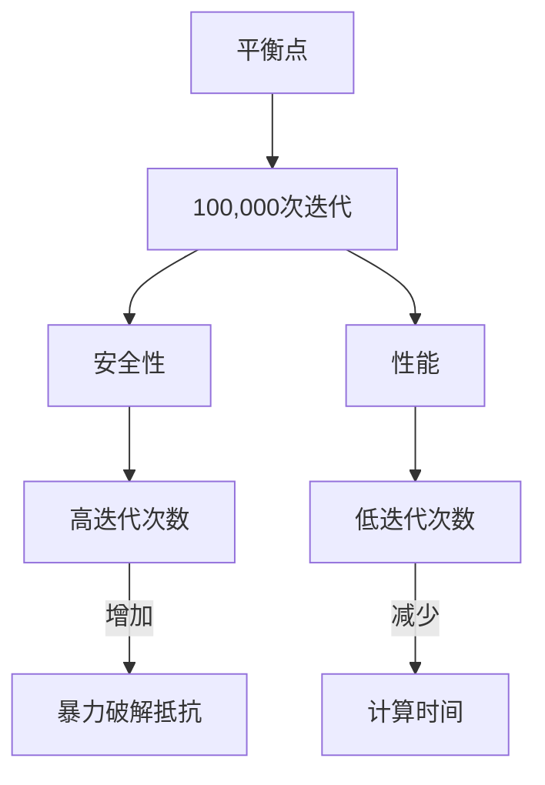

**节源**
- [utils.ts](file://src/lib/passcode/utils.ts#L3)

### 盐值管理策略
系统采用随机生成的盐值，确保每个用户的密钥派生都是唯一的。

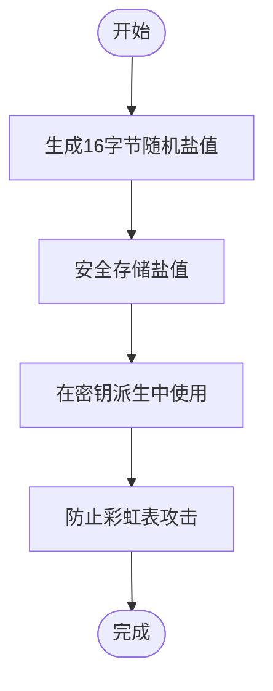

**节源**
- [constants.ts](file://src/lib/passcode/constants.ts#L2)
- [utils.ts](file://src/lib/passcode/utils.ts#L37-L38)

## 密钥生命周期管理

### 密钥存储机制
系统采用分层存储策略，确保密钥的安全性。

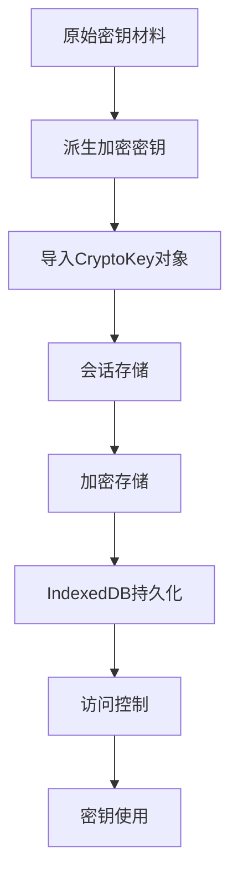

**节源**
- [keyStore.ts](file://src/lib/passcode/keyStore.ts#L4-L38)
- [localStorage.ts](file://src/lib/localStorage.ts#L220-L341)

### 密钥更新与销毁
系统实现了完整的密钥生命周期管理，包括更新和安全销毁。

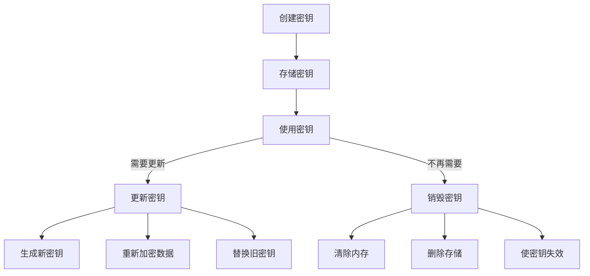

**节源**
- [encryptedStorageLayer.ts](file://src/lib/encryptedStorageLayer.ts#L144-L187)
- [keyStore.ts](file://src/lib/passcode/keyStore.ts#L25-L37)

## 安全防护与异常处理

### 安全防护措施
系统实现了多层安全防护，确保密钥派生过程的安全性。

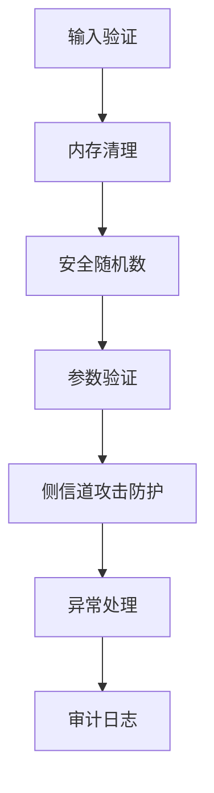

**节源**
- [utils.ts](file://src/lib/passcode/utils.ts#L8-L9)
- [srp.ts](file://src/lib/crypto/srp.ts#L37-L43)

### 异常处理机制
系统实现了全面的异常处理，确保在错误情况下仍能保持安全性。

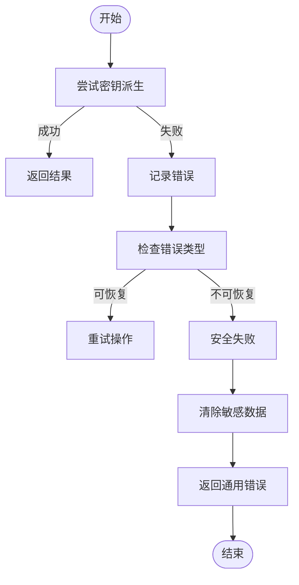

**节源**
- [authorizer.ts](file://src/lib/mtproto/authorizer.ts#L462-L463)
- [passwordManager.ts](file://src/lib/mtproto/passwordManager.ts#L103-L111)

## 性能分析

### 不同密钥派生方法比较
系统对不同密钥派生方法进行了性能评估，选择最优方案。

| 方法 | 迭代次数 | 哈希算法 | 安全性 | 性能 | 适用场景 |
|------|---------|---------|-------|------|---------|
| PBKDF2 | 100,000 | SHA-256 | 高 | 中等 | 密码保护 |
| PBKDF2 | 100,000 | SHA-512 | 极高 | 较低 | 高安全需求 |
| SRP | N/A | 多重哈希 | 极高 | 中等 | 远程认证 |
| DH | N/A | 模幂运算 | 高 | 高 | 密钥交换 |

**节源**
- [pbkdf2.ts](file://src/lib/crypto/utils/pbkdf2.ts#L32)
- [utils.ts](file://src/lib/passcode/utils.ts#L13)

### 性能优化策略
系统采用多种策略优化密钥派生性能。

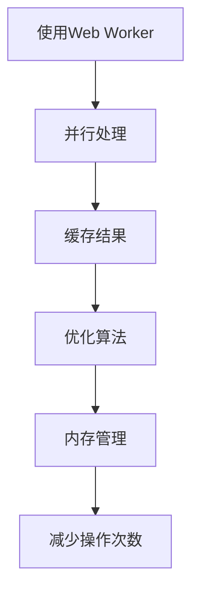

**节源**
- [cryptoMessagePort.ts](file://src/lib/crypto/cryptoMessagePort.ts#L20-L67)

## 结论
本文档详细分析了PBKDF2、SRP和DH密钥派生协议的实现机制。系统通过合理的参数配置和安全策略，实现了高安全性的密钥管理。100,000次迭代的PBKDF2提供了良好的暴力破解抵抗能力，SRP协议确保了安全的远程认证，DH协议实现了安全的密钥交换。完整的密钥生命周期管理确保了密钥从创建到销毁的全过程安全。系统在安全性和性能之间取得了良好平衡，为应用提供了可靠的加密基础。