# 消息加密

<cite>
**本文档中引用的文件**
- [aesCTR.ts](file://src/lib/crypto/utils/aesCTR.ts)
- [aesIGE.ts](file://src/lib/crypto/utils/aesIGE.ts)
- [aesLocal.ts](file://src/lib/crypto/utils/aesLocal.ts)
- [crypto_methods.ts](file://src/lib/crypto/crypto_methods.ts)
- [subtle.ts](file://src/lib/crypto/subtle.ts)
- [crypto.worker.ts](file://src/lib/crypto/crypto.worker.ts)
- [sha1.ts](file://src/lib/crypto/utils/sha1.ts)
- [sha256.ts](file://src/lib/crypto/utils/sha256.ts)
- [aesCTRJs.ts](file://src/lib/crypto/utils/aesCTRJs.ts)
- [cryptoMessagePort.ts](file://src/lib/crypto/cryptoMessagePort.ts)
- [encryptedStorageLayer.ts](file://src/lib/encryptedStorageLayer.ts)
</cite>

## 目录
1. [引言](#引言)
2. [项目结构](#项目结构)
3. [核心组件](#核心组件)
4. [架构概述](#架构概述)
5. [详细组件分析](#详细组件分析)
6. [依赖分析](#依赖分析)
7. [性能考虑](#性能考虑)
8. [故障排除指南](#故障排除指南)
9. [结论](#结论)

## 引言
本文档详细记录了消息加密的实现机制，包括AES-CTR和AES-IGE加密模式的应用。文档解释了加密密钥的生成、存储和更新流程，分析了SHA-1和SHA-256哈希算法在消息完整性验证中的作用。同时描述了Web Crypto API的使用方式和降级处理策略，说明了加密性能优化方法和资源消耗管理。此外，提供了消息加密的调试工具和安全审计方法，包含加密算法的测试验证流程。

## 项目结构
项目结构中与加密相关的文件主要集中在`src/lib/crypto`目录下，该目录包含了实现各种加密算法和相关工具的模块。这些模块通过Web Crypto API和自定义实现相结合的方式，提供了完整的加密解决方案。

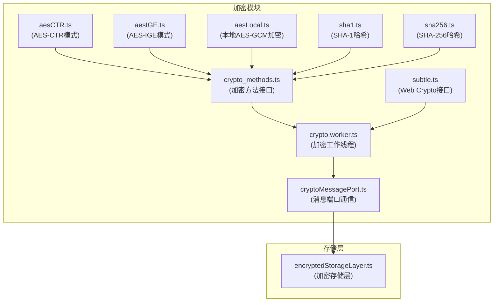

**Diagram sources**
- [aesCTR.ts](file://src/lib/crypto/utils/aesCTR.ts)
- [aesIGE.ts](file://src/lib/crypto/utils/aesIGE.ts)
- [aesLocal.ts](file://src/lib/crypto/utils/aesLocal.ts)
- [sha1.ts](file://src/lib/crypto/utils/sha1.ts)
- [sha256.ts](file://src/lib/crypto/utils/sha256.ts)
- [crypto_methods.ts](file://src/lib/crypto/crypto_methods.ts)
- [crypto.worker.ts](file://src/lib/crypto/crypto.worker.ts)
- [subtle.ts](file://src/lib/crypto/subtle.ts)
- [cryptoMessagePort.ts](file://src/lib/crypto/cryptoMessagePort.ts)
- [encryptedStorageLayer.ts](file://src/lib/encryptedStorageLayer.ts)

**Section sources**
- [src/lib/crypto](file://src/lib/crypto)
- [src/lib/encryptedStorageLayer.ts](file://src/lib/encryptedStorageLayer.ts)

## 核心组件
消息加密系统的核心组件包括AES-CTR和AES-IGE加密模式的实现、SHA-1和SHA-256哈希算法、Web Crypto API的封装以及加密存储层。这些组件协同工作，确保消息在传输和存储过程中的安全性。

**Section sources**
- [aesCTR.ts](file://src/lib/crypto/utils/aesCTR.ts)
- [aesIGE.ts](file://src/lib/crypto/utils/aesIGE.ts)
- [sha1.ts](file://src/lib/crypto/utils/sha1.ts)
- [sha256.ts](file://src/lib/crypto/utils/sha256.ts)
- [encryptedStorageLayer.ts](file://src/lib/encryptedStorageLayer.ts)

## 架构概述
消息加密系统采用分层架构，将加密算法实现、密钥管理、数据存储和通信接口分离。系统通过Web Crypto API提供标准的加密功能，同时实现了特定的加密模式如AES-CTR和AES-IGE。加密操作在独立的Web Worker中执行，以避免阻塞主线程。

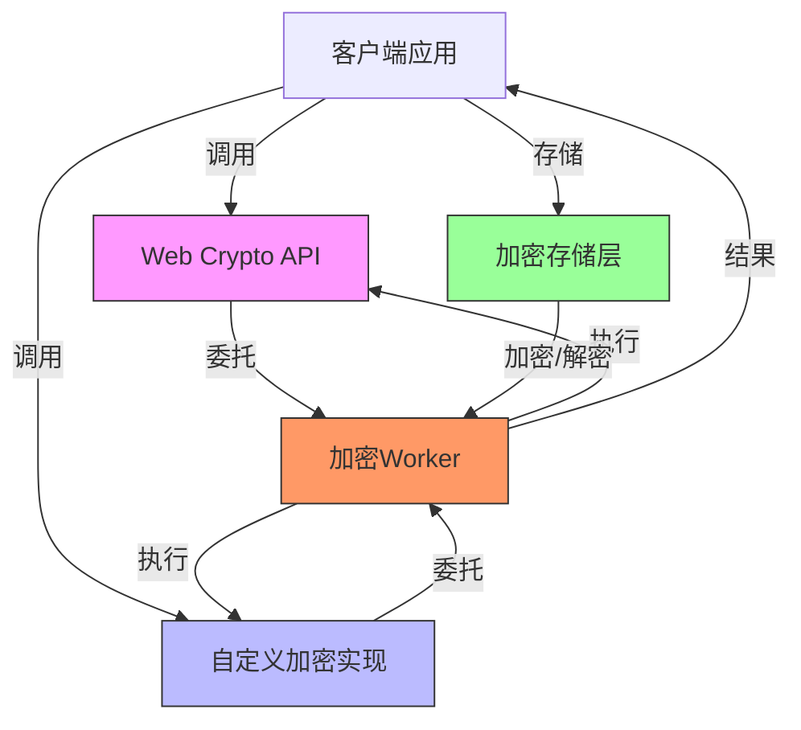

**Diagram sources**
- [subtle.ts](file://src/lib/crypto/subtle.ts)
- [crypto.worker.ts](file://src/lib/crypto/crypto.worker.ts)
- [cryptoMessagePort.ts](file://src/lib/crypto/cryptoMessagePort.ts)
- [encryptedStorageLayer.ts](file://src/lib/encryptedStorageLayer.ts)

## 详细组件分析

### AES加密模式分析
系统实现了两种AES加密模式：CTR（计数器模式）和IGE（无限伽罗瓦计数器模式）。这两种模式提供了不同的安全特性和性能特征。

#### AES-CTR模式
AES-CTR模式通过将计数器值加密后与明文进行异或操作来实现加密。该实现支持流式加密，可以处理任意长度的数据块。

```mermaid
classDiagram
class CTR {
-cryptoKey : CryptoKey
-leftLength : number
-mode : 'encrypt' | 'decrypt'
-counter : BigInteger
-queue : {data : Uint8Array, resolve : (data : Uint8Array) => void}[]
-releasing : boolean
+constructor(mode : 'encrypt' | 'decrypt', cryptoKey : CryptoKey, counter : Uint8Array)
+update(data : Uint8Array) : Promise~Uint8Array~
-release() : Promise~void~
-perform(data : Uint8Array) : Promise~ArrayBuffer~
-_update(data : Uint8Array) : Promise~Uint8Array~
}
CTR --> "uses" subtle : "Web Crypto API"
```

**Diagram sources**
- [aesCTR.ts](file://src/lib/crypto/utils/aesCTR.ts)
- [subtle.ts](file://src/lib/crypto/subtle.ts)

#### AES-IGE模式
AES-IGE模式是一种块加密模式，特别适用于需要完整性和机密性的场景。该实现基于外部库@cryptography/aes，并提供了同步的加密解密接口。

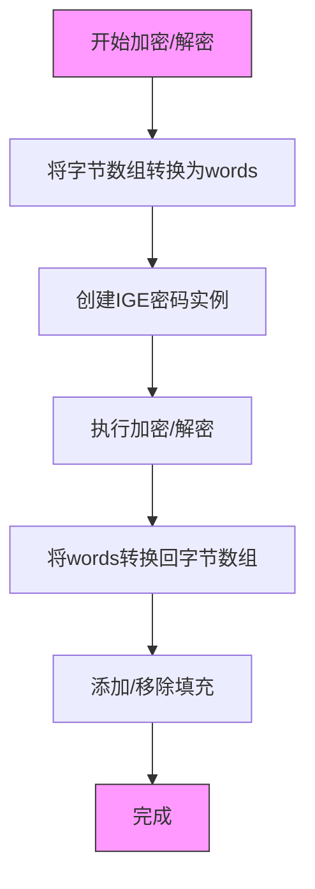

**Diagram sources**
- [aesIGE.ts](file://src/lib/crypto/utils/aesIGE.ts)

### 哈希算法分析
系统实现了SHA-1和SHA-256两种哈希算法，用于消息完整性验证和数字签名。

#### SHA-1实现
SHA-1哈希算法通过Web Crypto API的digest方法实现，提供了标准的160位哈希输出。

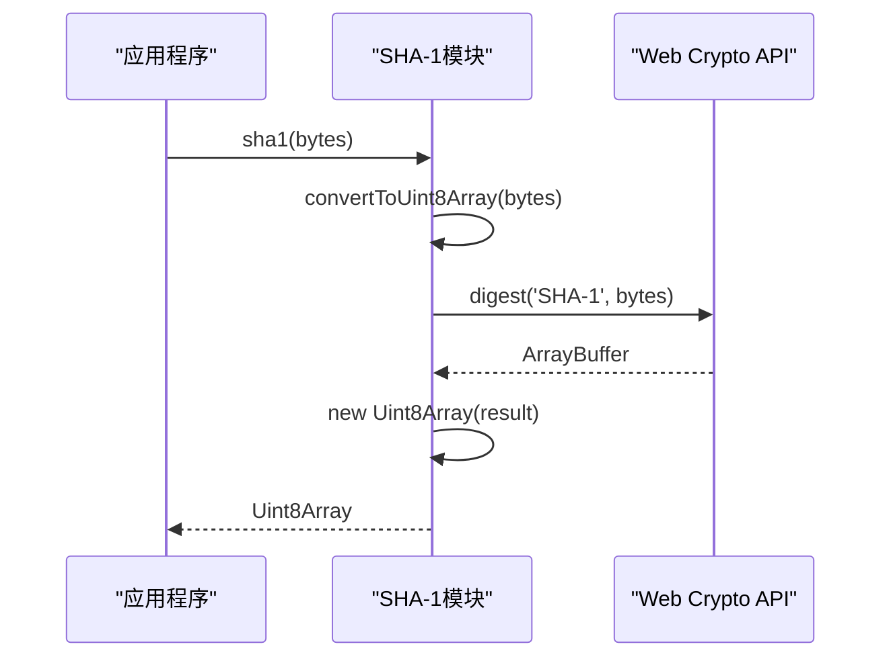

**Diagram sources**
- [sha1.ts](file://src/lib/crypto/utils/sha1.ts)
- [subtle.ts](file://src/lib/crypto/subtle.ts)

#### SHA-256实现
SHA-256哈希算法同样通过Web Crypto API实现，提供了更安全的256位哈希输出。

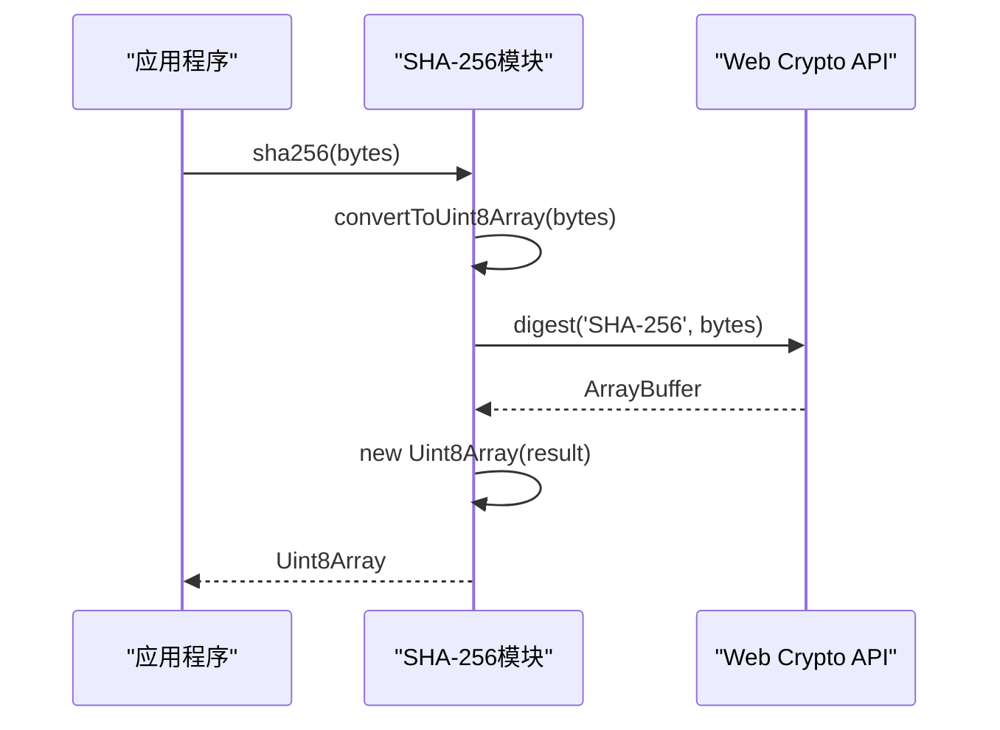

**Diagram sources**
- [sha256.ts](file://src/lib/crypto/utils/sha256.ts)
- [subtle.ts](file://src/lib/crypto/subtle.ts)

### Web Crypto API使用分析
系统通过封装Web Crypto API提供了统一的加密接口，同时实现了降级处理策略以应对不同浏览器环境。

#### Web Crypto封装
通过subtle.ts模块提供对Web Crypto API的访问，确保在不同执行环境中的一致性。

```mermaid
classDiagram
class subtle {
+subtle : CryptoKey
+default : CryptoKey
}
note right of subtle
提供对window.crypto.subtle或
self.crypto.subtle的统一访问
end
```

**Diagram sources**
- [subtle.ts](file://src/lib/crypto/subtle.ts)

#### 降级处理策略
当Web Crypto API不可用时，系统会使用自定义实现作为后备方案，确保基本的加密功能仍然可用。

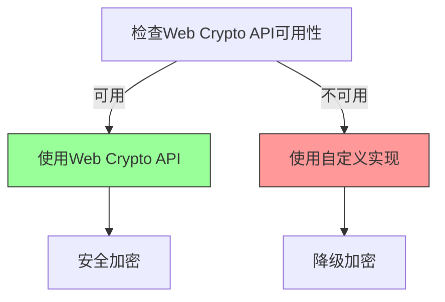

**Section sources**
- [subtle.ts](file://src/lib/crypto/subtle.ts)
- [crypto.worker.ts](file://src/lib/crypto/crypto.worker.ts)

## 依赖分析
消息加密系统依赖于多个内部和外部组件，这些组件共同构成了完整的加密解决方案。

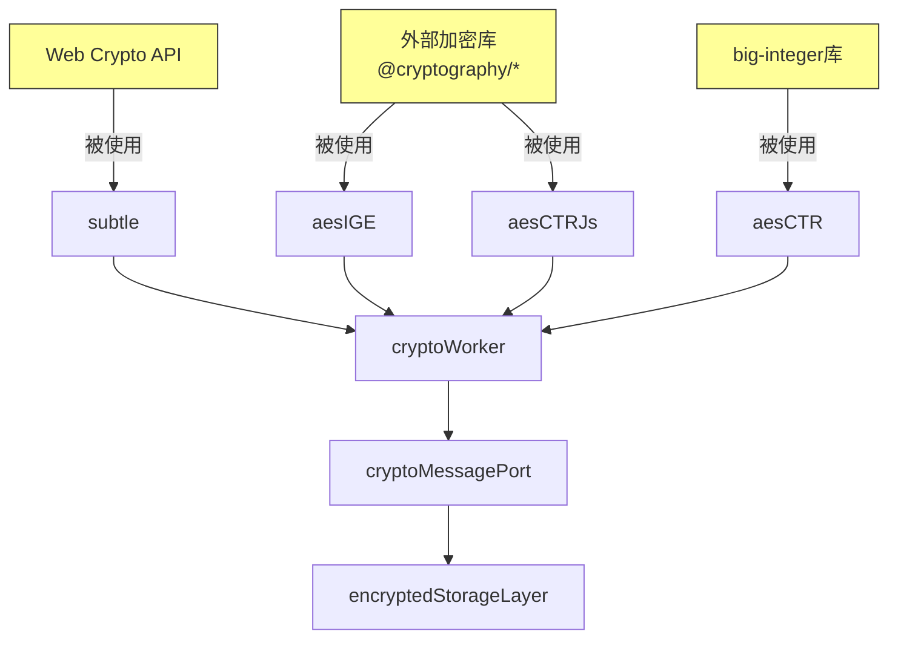

**Diagram sources**
- [subtle.ts](file://src/lib/crypto/subtle.ts)
- [aesIGE.ts](file://src/lib/crypto/utils/aesIGE.ts)
- [aesCTRJs.ts](file://src/lib/crypto/utils/aesCTRJs.ts)
- [aesCTR.ts](file://src/lib/crypto/utils/aesCTR.ts)
- [crypto.worker.ts](file://src/lib/crypto/crypto.worker.ts)
- [cryptoMessagePort.ts](file://src/lib/crypto/cryptoMessagePort.ts)
- [encryptedStorageLayer.ts](file://src/lib/encryptedStorageLayer.ts)

**Section sources**
- [package.json](file://package.json)
- [src/lib/crypto](file://src/lib/crypto)

## 性能考虑
消息加密系统在设计时充分考虑了性能因素，采用了多种优化策略来减少资源消耗。

### 加密性能优化
通过在Web Worker中执行加密操作，避免阻塞主线程，确保用户界面的响应性。

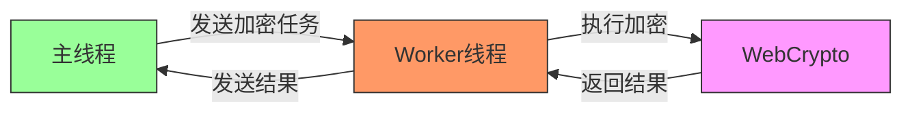

**Section sources**
- [crypto.worker.ts](file://src/lib/crypto/crypto.worker.ts)
- [cryptoMessagePort.ts](file://src/lib/crypto/cryptoMessagePort.ts)

### 资源消耗管理
系统通过异步节流和批量处理等技术来管理资源消耗，避免频繁的加密操作导致性能下降。

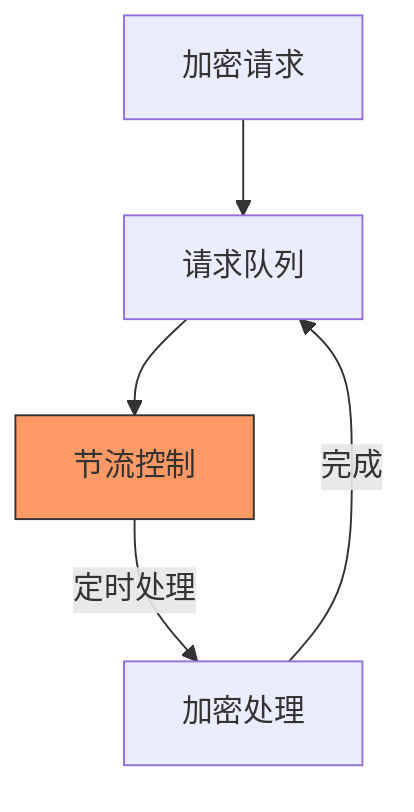

**Section sources**
- [encryptedStorageLayer.ts](file://src/lib/encryptedStorageLayer.ts)
- [asyncThrottle.ts](file://src/helpers/schedulers/asyncThrottle.ts)

## 故障排除指南
本节提供消息加密系统的调试工具和安全审计方法。

### 调试工具
系统提供了详细的日志记录功能，可以帮助开发者诊断加密相关的问题。

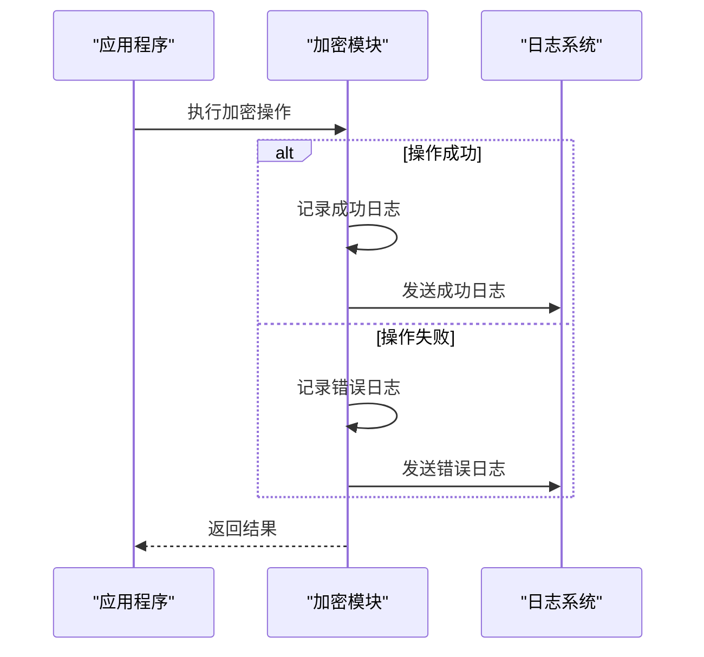

**Section sources**
- [logger.ts](file://src/lib/logger.ts)
- [encryptedStorageLayer.ts](file://src/lib/encryptedStorageLayer.ts)

### 安全审计方法
系统实现了加密算法的测试验证流程，确保加密实现的安全性。

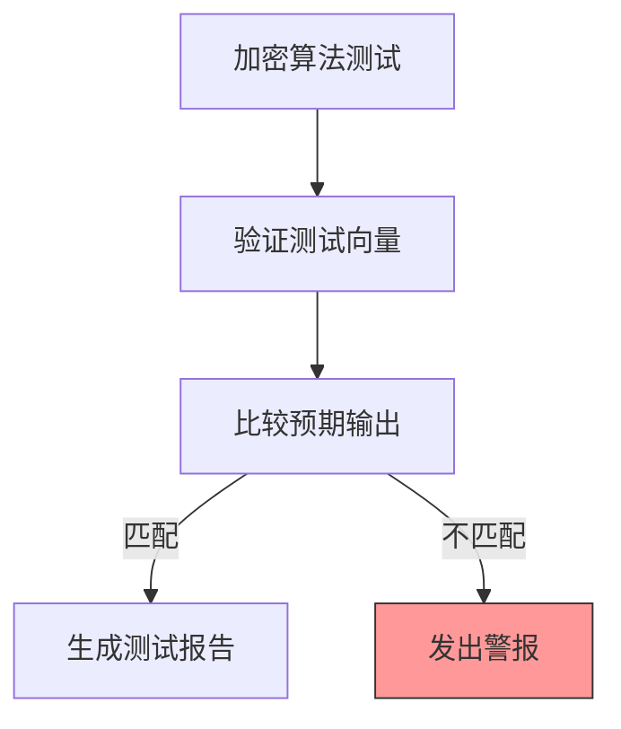

**Section sources**
- [crypto_methods.test.ts](file://src/tests/crypto_methods.test.ts)
- [srp.test.ts](file://src/tests/srp.test.ts)

## 结论
消息加密系统通过结合Web Crypto API和自定义实现，提供了安全可靠的加密解决方案。系统支持多种加密模式和哈希算法，能够满足不同的安全需求。通过在Web Worker中执行加密操作，系统确保了良好的性能表现。加密存储层的设计保证了数据在持久化过程中的安全性。整体架构清晰，组件职责分明，便于维护和扩展。