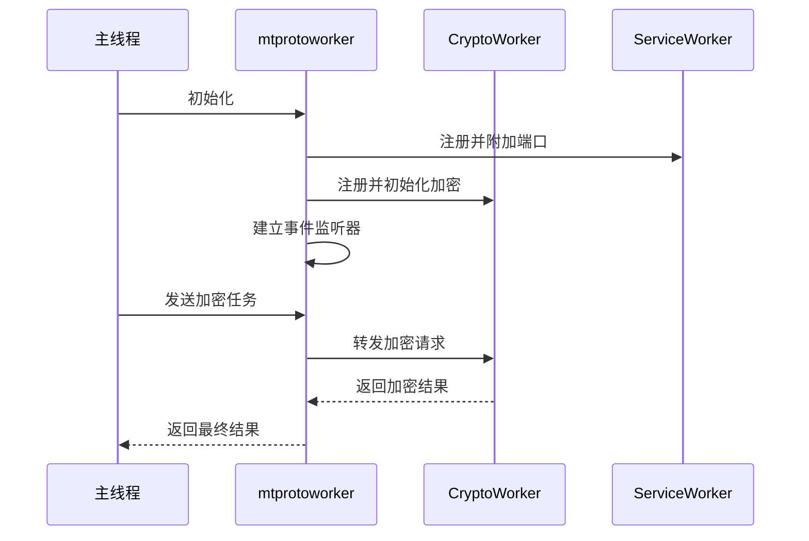
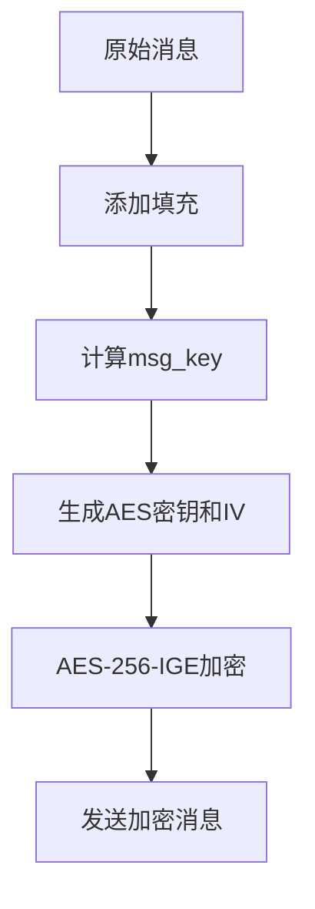
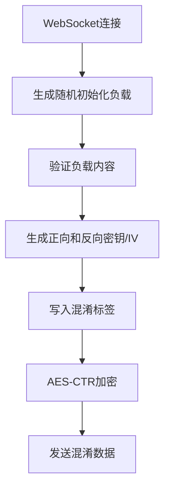
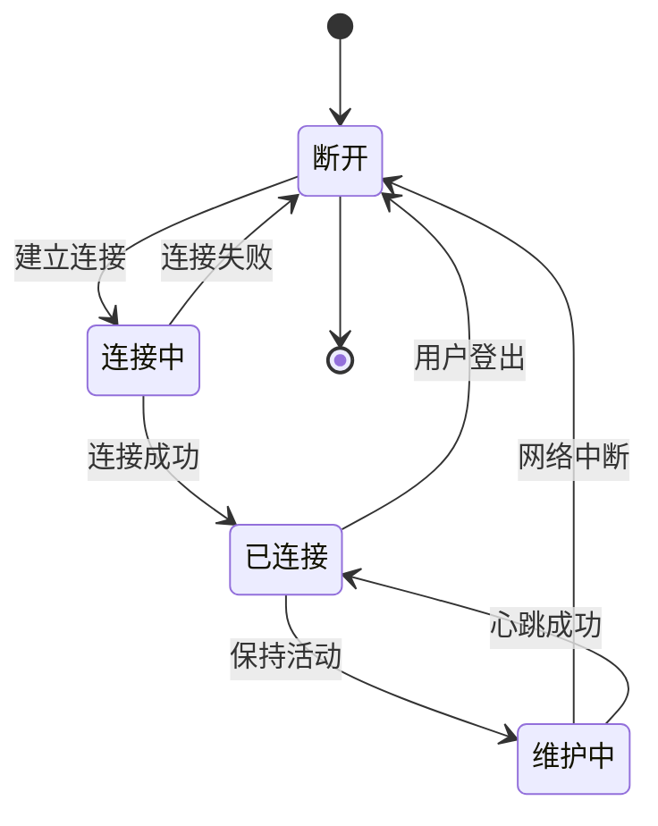

# 通信安全

<cite>
**本文档引用的文件**  
- [mtprotoworker.ts](file://src/lib/mtproto/mtprotoworker.ts)
- [mtproto.worker.ts](file://src/lib/mtproto/mtproto.worker.ts)
- [messageKeyUtils.ts](file://src/lib/mtproto/messageKeyUtils.ts)
- [obfuscation.ts](file://src/lib/mtproto/transports/obfuscation.ts)
- [websocket.ts](file://src/lib/mtproto/transports/websocket.ts)
- [transport.ts](file://src/lib/mtproto/transports/transport.ts)
- [controller.ts](file://src/lib/mtproto/transports/controller.ts)
- [crypto_methods.ts](file://src/lib/crypto/crypto_methods.ts)
- [aesCtrUtils.ts](file://src/lib/crypto/aesCtrUtils.ts)
- [sha1.ts](file://src/lib/crypto/utils/sha1.ts)
- [sha256.ts](file://src/lib/crypto/utils/sha256.ts)
</cite>

## 目录
1. [引言](#引言)
2. [MTProto协议安全特性概述](#mtproto协议安全特性概述)
3. [mtprotoworker中的安全通信流程](#mtprotoworker中的安全通信流程)
4. [消息加密与密钥生成机制](#消息加密与密钥生成机制)
5. [网络传输层安全措施](#网络传输层安全措施)
6. [消息完整性与重放攻击防护](#消息完整性与重放攻击防护)
7. [端到端加密实现与密钥协商](#端到端加密实现与密钥协商)
8. [安全连接的建立、维护与终止](#安全连接的建立维护与终止)
9. [安全配置选项与调试方法](#安全配置选项与调试方法)

## 引言
本文件详细记录了基于MTProto协议的通信安全机制，重点分析了在`tweb`项目中实现的安全通信流程。文档涵盖了从消息加密、密钥生成、网络传输安全到端到端加密的完整技术栈，旨在为开发者提供一个全面的安全架构理解。

## MTProto协议安全特性概述
MTProto协议是Telegram用于客户端与服务器通信的核心协议，其设计强调安全性与效率。该协议通过多层加密、消息认证和传输混淆等机制，确保通信的机密性、完整性和抗审查性。在`tweb`项目中，MTProto的实现通过Web Worker和Service Worker的协同工作，实现了高性能且安全的通信。

**Section sources**
- [mtprotoworker.ts](file://src/lib/mtproto/mtprotoworker.ts#L1-L800)
- [mtproto.worker.ts](file://src/lib/mtproto/mtproto.worker.ts#L1-L298)

## mtprotoworker中的安全通信流程
`mtprotoworker.ts`是安全通信的核心协调者，它通过`MTProtoMessagePort`与主应用线程通信，并管理多个安全相关的Worker。该模块负责初始化加密环境、协调密钥存储、处理服务消息端口，并确保所有安全操作在隔离的Worker环境中执行。

安全通信流程始于`mtprotoworker`的构造函数，它会注册Service Worker和Crypto Worker，建立安全的通信通道。通过`addMultipleEventsListeners`，它监听并处理来自不同组件的安全事件，如加密密钥保存、锁屏状态切换等。

**Diagram sources**
- [mtprotoworker.ts](file://src/lib/mtproto/mtprotoworker.ts#L1-L800)
- [mtproto.worker.ts](file://src/lib/mtproto/mtproto.worker.ts#L1-L298)

**Section sources**
- [mtprotoworker.ts](file://src/lib/mtproto/mtprotoworker.ts#L1-L800)

## 消息加密与密钥生成机制
消息加密是MTProto安全性的核心。`messageKeyUtils.ts`文件实现了消息密钥（msg_key）和AES密钥/IV的生成算法。该机制基于客户端和服务端的`auth_key`以及消息内容，通过SHA-1或SHA-256哈希函数生成消息认证码和加密参数。

消息密钥生成过程如下：对于传出消息，使用`auth_key`的前32字节与消息内容进行SHA-256哈希，取结果的中间16字节作为`msg_key`。随后，使用`msg_key`和`auth_key`的不同部分生成32字节的AES密钥和32字节的初始化向量（IV），用于AES-256-IGE模式加密。

**Diagram sources**
- [messageKeyUtils.ts](file://src/lib/mtproto/messageKeyUtils.ts#L1-L64)

**Section sources**
- [messageKeyUtils.ts](file://src/lib/mtproto/messageKeyUtils.ts#L1-L64)

## 网络传输层安全措施
### WebSocket加密传输
网络传输层使用WebSocket作为主要通信通道，通过`websocket.ts`实现。该实现基于标准WebSocket API，设置`binaryType`为`arraybuffer`以传输二进制数据。连接建立后，所有数据包都通过`send`方法发送，并通过`message`事件接收。

### 流量混淆（Obfuscation）
为了防止流量被识别和审查，MTProto实现了流量混淆机制，由`obfuscation.ts`文件实现。该机制在WebSocket连接建立初期，使用AES-CTR模式对通信数据进行加密混淆。混淆过程包括：
1. 生成64字节的随机初始化负载
2. 根据特定规则验证负载，避免使用敏感值
3. 使用正向和反向的密钥/IV对进行加密
4. 将混淆标签写入负载
5. 对整个负载进行加密

此混淆层确保了即使在不安全的网络环境中，通信流量也难以被识别和拦截。

**Diagram sources**
- [websocket.ts](file://src/lib/mtproto/transports/websocket.ts#L1-L114)
- [obfuscation.ts](file://src/lib/mtproto/transports/obfuscation.ts#L1-L227)

**Section sources**
- [websocket.ts](file://src/lib/mtproto/transports/websocket.ts#L1-L114)
- [obfuscation.ts](file://src/lib/mtproto/transports/obfuscation.ts#L1-L227)

## 消息完整性与重放攻击防护
MTProto协议通过消息密钥（msg_key）和消息ID机制确保消息完整性并防止重放攻击。每个消息都包含一个基于消息内容生成的`msg_key`，接收方会重新计算`msg_key`并进行验证。如果计算结果不匹配，则消息被视为无效或被篡改。

此外，消息ID的时间戳部分必须严格递增，且与服务器时间保持同步。这防止了攻击者重放旧消息，因为过时的消息ID会被服务器拒绝。`mtprotoworker`通过`timeManager`确保客户端时间的准确性，从而维护消息ID的有效性。

**Section sources**
- [messageKeyUtils.ts](file://src/lib/mtproto/messageKeyUtils.ts#L1-L64)
- [mtprotoworker.ts](file://src/lib/mtproto/mtprotoworker.ts#L1-L800)

## 端到端加密实现与密钥协商
端到端加密（E2EE）在`tweb`中通过独立的密钥协商流程实现。当用户发起秘密聊天时，客户端会启动一个安全的密钥交换协议（如Diffie-Hellman），生成会话密钥。该密钥仅存储在参与方的设备上，不会上传到服务器。

`crypto_methods.ts`定义了支持的加密方法，包括`sha1`、`sha256`、`pbkdf2`、`aes-encrypt`、`aes-decrypt`等。这些方法通过`CryptoWorker`在独立的Worker线程中执行，确保了密钥操作的安全隔离。密钥协商完成后，所有消息都使用会话密钥进行AES加密，确保只有通信双方能够解密。

**Section sources**
- [crypto_methods.ts](file://src/lib/crypto/crypto_methods.ts#L1-L43)
- [mtprotoworker.ts](file://src/lib/mtproto/mtprotoworker.ts#L1-L800)

## 安全连接的建立、维护与终止
### 连接建立
安全连接的建立由`transportController.ts`协调。它通过`pingTransports`方法测试HTTPS和WebSocket连接的可用性，并选择最优的传输方式。连接建立后，`setTransportOpened`方法会更新连接状态。

### 连接维护
连接维护通过`MTTransportController`的事件监听机制实现。当网络状态变化时，系统会自动尝试重新连接，并通过`setTransportValue`更新连接计数。`idleController`监听用户活动状态，在用户空闲时可能触发连接优化。

### 连接终止
连接终止通过`close`方法执行。`mtprotoworker`会清理所有定时器、关闭Worker端口，并通知所有相关组件。在用户登出时，`logging_out`事件会触发`toggleStorages`和`unregister`操作，确保所有敏感数据被清除。

**Diagram sources**
- [controller.ts](file://src/lib/mtproto/transports/controller.ts#L1-L129)
- [mtprotoworker.ts](file://src/lib/mtproto/mtprotoworker.ts#L1-L800)

**Section sources**
- [controller.ts](file://src/lib/mtproto/transports/controller.ts#L1-L129)
- [mtprotoworker.ts](file://src/lib/mtproto/mtprotoworker.ts#L1-L800)

## 安全配置选项与调试方法
### 安全配置
项目通过`appSettings`和`appState`存储安全相关配置。`DeferredIsUsingPasscode`管理密码锁状态，`EncryptionKeyStore`负责加密密钥的存储。配置变更通过`settings_updated`事件广播，确保所有组件同步更新。

### 调试方法
调试信息通过`logger`模块输出，支持不同日志级别（Error、Log、Debug）。`mtprotoworker`中的`log`方法会记录关键操作，便于问题排查。Service Worker的注册状态和网络连接状态也可通过控制台监控。

**Section sources**
- [mtprotoworker.ts](file://src/lib/mtproto/mtprotoworker.ts#L1-L800)
- [mtproto.worker.ts](file://src/lib/mtproto/mtproto.worker.ts#L1-L298)