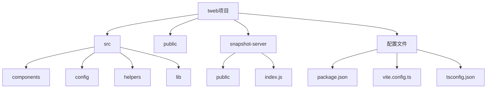
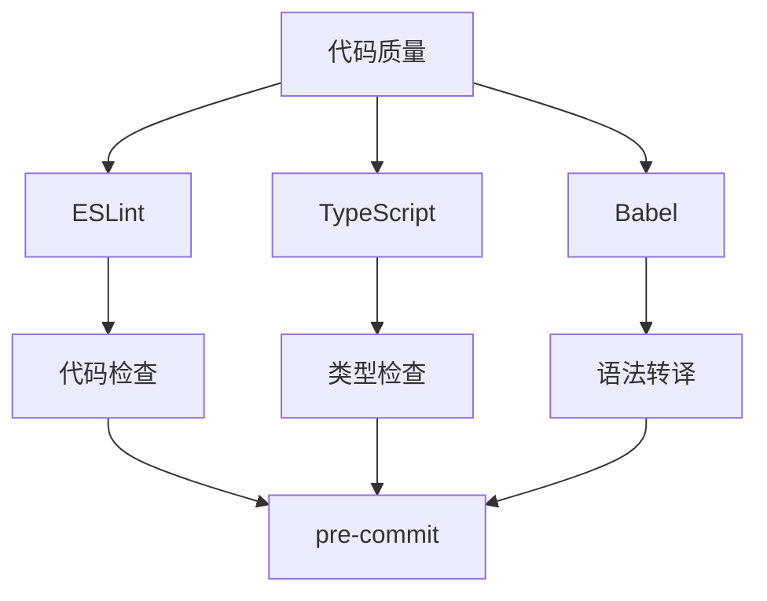

# 开发环境搭建

<cite>
**本文档中引用的文件**  
- [package.json](file://package.json)
- [README.md](file://README.md)
- [vite.config.ts](file://vite.config.ts)
- [tsconfig.json](file://tsconfig.json)
- [.env.local.example](file://.env.local.example)
- [docker-compose.yaml](file://docker-compose.yaml)
- [build.js](file://build.js)
- [server.js](file://server.js)
- [eslint.config.mjs](file://eslint.config.mjs)
- [snapshot-server/README.md](file://snapshot-server/README.md)
</cite>

## 目录
1. [简介](#简介)
2. [项目结构](#项目结构)
3. [Node.js与pnpm安装](#nodejs与pnpm安装)
4. [克隆仓库与依赖安装](#克隆仓库与依赖安装)
5. [环境变量配置](#环境变量配置)
6. [开发服务器启动与热重载](#开发服务器启动与热重载)
7. [调试配置](#调试配置)
8. [浏览器兼容性测试](#浏览器兼容性测试)
9. [常见问题解决方案](#常见问题解决方案)
10. [推荐开发工具与扩展](#推荐开发工具与扩展)
11. [代码格式化与Linting配置](#代码格式化与linting配置)

## 简介
本指南详细说明了如何为tweb项目搭建完整的开发环境。tweb是基于Webogram改进的Telegram Web客户端，使用Vite作为开发服务器，SolidJS作为前端框架。本文档将指导您完成从零开始的环境搭建全过程，包括必要的工具安装、依赖管理、环境配置、服务器启动以及调试设置。

## 项目结构
项目采用现代化的前端架构，主要包含以下目录：
- `src/`：核心源代码，包含组件、配置、助手函数等
- `public/`：静态资源文件
- `snapshot-server/`：用于本地存储和IndexedDB快照管理的小型应用
- 根目录包含构建和开发相关的配置文件



**Diagram sources**
- [package.json](file://package.json)
- [README.md](file://README.md)

## Node.js与pnpm安装
项目要求安装Node.js和pnpm包管理器：

1. **Node.js安装**：
   - 访问[Node.js官网](https://nodejs.org)
   - 下载并安装LTS版本（建议18.x或更高版本）
   - 验证安装：`node --version` 和 `npm --version`

2. **pnpm安装**：
   - 使用npm全局安装：`npm install -g pnpm`
   - 验证安装：`pnpm --version`
   - 项目中已配置`preinstall`脚本强制使用pnpm：`"preinstall": "npx only-allow pnpm"`

**Section sources**
- [package.json](file://package.json#L7)

## 克隆仓库与依赖安装
按照以下步骤设置项目：

1. **克隆仓库**：
   ```bash
   git clone <repository-url>
   cd tweb
   ```

2. **安装依赖**：
   ```bash
   pnpm install
   ```
   此命令将安装`package.json`中定义的所有开发依赖，包括Vite、TypeScript、ESLint等。

3. **验证安装**：
   - 检查`node_modules`目录是否已创建
   - 确认`pnpm-lock.yaml`文件存在

**Section sources**
- [package.json](file://package.json)
- [README.md](file://README.md#L6-L10)

## 环境变量配置
项目使用环境变量进行配置：

1. **创建环境文件**：
   ```bash
   cp .env.local.example .env.local
   ```
   或在开发模式下，Vite配置会自动创建此文件。

2. **配置内容**：
   - `VITE_LANG_PACK_LOCAL_VERSION`：本地语言包版本号
   - 其他可能的环境变量可根据需要添加

3. **自动配置机制**：
   `vite.config.ts`中的脚本会在开发模式下自动检查并创建`.env.local`文件。

**Section sources**
- [.env.local.example](file://.env.local.example)
- [vite.config.ts](file://vite.config.ts#L15-L25)

## 开发服务器启动与热重载
启动开发环境的步骤：

1. **启动开发服务器**：
   ```bash
   pnpm start
   ```
   此命令执行`vite --force`，启动Vite开发服务器。

2. **访问应用**：
   打开浏览器访问 `http://localhost:8080/`

3. **热重载功能**：
   - Vite提供即时热模块替换（HMR）
   - 修改源代码后，浏览器会自动刷新
   - 支持CSS和JavaScript的热重载

4. **自定义端口**：
   可在`vite.config.ts`中修改`server.port`配置。

**Section sources**
- [package.json](file://package.json#L8)
- [vite.config.ts](file://vite.config.ts#L36-L39)
- [README.md](file://README.md#L14-L15)

## 调试配置
项目提供多种调试选项：

1. **查询参数调试**：
   - `test=1`：使用测试DC
   - `debug=1`：启用额外日志
   - `noSharedWorker=1`：禁用Shared Worker
   - `http=1`：强制使用HTTPS传输

2. **全局调试函数**：
   - `showIconLibrary()`：预览所有SVG图标

3. **源码映射**：
   - 生产构建包含源码映射，便于调试

4. **本地存储快照**：
   使用`snapshot-server`管理本地存储和IndexedDB快照。

**Section sources**
- [README.md](file://README.md#L67-L79)
- [snapshot-server/README.md](file://snapshot-server/README.md)

## 浏览器兼容性测试
项目支持Docker环境进行兼容性测试：

1. **开发模式**：
   ```bash
   docker-compose up tweb.dependencies
   docker-compose up tweb.develop
   ```

2. **生产模式**：
   ```bash
   docker-compose up tweb.production -d
   ```

3. **访问地址**：
   - 开发：`http://localhost:8080/`
   - 生产：`http://localhost:80/`

**Section sources**
- [docker-compose.yaml](file://docker-compose.yaml)
- [README.md](file://README.md#L22-L37)

## 常见问题解决方案
解决开发中可能遇到的问题：

1. **依赖安装失败**：
   - 确保使用pnpm而非npm或yarn
   - 清除缓存：`pnpm store prune`
   - 检查网络代理设置

2. **构建错误**：
   - 检查TypeScript类型错误
   - 验证环境变量配置
   - 确认Node.js版本兼容性

3. **热重载失效**：
   - 重启Vite服务器
   - 检查文件监视权限
   - 清除浏览器缓存

4. **端口冲突**：
   修改`vite.config.ts`中的端口号。

**Section sources**
- [package.json](file://package.json)
- [vite.config.ts](file://vite.config.ts)

## 推荐开发工具与扩展
提升开发效率的工具推荐：

1. **代码编辑器**：
   - Visual Studio Code（推荐）
   - 配置在`fff.code-workspace`

2. **浏览器开发者工具**：
   - Chrome DevTools
   - 支持源码映射调试

3. **Docker**：
   - 用于环境隔离和兼容性测试

4. **Git**：
   - 版本控制

**Section sources**
- [fff.code-workspace](file://fff.code-workspace)

## 代码格式化与linting配置
项目代码质量保障配置：

1. **ESLint配置**：
   - 配置文件：`eslint.config.mjs`
   - 规则包括：缩进、引号、逗号、空格等
   - 支持TypeScript

2. **TypeScript配置**：
   - 严格类型检查
   - 模块解析策略为"node"
   - 目标ES版本为es2015

3. **格式化命令**：
   ```bash
   pnpm run lint
   ```

4. **Babel配置**：
   - 用于TypeScript转译
   - 目标浏览器：Chrome 56+



**Diagram sources**
- [eslint.config.mjs](file://eslint.config.mjs)
- [tsconfig.json](file://tsconfig.json)
- [babel.config.js](file://babel.config.js)