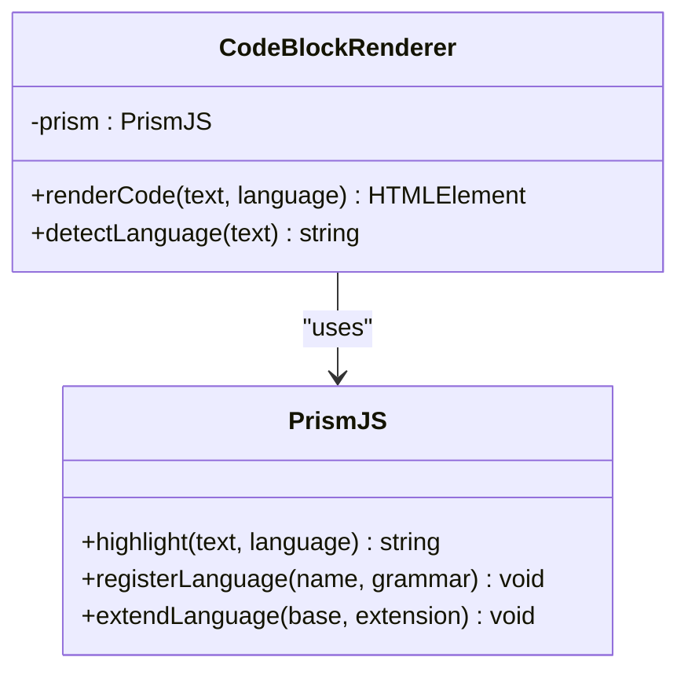
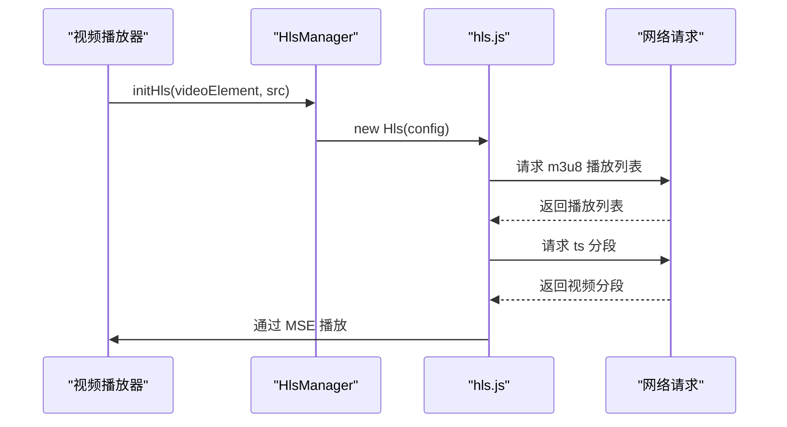
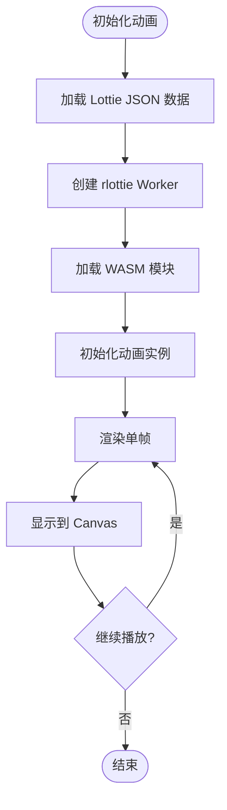

# 技术栈与依赖

<cite>
**本文档中引用的文件**  
- [package.json](file://package.json)
- [tsconfig.json](file://tsconfig.json)
- [vite.config.ts](file://vite.config.ts)
- [babel.config.js](file://babel.config.js)
- [pnpm-lock.yaml](file://pnpm-lock.yaml)
- [src/lib/rlottie/rlottiePlayer.ts](file://src/lib/rlottie/rlottiePlayer.ts)
- [src/lib/hls/initVideoHls.ts](file://src/lib/hls/initVideoHls.ts)
- [src/vendor/prism.ts](file://src/vendor/prism.ts)
- [src/scss/components/_prism.scss](file://src/scss/components/_prism.scss)
- [src/components/lottieAnimation.tsx](file://src/components/lottieAnimation.tsx)
- [src/components/chat/bubbles.ts](file://src/components/chat/bubbles.ts)
- [src/components/codeLanguages.ts](file://src/components/codeLanguages.ts)
</cite>

## 目录
1. [简介](#简介)
2. [主要依赖项](#主要依赖项)
3. [TypeScript 配置](#typescript-配置)
4. [构建工具链](#构建工具链)
5. [SCSS 样式处理与模块化 CSS](#scss-样式处理与模块化-css)
6. [前端安全实践与性能优化](#前端安全实践与性能优化)
7. [版本兼容性与升级指南](#版本兼容性与升级指南)
8. [开发环境要求与 IDE 配置](#开发环境要求与-ide-配置)

## 简介
tweb 项目是一个基于现代前端技术栈构建的 Telegram Web 客户端。该项目采用 Solid.js 作为核心 UI 框架，结合 Vite 构建工具和 pnpm 包管理器，实现了高性能、可维护的前端架构。本技术文档详细记录了项目的技术栈、依赖关系、构建流程、样式策略、安全实践及开发环境配置。

## 主要依赖项

### Solid.js
Solid.js 是 tweb 项目的核心前端框架，用于构建响应式用户界面。它通过细粒度的响应式系统实现高性能渲染，避免了虚拟 DOM 的开销。项目通过 `vite-plugin-solid` 插件集成 Solid.js，并在 `vite.config.ts` 中配置了 JSX 转换。

**作用**：
- 提供声明式 UI 开发模式
- 实现高效的响应式更新机制
- 支持组件化开发架构

**Section sources**
- [vite.config.ts](file://vite.config.ts#L2-L162)
- [package.json](file://package.json#L71-L72)

### Vite
Vite 作为项目的构建工具和开发服务器，提供了快速的冷启动和热模块替换（HMR）功能。在 `package.json` 的 `scripts` 中定义了 `start` 和 `build` 命令，分别用于开发和生产构建。

**作用**：
- 提供基于原生 ES 模块的开发服务器
- 实现快速的构建和热更新
- 支持 TypeScript、JSX 和 SCSS 的开箱即用

**Section sources**
- [package.json](file://package.json#L8-L11)
- [vite.config.ts](file://vite.config.ts#L70-L162)

### pnpm
pnpm 作为包管理器，通过硬链接和符号链接实现高效的依赖管理，减少磁盘空间占用并提高安装速度。`package.json` 中的 `packageManager` 字段指定了 pnpm 版本。

**作用**：
- 提供快速、节省磁盘空间的依赖安装
- 通过 `preinstall` 脚本强制使用 pnpm
- 支持精确的依赖版本控制

**Section sources**
- [package.json](file://package.json#L74-L75)

### Prism.js
Prism.js 用于代码高亮功能，支持多种编程语言的语法着色。项目通过 `@types/prismjs` 提供类型定义，并在 `src/vendor/prism.ts` 中进行配置。

**作用**：
- 实现聊天消息中的代码块语法高亮
- 支持多种编程语言的词法分析
- 提供可定制的主题和样式



**Diagram sources**
- [src/vendor/prism.ts](file://src/vendor/prism.ts)
- [src/components/chat/bubbles.ts](file://src/components/chat/bubbles.ts)

**Section sources**
- [package.json](file://package.json#L62-L63)
- [src/vendor/prism.ts](file://src/vendor/prism.ts)

### hls.js
hls.js 用于处理 HLS（HTTP Live Streaming）视频流，支持在不原生支持 HLS 的浏览器中播放流媒体内容。项目在 `src/lib/hls/` 目录下封装了 HLS 播放逻辑。

**作用**：
- 实现视频消息的流媒体播放
- 支持自适应码率切换
- 处理 HLS 播放列表和分段请求



**Diagram sources**
- [src/lib/hls/initVideoHls.ts](file://src/lib/hls/initVideoHls.ts)
- [src/lib/hls/types.ts](file://src/lib/hls/types.ts)

**Section sources**
- [package.json](file://package.json#L54-L55)
- [src/lib/hls/](file://src/lib/hls/)

### rlottie
rlottie 用于播放 Lottie 动画，支持高性能的 WebAssembly 渲染。项目通过 `rlottie-wasm.js` 和 `rlottie-wasm.wasm` 文件提供动画播放能力。

**作用**：
- 实现表情动画的高性能播放
- 支持 WebAssembly 加速渲染
- 提供 Worker 线程隔离的动画处理



**Diagram sources**
- [src/lib/rlottie/rlottiePlayer.ts](file://src/lib/rlottie/rlottiePlayer.ts)
- [src/lib/rlottie/rlottie.worker.ts](file://src/lib/rlottie/rlottie.worker.ts)

**Section sources**
- [public/rlottie-wasm.js](file://public/rlottie-wasm.js)
- [src/lib/rlottie/](file://src/lib/rlottie/)

## TypeScript 配置

### 编译选项
`tsconfig.json` 文件定义了项目的 TypeScript 编译配置，关键选项包括：

- **target**: es2015 - 目标 ECMAScript 版本
- **module**: es2020 - 模块代码生成格式
- **lib**: ["es2015", "dom", "webworker"] - 包含的库文件
- **strict**: true - 启用所有严格类型检查
- **sourceMap**: true - 生成源码映射文件
- **jsx**: preserve - JSX 代码生成模式
- **jsxImportSource**: solid-js - JSX 导入源

### 路径别名
通过 `paths` 配置实现了模块路径别名，将 `solid-js` 等包重定向到本地 `src/vendor/` 目录，便于定制和优化。

```json
{
  "paths": {
    "solid-js": ["./src/vendor/solid"],
    "solid-js/web": ["./src/vendor/solid/web"],
    "solid-transition-group": ["./src/vendor/solid-transition-group"]
  }
}
```

**Section sources**
- [tsconfig.json](file://tsconfig.json#L1-L95)

## 构建工具链

### 开发服务器
通过 `vite --force` 命令启动开发服务器，提供以下特性：
- 基于原生 ES 模块的快速启动
- 热模块替换（HMR）
- 自动类型检查和 ESLint 验证

### 生产构建
构建流程通过以下步骤执行：
1. 运行 `generate-changelog` 脚本生成变更日志
2. 执行 `vite build` 进行生产构建
3. 使用 Rollup 插件生成构建分析报告

### 构建优化
- **代码分割**: Vite 自动进行代码分割
- **Tree Shaking**: 移除未使用的代码
- **压缩**: 生产环境启用代码压缩
- **可视化分析**: 通过 `rollup-plugin-visualizer` 分析包大小

**Section sources**
- [package.json](file://package.json#L8-L13)
- [vite.config.ts](file://vite.config.ts#L121-L138)

## SCSS 样式处理与模块化 CSS

### SCSS 处理
项目使用 Sass（SCSS）作为 CSS 预处理器，通过 `sass` 包和 Vite 内置支持实现样式编译。

**特性**：
- 变量和混合宏（mixins）
- 嵌套规则
- 模块化导入

### 模块化 CSS
采用 CSS Modules 实现样式模块化，文件命名如 `styles.module.scss`，确保样式作用域隔离。

**优势**：
- 避免全局样式冲突
- 支持动态类名生成
- 提高样式的可维护性

### 样式架构
- **variables.scss**: 全局变量定义
- **mixins.scss**: 可复用的样式混合
- **partials/**: 功能性样式片段
- 组件级模块化 SCSS 文件

**Section sources**
- [src/scss/](file://src/scss/)
- [vite.config.ts](file://vite.config.ts#L142-L148)

## 前端安全实践与性能优化

### 安全实践
- **内容安全策略**: 通过 Vite 配置确保资源加载安全
- **XSS 防护**: 在消息渲染中进行 HTML 转义
- **依赖安全**: 使用 pnpm 锁定依赖版本
- **类型安全**: TypeScript 严格模式防止运行时错误

### 性能优化
- **懒加载**: 动态导入非关键组件
- **虚拟列表**: 实现长列表的虚拟滚动
- **Web Workers**: 将计算密集型任务移至 Worker 线程
- **缓存策略**: 实现资源和数据的多级缓存
- **代码分割**: 按路由和功能分割代码包

**Section sources**
- [src/lib/solidjs/](file://src/lib/solidjs/)
- [src/components/dynamicVirtualList/](file://src/components/dynamicVirtualList/)

## 版本兼容性与升级指南

### 版本兼容性
- **TypeScript**: ^5.7.3
- **Node.js**: 当前版本（通过 Babel 配置）
- **浏览器**: 支持现代浏览器，目标 Chrome 56+

### 升级指南
1. 更新 `package.json` 中的依赖版本
2. 检查 TypeScript 配置的兼容性
3. 验证构建流程是否正常
4. 运行测试套件确保功能完整
5. 检查性能指标是否有退化

**Section sources**
- [package.json](file://package.json)
- [babel.config.js](file://babel.config.js)

## 开发环境要求与 IDE 配置

### 开发环境
- **Node.js**: 最新 LTS 版本
- **pnpm**: 9.15.3 或更高版本
- **TypeScript**: 5.7.3 或更高版本
- **编辑器**: 支持 TypeScript 和 SCSS 的现代编辑器

### IDE 配置
- **VS Code 推荐配置**:
  - 安装 TypeScript、SCSS 和 ESLint 插件
  - 启用 `editor.formatOnSave`
  - 配置 `typescript.preferences.includePackageJsonAutoImports`: "auto"
- **编辑器配置文件**:
  - `.editorconfig`: 统一代码风格
  - `.env.local.example`: 环境变量模板

**Section sources**
- [.editorconfig](file://.editorconfig)
- [.env.local.example](file://.env.local.example)
- [package.json](file://package.json)