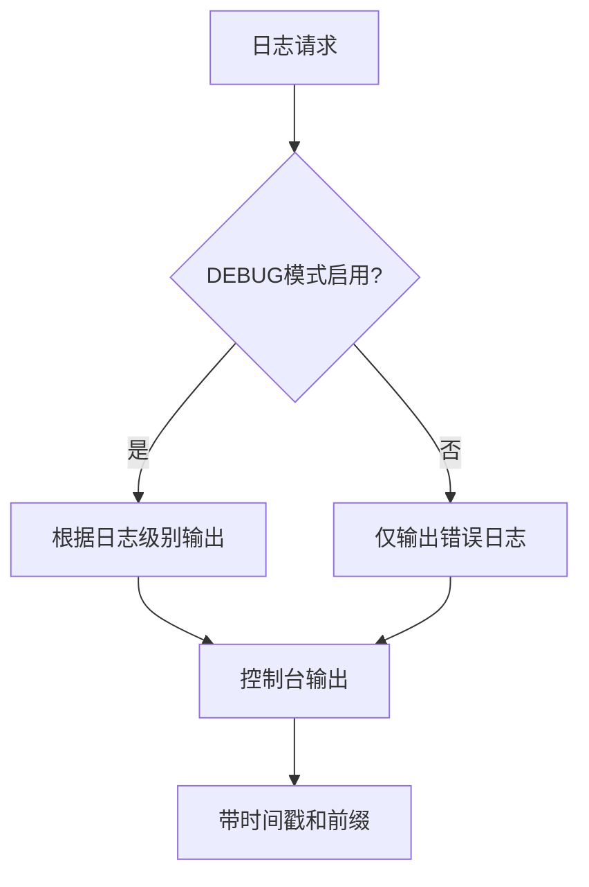
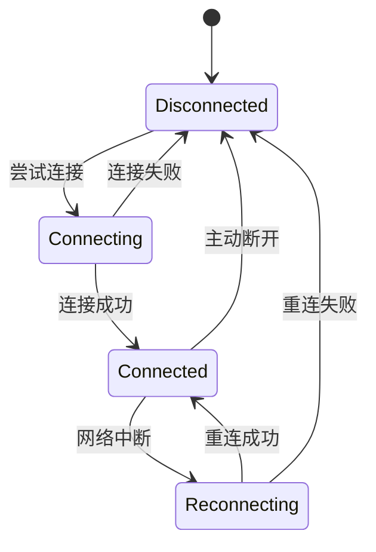
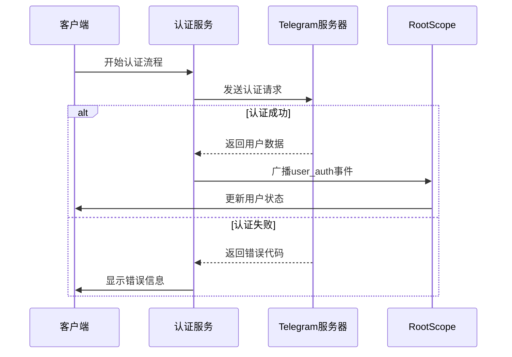
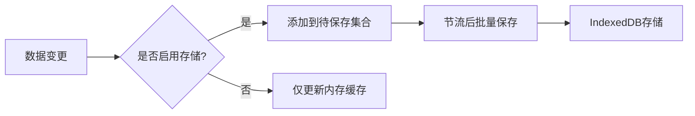
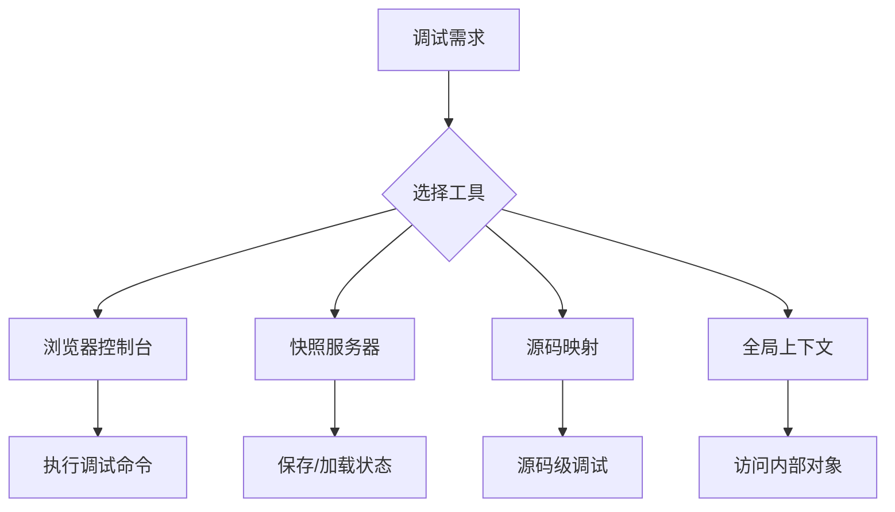

# 故障排除

<cite>
**本文档中引用的文件**  
- [README.md](file://README.md)
- [SECURITY.md](file://SECURITY.md)
- [package.json](file://package.json)
- [src\lib\logger.ts](file://src/lib/logger.ts)
- [src\config\debug.ts](file://src/config/debug.ts)
- [src\lib\rootScope.ts](file://src/lib/rootScope.ts)
- [src\lib\storage.ts](file://src/lib/storage.ts)
- [src\lib\encryptedStorageLayer.ts](file://src/lib/encryptedStorageLayer.ts)
- [src\environment\userAgent.ts](file://src/environment/userAgent.ts)
- [src\components\passcodeLock\passcodeLockScreen.tsx](file://src/components/passcodeLock/passcodeLockScreen.tsx)
- [src\pages\loginPage.ts](file://src/pages/loginPage.ts)
- [src\lib\mtproto\connectionStatus.ts](file://src/lib/mtproto/connectionStatus.ts)
- [src\lib\appManagers\appMessagesManager.ts](file://src/lib/appManagers/appMessagesManager.ts)
- [src\lib\appManagers\appAuthService.ts](file://src/lib/appManagers/appAuthService.ts)
</cite>

## 目录
1. [简介](#简介)
2. [诊断工具与日志分析](#诊断工具与日志分析)
3. [网络问题排查](#网络问题排查)
4. [认证失败处理](#认证失败处理)
5. [性能瓶颈分析](#性能瓶颈分析)
6. [错误代码与异常信息](#错误代码与异常信息)
7. [调试技巧与开发工具](#调试技巧与开发工具)
8. [已知问题与临时解决方案](#已知问题与临时解决方案)
9. [问题收集与报告](#问题收集与报告)
10. [安全事件应急响应](#安全事件应急响应)

## 简介
本故障排除指南旨在为Telegram Web K应用提供全面的技术支持文档。文档涵盖了常见问题的症状、原因和解决方案，重点介绍了诊断工具、日志分析方法以及各类技术问题的排查步骤。通过本指南，用户和开发人员可以系统性地解决网络连接、认证失败、性能瓶颈等常见问题，并了解如何正确收集和报告问题给开发团队。

**Section sources**
- [README.md](file://README.md#L1-L88)
- [SECURITY.md](file://SECURITY.md#L1-L22)

## 诊断工具与日志分析

### 日志系统配置
项目内置了详细的日志记录系统，通过`src/lib/logger.ts`实现。日志系统支持多种日志级别，包括错误、警告、信息、调试等，可根据需要进行配置。

日志级别定义在`LogTypes`枚举中：
- None (0): 无日志输出
- Error (1): 错误级别
- Warn (2): 警告级别
- Log (4): 信息级别
- Debug (8): 调试级别

日志系统的启用受`src/config/debug.ts`中的`DEBUG`常量控制，该常量根据开发环境变量和模式设置来决定是否启用调试功能。

**Diagram sources**
- [src\lib\logger.ts](file://src/lib/logger.ts#L1-L184)
- [src\config\debug.ts](file://src/config/debug.ts#L1-L58)

### 日志分析方法
要启用详细的日志记录，可以在URL中添加查询参数：
- **debug=1**: 启用额外的日志记录
- **test=1**: 使用测试DC服务器
- **noSharedWorker=1**: 禁用共享Worker，便于调试
- **http=1**: 强制使用HTTPS传输连接到Telegram服务器

这些参数可以组合使用，例如：`http://localhost:8080/?debug=1&test=1`

**Section sources**
- [README.md](file://README.md#L67-L73)
- [src\lib\logger.ts](file://src/lib/logger.ts#L147-L155)

## 网络问题排查

### 连接状态监控
网络连接状态通过`src/lib/rootScope.ts`中的`connection_status_change`事件进行管理。该事件会广播连接状态的变化，包括连接、断开、重连等状态。

连接状态信息存储在`RootScope`类的`connectionStatus`属性中，以名称为键的对象形式保存。可以通过监听`connection_status_change`事件来获取实时的连接状态更新。

**Diagram sources**
- [src\lib\rootScope.ts](file://src/lib/rootScope.ts#L250-L315)
- [src\lib\mtproto\connectionStatus.ts](file://src/lib/mtproto/connectionStatus.ts)

### 网络问题诊断步骤
1. 检查浏览器控制台是否有网络相关的错误信息
2. 确认是否能够访问Telegram服务器
3. 检查防火墙或代理设置是否阻止了连接
4. 尝试使用不同的网络环境
5. 使用`debug=1`参数启用详细日志查看网络请求详情

对于持久性网络问题，可以使用`src/snapshot-server`中的快照服务器功能来保存和加载本地存储及IndexedDB的快照，便于问题复现和分析。

**Section sources**
- [src\lib\rootScope.ts](file://src/lib/rootScope.ts#L146-L147)
- [README.md](file://README.md#L75-L76)

## 认证失败处理

### 认证流程分析
用户认证流程由`src/lib/appManagers/appAuthService.ts`管理。认证状态通过`user_auth`事件广播，当用户成功认证后，`RootScope`的`myId`属性会被设置为用户的PeerId。

认证失败可能由以下原因导致：
- 网络连接问题
- 服务器端验证失败
- 会话过期
- 双重验证密码错误

**Diagram sources**
- [src\lib\appManagers\appAuthService.ts](file://src/lib/appManagers/appAuthService.ts)
- [src\lib\rootScope.ts](file://src/lib/rootScope.ts#L264-L266)

### 认证问题解决方案
1. 检查网络连接是否正常
2. 确认输入的手机号码格式正确
3. 如果启用了双重验证，确保输入的密码正确
4. 清除浏览器缓存和本地存储后重试
5. 尝试使用不同的浏览器或设备

对于密码锁相关的认证问题，检查`src/components/passcodeLock/`目录下的组件，特别是`passcodeLockScreen.tsx`文件中的实现逻辑。

**Section sources**
- [src\lib\rootScope.ts](file://src/lib/rootScope.ts#L46-L47)
- [src\components\passcodeLock\passcodeLockScreen.tsx](file://src/components/passcodeLock/passcodeLockScreen.tsx)

## 性能瓶颈分析

### 存储性能优化
项目使用IndexedDB作为主要的客户端存储机制，通过`src/lib/storage.ts`和`src/lib/encryptedStorageLayer.ts`进行管理。存储操作经过优化，使用节流机制来减少频繁的磁盘写入。

关键性能优化措施包括：
- 使用`throttleWith`函数对保存操作进行节流
- 批量处理多个存储操作
- 使用微任务队列进行异步处理
- 缓存机制减少重复读取

**Diagram sources**
- [src\lib\storage.ts](file://src/lib/storage.ts#L46-L490)
- [src\lib\encryptedStorageLayer.ts](file://src/lib/encryptedStorageLayer.ts)

### 性能监控指标
通过`rootScope`的广播事件可以监控关键性能指标：
- `download_progress`: 文件下载进度
- `document_downloading`: 文档下载开始
- `document_downloaded`: 文档下载完成
- `media_play`: 媒体播放事件
- `file_speed_limited`: 文件传输速度受限

这些事件可以帮助识别性能瓶颈，特别是在文件传输和媒体处理方面。

**Section sources**
- [src\lib\rootScope.ts](file://src/lib/rootScope.ts#L174-L177)
- [src\lib\storage.ts](file://src/lib/storage.ts#L99-L101)

## 错误代码与异常信息

### 常见错误类型
根据代码库分析，常见的错误类型包括：
- `NO_ENTRY_FOUND`: 存储条目未找到
- `STORAGE_OFFLINE`: 存储离线
- 网络连接错误
- 认证失败错误
- 数据解析错误

这些错误通常在`src/lib/storage.ts`的错误处理部分被捕获和记录。

### 异常处理机制
项目采用统一的异常处理机制：
1. 在关键操作中使用try-catch捕获异常
2. 通过logger记录详细的错误信息
3. 广播相应的事件通知UI层
4. 提供用户友好的错误提示

对于存储相关的错误，系统会自动降级到仅使用内存缓存模式，确保应用的基本功能仍然可用。

**Section sources**
- [src\lib\storage.ts](file://src/lib/storage.ts#L213-L218)
- [src\lib\logger.ts](file://src/lib/logger.ts#L150-L155)

## 调试技巧与开发工具

### 开发环境配置
开发环境通过`package.json`中的脚本进行管理：
- `pnpm start`: 启动开发服务器
- `pnpm run build`: 构建生产版本
- `pnpm run serve`: 构建并启动服务

开发服务器运行在`http://localhost:8080/`，支持热重载功能。

### 调试工具使用
1. **全局函数**: 在浏览器控制台中可以调用`showIconLibrary()`查看所有可用的SVG图标
2. **快照功能**: 使用`./snapshot-server`可以保存和加载本地存储快照
3. **源码映射**: 生产版本包含源码映射，便于调试
4. **全局上下文**: 调试类绑定到全局上下文，可以直接在开发者工具中访问

**Diagram sources**
- [package.json](file://package.json#L6-L15)
- [README.md](file://README.md#L13-L15)

**Section sources**
- [README.md](file://README.md#L79-L80)
- [package.json](file://package.json)

## 已知问题与临时解决方案

### 存储兼容性问题
在某些浏览器中，加密存储的使用可能会导致数据不一致问题，特别是在启用密码锁功能时。这是因为在窗口客户端和共享Worker之间可能存在数据同步问题。

**临时解决方案**:
1. 避免在多个标签页同时使用应用
2. 定期备份重要数据
3. 在遇到同步问题时清除缓存并重新登录

### 浏览器特定问题
根据`src/environment/userAgent.ts`中的检测逻辑，不同浏览器可能存在特定的兼容性问题：
- Safari和Firefox使用不同的堆栈跟踪格式
- 某些浏览器可能不支持WebP格式
- 移动设备上的触摸事件处理可能存在问题

**Section sources**
- [src\lib\storage.ts](file://src/lib/storage.ts#L287-L291)
- [src\environment\userAgent.ts](file://src/environment/userAgent.ts)

## 问题收集与报告

### 问题报告流程
当发现应用问题或希望添加新功能时，应通过Telegram的建议平台进行报告：
1. 访问[Suggestions Platform](https://bugs.telegram.org/c/4002)
2. 详细描述问题现象和复现步骤
3. 提供相关日志信息（如果可能）
4. 附上截图或屏幕录制

### 信息收集指南
在报告问题时，应收集以下信息：
- 浏览器类型和版本
- 操作系统信息
- 网络环境
- 问题发生的具体步骤
- 控制台错误日志
- 相关的URL参数

对于复杂问题，可以使用快照服务器功能保存应用状态，便于开发团队复现问题。

**Section sources**
- [README.md](file://README.md#L81-L83)

## 安全事件应急响应

### 安全策略
项目遵循明确的安全策略，定义在`SECURITY.md`文件中。支持的版本会定期接收安全更新，而旧版本将不再维护。

安全响应流程包括：
1. 漏洞报告接收
2. 漏洞验证和评估
3. 修复开发和测试
4. 安全更新发布
5. 用户通知

### 应急响应步骤
当发现安全漏洞时：
1. 立即通过指定渠道报告
2. 提供详细的漏洞描述和利用方法
3. 保持沟通，配合开发团队验证和修复
4. 遵守负责任的披露原则

对于用户账户安全事件，系统提供密码锁功能（`src/components/passcodeLock/`）来增强本地安全性。

**Section sources**
- [SECURITY.md](file://SECURITY.md#L1-L22)
- [src\components\passcodeLock](file://src/components/passcodeLock)