# 构建和部署

<cite>
**本文档中引用的文件**  
- [package.json](file://package.json)
- [vite.config.ts](file://vite.config.ts)
- [build.js](file://build.js)
- [server.js](file://server.js)
- [docker-compose.yaml](file://docker-compose.yaml)
- [.env](file://.env)
- [.env.local.example](file://.env.local.example)
- [keepAsset.js](file://keepAsset.js)
</cite>

## 目录
1. [简介](#简介)
2. [项目结构](#项目结构)
3. [生产构建流程](#生产构建流程)
4. [构建配置与优化](#构建配置与优化)
5. [部署选项](#部署选项)
6. [环境变量管理](#环境变量管理)
7. [性能监控与日志记录](#性能监控与日志记录)
8. [部署验证与回滚机制](#部署验证与回滚机制)

## 简介
本文档详细说明了tweb项目的构建和部署流程。文档涵盖了从代码压缩、资源优化到缓存策略的生产构建流程，解释了不同构建配置的用途和切换方法，描述了静态服务器部署和Docker容器化部署两种主要部署选项。同时提供了server.js和docker-compose.yaml的配置说明，涵盖了环境变量管理和多环境部署策略，并包含性能监控和错误日志记录的配置方法，最后提供了部署后的验证步骤和回滚机制。

## 项目结构
tweb项目采用模块化前端架构，主要包含源代码(src)、公共资源(public)、快照服务器(snapshot-server)和构建部署相关文件。项目使用Vite作为构建工具，SolidJS作为前端框架，通过pnpm进行包管理。

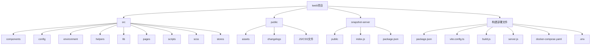

**Diagram sources**
- [package.json](file://package.json#L1-L76)
- [vite.config.ts](file://vite.config.ts#L1-L162)

**Section sources**
- [package.json](file://package.json#L1-L76)
- [vite.config.ts](file://vite.config.ts#L1-L162)

## 生产构建流程
tweb项目的生产构建流程通过一系列自动化脚本实现，确保代码压缩、资源优化和缓存策略的有效实施。

### 构建命令流程
生产构建通过`npm run build`命令触发，该命令执行一系列预定义的构建步骤：

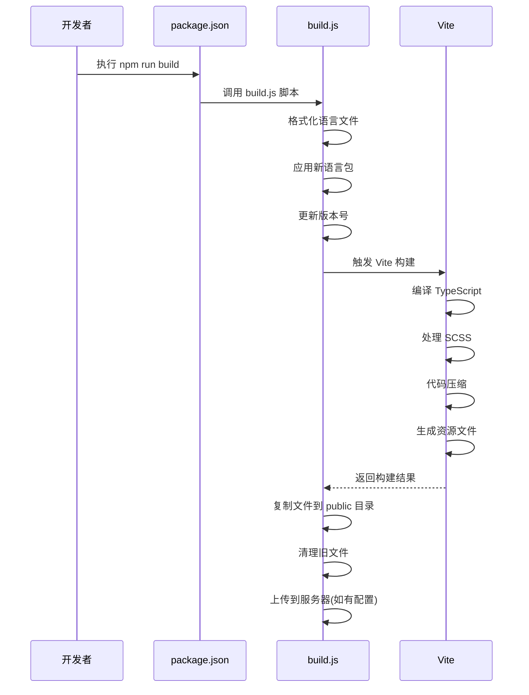

**Diagram sources**
- [package.json](file://package.json#L11)
- [build.js](file://build.js#L185-L208)
- [vite.config.ts](file://vite.config.ts#L121-L138)

**Section sources**
- [package.json](file://package.json#L11)
- [build.js](file://build.js#L1-L212)
- [vite.config.ts](file://vite.config.ts#L1-L162)

### 代码压缩与资源优化
tweb项目通过Vite构建工具实现代码压缩和资源优化，确保生产环境的性能最优。

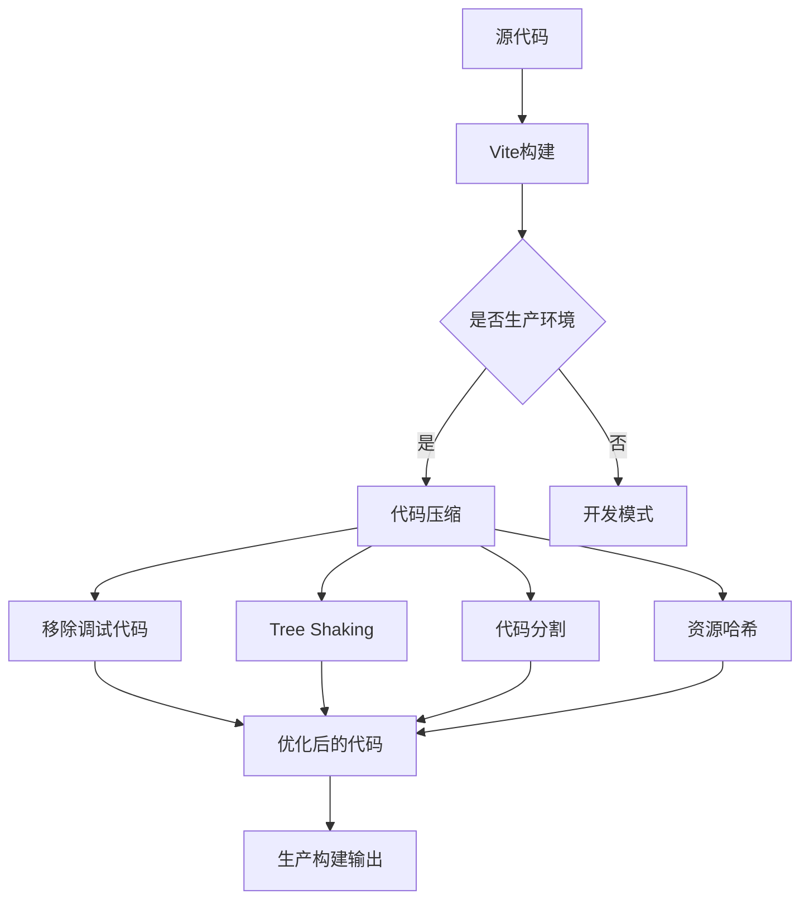

**Diagram sources**
- [vite.config.ts](file://vite.config.ts#L127)
- [build.js](file://build.js#L112-L116)

**Section sources**
- [vite.config.ts](file://vite.config.ts#L121-L138)
- [build.js](file://build.js#L112-L116)

### 缓存策略
tweb项目实施了多层次的缓存策略，以优化用户体验和减少服务器负载。

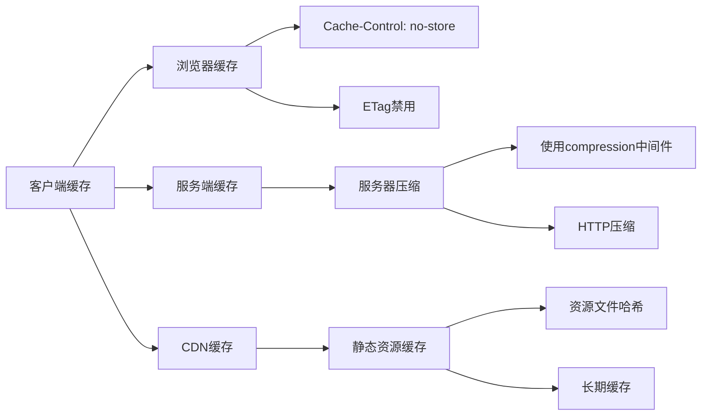

**Diagram sources**
- [server.js](file://server.js#L16-L21)
- [vite.config.ts](file://vite.config.ts#L124)

**Section sources**
- [server.js](file://server.js#L1-L39)
- [vite.config.ts](file://vite.config.ts#L121-L138)

## 构建配置与优化
tweb项目的构建配置通过vite.config.ts文件进行管理，支持多种构建选项和优化策略。

### Vite构建配置
Vite构建配置文件(vite.config.ts)定义了项目的核心构建参数和插件配置。

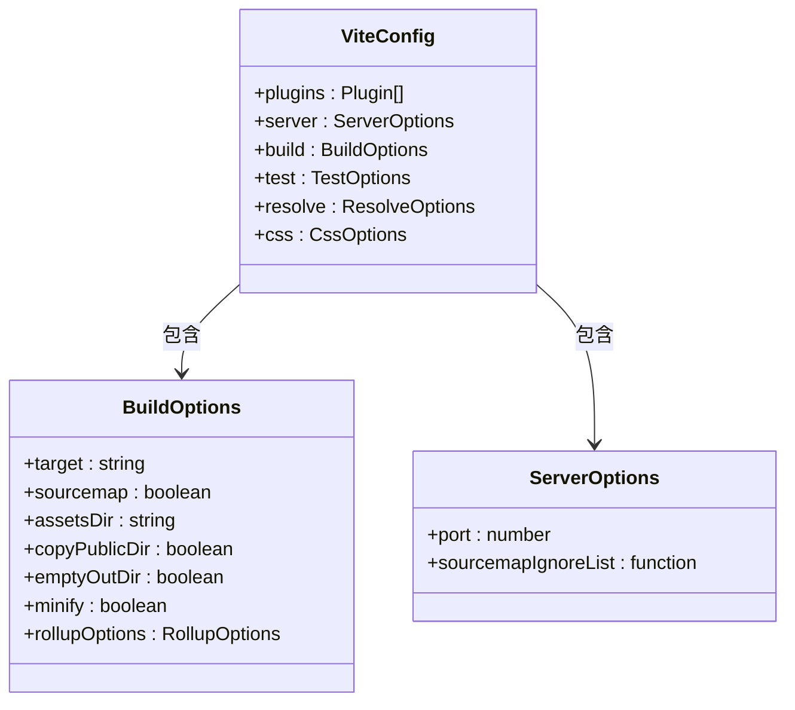

**Diagram sources**
- [vite.config.ts](file://vite.config.ts#L70-L161)

**Section sources**
- [vite.config.ts](file://vite.config.ts#L1-L162)

### 构建插件配置
tweb项目使用了多个Vite插件来增强构建功能和开发体验。

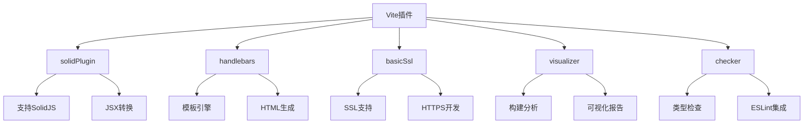

**Diagram sources**
- [vite.config.ts](file://vite.config.ts#L71-L91)

**Section sources**
- [vite.config.ts](file://vite.config.ts#L1-L162)

### 资源保留策略
tweb项目通过keepAsset.js文件定义了哪些资源文件在构建过程中需要保留。

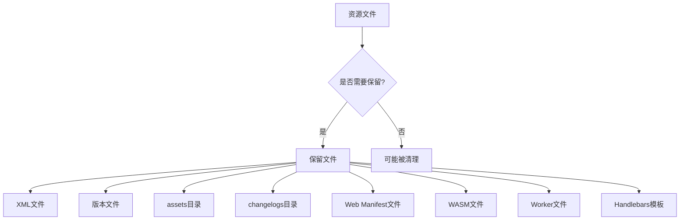

**Diagram sources**
- [keepAsset.js](file://keepAsset.js#L1-L13)

**Section sources**
- [keepAsset.js](file://keepAsset.js#L1-L14)
- [build.js](file://build.js#L43-L55)

## 部署选项
tweb项目支持多种部署选项，包括静态服务器部署和Docker容器化部署。

### 静态服务器部署
静态服务器部署通过server.js文件配置，使用Express框架提供静态文件服务。

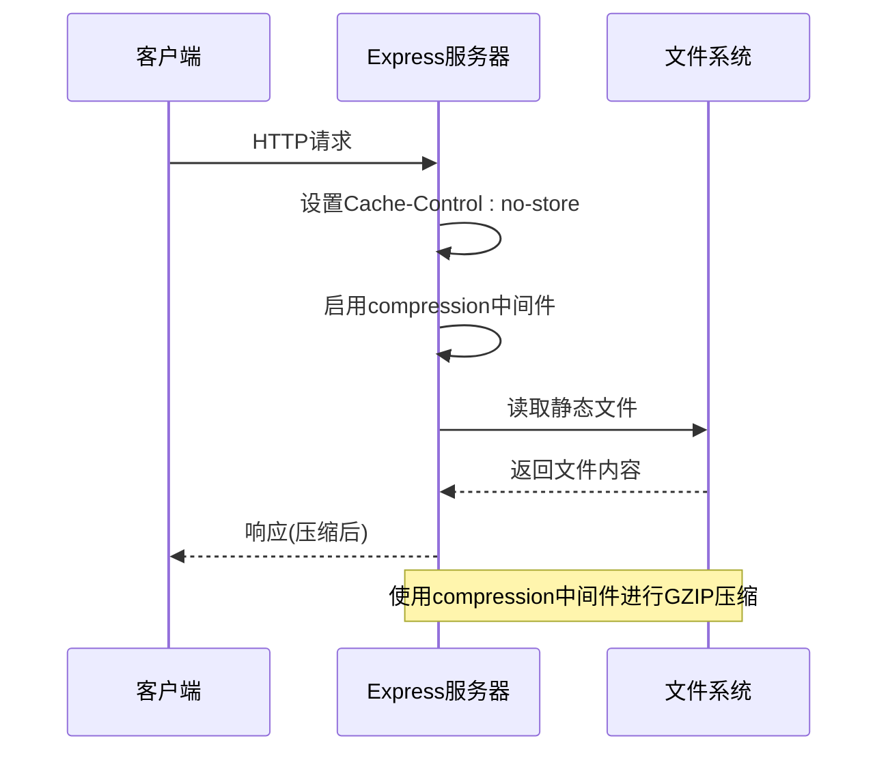

**Diagram sources**
- [server.js](file://server.js#L1-L39)
- [package.json](file://package.json#L10)

**Section sources**
- [server.js](file://server.js#L1-L39)
- [package.json](file://package.json#L10)

### Docker容器化部署
Docker容器化部署通过docker-compose.yaml文件配置，支持开发和生产环境的容器化部署。

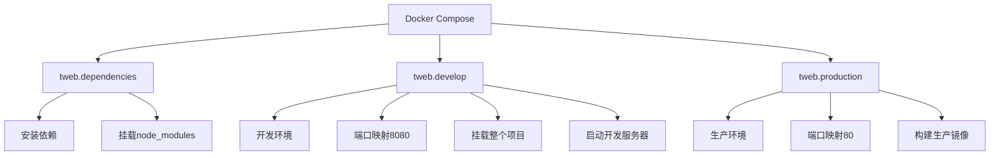

**Diagram sources**
- [docker-compose.yaml](file://docker-compose.yaml#L1-L30)

**Section sources**
- [docker-compose.yaml](file://docker-compose.yaml#L1-L30)

### Docker构建流程
Docker构建流程通过docker-compose.yaml文件定义的Dockerfile实现。

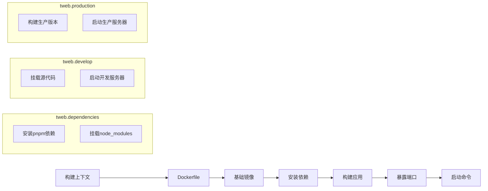

**Diagram sources**
- [docker-compose.yaml](file://docker-compose.yaml#L5-L27)

**Section sources**
- [docker-compose.yaml](file://docker-compose.yaml#L1-L30)

## 环境变量管理
tweb项目通过环境变量文件实现多环境配置管理。

### 环境变量文件结构
项目使用多种环境变量文件来管理不同环境的配置。

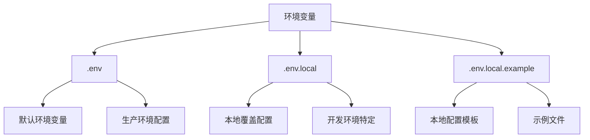

**Diagram sources**
- [.env](file://.env#L1-L17)
- [.env.local.example](file://.env.local.example#L1-L2)

**Section sources**
- [.env](file://.env#L1-L17)
- [.env.local.example](file://.env.local.example#L1-L2)

### 环境变量配置
tweb项目的关键环境变量配置如下表所示：

| 环境变量 | 描述 | 示例值 |
|---------|------|-------|
| VITE_API_ID | Telegram API ID | 1025907 |
| VITE_API_HASH | Telegram API Hash | 452b0359b988148995f22ff0f4229750 |
| VITE_PUSH_SERVER_KEY | 推送服务器密钥 | BB3JzmQIBTl8ZdTmLzhkZVnoYxoSvUmCe1CqqF53u2j0WbEFo2m--mOBagroDFdqMeESfz3ue1Z1e5PTIxMYH_g |
| VITE_VERSION | 应用版本 | 2.2 |
| VITE_VERSION_FULL | 完整版本号 | 2.2 (611) |
| VITE_BUILD | 构建号 | 611 |
| VITE_LANG_PACK_VERSION | 语言包版本 | 240618 |
| VITE_MTPROTO_WORKER | MTPROTO Worker启用 | 1 |
| VITE_MTPROTO_AUTO | 自动选择MTPROTO协议 | 1 |
| VITE_MTPROTO_HAS_HTTP | 支持HTTP协议 | 1 |
| VITE_MTPROTO_HAS_WS | 支持WebSocket协议 | 1 |
| VITE_LANG_PACK_LOCAL_VERSION | 本地语言包版本 | 1 |

**Section sources**
- [.env](file://.env#L1-L17)
- [.env.local.example](file://.env.local.example#L1-L2)

### 多环境部署策略
tweb项目支持多环境部署，通过不同的构建和部署配置实现。

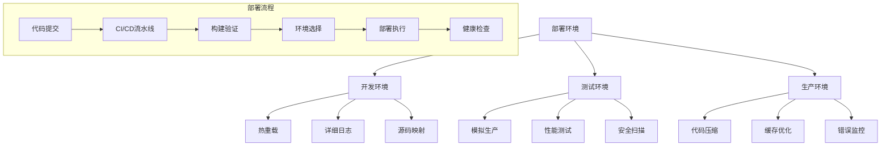

**Section sources**
- [package.json](file://package.json#L8-L11)
- [server.js](file://server.js#L9-L14)
- [docker-compose.yaml](file://docker-compose.yaml#L12-L30)

## 性能监控与日志记录
tweb项目通过多种机制实现性能监控和错误日志记录。

### 性能监控配置
项目通过Vite的visualizer插件实现构建性能分析。

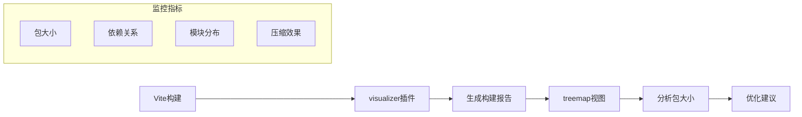

**Diagram sources**
- [vite.config.ts](file://vite.config.ts#L87-L90)

**Section sources**
- [vite.config.ts](file://vite.config.ts#L87-L90)

### 错误日志记录
tweb项目通过多种方式实现错误日志记录和处理。

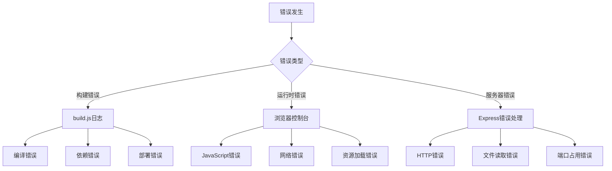

**Section sources**
- [build.js](file://build.js#L199-L206)
- [server.js](file://server.js#L36-L38)

## 部署验证与回滚机制
tweb项目建立了完整的部署验证和回滚机制，确保部署的可靠性和可恢复性。

### 部署验证流程
部署后需要进行一系列验证步骤，确保应用正常运行。

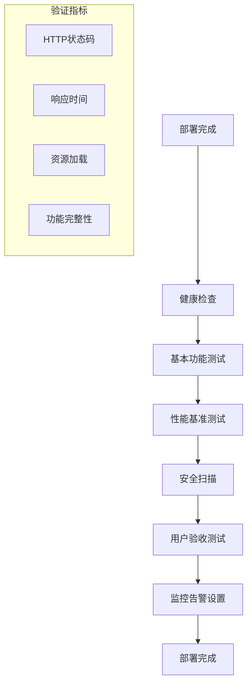

**Section sources**
- [server.js](file://server.js#L36-L38)
- [package.json](file://package.json#L10)

### 回滚机制
当部署出现问题时，tweb项目支持快速回滚到之前的稳定版本。

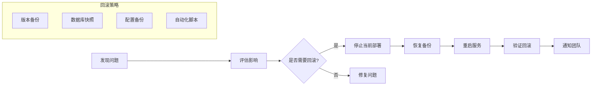

**Section sources**
- [build.js](file://build.js#L117-L143)
- [server.js](file://server.js#L13-L14)