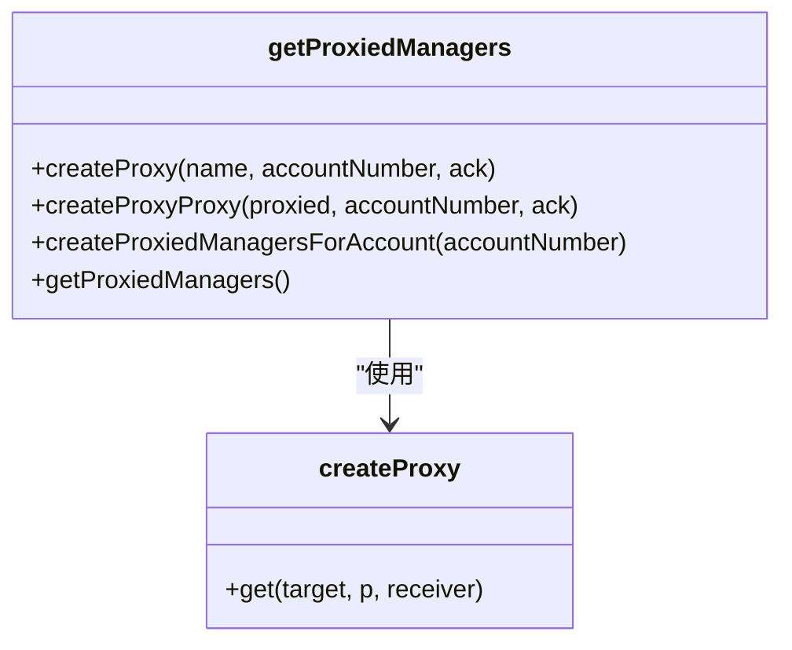
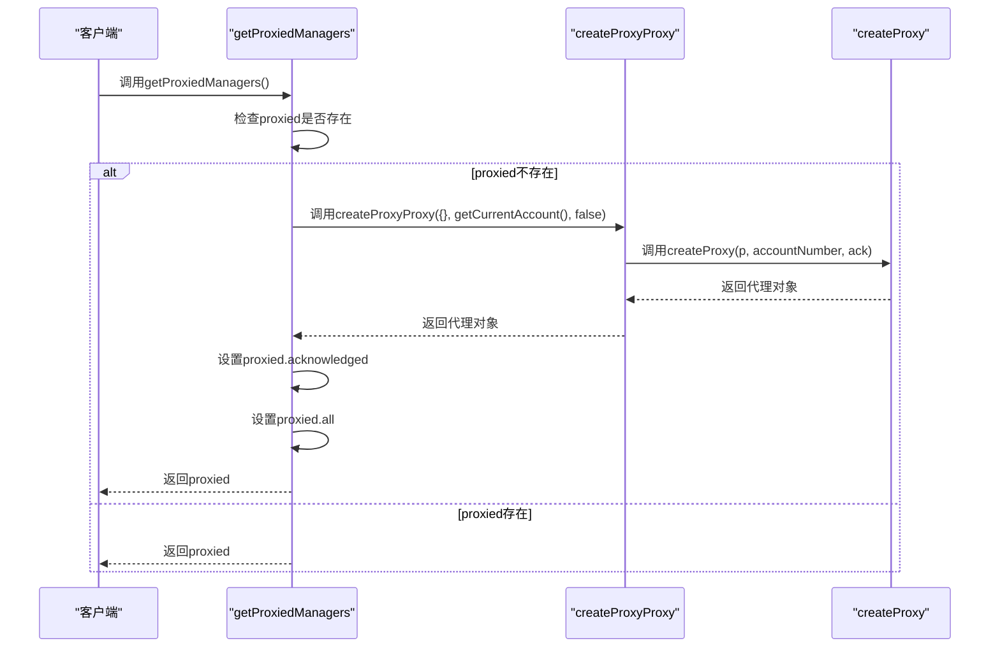
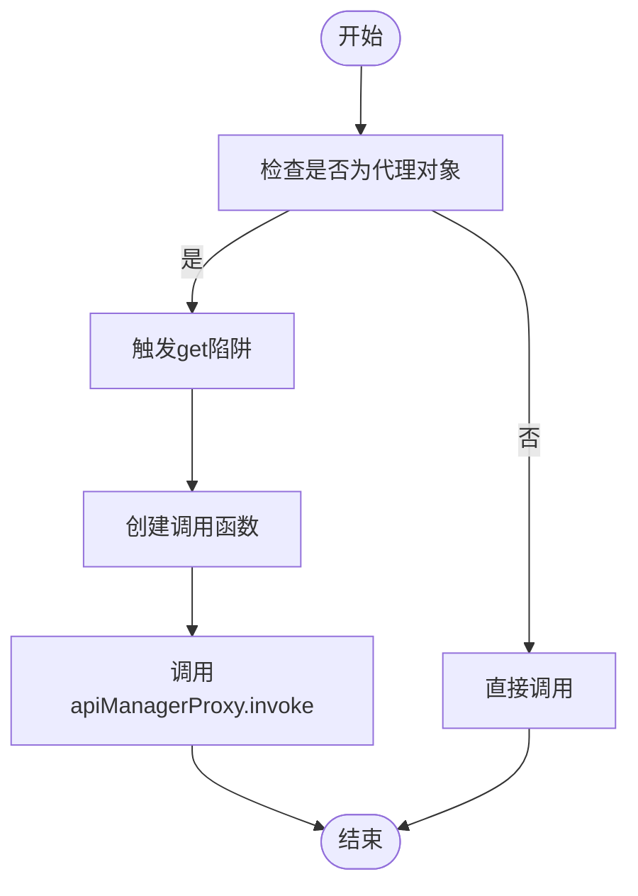
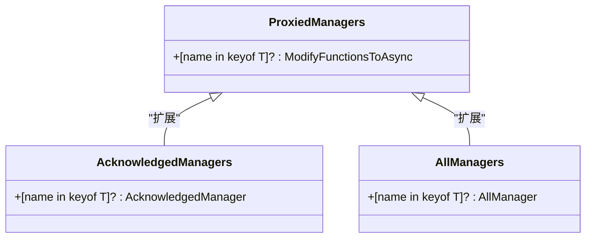
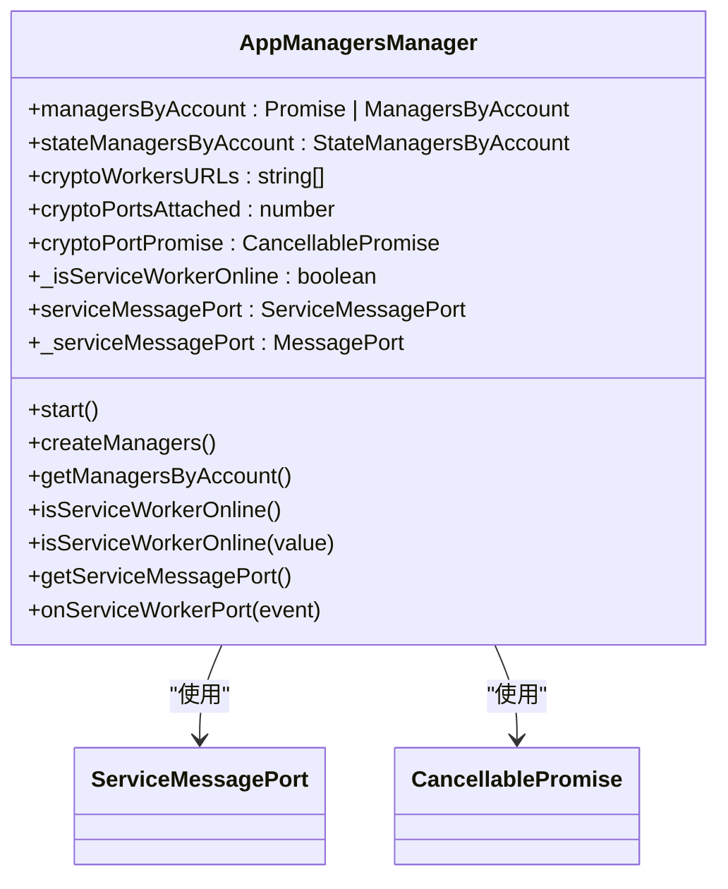
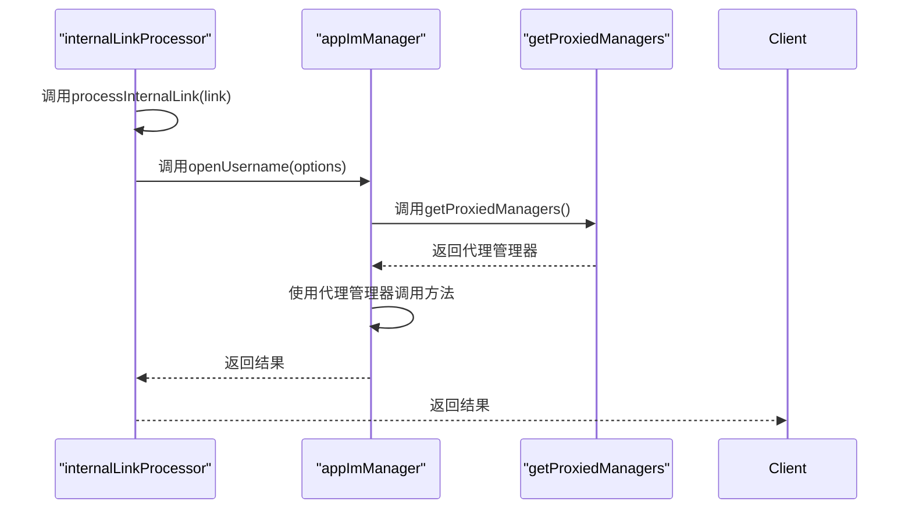
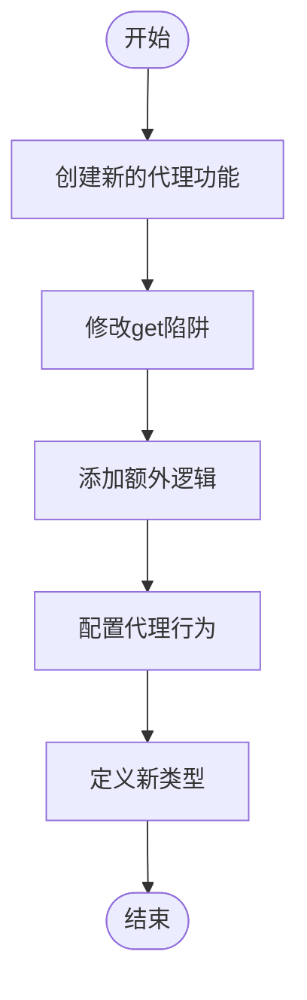

# 代理机制

<cite>
**本文档引用的文件**  
- [getProxiedManagers.ts](file://src/lib/appManagers/getProxiedManagers.ts)
- [appManagersManager.ts](file://src/lib/appManagers/appManagersManager.ts)
- [internalLinkProcessor.ts](file://src/lib/appManagers/internalLinkProcessor.ts)
- [appImManager.ts](file://src/lib/appManagers/appImManager.ts)
- [mtprotoworker.ts](file://src/lib/mtproto/mtprotoworker.ts)
- [createManagers.ts](file://src/lib/appManagers/createManagers.ts)
</cite>

## 目录
1. [引言](#引言)
2. [代理机制概述](#代理机制概述)
3. [getProxiedManagers实现原理](#getproxiedmanagers实现原理)
4. [代理管理器的创建过程](#代理管理器的创建过程)
5. [调用拦截机制](#调用拦截机制)
6. [功能扩展机制](#功能扩展机制)
7. [appManagersManager协调机制](#appmanagersmanager协调机制)
8. [internalLinkProcessor应用示例](#internallinkprocessor应用示例)
9. [自定义和扩展指南](#自定义和扩展指南)
10. [结论](#结论)

## 引言
tweb项目中的代理机制是一种设计模式，通过代理模式为管理器提供额外的功能层，如权限检查、日志记录和性能监控。该机制允许在不修改原有管理器代码的情况下，支持功能扩展。本文档将深入分析getProxiedManagers的实现原理，解释代理管理器的创建过程和调用拦截机制，并结合internalLinkProcessor的使用示例，说明代理机制在实际业务场景中的应用。

## 代理机制概述
tweb项目的代理机制基于JavaScript的Proxy对象实现，通过创建代理管理器来拦截对原始管理器的调用。这种设计模式允许在调用前后添加额外的逻辑，如权限检查、日志记录和性能监控。代理机制的核心是getProxiedManagers函数，它负责创建和管理代理管理器。

**Section sources**
- [getProxiedManagers.ts](file://src/lib/appManagers/getProxiedManagers.ts#L1-L174)

## getProxiedManagers实现原理
getProxiedManagers函数是代理机制的核心，它通过createProxy函数创建代理对象。createProxy函数使用JavaScript的Proxy构造函数，定义了一个get陷阱，当访问代理对象的属性时，会返回一个函数，该函数通过apiManagerProxy.invoke方法调用原始管理器的方法。

**Diagram sources**
- [getProxiedManagers.ts](file://src/lib/appManagers/getProxiedManagers.ts#L80-L117)

**Section sources**
- [getProxiedManagers.ts](file://src/lib/appManagers/getProxiedManagers.ts#L1-L174)

## 代理管理器的创建过程
代理管理器的创建过程始于getProxiedManagers函数的调用。该函数首先检查是否已经创建了代理管理器，如果已存在则直接返回。否则，它会调用createProxyProxy函数创建一个新的代理对象，并将其赋值给proxied变量。

**Diagram sources**
- [getProxiedManagers.ts](file://src/lib/appManagers/getProxiedManagers.ts#L164-L172)

**Section sources**
- [getProxiedManagers.ts](file://src/lib/appManagers/getProxiedManagers.ts#L1-L174)

## 调用拦截机制
代理机制的调用拦截是通过Proxy对象的get陷阱实现的。当访问代理对象的方法时，get陷阱会返回一个函数，该函数通过apiManagerProxy.invoke方法调用原始管理器的方法。这个过程允许在调用前后添加额外的逻辑，如权限检查、日志记录和性能监控。

**Diagram sources**
- [getProxiedManagers.ts](file://src/lib/appManagers/getProxiedManagers.ts#L95-L111)

**Section sources**
- [getProxiedManagers.ts](file://src/lib/appManagers/getProxiedManagers.ts#L1-L174)

## 功能扩展机制
代理机制支持功能扩展而无需修改原有管理器代码。通过在get陷阱中添加额外的逻辑，可以轻松实现权限检查、日志记录和性能监控等功能。例如，可以在调用前后添加日志记录，或者在调用前进行权限检查。

**Diagram sources**
- [getProxiedManagers.ts](file://src/lib/appManagers/getProxiedManagers.ts#L131-L141)

**Section sources**
- [getProxiedManagers.ts](file://src/lib/appManagers/getProxiedManagers.ts#L1-L174)

## appManagersManager协调机制
appManagersManager负责协调代理管理器的生命周期和状态同步。它通过getManagersByAccount方法获取所有账户的管理器，并通过isServiceWorkerOnline属性管理服务工作线程的在线状态。此外，它还通过getServiceMessagePort方法提供服务消息端口，用于与服务工作线程通信。

**Diagram sources**
- [appManagersManager.ts](file://src/lib/appManagers/appManagersManager.ts#L30-L243)

**Section sources**
- [appManagersManager.ts](file://src/lib/appManagers/appManagersManager.ts#L1-L243)

## internalLinkProcessor应用示例
internalLinkProcessor是代理机制在实际业务场景中的一个应用示例。它通过processInternalLink方法处理内部链接，利用代理管理器调用相应的处理函数。例如，当处理消息链接时，它会调用appImManager.openUsername方法打开指定的用户名。

**Diagram sources**
- [internalLinkProcessor.ts](file://src/lib/appManagers/internalLinkProcessor.ts#L1104-L1139)
- [appImManager.ts](file://src/lib/appManagers/appImManager.ts#L660-L669)

**Section sources**
- [internalLinkProcessor.ts](file://src/lib/appManagers/internalLinkProcessor.ts#L1-L1145)
- [appImManager.ts](file://src/lib/appManagers/appImManager.ts#L1-L2987)

## 自定义和扩展指南
要自定义和扩展代理机制，可以通过以下步骤实现：
1. 创建新的代理功能：在get陷阱中添加新的逻辑，如权限检查、日志记录或性能监控。
2. 配置代理行为：通过修改getProxiedManagers函数的参数，配置代理的行为，如是否启用确认模式或所有模式。
3. 扩展功能类型：通过定义新的类型，如AcknowledgedManagers和AllManagers，扩展代理管理器的功能。

**Diagram sources**
- [getProxiedManagers.ts](file://src/lib/appManagers/getProxiedManagers.ts#L122-L141)

**Section sources**
- [getProxiedManagers.ts](file://src/lib/appManagers/getProxiedManagers.ts#L1-L174)

## 结论
tweb项目的代理机制通过JavaScript的Proxy对象实现，为管理器提供了额外的功能层，如权限检查、日志记录和性能监控。该机制允许在不修改原有管理器代码的情况下，支持功能扩展。通过getProxiedManagers函数，可以轻松创建和管理代理管理器，并通过appManagersManager协调其生命周期和状态同步。internalLinkProcessor是代理机制在实际业务场景中的一个应用示例，展示了如何利用代理管理器处理内部链接。通过自定义和扩展指南，开发者可以轻松地添加新的代理功能和配置代理行为。