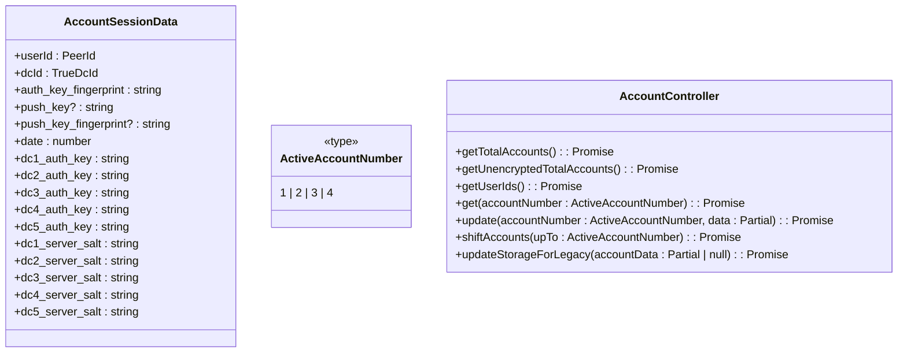
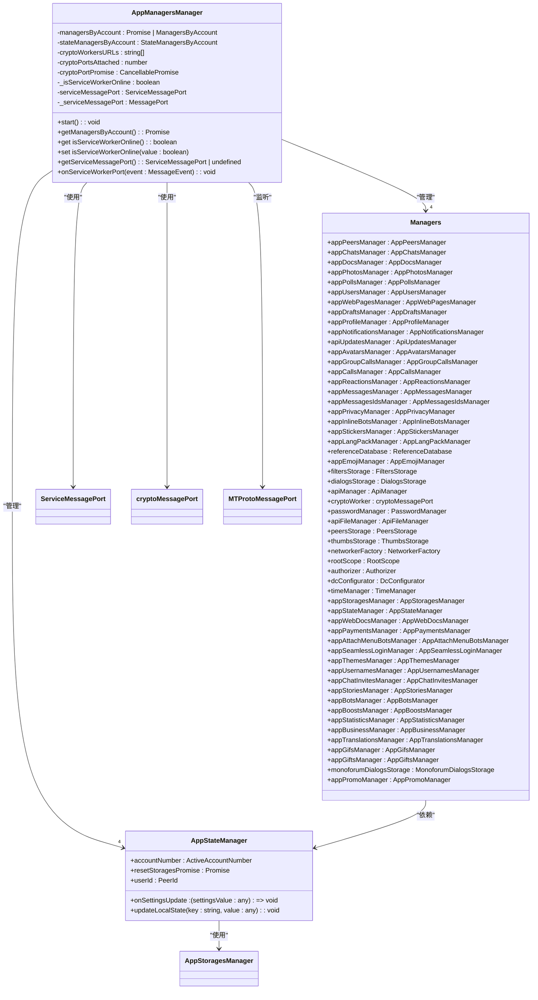
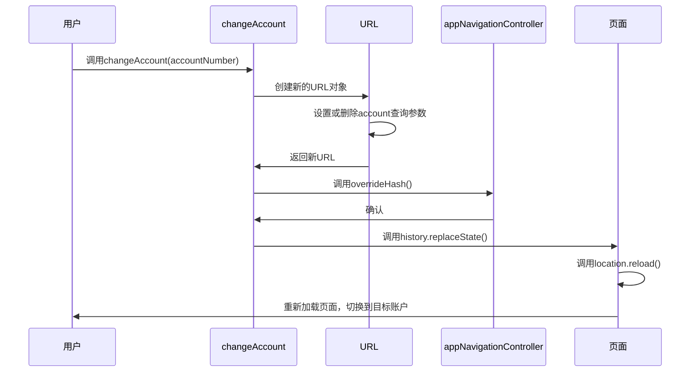
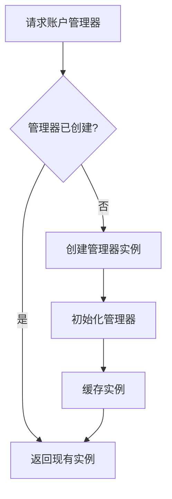

# 多账户架构

<cite>
**本文档中引用的文件**  
- [accountController.ts](file://src/lib/accounts/accountController.ts)
- [changeAccount.ts](file://src/lib/accounts/changeAccount.ts)
- [getCurrentAccount.ts](file://src/lib/accounts/getCurrentAccount.ts)
- [types.d.ts](file://src/lib/accounts/types.d.ts)
- [constants.ts](file://src/lib/accounts/constants.ts)
- [getCurrentAccountFromURL.ts](file://src/lib/accounts/getCurrentAccountFromURL.ts)
- [getValidatedAccount.ts](file://src/lib/accounts/getValidatedAccount.ts)
- [appManagersManager.ts](file://src/lib/appManagers/appManagersManager.ts)
- [createManagers.ts](file://src/lib/appManagers/createManagers.ts)
- [accountsLimitPopup.ts](file://src/components/sidebarLeft/accountsLimitPopup.ts)
- [accountsLimitPopupContent.tsx](file://src/components/sidebarLeft/accountsLimitPopupContent.tsx)
</cite>

## 目录
1. [多账户架构概述](#多账户架构概述)
2. [账户数据存储与访问](#账户数据存储与访问)
3. [账户隔离与状态管理](#账户隔离与状态管理)
4. [账户切换机制](#账户切换机制)
5. [多账户限制的用户界面](#多账户限制的用户界面)
6. [扩展指南与性能优化](#扩展指南与性能优化)

## 多账户架构概述

tweb项目的多账户架构支持用户在单个客户端中管理多个账户，通过账户隔离、状态管理和切换机制实现。系统最多支持4个账户（免费用户3个，Premium用户4个），每个账户拥有独立的会话数据和管理器实例。

该架构的核心组件包括：
- **accounts模块**：负责账户数据的存储、验证和管理
- **appManagersManager**：管理多个账户的管理器实例，确保数据隔离
- **账户切换机制**：通过URL参数实现账户切换
- **账户限制界面**：当达到账户数量限制时提示用户升级

**Section sources**
- [accountController.ts](file://src/lib/accounts/accountController.ts)
- [appManagersManager.ts](file://src/lib/appManagers/appManagersManager.ts)
- [constants.ts](file://src/lib/accounts/constants.ts)

## 账户数据存储与访问

### 账户数据结构

账户数据存储在`AccountSessionData`类型中，包含以下关键信息：
- `userId`：用户ID
- `dcId`：数据中心ID
- `auth_key_fingerprint`：认证密钥指纹
- `push_key`：推送密钥
- `date`：创建时间戳
- 各数据中心的认证密钥和服务器盐值



**Diagram sources**
- [types.d.ts](file://src/lib/accounts/types.d.ts)
- [accountController.ts](file://src/lib/accounts/accountController.ts)

### 存储机制

账户数据通过`sessionStorage`进行持久化存储，每个账户的数据存储在独立的键中：
- `account1`、`account2`、`account3`、`account4`：分别存储四个账户的会话数据
- `number_of_accounts`：存储当前账户总数

`AccountController`类提供了完整的账户数据管理API，包括获取、更新和删除账户数据的方法。当账户数据缺失关键字段时，系统会自动填充（如生成推送密钥）。

**Section sources**
- [accountController.ts](file://src/lib/accounts/accountController.ts)
- [types.d.ts](file://src/lib/accounts/types.d.ts)

## 账户隔离与状态管理

### AppManagersManager架构

`AppManagersManager`是多账户架构的核心，负责管理所有账户的管理器实例，确保账户间的数据隔离。



**Diagram sources**
- [appManagersManager.ts](file://src/lib/appManagers/appManagersManager.ts)
- [createManagers.ts](file://src/lib/appManagers/createManagers.ts)

### 数据隔离机制

`AppManagersManager`通过以下机制确保账户间的数据隔离：

1. **独立的状态管理器**：为每个账户创建独立的`AppStateManager`实例，存储账户特定的状态数据。

2. **独立的管理器实例**：通过`createManagers`函数为每个账户创建一套完整的管理器实例，包括`appPeersManager`、`appChatsManager`等。

3. **账户特定的存储**：`AppStoragesManager`为每个账户管理独立的存储实例，确保数据不会交叉污染。

4. **消息端口路由**：`MTProtoMessagePort`根据`accountNumber`参数将消息路由到正确的账户管理器。

当用户登录时，系统会检查是否有其他账户使用相同的`userId`，如果有则自动注销冲突的账户，防止同一用户在多个账户中同时登录。

**Section sources**
- [appManagersManager.ts](file://src/lib/appManagers/appManagersManager.ts)
- [createManagers.ts](file://src/lib/appManagers/createManagers.ts)

## 账户切换机制

### 账户切换流程

账户切换通过URL参数`account`实现，具体流程如下：



**Diagram sources**
- [changeAccount.ts](file://src/lib/accounts/changeAccount.ts)
- [getCurrentAccountFromURL.ts](file://src/lib/accounts/getCurrentAccountFromURL.ts)

### 当前账户识别

系统通过`getCurrentAccount`函数确定当前活动的账户：

1. 从URL中提取`account`查询参数
2. 使用`getValidatedAccount`验证参数的有效性
3. 返回有效的账户编号（1-4），默认为1

`getCurrentAccount`函数使用惰性求值模式，确保结果只计算一次并缓存，提高性能。

**Section sources**
- [changeAccount.ts](file://src/lib/accounts/changeAccount.ts)
- [getCurrentAccount.ts](file://src/lib/accounts/getCurrentAccount.ts)
- [getCurrentAccountFromURL.ts](file://src/lib/accounts/getCurrentAccountFromURL.ts)
- [getValidatedAccount.ts](file://src/lib/accounts/getValidatedAccount.ts)

## 多账户限制的用户界面

### 限制弹窗实现

当用户尝试添加超过限制的账户时，系统会显示`AccountsLimitPopup`弹窗：

```mermaid
classDiagram
class AccountsLimitPopup {
+constructor()
+show() : void
+hide() : void
}
class AccountsLimitPopupContent {
+props : {onCancel : () => void; onSubmit : () => void}
+return : HTMLElement
}
class Button {
+text : string
+class : string
}
AccountsLimitPopup --> AccountsLimitPopupContent : "包含"
AccountsLimitPopupContent --> Button : "创建"
AccountsLimitPopupContent --> IconTsx : "使用"
AccountsLimitPopupContent --> i18n : "使用"
```

**Diagram sources**
- [accountsLimitPopup.ts](file://src/components/sidebarLeft/accountsLimitPopup.ts)
- [accountsLimitPopupContent.tsx](file://src/components/sidebarLeft/accountsLimitPopupContent.tsx)

### 用户界面元素

`AccountsLimitPopupContent`组件包含以下UI元素：
- 账户限制图示（包含当前账户数的图钉）
- 免费账户限制条（显示3个账户）
- Premium账户限制条（显示4个账户）
- 描述文本（说明多账户功能）
- 取消按钮
- 升级限制按钮（引导用户升级到Premium）

当用户点击"升级限制"按钮时，系统会显示Premium功能弹窗，引导用户购买Premium服务以增加账户数量限制。

**Section sources**
- [accountsLimitPopup.ts](file://src/components/sidebarLeft/accountsLimitPopup.ts)
- [accountsLimitPopupContent.tsx](file://src/components/sidebarLeft/accountsLimitPopupContent.tsx)
- [constants.ts](file://src/lib/accounts/constants.ts)

## 扩展指南与性能优化

### 添加新的账户相关功能

要添加新的账户相关功能，遵循以下步骤：

1. **创建新的管理器**：在`appManagers`目录下创建新的管理器类，继承`AppManager`基类。

2. **注册到createManagers**：在`createManagers.ts`中将新管理器添加到返回的对象中。

3. **实现账户感知**：确保新管理器能够通过`setManagersAndAccountNumber`方法获取当前账户信息。

4. **使用正确的存储**：通过`appStoragesManager`访问账户特定的存储，而不是全局存储。

5. **处理跨账户事件**：如果需要在多个账户间同步数据，使用`rootScope`事件系统。

### 账户切换性能优化

#### 当前性能特征
- 账户切换需要重新加载页面，导致完整的应用初始化
- 所有管理器实例在应用启动时创建，即使未使用
- 存储数据在内存中完全加载

#### 优化建议

1. **懒加载管理器**：修改`createManagers`实现，只在首次访问时创建特定账户的管理器实例。



2. **增量加载存储**：实现存储的按需加载，只在需要时从持久化存储中读取数据。

3. **无刷新账户切换**：实现客户端路由，避免页面重新加载，通过状态重置实现账户切换。

4. **内存优化**：为非活动账户的管理器实现休眠机制，释放不必要的内存占用。

5. **预加载优化**：在用户可能切换账户时预加载相关资源，减少切换延迟。

### 架构影响分析

多账户架构对应用性能和内存使用有显著影响：

- **内存使用**：每个账户的管理器实例和状态数据都会增加内存占用，4个账户的内存使用量可能是单账户的4倍。
- **启动时间**：需要初始化所有账户的管理器，导致应用启动时间增加。
- **存储开销**：每个账户都有独立的存储，增加了本地存储的使用量。
- **复杂性**：跨账户数据同步和冲突处理增加了系统复杂性。

通过实施上述优化建议，可以显著改善多账户架构的性能特征，提供更流畅的用户体验。

**Section sources**
- [appManagersManager.ts](file://src/lib/appManagers/appManagersManager.ts)
- [createManagers.ts](file://src/lib/appManagers/createManagers.ts)
- [accountController.ts](file://src/lib/accounts/accountController.ts)