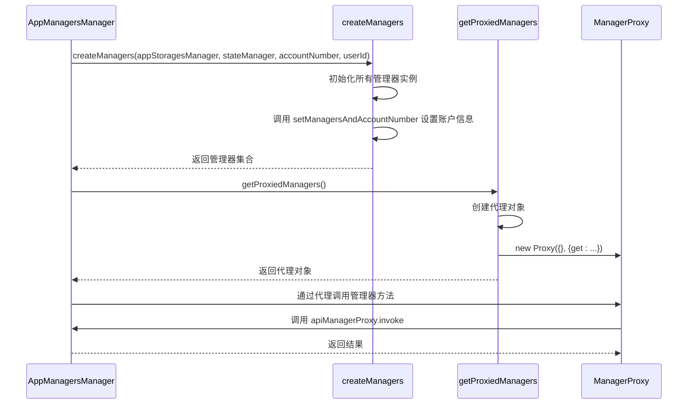
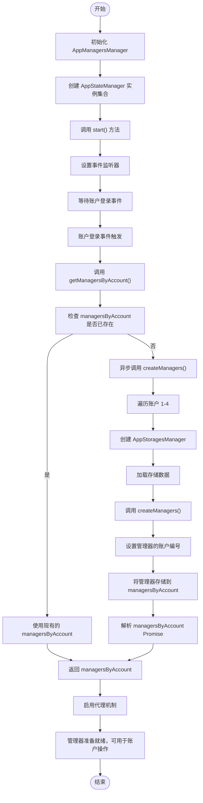
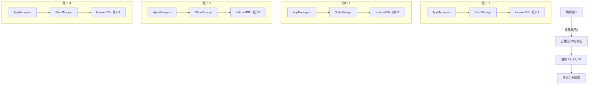

# 状态隔离策略

<cite>
**本文档中引用的文件**  
- [appManagersManager.ts](file://src/lib/appManagers/appManagersManager.ts)
- [createManagers.ts](file://src/lib/appManagers/createManagers.ts)
- [getProxiedManagers.ts](file://src/lib/appManagers/getProxiedManagers.ts)
- [appStateManager.ts](file://src/lib/appManagers/appStateManager.ts)
- [appStoragesManager.ts](file://src/lib/appManagers/appStoragesManager.ts)
- [state.ts](file://src/config/state.ts)
- [stateStorage.ts](file://src/lib/stateStorage.ts)
- [appState.ts](file://src/stores/appState.ts)
</cite>

## 目录
1. [引言](#引言)
2. [核心组件分析](#核心组件分析)
3. [AppManagersManager 状态隔离机制](#appmanagersmanager-状态隔离机制)
4. [createManagers 与 getProxiedManagers 的作用](#createmangers-与-getproxiedmanagers-的作用)
5. [appState 状态存储机制](#appstate-状态存储机制)
6. [状态隔离的实现流程](#状态隔离的实现流程)
7. [数据隔离与账户切换](#数据隔离与账户切换)
8. [优化建议与改进方向](#优化建议与改进方向)
9. [结论](#结论)

## 引言
tweb 项目实现了多账户状态隔离机制，确保每个账户拥有独立的管理器实例集合和状态快照。该机制通过 `AppManagersManager` 类协调多个账户的资源分配，利用代理机制防止账户间的数据泄露。每个账户的状态包括聊天记录、设置和会话数据等，均被独立维护。本文将详细阐述这一状态隔离策略的实现原理，分析关键函数的作用，并提供优化建议。

## 核心组件分析

**Section sources**
- [appManagersManager.ts](file://src/lib/appManagers/appManagersManager.ts#L30-L243)
- [createManagers.ts](file://src/lib/appManagers/createManagers.ts#L67-L184)
- [getProxiedManagers.ts](file://src/lib/appManagers/getProxiedManagers.ts#L80-L174)

## AppManagersManager 状态隔离机制

`AppManagersManager` 是多账户状态隔离的核心类，负责为每个账户创建独立的管理器实例集合。其构造函数初始化了四个账户的状态管理器（`stateManagersByAccount`），每个账户对应一个 `AppStateManager` 实例。

```mermaid
classDiagram
class AppManagersManager {
-managersByAccount : Promise<ManagersByAccount> | ManagersByAccount
+stateManagersByAccount : StateManagersByAccount
-cryptoWorkersURLs : string[]
-cryptoPortsAttached : number
-cryptoPortPromise : CancellablePromise<void>
+start() : void
+getManagersByAccount() : Promise<ManagersByAccount>
+get isServiceWorkerOnline() : boolean
+set isServiceWorkerOnline(value : boolean)
+getServiceMessagePort() : ServiceMessagePort<true>
+onServiceWorkerPort(event : MessageEvent<any>) : void
}
class AppStateManager {
-state : State
+storage : StateStorage
+newVersion : string
+oldVersion : string
+userId : UserId
+onSettingsUpdate : (value : StateSettings) => void
+resetStoragesPromise : ResetStoragesPromise
+constructor(accountNumber : ActiveAccountNumber)
+getState() : Promise<State>
+setByKey(key : string, value : any) : Promise<void>
+pushToState<T extends keyof State>(key : T, value : State[T], direct : boolean, onlyLocal? : boolean) : Promise<void>
+updateLocalState<T extends keyof State>(key : T, value : State[T]) : Promise<void>
+setKeyValueToStorage<T extends keyof State>(key : T, value : State[T], onlyLocal? : boolean) : Promise<void>
+getSomethingCached<T extends Extract<keyof State, 'accountContentSettings'>>({key, defaultValue, getValue, overwrite}) : Promise<State[T]['value']>
}
AppManagersManager --> AppStateManager : "包含"
```

**Diagram sources**
- [appManagersManager.ts](file://src/lib/appManagers/appManagersManager.ts#L52-L57)
- [appStateManager.ts](file://src/lib/appManagers/appStateManager.ts#L25-L133)

## createManagers 与 getProxiedManagers 的作用

`createManagers` 函数为指定账户创建所有必要的管理器实例，并通过 `setManagersAndAccountNumber` 方法将这些管理器与账户关联。`getProxiedManagers` 函数则创建代理对象，确保对管理器的调用被正确路由到对应账户。



**Diagram sources**
- [createManagers.ts](file://src/lib/appManagers/createManagers.ts#L67-L184)
- [getProxiedManagers.ts](file://src/lib/appManagers/getProxiedManagers.ts#L80-L174)

## appState 状态存储机制

`appState` 使用 SolidJS 的 `createStore` 实现响应式状态管理，与 `AppStateManager` 协同工作，为不同账户维护独立的状态快照。状态存储分为账户特定存储和通用存储，确保设置等共享数据的一致性。

```mermaid
erDiagram
ACCOUNT ||--o{ APP_STATE : "拥有"
ACCOUNT ||--o{ STATE_STORAGE : "拥有"
COMMON_STATE ||--o{ APP_STATE : "共享"
class ACCOUNT {
+accountNumber: ActiveAccountNumber
+userId: UserId
}
class APP_STATE {
+appState: State
+useAppState: () => [State, SetStoreFunction<State, Promise<void>>]
+setAppState: SetStoreFunction<State, Promise<void>>
+setAppStateSilent: (key: any, value?: any) => void
}
class STATE_STORAGE {
+storage: StateStorage
+set: (value: Partial<State>, onlyLocal?: boolean) => Promise<void>
+get: () => Promise<State>
}
class COMMON_STATE {
+settings: StateSettings
}
```

**Diagram sources**
- [appState.ts](file://src/stores/appState.ts#L1-L39)
- [stateStorage.ts](file://src/lib/stateStorage.ts#L1-L27)
- [state.ts](file://src/config/state.ts#L122-L420)

## 状态隔离的实现流程

状态隔离的实现流程始于 `AppManagersManager` 的 `createManagers` 方法。该方法为每个账户异步创建管理器实例，并通过 `AppStoragesManager` 加载存储数据。`getProxiedManagers` 函数确保所有管理器调用都通过代理机制进行，从而实现账户间的状态隔离。



**Diagram sources**
- [appManagersManager.ts](file://src/lib/appManagers/appManagersManager.ts#L136-L163)
- [appStoragesManager.ts](file://src/lib/appManagers/appStoragesManager.ts#L33-L40)
- [createManagers.ts](file://src/lib/appManagers/createManagers.ts#L67-L184)

## 数据隔离与账户切换

数据隔离通过独立的 IndexedDB 数据库实现，每个账户有自己独立的存储空间。账户切换时，`AppManagersManager` 会重新加载对应账户的状态，确保状态正确恢复。`AppStoragesManager` 的 `moveAccountStorages` 和 `shiftStorages` 方法支持账户数据的迁移和重组。



**Diagram sources**
- [appStoragesManager.ts](file://src/lib/appManagers/appStoragesManager.ts#L57-L102)
- [stateStorage.ts](file://src/lib/stateStorage.ts#L20-L26)

## 优化建议与改进方向

1. **惰性加载优化**：当前 `createManagers` 会为所有账户预创建管理器实例，可改为按需创建，减少初始内存占用。
2. **状态同步机制**：对于跨账户共享的设置（如主题），可引入更高效的状态同步机制，减少重复存储。
3. **错误处理增强**：在 `createManagers` 和 `loadStorages` 过程中增加更完善的错误处理和恢复机制。
4. **性能监控**：集成性能监控，跟踪管理器创建和状态加载的耗时，便于性能优化。
5. **类型安全增强**：进一步强化 TypeScript 类型定义，确保账户相关的操作在编译期就能发现潜在错误。

## 结论

tweb 项目的多账户状态隔离策略通过 `AppManagersManager`、`AppStateManager` 和代理机制的协同工作，实现了高效且安全的状态管理。每个账户拥有独立的管理器实例和状态存储，确保了数据的隔离性和安全性。该设计模式具有良好的扩展性和维护性，为多账户应用提供了可靠的架构基础。