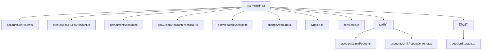
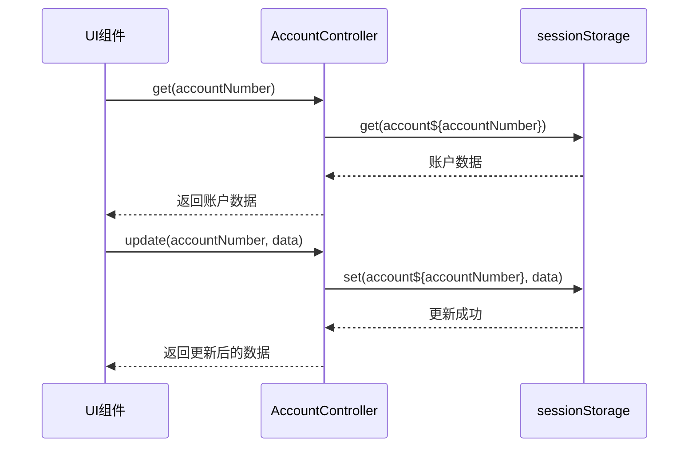
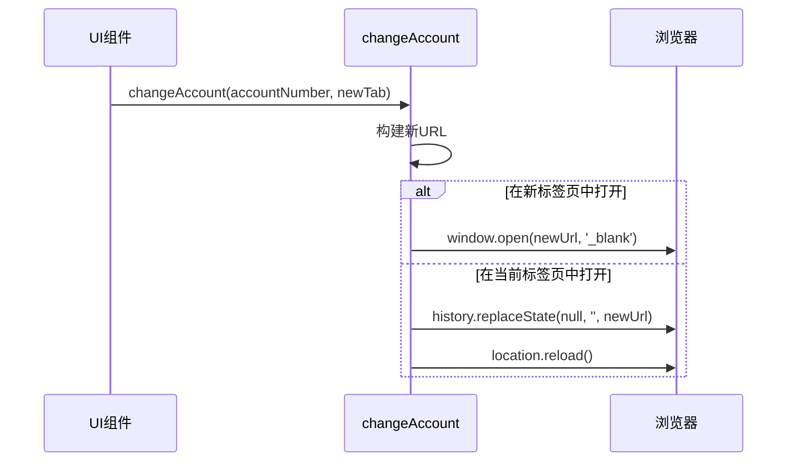
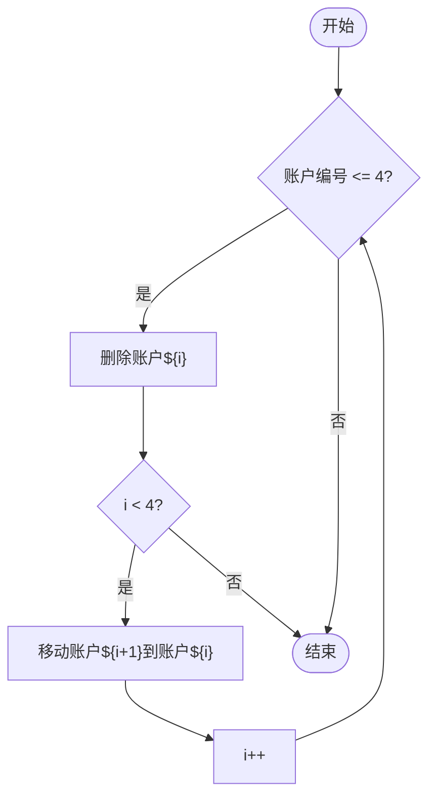
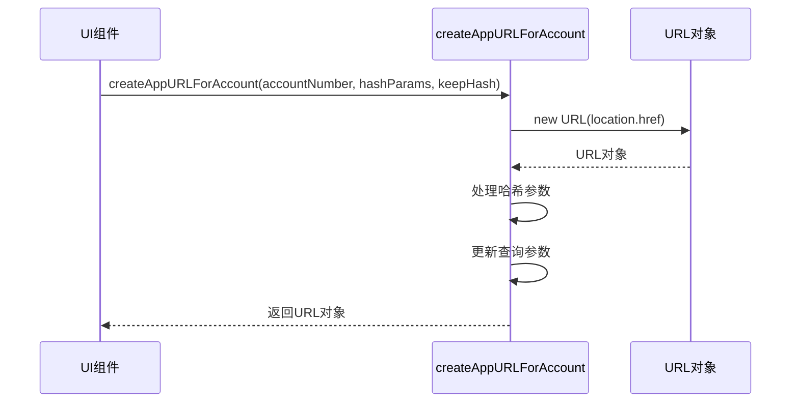
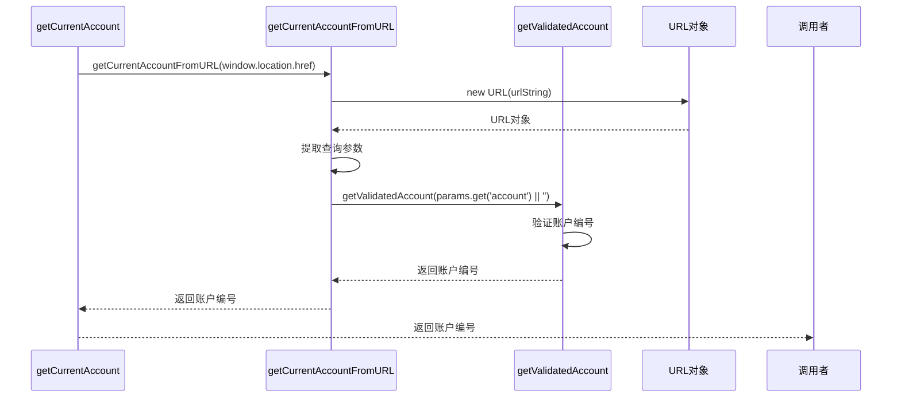
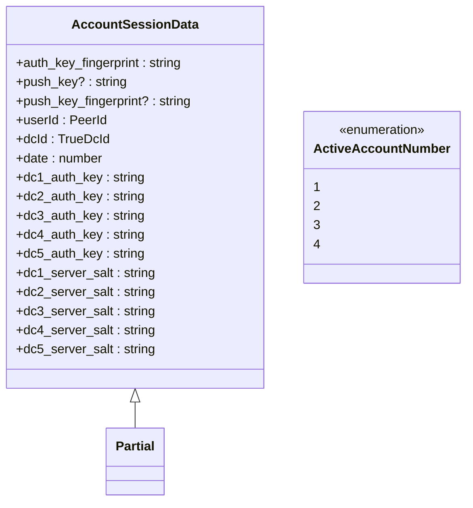
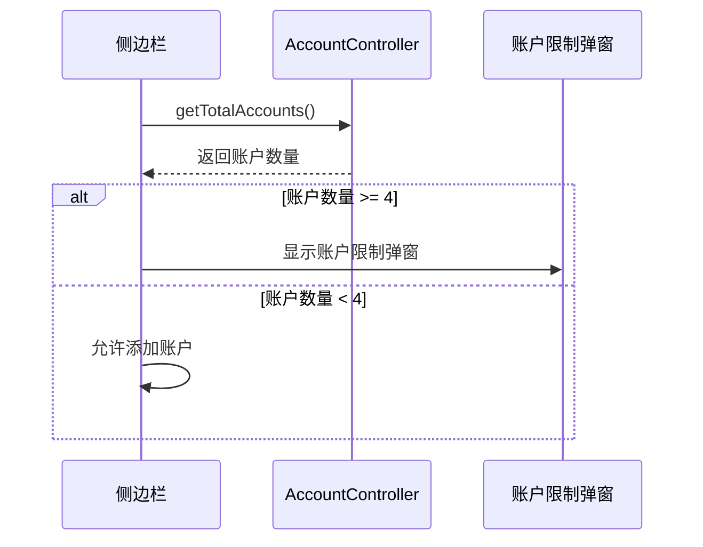
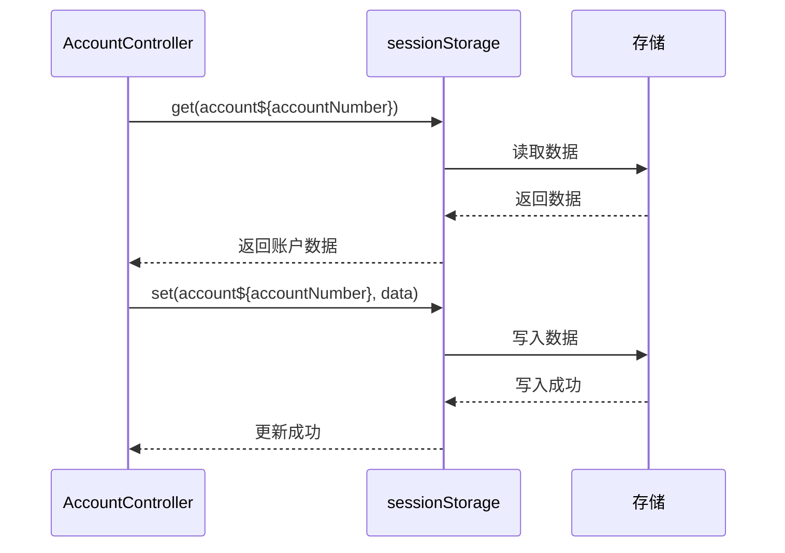

# 账户管理机制

<cite>
**本文档中引用的文件**  
- [accountController.ts](file://src/lib/accounts/accountController.ts)
- [createAppURLForAccount.ts](file://src/lib/accounts/createAppURLForAccount.ts)
- [getCurrentAccount.ts](file://src/lib/accounts/getCurrentAccount.ts)
- [getCurrentAccountFromURL.ts](file://src/lib/accounts/getCurrentAccountFromURL.ts)
- [getValidatedAccount.ts](file://src/lib/accounts/getValidatedAccount.ts)
- [changeAccount.ts](file://src/lib/accounts/changeAccount.ts)
- [types.d.ts](file://src/lib/accounts/types.d.ts)
- [constants.ts](file://src/lib/accounts/constants.ts)
- [accountsLimitPopup.ts](file://src/components/sidebarLeft/accountsLimitPopup.ts)
- [accountsLimitPopupContent.tsx](file://src/components/sidebarLeft/accountsLimitPopupContent.tsx)
- [sessionStorage.ts](file://src/lib/sessionStorage.ts)
</cite>

## 目录
1. [项目结构](#项目结构)
2. [核心组件](#核心组件)
3. [账户生命周期管理](#账户生命周期管理)
4. [账户URL生成机制](#账户url生成机制)
5. [当前账户确定机制](#当前账户确定机制)
6. [账户类型定义与数据结构](#账户类型定义与数据结构)
7. [账户管理器与其他组件的交互](#账户管理器与其他组件的交互)
8. [扩展指南](#扩展指南)

## 项目结构

tweb项目的账户管理功能主要集中在`src/lib/accounts`目录下，该目录包含了账户管理的核心逻辑和相关工具函数。账户管理机制与UI组件（如侧边栏）和网络层紧密集成，形成了一个完整的多账户管理体系。

**图示来源**
- [accountController.ts](file://src/lib/accounts/accountController.ts)
- [createAppURLForAccount.ts](file://src/lib/accounts/createAppURLForAccount.ts)
- [getCurrentAccount.ts](file://src/lib/accounts/getCurrentAccount.ts)
- [getCurrentAccountFromURL.ts](file://src/lib/accounts/getCurrentAccountFromURL.ts)
- [getValidatedAccount.ts](file://src/lib/accounts/getValidatedAccount.ts)
- [changeAccount.ts](file://src/lib/accounts/changeAccount.ts)
- [types.d.ts](file://src/lib/accounts/types.d.ts)
- [constants.ts](file://src/lib/accounts/constants.ts)
- [accountsLimitPopup.ts](file://src/components/sidebarLeft/accountsLimitPopup.ts)
- [accountsLimitPopupContent.tsx](file://src/components/sidebarLeft/accountsLimitPopupContent.tsx)
- [sessionStorage.ts](file://src/lib/sessionStorage.ts)

## 核心组件

账户管理机制的核心组件包括`AccountController`类、`getCurrentAccount`函数、`createAppURLForAccount`函数以及相关的类型定义和常量。这些组件共同协作，实现了多账户的创建、激活、切换和销毁功能。

**本节来源**
- [accountController.ts](file://src/lib/accounts/accountController.ts)
- [createAppURLForAccount.ts](file://src/lib/accounts/createAppURLForAccount.ts)
- [getCurrentAccount.ts](file://src/lib/accounts/getCurrentAccount.ts)
- [types.d.ts](file://src/lib/accounts/types.d.ts)
- [constants.ts](file://src/lib/accounts/constants.ts)

## 账户生命周期管理

账户的生命周期管理主要通过`AccountController`类实现。该类提供了创建、获取、更新和删除账户的方法。账户的创建和激活通过`get`和`update`方法完成，账户的切换通过`changeAccount`函数实现，账户的销毁则通过`shiftAccounts`方法完成。

### 账户创建与激活

账户的创建和激活主要通过`AccountController.get`和`AccountController.update`方法完成。`get`方法用于获取指定账户的数据，如果数据不存在，则返回一个空对象。`update`方法用于更新指定账户的数据，如果账户不存在，则创建新账户。

**图示来源**
- [accountController.ts](file://src/lib/accounts/accountController.ts#L32-L97)
- [sessionStorage.ts](file://src/lib/sessionStorage.ts)

### 账户切换

账户的切换通过`changeAccount`函数实现。该函数接收一个账户编号和一个布尔值，用于指定是否在新标签页中打开账户。函数首先构建一个新的URL，然后根据是否在新标签页中打开账户，调用`window.open`或`history.replaceState`方法。

**图示来源**
- [changeAccount.ts](file://src/lib/accounts/changeAccount.ts)
- [appNavigationController.ts](file://src/components/appNavigationController.ts)

### 账户销毁

账户的销毁通过`AccountController.shiftAccounts`方法实现。该方法接收一个账户编号，将指定账户及其之后的所有账户向前移动一位，从而实现账户的删除。

**图示来源**
- [accountController.ts](file://src/lib/accounts/accountController.ts#L103-L111)

## 账户URL生成机制

`createAppURLForAccount`函数用于为不同账户生成唯一的URL标识。该函数接收一个账户编号、一个哈希参数对象和一个布尔值，用于指定是否保留哈希。函数首先构建一个新的URL，然后根据账户编号和哈希参数更新URL的查询参数和哈希。

**图示来源**
- [createAppURLForAccount.ts](file://src/lib/accounts/createAppURLForAccount.ts)

## 当前账户确定机制

`getCurrentAccount`函数用于确定当前活动账户。该函数通过`getCurrentAccountFromURL`函数从URL中提取账户编号，然后通过`getValidatedAccount`函数验证账户编号的有效性。

**图示来源**
- [getCurrentAccount.ts](file://src/lib/accounts/getCurrentAccount.ts)
- [getCurrentAccountFromURL.ts](file://src/lib/accounts/getCurrentAccountFromURL.ts)
- [getValidatedAccount.ts](file://src/lib/accounts/getValidatedAccount.ts)

## 账户类型定义与数据结构

账户类型定义位于`types.d.ts`文件中，定义了`ActiveAccountNumber`和`AccountSessionData`类型。`ActiveAccountNumber`类型表示账户编号，取值范围为1到4。`AccountSessionData`类型表示账户会话数据，包含账户ID、会话信息和配置参数。

**图示来源**
- [types.d.ts](file://src/lib/accounts/types.d.ts)

## 账户管理器与其他组件的交互

账户管理器与UI组件和网络层紧密集成，形成了一个完整的多账户管理体系。UI组件通过调用`AccountController`类的方法来管理账户，网络层通过`sessionStorage`来存储和读取账户数据。

### 与UI组件的交互

UI组件通过调用`AccountController`类的方法来管理账户。例如，侧边栏中的“添加账户”按钮通过调用`AccountController.getTotalAccounts`方法来检查账户数量，如果账户数量达到上限，则显示账户限制弹窗。

**图示来源**
- [sidebarLeft/index.ts](file://src/components/sidebarLeft/index.ts#L659-L665)
- [accountsLimitPopup.ts](file://src/components/sidebarLeft/accountsLimitPopup.ts)

### 与网络层的交互

网络层通过`sessionStorage`来存储和读取账户数据。`AccountController`类通过调用`sessionStorage`的`get`和`set`方法来读取和写入账户数据。

**图示来源**
- [accountController.ts](file://src/lib/accounts/accountController.ts)
- [sessionStorage.ts](file://src/lib/sessionStorage.ts)

## 扩展指南

### 添加新的账户属性

要添加新的账户属性，首先需要在`types.d.ts`文件中定义新的属性类型，然后在`AccountSessionData`类型中添加新的属性。最后，在`AccountController`类中添加相应的getter和setter方法。

### 优化账户切换性能

为了优化账户切换性能，可以考虑以下几点：
1. 减少`sessionStorage`的读写操作，尽量在内存中缓存账户数据。
2. 使用异步操作来避免阻塞主线程。
3. 在账户切换时，提前加载必要的资源，减少用户等待时间。

**本节来源**
- [types.d.ts](file://src/lib/accounts/types.d.ts)
- [accountController.ts](file://src/lib/accounts/accountController.ts)
- [sessionStorage.ts](file://src/lib/sessionStorage.ts)