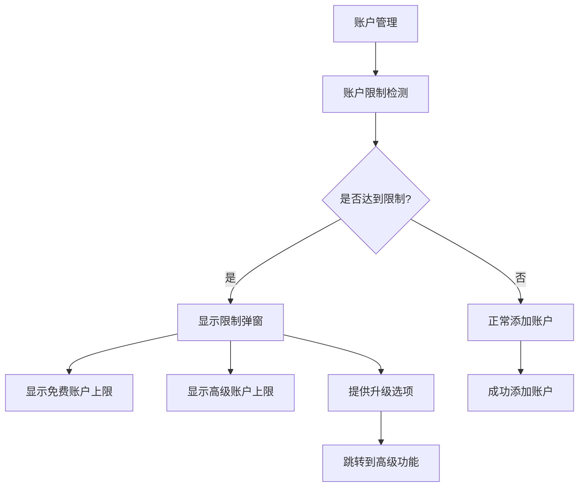
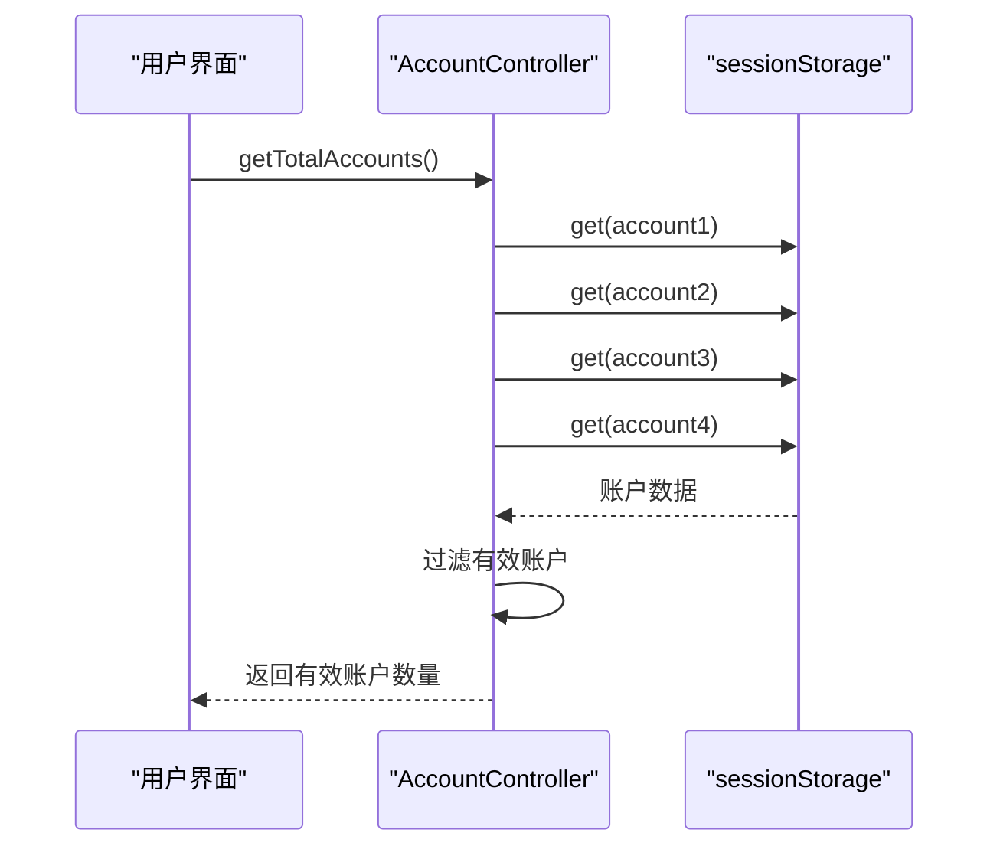

# 账户限制实现

<cite>
**本文档引用的文件**   
- [accountsLimitPopup.ts](file://src/components/sidebarLeft/accountsLimitPopup.ts)
- [accountsLimitPopupContent.tsx](file://src/components/sidebarLeft/accountsLimitPopupContent.tsx)
- [constants.ts](file://src/lib/accounts/constants.ts)
- [accountController.ts](file://src/lib/accounts/accountController.ts)
- [index.ts](file://src/components/sidebarLeft/index.ts)
- [settings.ts](file://src/components/sidebarLeft/tabs/settings.ts)
- [_accountsLimit.scss](file://src/scss/partials/popups/_accountsLimit.scss)
</cite>

## 目录
1. [介绍](#介绍)
2. [账户限制功能架构](#账户限制功能架构)
3. [核心组件分析](#核心组件分析)
4. [账户限制常量定义](#账户限制常量定义)
5. [账户管理机制集成](#账户管理机制集成)
6. [UI设计与交互逻辑](#ui设计与交互逻辑)
7. [设置组件集成](#设置组件集成)
8. [可访问性优化建议](#可访问性优化建议)
9. [国际化支持方案](#国际化支持方案)

## 介绍
本文档全面解析tweb项目中账户限制功能的实现。详细说明accountsLimitPopup和accountsLimitPopupContent组件的UI设计和交互逻辑，包括限制提示的显示条件和用户操作响应。分析constants.ts中定义的账户限制常量，如最大账户数和限制阈值。阐述账户限制功能如何与账户管理机制集成，以及在达到限制时的处理流程。结合settings组件，说明用户如何管理账户限制和升级账户权限。提供账户限制实现的可访问性优化建议和国际化支持方案。

## 账户限制功能架构
账户限制功能是tweb项目多账户管理系统的重要组成部分，旨在为免费和高级用户提供不同的账户数量限制。该功能通过多个组件协同工作，实现了限制检测、提示显示和升级引导的完整流程。



**图表来源**
- [accountController.ts](file://src/lib/accounts/accountController.ts#L16-L20)
- [accountsLimitPopup.ts](file://src/components/sidebarLeft/accountsLimitPopup.ts#L5-L23)

## 核心组件分析

### accountsLimitPopup组件
accountsLimitPopup组件是账户限制功能的主要容器，继承自PopupElement基类，负责创建和管理账户限制弹窗的整体结构和行为。

该组件在构造函数中初始化弹窗的基本属性，包括：
- 弹窗类名：accounts-limit-popup
- 可通过遮罩层关闭：overlayClosable为true
- 包含主体内容：body为true
- 标题语言包键：title为'LimitReached'

组件通过导入AccountsLimitPopupContent组件并将其附加到弹窗主体中，实现了内容与容器的分离。当用户点击取消按钮时，调用hide()方法关闭弹窗；当用户点击升级按钮时，隐藏当前弹窗并显示高级功能弹窗，引导用户升级账户权限。

**组件来源**
- [accountsLimitPopup.ts](file://src/components/sidebarLeft/accountsLimitPopup.ts#L5-L23)

### accountsLimitPopupContent组件
accountsLimitPopupContent组件是账户限制弹窗的内容部分，采用函数式组件的形式实现，负责渲染弹窗的具体UI元素和交互逻辑。

组件的主要功能包括：
1. 显示账户限制的视觉标识，包括账户图钉容器、免费账户数量和人物图标
2. 展示免费和高级账户的对比信息，通过进度条形式直观显示两种账户类型的上限差异
3. 提供操作按钮，包括取消按钮和升级限制按钮
4. 显示账户限制的详细描述文本

组件通过props接收onCancel和onSubmit回调函数，实现了与父组件的交互。升级按钮包含一个自定义的PlusOneSvg图标，增强了用户体验。

```mermaid
classDiagram
class AccountsLimitPopupContent {
+props : {onCancel : () => void; onSubmit : () => void}
+AccountsLimitPopupContent(props)
+PlusOneSvg()
}
AccountsLimitPopupContent --> Button : "使用"
AccountsLimitPopupContent --> IconTsx : "使用"
AccountsLimitPopupContent --> i18n : "使用"
AccountsLimitPopupContent --> MAX_ACCOUNTS_FREE : "引用"
AccountsLimitPopupContent --> MAX_ACCOUNTS_PREMIUM : "引用"
```

**图表来源**
- [accountsLimitPopupContent.tsx](file://src/components/sidebarLeft/accountsLimitPopupContent.tsx#L7-L42)

**组件来源**
- [accountsLimitPopupContent.tsx](file://src/components/sidebarLeft/accountsLimitPopupContent.tsx#L7-L42)

## 账户限制常量定义
账户限制相关的常量定义在src/lib/accounts/constants.ts文件中，这些常量为账户限制功能提供了基础配置。

```typescript
export const CURRENT_ACCOUNT_QUERY_PARAM = 'account';

export const MAX_ACCOUNTS_FREE = 3;
export const MAX_ACCOUNTS_PREMIUM = 4;
export const MAX_ACCOUNTS = MAX_ACCOUNTS_PREMIUM;
```

主要常量包括：
- MAX_ACCOUNTS_FREE：免费账户的最大数量，设置为3个
- MAX_ACCOUNTS_PREMIUM：高级账户的最大数量，设置为4个
- MAX_ACCOUNTS：系统账户上限，等于MAX_ACCOUNTS_PREMIUM

这些常量被多个组件引用，确保了账户限制逻辑的一致性。MAX_ACCOUNTS_FREE和MAX_ACCOUNTS_PREMIUM分别代表了免费用户和付费用户的账户数量上限，为账户限制功能提供了明确的阈值定义。

**组件来源**
- [constants.ts](file://src/lib/accounts/constants.ts#L3-L5)

## 账户管理机制集成
账户限制功能与账户管理机制深度集成，通过AccountController类提供的API实现账户数量的检测和管理。

### 账户数量检测
AccountController类提供了getTotalAccounts方法，用于获取当前已创建的账户总数：



**图表来源**
- [accountController.ts](file://src/lib/accounts/accountController.ts#L16-L20)

### 账户添加流程
在添加新账户时，系统会检查当前账户数量是否达到限制。相关逻辑位于src/components/sidebarLeft/index.ts文件中：

```typescript
const menuButtons: (ButtonMenuItemOptions & {verify?: () => boolean | Promise<boolean>})[] = [{
  icon: 'plus',
  text: 'MultiAccount.AddAccount',
  onClick: async(e) => {
    const totalAccounts = await AccountController.getTotalAccounts();
    if(totalAccounts >= MAX_ACCOUNTS) return;

    const hasSomeonePremium = await apiManagerProxy.hasSomeonePremium();

    if(totalAccounts === MAX_ACCOUNTS_FREE && !hasSomeonePremium) {
      new AccountsLimitPopup().show();
      return;
    }
    // ...账户创建逻辑
  },
  verify: async() => {
    const totalAccounts = await AccountController.getTotalAccounts();
    return totalAccounts < MAX_ACCOUNTS;
  }
}]
```

当用户尝试添加账户时，系统首先获取当前账户总数。如果总数已达到系统上限(MAX_ACCOUNTS)，则直接返回，不允许添加。如果总数达到免费账户上限(MAX_ACCOUNTS_FREE)且用户没有高级账户权限，则显示账户限制弹窗，引导用户升级。

**组件来源**
- [accountController.ts](file://src/lib/accounts/accountController.ts#L16-L20)
- [index.ts](file://src/components/sidebarLeft/index.ts#L658-L665)

## UI设计与交互逻辑
账户限制功能的UI设计注重用户体验，通过视觉元素和交互逻辑引导用户理解账户限制并采取相应行动。

### 视觉设计
弹窗采用现代化的设计风格，包含以下主要视觉元素：
1. 账户图钉容器：使用SVG图像和图标组合，形成独特的视觉标识
2. 进度条对比：通过左右分区的进度条，直观展示免费和高级账户的上限差异
3. 操作按钮：提供清晰的取消和升级选项，使用主色调突出重要操作

### 交互逻辑
弹窗的交互逻辑设计考虑了用户操作的流畅性：
- 取消按钮：点击后关闭弹窗，返回原操作界面
- 升级按钮：点击后关闭当前弹窗，并打开高级功能页面，引导用户升级账户
- 遮罩层点击：支持点击遮罩层关闭弹窗，提供便捷的关闭方式

### 动画效果
CSS样式文件中定义了专门的动画效果，增强用户体验：

```scss
@keyframes accounts-limit-pin-animation {
  0% {
    transform: translateX(-160px) rotate(-16deg);
    opacity: 0.5;
  }
  30% {
    transform: translateX(0px) rotate(-16deg);
    opacity: 1;
  }
  50% {
    transform: translateX(0px) rotate(12deg);
  }
  75% {
    transform: rotate(-2deg);
  }
  100% {
    transform: rotate(0deg);
  }
}
```

这些动画效果为账户图钉添加了入场动画，使弹窗显示更加生动自然。

**组件来源**
- [accountsLimitPopupContent.tsx](file://src/components/sidebarLeft/accountsLimitPopupContent.tsx#L7-L42)
- [_accountsLimit.scss](file://src/scss/partials/popups/_accountsLimit.scss#L30-L132)

## 设置组件集成
账户限制功能与设置组件紧密集成，为用户提供管理账户和升级权限的完整路径。

### 设置页面导航
在设置页面中，用户可以通过"Premium"行点击进入高级功能页面，这是升级账户的主要入口之一：

```typescript
this.premiumRow = new Row({
  titleLangKey: 'Premium.Boarding.Title',
  icon: 'star',
  iconClasses: ['row-icon-premium-color'],
  clickable: () => {
    PopupPremium.show();
  },
  listenerSetter: this.listenerSetter
});
```

### 账户管理集成
设置组件还集成了账户管理功能，用户可以在设置中查看和管理所有账户。当账户数量接近限制时，系统会在相关界面提供提示，帮助用户及时了解账户状态。

**组件来源**
- [settings.ts](file://src/components/sidebarLeft/tabs/settings.ts#L230-L238)

## 可访问性优化建议
为了提升账户限制功能的可访问性，建议实施以下优化措施：

1. **键盘导航支持**：确保弹窗可以通过Tab键在取消和升级按钮之间切换，Enter键确认操作，Esc键关闭弹窗
2. **屏幕阅读器优化**：为弹窗添加适当的ARIA标签，如aria-modal="true"和role="dialog"，帮助视障用户理解弹窗的上下文
3. **高对比度模式**：确保在高对比度模式下，弹窗的关键信息仍然清晰可见
4. **焦点管理**：在弹窗显示时，将焦点设置在第一个可交互元素上，并在弹窗关闭后恢复之前的焦点位置
5. **动画控制**：为有动画敏感性的用户提供减少动画的选项

这些优化措施将确保所有用户，包括残障用户，都能顺利使用账户限制功能。

## 国际化支持方案
账户限制功能已经实现了完善的国际化支持，通过语言包系统适配不同语言环境。

### 语言包使用
组件中使用了多种国际化方法：
- i18n函数：用于简单的文本翻译，如i18n('LimitFree')
- i18n_函数：用于包含动态内容的复杂文本翻译，如i18n_({key: 'MultiAccount.AccountsLimitDescription'})

### 多语言支持
系统支持多种语言，包括英语(en)和俄语(ru)，通过语言包文件实现文本的本地化。当用户切换语言时，账户限制弹窗中的所有文本都会自动更新为对应语言的翻译。

### 扩展性
国际化架构设计具有良好的扩展性，可以轻松添加新的语言支持。只需创建对应的语言包文件并注册到系统中，即可实现新语言的完整支持。

**组件来源**
- [accountsLimitPopupContent.tsx](file://src/components/sidebarLeft/accountsLimitPopupContent.tsx#L2-L3)
- [lang.ts](file://src/lib/lang.ts)