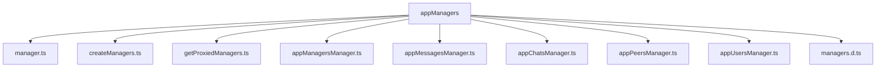
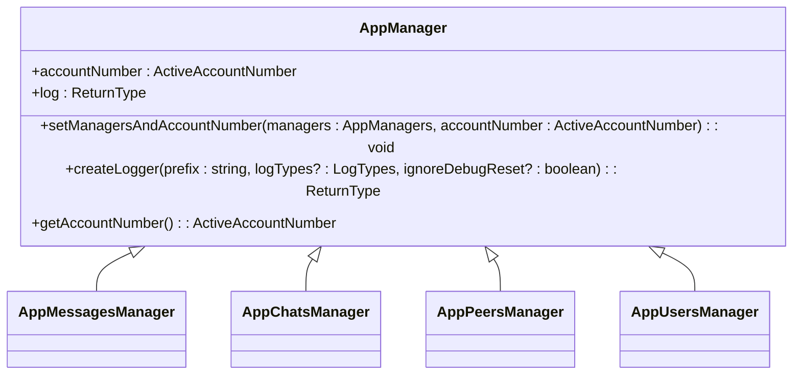
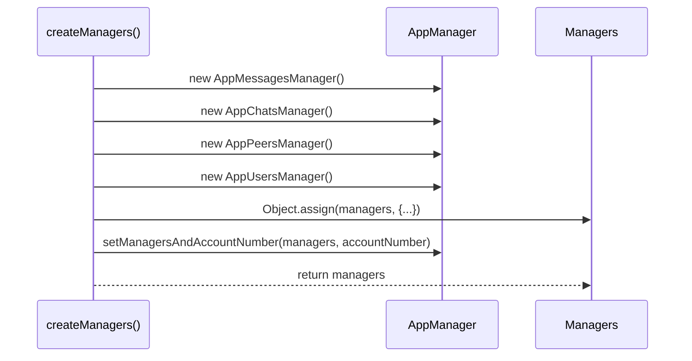
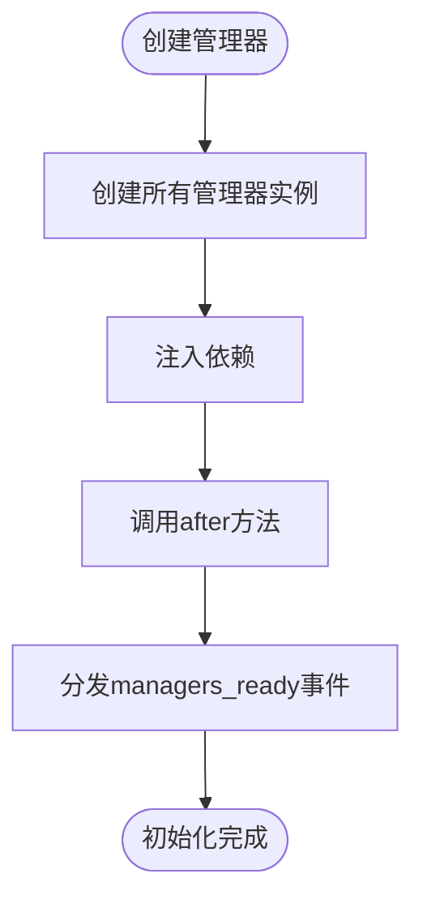
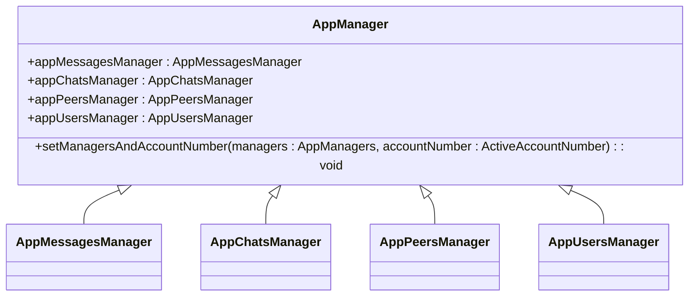
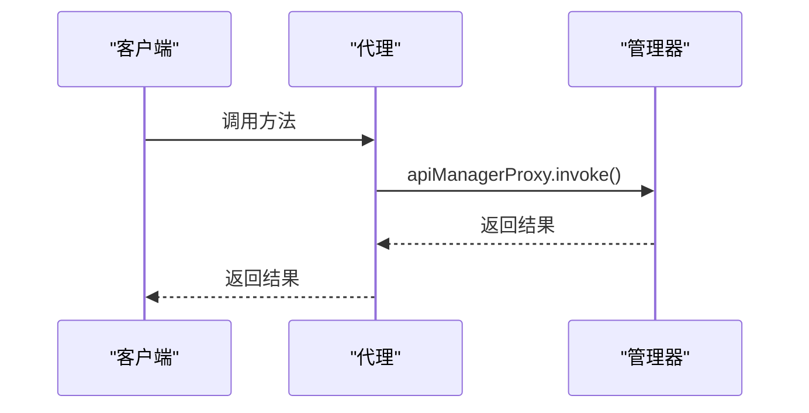
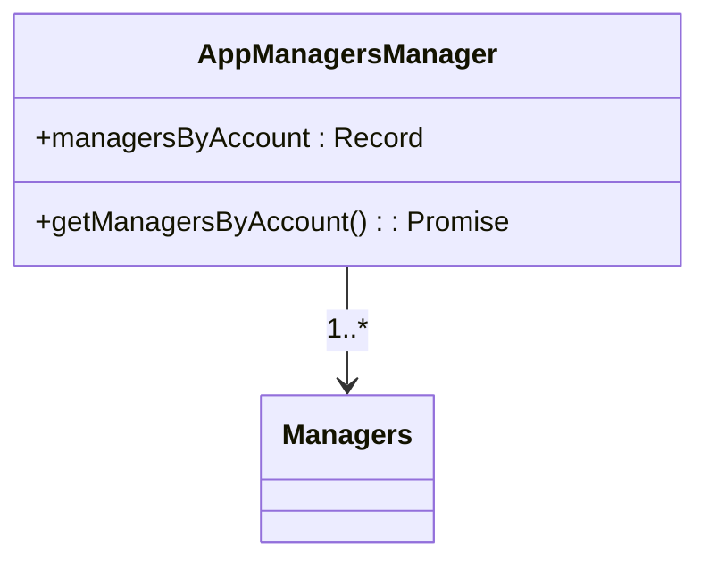

# 应用管理器架构

<cite>
**本文档引用的文件**
- [manager.ts](file://src/lib/appManagers/manager.ts)
- [createManagers.ts](file://src/lib/appManagers/createManagers.ts)
- [getProxiedManagers.ts](file://src/lib/appManagers/getProxiedManagers.ts)
- [appManagersManager.ts](file://src/lib/appManagers/appManagersManager.ts)
- [appMessagesManager.ts](file://src/lib/appManagers/appMessagesManager.ts)
- [appChatsManager.ts](file://src/lib/appManagers/appChatsManager.ts)
- [appPeersManager.ts](file://src/lib/appManagers/appPeersManager.ts)
- [appUsersManager.ts](file://src/lib/appManagers/appUsersManager.ts)
- [managers.d.ts](file://src/lib/appManagers/managers.d.ts)
</cite>

## 目录
1. [项目结构](#项目结构)
2. [核心组件](#核心组件)
3. [应用管理器设计模式](#应用管理器设计模式)
4. [管理器职责划分](#管理器职责划分)
5. [生命周期管理](#生命周期管理)
6. [依赖注入与通信机制](#依赖注入与通信机制)
7. [代理模式与多账户支持](#代理模式与多账户支持)
8. [扩展与自定义最佳实践](#扩展与自定义最佳实践)

## 项目结构

tweb项目的应用管理器模块位于`src/lib/appManagers`目录下，该模块包含多个管理器类，每个管理器负责特定的功能领域。主要的管理器包括`appMessagesManager`、`appChatsManager`、`appPeersManager`、`appUsersManager`等，这些管理器通过`createManagers`函数创建，并通过`getProxiedManagers`函数获取代理实例。

**图示来源**
- [manager.ts](file://src/lib/appManagers/manager.ts)
- [createManagers.ts](file://src/lib/appManagers/createManagers.ts)
- [getProxiedManagers.ts](file://src/lib/appManagers/getProxiedManagers.ts)
- [appManagersManager.ts](file://src/lib/appManagers/appManagersManager.ts)
- [appMessagesManager.ts](file://src/lib/appManagers/appMessagesManager.ts)
- [appChatsManager.ts](file://src/lib/appManagers/appChatsManager.ts)
- [appPeersManager.ts](file://src/lib/appManagers/appPeersManager.ts)
- [appUsersManager.ts](file://src/lib/appManagers/appUsersManager.ts)
- [managers.d.ts](file://src/lib/appManagers/managers.d.ts)

## 核心组件

应用管理器模块的核心组件包括`AppManager`基类、`createManagers`函数、`getProxiedManagers`函数和`AppManagersManager`类。`AppManager`基类定义了所有管理器的公共属性和方法，`createManagers`函数负责创建和初始化所有管理器实例，`getProxiedManagers`函数提供代理模式支持，`AppManagersManager`类管理多账户环境下的管理器实例。

**组件来源**
- [manager.ts](file://src/lib/appManagers/manager.ts)
- [createManagers.ts](file://src/lib/appManagers/createManagers.ts)
- [getProxiedManagers.ts](file://src/lib/appManagers/getProxiedManagers.ts)
- [appManagersManager.ts](file://src/lib/appManagers/appManagersManager.ts)

## 应用管理器设计模式

### 基类设计

`AppManager`基类是所有管理器的父类，它定义了管理器的基本结构和公共方法。基类通过`setManagersAndAccountNumber`方法接收所有管理器实例和账户编号，实现依赖注入。基类还提供了日志记录功能，每个管理器可以通过`createLogger`方法创建自己的日志实例。

**图示来源**
- [manager.ts](file://src/lib/appManagers/manager.ts)

### 工厂模式

`createManagers`函数实现了工厂模式，负责创建和初始化所有管理器实例。该函数接收`appStoragesManager`、`stateManager`、`accountNumber`和`userId`作为参数，创建所有管理器实例，并通过`setManagersAndAccountNumber`方法将所有管理器实例注入到每个管理器中，实现依赖注入。

**图示来源**
- [createManagers.ts](file://src/lib/appManagers/createManagers.ts)

## 管理器职责划分

### appMessagesManager

`appMessagesManager`负责管理消息相关的所有操作，包括消息的发送、接收、存储和检索。它提供了`sendMessage`、`getMessage`、`getHistory`等方法，支持消息的分页加载和搜索功能。

**职责来源**
- [appMessagesManager.ts](file://src/lib/appManagers/appMessagesManager.ts)

### appChatsManager

`appChatsManager`负责管理聊天相关的所有操作，包括聊天的创建、修改、删除和成员管理。它提供了`createChat`、`editChat`、`deleteChat`、`addMember`等方法，支持聊天的权限管理和消息历史记录。

**职责来源**
- [appChatsManager.ts](file://src/lib/appManagers/appChatsManager.ts)

### appPeersManager

`appPeersManager`负责管理用户和聊天的统一接口，提供`getPeer`、`getPeerId`、`getOutputPeer`等方法，支持用户和聊天的相互转换和信息查询。

**职责来源**
- [appPeersManager.ts](file://src/lib/appManagers/appPeersManager.ts)

### appUsersManager

`appUsersManager`负责管理用户相关的所有操作，包括用户的创建、修改、删除和联系人管理。它提供了`getUser`、`saveUser`、`addContact`等方法，支持用户的个人信息和联系人列表的管理。

**职责来源**
- [appUsersManager.ts](file://src/lib/appManagers/appUsersManager.ts)

## 生命周期管理

### 创建与初始化

管理器的创建和初始化通过`createManagers`函数完成。该函数首先创建所有管理器实例，然后通过`setManagersAndAccountNumber`方法将所有管理器实例注入到每个管理器中，最后调用`after`方法进行后续的初始化操作。

**图示来源**
- [createManagers.ts](file://src/lib/appManagers/createManagers.ts)

### 销毁

管理器的销毁通过`clear`方法完成。该方法根据`init`参数决定是否完全清除管理器的状态。在多账户环境下，`AppManagersManager`类负责管理每个账户的管理器实例，当账户注销时，相应的管理器实例会被销毁。

**销毁来源**
- [appChatsManager.ts](file://src/lib/appManagers/appChatsManager.ts)
- [appManagersManager.ts](file://src/lib/appManagers/appManagersManager.ts)

## 依赖注入与通信机制

### 依赖注入

依赖注入通过`setManagersAndAccountNumber`方法实现。该方法接收所有管理器实例和账户编号，使用`Object.assign`方法将所有管理器实例注入到当前管理器中。这种方式使得每个管理器都可以访问其他管理器的方法和属性，实现松耦合的设计。

**图示来源**
- [manager.ts](file://src/lib/appManagers/manager.ts)

### 通信机制

管理器之间的通信通过事件系统和方法调用实现。`apiUpdatesManager`负责监听和分发API更新事件，其他管理器通过注册事件监听器来响应这些事件。此外，管理器之间也可以直接调用对方的方法，实现同步或异步的通信。

**通信来源**
- [appMessagesManager.ts](file://src/lib/appManagers/appMessagesManager.ts)
- [appChatsManager.ts](file://src/lib/appManagers/appChatsManager.ts)
- [appPeersManager.ts](file://src/lib/appManagers/appPeersManager.ts)
- [appUsersManager.ts](file://src/lib/appManagers/appUsersManager.ts)

## 代理模式与多账户支持

### 代理模式

`getProxiedManagers`函数提供了代理模式的支持。该函数返回一个代理对象，该对象拦截对管理器方法的调用，并通过`apiManagerProxy.invoke`方法将调用转发到实际的管理器实例。这种方式使得管理器的调用可以被监控和记录，同时也支持异步调用。

**图示来源**
- [getProxiedManagers.ts](file://src/lib/appManagers/getProxiedManagers.ts)

### 多账户支持

`AppManagersManager`类负责管理多账户环境下的管理器实例。该类维护一个`managersByAccount`对象，存储每个账户的管理器实例。当需要访问某个账户的管理器时，通过`getManagersByAccount`方法获取相应的管理器实例。这种方式支持多账户的并发操作，每个账户的管理器实例相互独立。

**图示来源**
- [appManagersManager.ts](file://src/lib/appManagers/appManagersManager.ts)

## 扩展与自定义最佳实践

### 扩展管理器

要扩展管理器功能，可以通过继承`AppManager`基类来创建新的管理器类。新管理器类可以重写`after`方法进行初始化，也可以添加新的方法和属性。为了确保新管理器能够正确地与其他管理器协作，需要在`createManagers`函数中添加新管理器的实例创建代码。

**扩展来源**
- [manager.ts](file://src/lib/appManagers/manager.ts)
- [createManagers.ts](file://src/lib/appManagers/createManagers.ts)

### 自定义管理器

自定义管理器时，应遵循单一职责原则，确保每个管理器只负责一个特定的功能领域。管理器之间的依赖关系应通过`setManagersAndAccountNumber`方法注入，避免直接引用其他管理器的实例。此外，管理器的方法应尽量保持无副作用，确保方法的可测试性和可维护性。

**自定义来源**
- [manager.ts](file://src/lib/appManagers/manager.ts)
- [createManagers.ts](file://src/lib/appManagers/createManagers.ts)