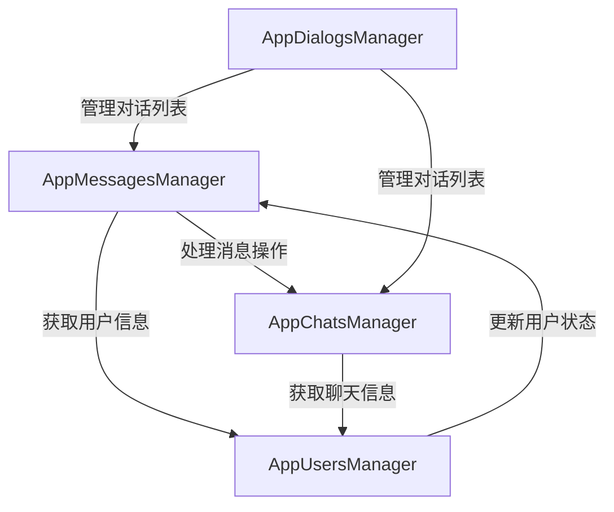
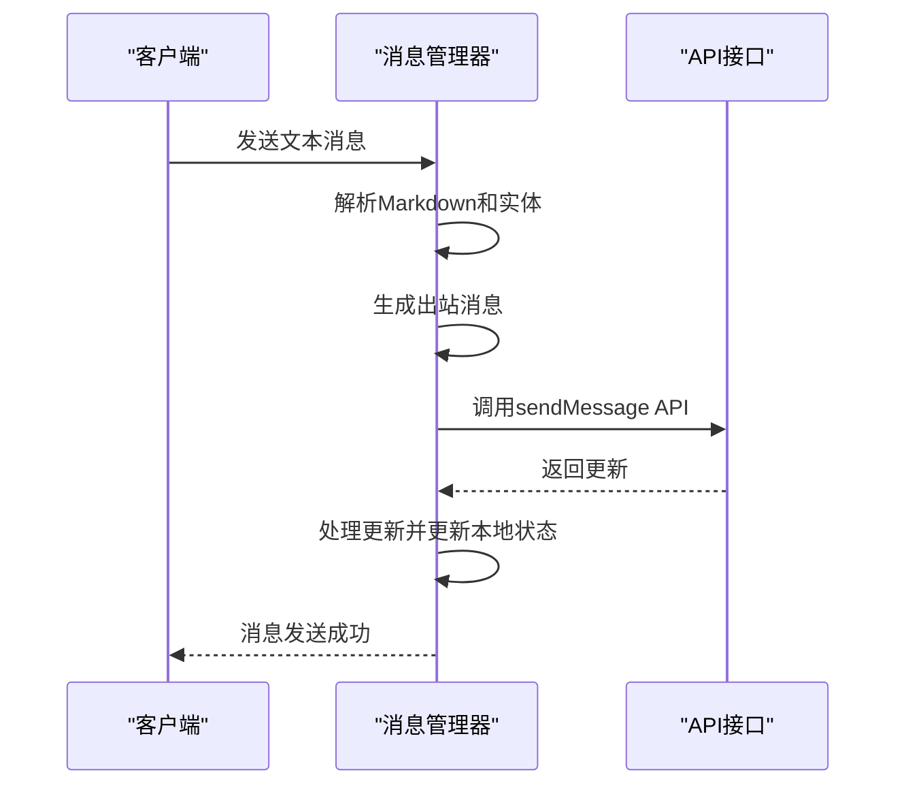
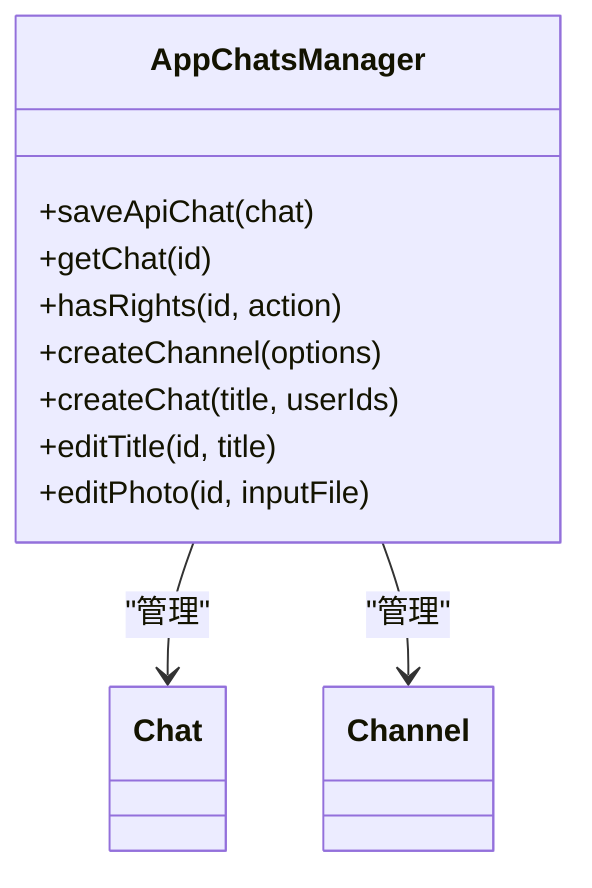
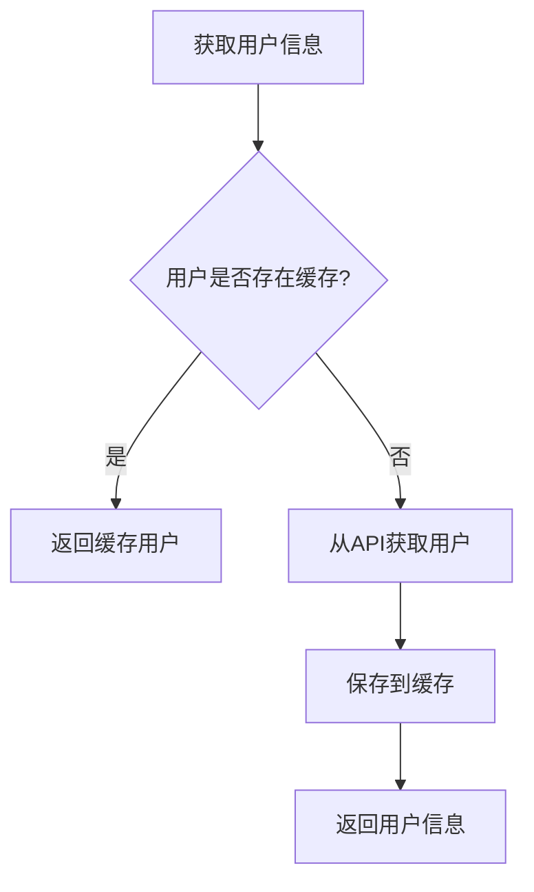
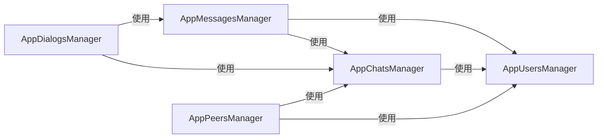

# 核心管理器实现

<cite>
**本文档引用的文件**   
- [appMessagesManager.ts](file://src\lib\appManagers\appMessagesManager.ts)
- [appChatsManager.ts](file://src\lib\appManagers\appChatsManager.ts)
- [appUsersManager.ts](file://src\lib\appManagers\appUsersManager.ts)
- [appDialogsManager.ts](file://src\lib\appManagers\appDialogsManager.ts)
- [appPeersManager.ts](file://src\lib\appManagers\appPeersManager.ts)
</cite>

## 目录
1. [引言](#引言)
2. [核心管理器架构](#核心管理器架构)
3. [消息管理器分析](#消息管理器分析)
4. [聊天管理器分析](#聊天管理器分析)
5. [用户管理器分析](#用户管理器分析)
6. [管理器交互模式](#管理器交互模式)
7. [结论](#结论)

## 引言

tweb项目的核心管理器是整个应用功能实现的基础，负责处理消息、聊天和用户等核心业务逻辑。本文档将深入分析appMessagesManager、appChatsManager和appUsersManager三个核心管理器的具体实现细节和职责划分。

## 核心管理器架构

tweb项目采用模块化的管理器架构，每个管理器负责特定领域的业务逻辑。核心管理器之间通过事件系统和依赖注入进行通信和协作。

**Diagram sources**
- [appMessagesManager.ts](file://src\lib\appManagers\appMessagesManager.ts)
- [appChatsManager.ts](file://src\lib\appManagers\appChatsManager.ts)
- [appUsersManager.ts](file://src\lib\appManagers\appUsersManager.ts)
- [appDialogsManager.ts](file://src\lib\appManagers\appDialogsManager.ts)

## 消息管理器分析

appMessagesManager是tweb项目中负责消息处理的核心组件，它管理着消息的发送、接收、编辑和删除等操作。

### 消息发送处理

消息管理器通过sendText和sendFile方法处理不同类型的消息发送。在发送消息前，管理器会进行必要的预处理，包括文本解析、实体处理和权限检查。

**Diagram sources**
- [appMessagesManager.ts](file://src\lib\appManagers\appMessagesManager.ts)

### 消息编辑与删除

消息管理器提供了editMessage方法来处理消息编辑操作。当用户编辑消息时，管理器会验证编辑权限，然后调用相应的API接口。

**Section sources**
- [appMessagesManager.ts](file://src\lib\appManagers\appMessagesManager.ts#L778-L835)

## 聊天管理器分析

appChatsManager负责管理聊天会话的创建、更新和同步，是聊天功能的核心组件。

### 聊天会话管理

聊天管理器通过多种方法管理不同类型的聊天会话，包括普通聊天、频道和群组。

**Diagram sources**
- [appChatsManager.ts](file://src\lib\appManagers\appChatsManager.ts)

### 聊天权限控制

聊天管理器实现了细粒度的权限控制系统，可以检查用户在特定聊天中的各种权限。

**Section sources**
- [appChatsManager.ts](file://src\lib\appManagers\appChatsManager.ts#L263-L265)

## 用户管理器分析

appUsersManager负责处理用户信息的获取和缓存，是用户相关功能的核心。

### 用户信息管理

用户管理器通过多种方法获取和管理用户信息，包括联系人管理、用户名解析和用户状态更新。

**Diagram sources**
- [appUsersManager.ts](file://src\lib\appManagers\appUsersManager.ts)

### 用户搜索与联系人

用户管理器提供了强大的搜索和联系人管理功能，支持多种搜索方式和联系人操作。

**Section sources**
- [appUsersManager.ts](file://src\lib\appManagers\appUsersManager.ts#L402-L449)

## 管理器交互模式

核心管理器之间通过精心设计的交互模式协同工作，确保应用功能的完整性和一致性。

### 管理器依赖关系

各个管理器之间存在明确的依赖关系，形成了一个完整的功能网络。

**Diagram sources**
- [appPeersManager.ts](file://src\lib\appManagers\appPeersManager.ts)

### 事件驱动通信

管理器之间主要通过事件系统进行通信，实现了松耦合的设计。

**Section sources**
- [appMessagesManager.ts](file://src\lib\appManagers\appMessagesManager.ts#L517-L590)

## 结论

tweb项目的核心管理器实现展现了良好的架构设计和代码组织。通过将不同的业务逻辑分离到独立的管理器中，并采用事件驱动的通信模式，项目实现了高内聚、低耦合的设计目标。这种架构不仅提高了代码的可维护性，也为未来的功能扩展提供了坚实的基础。