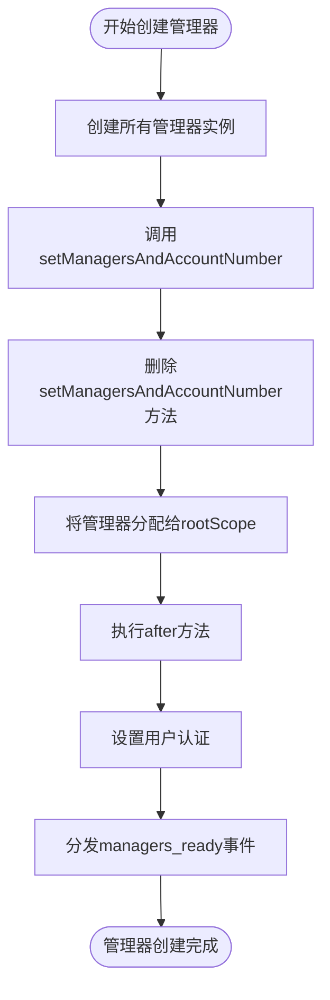
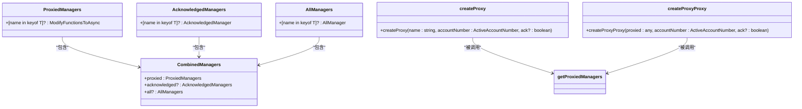
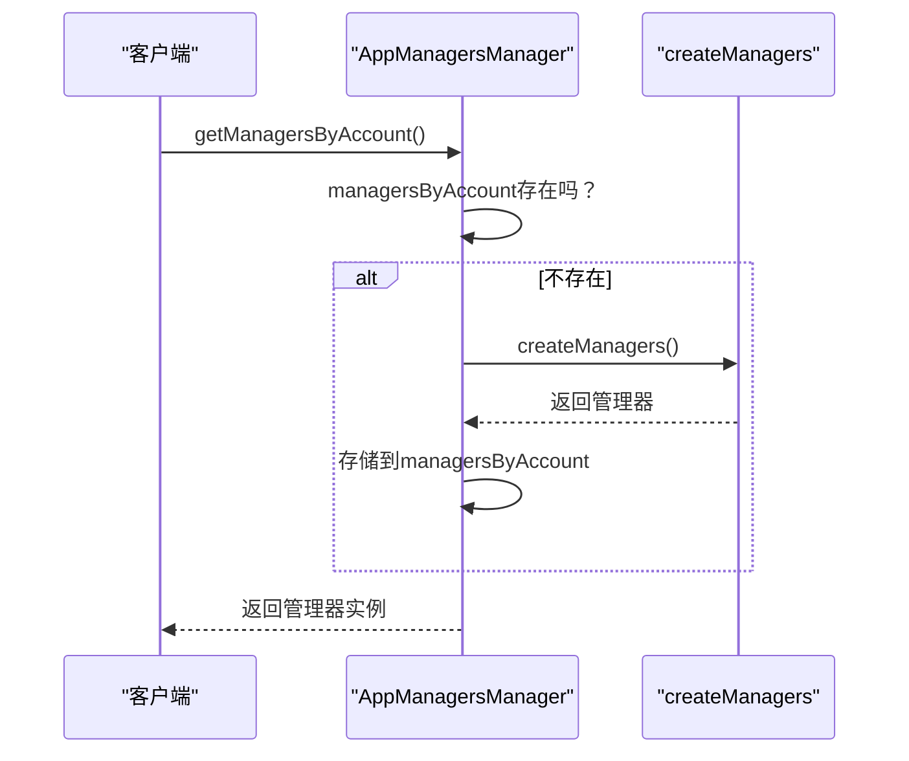
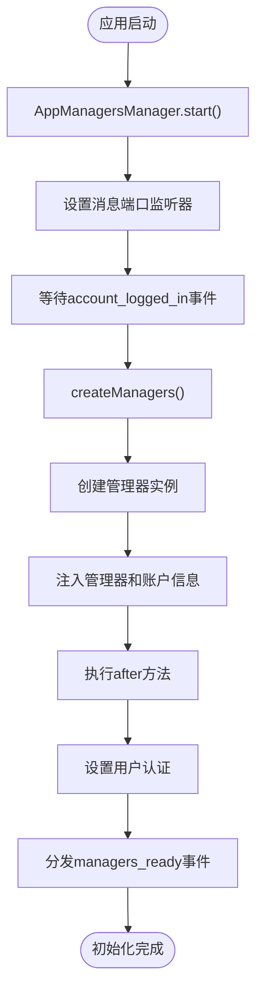
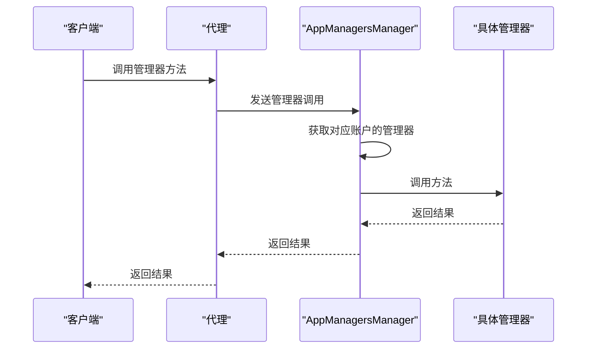
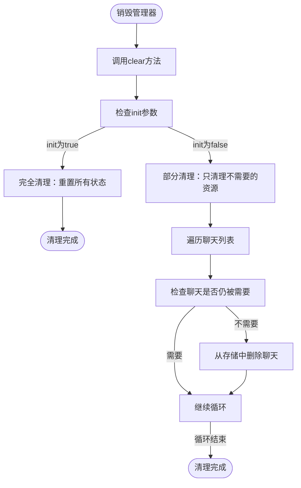
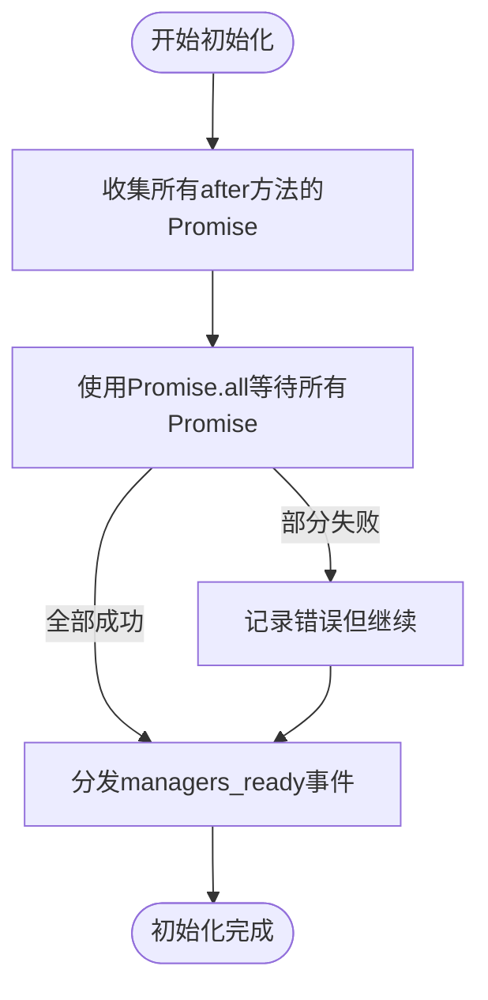

# 生命周期管理

<cite>
**本文档引用的文件**  
- [createManagers.ts](file://src/lib/appManagers/createManagers.ts)
- [getProxiedManagers.ts](file://src/lib/appManagers/getProxiedManagers.ts)
- [appManagersManager.ts](file://src/lib/appManagers/appManagersManager.ts)
- [manager.ts](file://src/lib/appManagers/manager.ts)
- [appStateManager.ts](file://src/lib/appManagers/appStateManager.ts)
- [appStoragesManager.ts](file://src/lib/appManagers/appStoragesManager.ts)
- [appUsersManager.ts](file://src/lib/appManagers/appUsersManager.ts)
- [appChatsManager.ts](file://src/lib/appManagers/appChatsManager.ts)
</cite>

## 目录
1. [生命周期管理概述](#生命周期管理概述)
2. [管理器创建与注册机制](#管理器创建与注册机制)
3. [管理器代理实现原理](#管理器代理实现原理)
4. [管理器生命周期协调策略](#管理器生命周期协调策略)
5. [初始化过程](#初始化过程)
6. [运行时管理](#运行时管理)
7. [销毁与资源清理](#销毁与资源清理)
8. [错误处理与恢复策略](#错误处理与恢复策略)
9. [生命周期管理对应用稳定性的影响](#生命周期管理对应用稳定性的影响)

## 生命周期管理概述

tweb项目中的管理器生命周期管理是一个复杂的系统，负责协调和管理应用中各种功能模块的创建、初始化、运行和销毁过程。该系统通过三个核心文件——createManagers.ts、getProxiedManagers.ts和appManagersManager.ts——实现对管理器的完整生命周期控制。管理器生命周期管理确保了应用在启动时能够正确初始化所有必要的组件，在运行时能够高效处理数据同步和状态更新，并在应用关闭或切换时进行适当的资源清理和状态保存。

**Section sources**
- [createManagers.ts](file://src/lib/appManagers/createManagers.ts)
- [getProxiedManagers.ts](file://src/lib/appManagers/getProxiedManagers.ts)
- [appManagersManager.ts](file://src/lib/appManagers/appManagersManager.ts)

## 管理器创建与注册机制

管理器的创建和注册主要在createManagers.ts文件中实现。该文件定义了一个createManagers函数，该函数负责创建和初始化所有管理器实例。函数接收appStoragesManager、stateManager、accountNumber和userId作为参数，并返回一个包含所有管理器实例的对象。

createManagers函数首先创建所有管理器的实例，并将它们存储在一个对象中。然后，它遍历所有管理器，调用它们的setManagersAndAccountNumber方法，将所有管理器和账户编号传递给每个管理器实例。这使得每个管理器都能够访问其他管理器和账户信息。

**Diagram sources**
- [createManagers.ts](file://src/lib/appManagers/createManagers.ts#L73-L183)

**Section sources**
- [createManagers.ts](file://src/lib/appManagers/createManagers.ts#L67-L183)

## 管理器代理实现原理

管理器代理的实现主要在getProxiedManagers.ts文件中。该文件通过Proxy对象为管理器提供远程调用能力，使得管理器可以在不同的执行上下文中被调用。

getProxiedManagers函数创建了一个代理系统，该系统通过apiManagerProxy.invoke方法将管理器调用转发到适当的执行上下文。代理系统支持三种类型的调用：普通调用、确认调用（acknowledged）和全局调用（all）。普通调用直接转发到指定账户的管理器，确认调用会等待响应确认，而全局调用则会在所有账户的管理器上执行。

**Diagram sources**
- [getProxiedManagers.ts](file://src/lib/appManagers/getProxiedManagers.ts#L80-L174)

**Section sources**
- [getProxiedManagers.ts](file://src/lib/appManagers/getProxiedManagers.ts#L73-L174)

## 管理器生命周期协调策略

管理器生命周期的协调主要由appManagersManager.ts文件中的AppManagersManager类负责。该类是管理器生命周期的中央协调器，负责管理所有账户的管理器实例。

AppManagersManager类维护一个managersByAccount对象，该对象按账户编号存储管理器实例。当需要获取管理器时，它会延迟创建管理器实例，只有在第一次请求时才实际创建。这种延迟加载策略有助于提高应用启动性能。

**Diagram sources**
- [appManagersManager.ts](file://src/lib/appManagers/appManagersManager.ts#L30-L243)

**Section sources**
- [appManagersManager.ts](file://src/lib/appManagers/appManagersManager.ts#L30-L243)

## 初始化过程

管理器的初始化过程从AppManagersManager的start方法开始。该方法设置消息端口监听器，用于处理管理器调用和加密端口连接。当收到account_logged_in事件时，它会确保同一用户不会在多个账户中同时登录。

管理器的实际创建发生在createManagers函数中。该函数首先创建所有管理器实例，然后调用它们的setManagersAndAccountNumber方法，将所有管理器和账户信息注入到每个管理器中。最后，它调用每个管理器的after方法，完成初始化过程。

**Diagram sources**
- [appManagersManager.ts](file://src/lib/appManagers/appManagersManager.ts#L71-L134)
- [createManagers.ts](file://src/lib/appManagers/createManagers.ts#L67-L183)

**Section sources**
- [appManagersManager.ts](file://src/lib/appManagers/appManagersManager.ts#L71-L134)
- [createManagers.ts](file://src/lib/appManagers/createManagers.ts#L67-L183)

## 运行时管理

在运行时，管理器通过代理系统进行调用。当需要调用管理器方法时，调用会被转发到AppManagersManager的消息端口监听器。监听器根据账户编号找到相应的管理器实例，并调用相应的方法。

对于需要在所有账户上执行的方法，系统会遍历所有账户的管理器实例，并收集所有结果。这种机制确保了跨账户操作的一致性。

**Diagram sources**
- [appManagersManager.ts](file://src/lib/appManagers/appManagersManager.ts#L74-L93)
- [getProxiedManagers.ts](file://src/lib/appManagers/getProxiedManagers.ts#L95-L112)

**Section sources**
- [appManagersManager.ts](file://src/lib/appManagers/appManagersManager.ts#L74-L93)
- [getProxiedManagers.ts](file://src/lib/appManagers/getProxiedManagers.ts#L95-L112)

## 销毁与资源清理

管理器的销毁和资源清理主要通过clear方法实现。每个管理器都有一个clear方法，该方法负责清理管理器的内部状态和资源。

在appUsersManager.ts和appChatsManager.ts等具体管理器实现中，clear方法会根据init参数决定清理的深度。如果init为true，则进行完全清理，重置所有状态；否则进行部分清理，只清理不再需要的资源。

**Diagram sources**
- [appUsersManager.ts](file://src/lib/appManagers/appUsersManager.ts#L69-L90)
- [appChatsManager.ts](file://src/lib/appManagers/appChatsManager.ts#L108-L125)

**Section sources**
- [appUsersManager.ts](file://src/lib/appManagers/appUsersManager.ts#L69-L90)
- [appChatsManager.ts](file://src/lib/appManagers/appChatsManager.ts#L108-L125)

## 错误处理与恢复策略

生命周期管理中的错误处理主要通过Promise机制实现。在createManagers函数中，所有after方法的调用结果都被收集到一个promises数组中，然后使用Promise.all等待所有初始化完成。

如果某个管理器的初始化失败，整个初始化过程会失败，但系统会尝试继续执行其他管理器的初始化。这种策略确保了即使部分功能不可用，应用的其他部分仍能正常工作。

**Diagram sources**
- [createManagers.ts](file://src/lib/appManagers/createManagers.ts#L150-L182)

**Section sources**
- [createManagers.ts](file://src/lib/appManagers/createManagers.ts#L150-L182)

## 生命周期管理对应用稳定性的影响

生命周期管理机制对应用的稳定性有重要影响。通过集中管理所有管理器的创建、初始化和销毁，系统确保了资源的有效利用和状态的一致性。

延迟加载策略减少了应用启动时的资源消耗，提高了启动速度。代理机制使得管理器可以在不同的执行上下文中被安全调用，增强了系统的模块化和可维护性。统一的错误处理机制确保了即使部分功能失败，应用的其他部分仍能正常工作。

这些机制共同作用，确保了tweb应用在各种使用场景下的稳定性和可靠性。

**Section sources**
- [createManagers.ts](file://src/lib/appManagers/createManagers.ts)
- [getProxiedManagers.ts](file://src/lib/appManagers/getProxiedManagers.ts)
- [appManagersManager.ts](file://src/lib/appManagers/appManagersManager.ts)