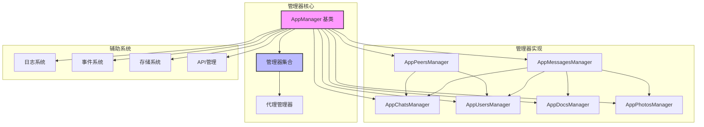
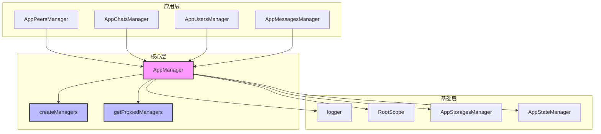
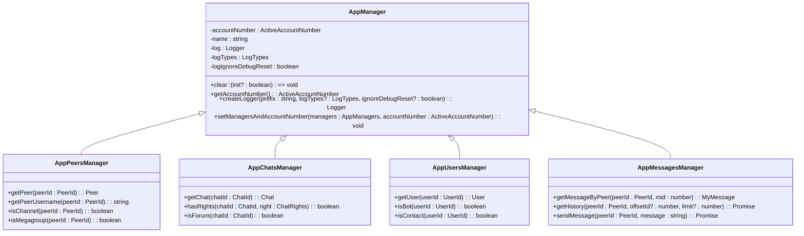
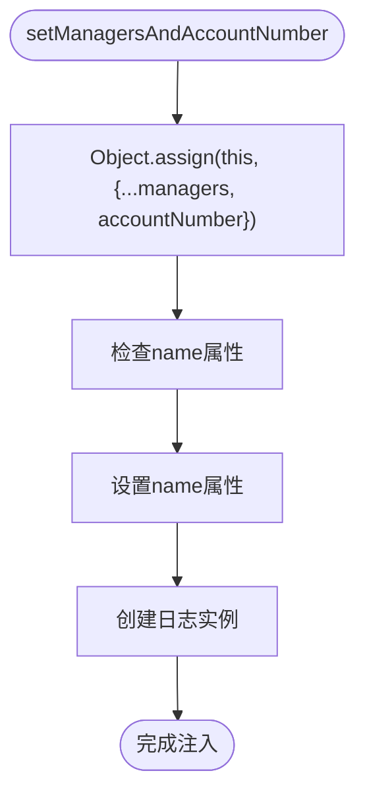
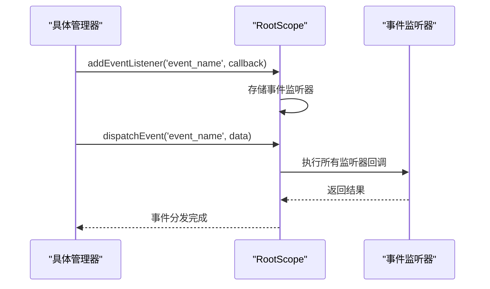
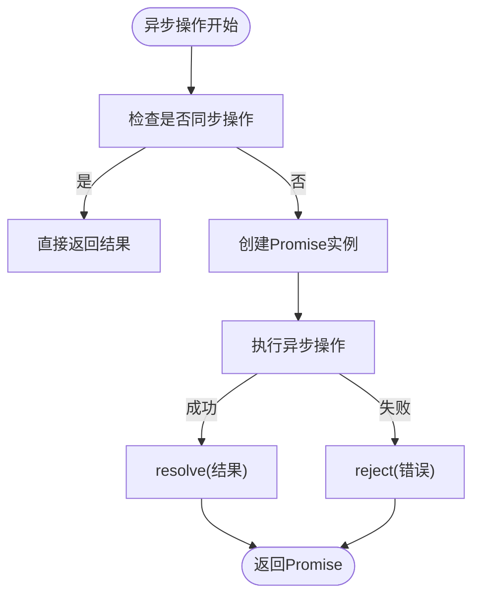
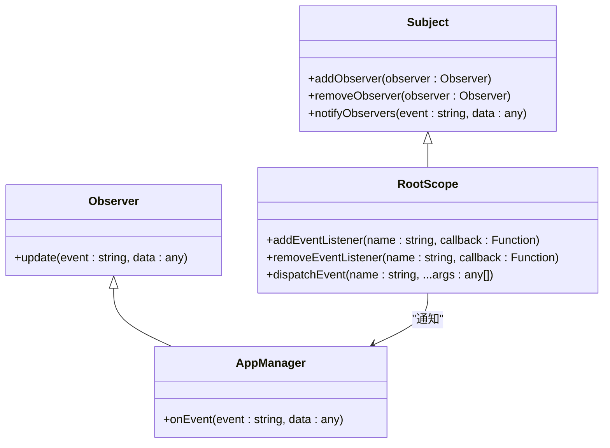
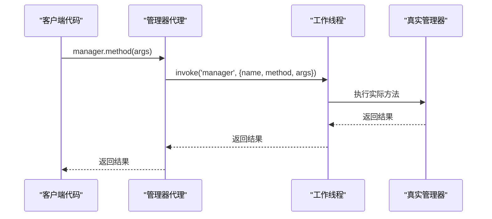
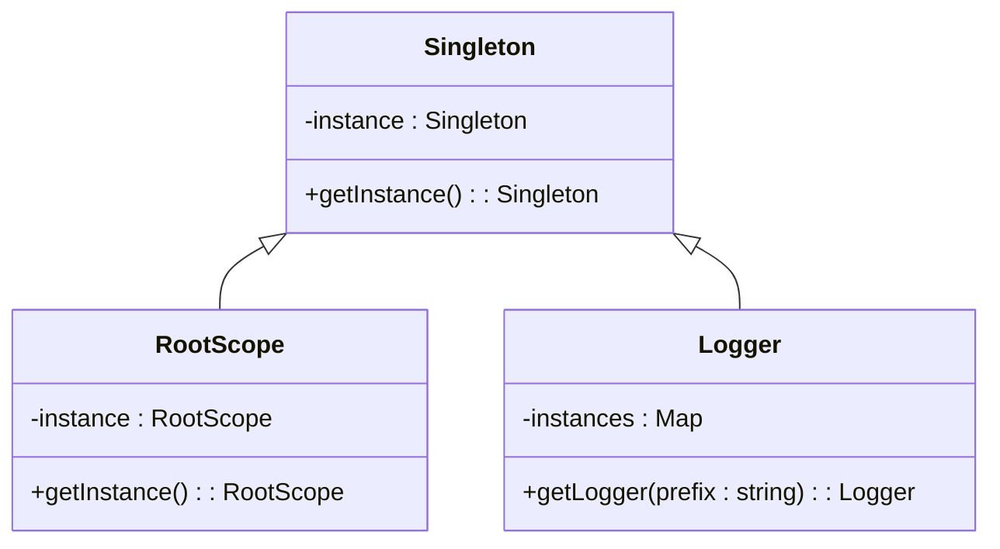

# 管理器基类架构

<cite>
**本文档引用的文件**  
- [manager.ts](file://src/lib/appManagers/manager.ts)
- [managers.d.ts](file://src/lib/appManagers/managers.d.ts)
- [getProxiedManagers.ts](file://src/lib/appManagers/getProxiedManagers.ts)
- [createManagers.ts](file://src/lib/appManagers/createManagers.ts)
- [appPeersManager.ts](file://src/lib/appManagers/appPeersManager.ts)
- [logger.ts](file://src/lib/logger.ts)
- [rootScope.ts](file://src/lib/rootScope.ts)
- [eventListenerBase.ts](file://src/helpers/eventListenerBase.ts)
- [appMessagesManager.ts](file://src/lib/appManagers/appMessagesManager.ts)
- [appChatsManager.ts](file://src/lib/appManagers/appChatsManager.ts)
- [appUsersManager.ts](file://src/lib/appManagers/appUsersManager.ts)
</cite>

## 目录
1. [简介](#简介)
2. [项目结构](#项目结构)
3. [核心组件](#核心组件)
4. [架构概述](#架构概述)
5. [详细组件分析](#详细组件分析)
6. [依赖分析](#依赖分析)
7. [性能考虑](#性能考虑)
8. [故障排除指南](#故障排除指南)
9. [结论](#结论)

## 简介
tweb项目中的管理器基类架构是整个应用的核心基础，它通过`AppManager`类为所有具体管理器提供统一的接口和基础功能。该架构设计精巧，采用了多种设计模式，包括观察者模式、代理模式和单例模式，确保了系统的可维护性和扩展性。基类通过依赖注入机制将所有管理器实例连接在一起，形成一个完整的管理器网络。状态管理、事件分发和异步操作处理是该架构的三大核心功能，它们共同支撑着整个应用的运行。

## 项目结构
tweb项目的管理器系统位于`src/lib/appManagers`目录下，形成了一个完整的管理器生态系统。该系统通过基类`AppManager`和一系列具体管理器实现，构建了一个层次分明、职责清晰的架构体系。

**Diagram sources**
- [manager.ts](file://src/lib/appManagers/manager.ts)
- [createManagers.ts](file://src/lib/appManagers/createManagers.ts)

**Section sources**
- [manager.ts](file://src/lib/appManagers/manager.ts)
- [createManagers.ts](file://src/lib/appManagers/createManagers.ts)

## 核心组件
管理器基类架构的核心组件包括`AppManager`基类、管理器创建系统、代理系统和事件分发系统。`AppManager`基类定义了所有管理器的公共接口和基础功能，包括状态存储、事件监听和日志记录。管理器创建系统通过`createManagers`函数实例化所有管理器，并通过`setManagersAndAccountNumber`方法将它们注入到基类中。代理系统通过`getProxiedManagers`函数创建管理器代理，实现了跨工作线程的通信。事件分发系统基于`RootScope`类，实现了全局事件的订阅和发布机制。

**Section sources**
- [manager.ts](file://src/lib/appManagers/manager.ts)
- [createManagers.ts](file://src/lib/appManagers/createManagers.ts)
- [getProxiedManagers.ts](file://src/lib/appManagers/getProxiedManagers.ts)
- [rootScope.ts](file://src/lib/rootScope.ts)

## 架构概述
tweb管理器基类架构采用分层设计，从下到上分为基础层、核心层和应用层。基础层包括日志系统、事件系统和存储系统，为核心层提供基础服务。核心层由`AppManager`基类和管理器创建系统组成，定义了所有管理器的公共接口和行为规范。应用层由各种具体管理器实现，如`AppPeersManager`、`AppChatsManager`等，它们继承基类并实现特定业务逻辑。

**Diagram sources**
- [manager.ts](file://src/lib/appManagers/manager.ts)
- [createManagers.ts](file://src/lib/appManagers/createManagers.ts)
- [getProxiedManagers.ts](file://src/lib/appManagers/getProxiedManagers.ts)
- [logger.ts](file://src/lib/logger.ts)
- [rootScope.ts](file://src/lib/rootScope.ts)

## 详细组件分析

### AppManager 基类分析
`AppManager`基类是整个管理器系统的基石，它通过属性和方法为所有具体管理器提供了统一的接口和基础功能。基类的设计体现了面向对象编程的三大特性：封装、继承和多态。

#### 类图

**Diagram sources**
- [manager.ts](file://src/lib/appManagers/manager.ts)
- [appPeersManager.ts](file://src/lib/appManagers/appPeersManager.ts)
- [appChatsManager.ts](file://src/lib/appManagers/appChatsManager.ts)
- [appUsersManager.ts](file://src/lib/appManagers/appUsersManager.ts)
- [appMessagesManager.ts](file://src/lib/appManagers/appMessagesManager.ts)

#### 状态管理机制
`AppManager`基类通过依赖注入的方式管理状态，将所有相关管理器实例作为属性存储在基类中。这种设计模式实现了状态的集中管理和共享，避免了状态的重复和不一致。基类在`setManagersAndAccountNumber`方法中使用`Object.assign`将管理器实例批量注入到自身属性中，实现了高效的依赖注入。

**Diagram sources**
- [manager.ts](file://src/lib/appManagers/manager.ts)

#### 事件分发系统
事件分发系统基于`RootScope`类实现，采用了观察者设计模式。`RootScope`类继承自`EventListenerBase`，提供了事件订阅、发布和取消的功能。所有管理器都可以通过`rootScope`实例订阅全局事件，实现了组件间的松耦合通信。

**Diagram sources**
- [rootScope.ts](file://src/lib/rootScope.ts)
- [eventListenerBase.ts](file://src/helpers/eventListenerBase.ts)

#### 异步操作处理模式
管理器基类通过Promise和async/await模式处理异步操作，确保了非阻塞的执行流程。基类本身不直接处理异步操作，而是为具体管理器提供了处理异步操作的基础环境。具体管理器可以重写基类方法，实现异步逻辑。

**Diagram sources**
- [appMessagesManager.ts](file://src/lib/appManagers/appMessagesManager.ts)

### 设计模式应用
管理器基类架构中应用了多种设计模式，这些模式共同构建了一个灵活、可扩展的系统。

#### 观察者模式
观察者模式在事件分发系统中得到了充分体现。`RootScope`作为被观察者（Subject），管理着所有事件监听器；各个管理器作为观察者（Observer），订阅感兴趣的事件。当事件发生时，`RootScope`会通知所有订阅该事件的观察者。

**Diagram sources**
- [rootScope.ts](file://src/lib/rootScope.ts)
- [eventListenerBase.ts](file://src/helpers/eventListenerBase.ts)

#### 代理模式
代理模式在跨工作线程通信中得到了应用。`getProxiedManagers`函数创建了管理器代理，这些代理拦截对管理器方法的调用，并通过`apiManagerProxy.invoke`将调用转发到工作线程中的实际管理器实例。

**Diagram sources**
- [getProxiedManagers.ts](file://src/lib/appManagers/getProxiedManagers.ts)

#### 单例模式
单例模式在`RootScope`和`logger`系统中得到了应用。`RootScope`实例在整个应用中只有一个，通过`export default rootScope`导出，确保了全局事件系统的唯一性。日志系统通过`logger`函数的缓存机制实现了单例模式，相同前缀的日志实例只会创建一次。

**Diagram sources**
- [rootScope.ts](file://src/lib/rootScope.ts)
- [logger.ts](file://src/lib/logger.ts)

**Section sources**
- [manager.ts](file://src/lib/appManagers/manager.ts)
- [getProxiedManagers.ts](file://src/lib/appManagers/getProxiedManagers.ts)
- [createManagers.ts](file://src/lib/appManagers/createManagers.ts)
- [logger.ts](file://src/lib/logger.ts)
- [rootScope.ts](file://src/lib/rootScope.ts)
- [eventListenerBase.ts](file://src/helpers/eventListenerBase.ts)

## 依赖分析
管理器基类架构的依赖关系复杂而有序，形成了一个完整的依赖网络。基类`AppManager`依赖于所有具体管理器，而具体管理器之间也存在相互依赖关系。

```mermaid
graph TD
AM[AppManager] --> APM[AppPeersManager]
AM --> ACM[AppChatsManager]
AM --> AUM[AppUsersManager]
AM --> AMM[AppMessagesManager]
AM --> ADM[AppDocsManager]
AM --> APM2[AppPhotosManager]
AM --> AU[apiUpdatesManager]
AM --> AV[appAvatarsManager]
AM --> AGC[appGroupCallsManager]
AM --> AC[appCallsManager]
AM --> AR[appReactionsManager]
AM --> AMI[appMessagesIdsManager]
AM --> AP[appPrivacyManager]
AM --> AI[appInlineBotsManager]
AM --> AS[appStickersManager]
AM --> AL[appLangPackManager]
AM --> RD[referenceDatabase]
AM --> AE[appEmojiManager]
AM --> DS[dialogsStorage]
AM --> FS[filtersStorage]
AM --> API[apiManager]
AM --> CW[cryptoWorker]
AM --> PM[passwordManager]
AM --> AFM[apiFileManager]
AM --> PS[peersStorage]
AM --> TS[thumbsStorage]
AM --> NF[networkerFactory]
AM --> RS[rootScope]
AM --> AUZ[authorizer]
AM --> DC[dcConfigurator]
AM --> TM[timeManager]
AM --> ASM[appStoragesManager]
AM --> ASM2[appStateManager]
AM --> AWM[appWebDocsManager]
AM --> APM3[appPaymentsManager]
APM --> ACM
APM --> AUM
ACM --> AUM
AMM --> ACM
AMM --> AUM
AMM --> ADM
AMM --> APM2
style AM fill:#f9f,stroke:#333,stroke-width:2px
```

**Diagram sources**
- [manager.ts](file://src/lib/appManagers/manager.ts)
- [createManagers.ts](file://src/lib/appManagers/createManagers.ts)

## 性能考虑
管理器基类架构在设计时充分考虑了性能因素。通过延迟加载、缓存机制和批量操作等策略，优化了系统的运行效率。例如，`AppPeersManager`中的`mirrorAllPeers`方法通过批量传输所有对等体数据，减少了通信开销。日志系统通过`DEBUG`标志控制日志级别，在生产环境中可以关闭调试日志，提高性能。

## 故障排除指南
在使用管理器基类时，可能会遇到一些常见问题。以下是故障排除指南：

1. **管理器未正确注入**：确保在调用`setManagersAndAccountNumber`方法前，所有管理器实例都已创建。
2. **事件监听器未触发**：检查事件名称是否正确，确保监听器在事件触发前已注册。
3. **异步操作超时**：检查网络连接和API端点，确保工作线程正常运行。
4. **状态不一致**：确保所有状态变更都通过正确的管理器方法进行，避免直接修改状态。

**Section sources**
- [manager.ts](file://src/lib/appManagers/manager.ts)
- [appPeersManager.ts](file://src/lib/appManagers/appPeersManager.ts)
- [appChatsManager.ts](file://src/lib/appManagers/appChatsManager.ts)
- [appUsersManager.ts](file://src/lib/appManagers/appUsersManager.ts)

## 结论
tweb项目管理器基类架构是一个精心设计的系统，它通过`AppManager`基类为所有具体管理器提供了统一的接口和基础功能。该架构采用了多种设计模式，包括观察者模式、代理模式和单例模式，确保了系统的可维护性和扩展性。状态管理、事件分发和异步操作处理是该架构的三大核心功能，它们共同支撑着整个应用的运行。通过依赖注入机制，所有管理器实例被有效地组织在一起，形成了一个完整的管理器网络。这种设计不仅提高了代码的复用性，还增强了系统的灵活性和可测试性。