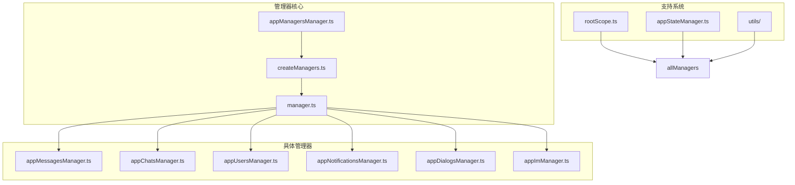
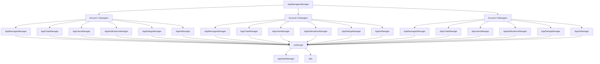
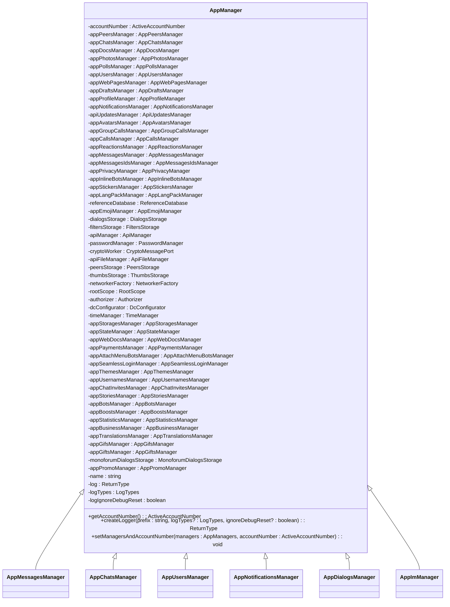
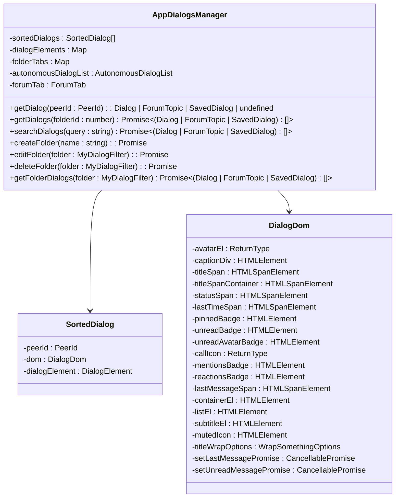
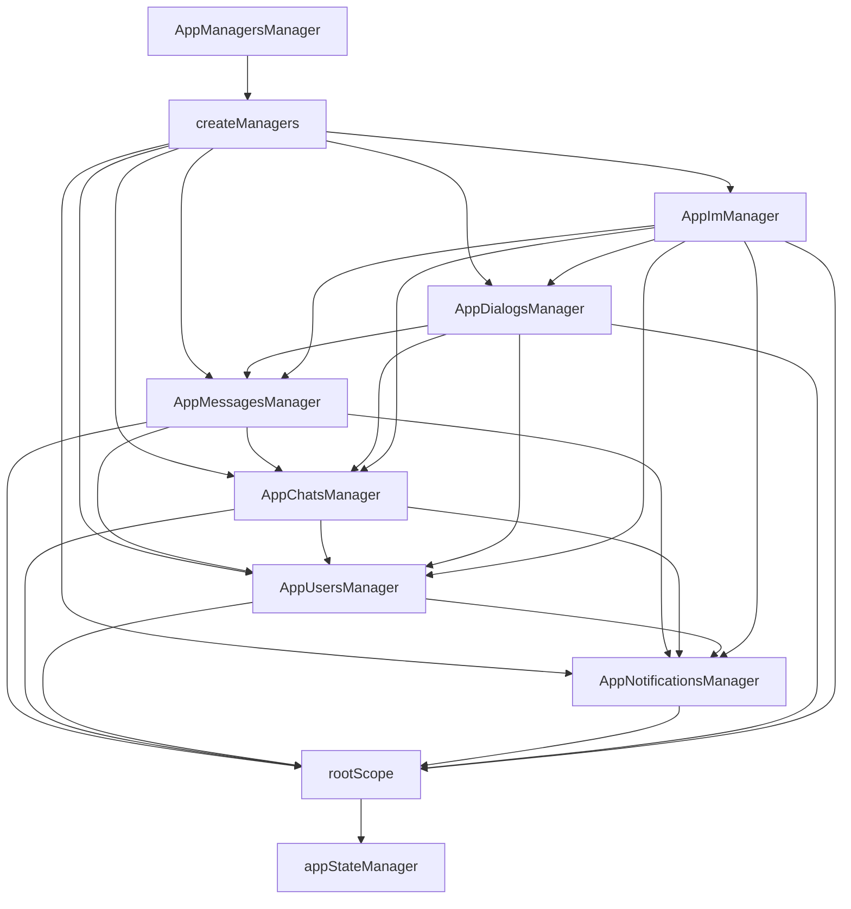

# 管理器设计模式

<cite>
**本文档引用的文件**   
- [manager.ts](file://src/lib/appManagers/manager.ts)
- [appMessagesManager.ts](file://src/lib/appManagers/appMessagesManager.ts)
- [appChatsManager.ts](file://src/lib/appManagers/appChatsManager.ts)
- [appUsersManager.ts](file://src/lib/appManagers/appUsersManager.ts)
- [createManagers.ts](file://src/lib/appManagers/createManagers.ts)
- [appManagersManager.ts](file://src/lib/appManagers/appManagersManager.ts)
- [rootScope.ts](file://src/lib/rootScope.ts)
- [appStateManager.ts](file://src/lib/appManagers/appStateManager.ts)
- [appNotificationsManager.ts](file://src/lib/appManagers/appNotificationsManager.ts)
- [appDialogsManager.ts](file://src/lib/appManagers/appDialogsManager.ts)
- [appImManager.ts](file://src/lib/appManagers/appImManager.ts)
- [utils/chats/slicedCachedFetcher.ts](file://src/lib/appManagers/utils/chats/slicedCachedFetcher.ts)
</cite>

## 目录
1. [简介](#简介)
2. [项目结构](#项目结构)
3. [核心组件](#核心组件)
4. [架构概述](#架构概述)
5. [详细组件分析](#详细组件分析)
6. [依赖关系分析](#依赖关系分析)
7. [性能考虑](#性能考虑)
8. [故障排除指南](#故障排除指南)
9. [结论](#结论)

## 简介
tweb项目采用了一种基于管理器（Manager）模式的架构设计，该设计模式通过将应用程序的不同功能模块化为独立的管理器类，实现了高内聚、低耦合的系统结构。每个管理器负责特定领域的业务逻辑，如用户管理、聊天管理、消息处理等。这种设计不仅提高了代码的可维护性和可扩展性，还便于团队协作开发。管理器基类（AppManager）提供了统一的初始化、状态管理和事件分发机制，确保了所有管理器的一致性和协调性。通过事件系统和依赖注入，管理器之间能够松耦合地通信和协作，支持复杂的业务流程和异步操作处理。

## 项目结构
tweb项目的管理器相关代码主要位于`src/lib/appManagers`目录下，该目录包含了所有管理器的实现文件和工具函数。项目采用模块化设计，将不同的功能划分为独立的管理器，每个管理器负责特定的业务领域。管理器基类`manager.ts`定义了所有管理器的公共接口和基础功能，如状态管理、日志记录和依赖注入。具体的管理器实现，如`appMessagesManager.ts`、`appChatsManager.ts`和`appUsersManager.ts`，继承自基类并实现了各自领域的业务逻辑。此外，`createManagers.ts`文件负责管理器的创建和初始化，`appManagersManager.ts`协调多个账户的管理器实例，`rootScope.ts`提供了全局事件系统，`appStateManager.ts`处理应用状态的持久化。



**Diagram sources**
- [manager.ts](file://src/lib/appManagers/manager.ts)
- [createManagers.ts](file://src/lib/appManagers/createManagers.ts)
- [appManagersManager.ts](file://src/lib/appManagers/appManagersManager.ts)

**Section sources**
- [manager.ts](file://src/lib/appManagers/manager.ts)
- [createManagers.ts](file://src/lib/appManagers/createManagers.ts)
- [appManagersManager.ts](file://src/lib/appManagers/appManagersManager.ts)

## 核心组件
tweb项目的核心组件是基于管理器模式构建的，每个管理器负责特定的业务领域。管理器基类`AppManager`定义了所有管理器的公共接口和基础功能，包括依赖注入、日志记录和生命周期管理。`appMessagesManager`负责消息的发送、接收和存储，`appChatsManager`管理聊天会话和群组信息，`appUsersManager`处理用户数据和联系人列表，`appNotificationsManager`管理通知设置和状态，`appDialogsManager`负责对话列表的显示和交互，`appImManager`处理即时消息界面的逻辑。这些管理器通过事件系统和依赖注入相互协作，形成了一个松耦合、高内聚的应用架构。

**Section sources**
- [manager.ts](file://src/lib/appManagers/manager.ts)
- [appMessagesManager.ts](file://src/lib/appManagers/appMessagesManager.ts)
- [appChatsManager.ts](file://src/lib/appManagers/appChatsManager.ts)
- [appUsersManager.ts](file://src/lib/appManagers/appUsersManager.ts)
- [appNotificationsManager.ts](file://src/lib/appManagers/appNotificationsManager.ts)
- [appDialogsManager.ts](file://src/lib/appManagers/appDialogsManager.ts)
- [appImManager.ts](file://src/lib/appManagers/appImManager.ts)

## 架构概述
tweb项目的管理器架构采用分层设计，顶层是管理器协调器`AppManagersManager`，负责管理多个账户的管理器实例。中间层是具体的管理器实现，每个管理器继承自`AppManager`基类，实现了特定领域的业务逻辑。底层是支持系统，包括事件系统`rootScope`、状态管理`appStateManager`和工具函数库`utils`。管理器之间通过依赖注入获取所需的其他管理器实例，通过事件系统进行松耦合通信。这种架构设计使得系统具有良好的可扩展性和可维护性，新的功能可以通过添加新的管理器来实现，而不会影响现有代码。



**Diagram sources**
- [appManagersManager.ts](file://src/lib/appManagers/appManagersManager.ts)
- [manager.ts](file://src/lib/appManagers/manager.ts)
- [rootScope.ts](file://src/lib/rootScope.ts)
- [appStateManager.ts](file://src/lib/appManagers/appStateManager.ts)

## 详细组件分析

### 管理器基类分析
管理器基类`AppManager`是所有具体管理器的父类，它定义了管理器的基本结构和公共功能。基类通过`setManagersAndAccountNumber`方法实现依赖注入，将所有管理器实例和账户信息注入到每个管理器中，使得管理器可以方便地访问其他管理器的功能。基类还提供了日志记录功能，通过`createLogger`方法为每个管理器创建独立的日志实例。`after`方法用于管理器的初始化，通常在所有依赖注入完成后调用，确保管理器可以正确地设置事件监听器和加载初始数据。



**Diagram sources**
- [manager.ts](file://src/lib/appManagers/manager.ts)

**Section sources**
- [manager.ts](file://src/lib/appManagers/manager.ts)

### 消息管理器分析
`appMessagesManager`是负责消息处理的核心管理器，它管理消息的发送、接收、存储和显示。该管理器通过`HistoryStorage`类管理不同类型的聊天历史，包括普通聊天、主题聊天和保存的对话。`HistoryStorage`使用`SlicedArray`来高效地处理大量消息数据，支持分页加载和搜索功能。管理器还实现了消息的异步操作处理，如消息发送、编辑和删除，通过事件系统通知UI层更新界面。`appMessagesManager`与其他管理器紧密协作，如`appChatsManager`获取聊天信息，`appUsersManager`获取用户信息，`appNotificationsManager`处理通知设置。

```mermaid
classDiagram
class AppMessagesManager {
-storage : AppStoragesManager['storages']['messages']
-messages : Map<number, Message.message | Message.messageService>
-historyStorages : Map<HistoryStorageKey, HistoryStorage>
-pinnedStorages : Map<PeerId, PinnedStorage>
-paidMessagesQueue : PaidMessagesQueue
+saveApiMessage(message : Message.message | Message.messageService) : void
+saveApiMessages(messages : (Message.message | Message.messageService)[]) : void
+getHistory(storageKey : HistoryStorageKey, options : RequestHistoryOptions) : Promise<HistoryResult>
+sendMessage(peerId : PeerId, message : string, entities? : MessageEntity[]) : Promise<number>
+editMessage(peerId : PeerId, mid : number, message : string, entities? : MessageEntity[]) : Promise<void>
+deleteMessages(peerId : PeerId, mids : number[]) : Promise<void>
+markMessagesRead(peerId : PeerId, mids : number[]) : Promise<void>
}
class HistoryStorage {
-_maxId : number
-count : number | null
-history : SlicedArray<number>
-searchHistory : SlicedArray<`${PeerId}_${number}`>
-maxId : number
-readPromise : Promise<void>
-readMaxId : number
-readOutboxMaxId : number
-triedToReadMaxId : number
-maxOutId : number
-replyMarkup : Exclude<ReplyMarkup, ReplyMarkup.replyInlineMarkup>
-type : 'history' | 'replies' | 'search'
-key : HistoryStorageKey
-wasFetched : boolean
-channelJoinedMid : number
-originalInsertSlice : SlicedArray<number>['insertSlice']
-filterMessages : (messages : MyMessage[]) => MyMessage[]
-filterMessage : (message : MyMessage) => boolean
-onMidInsertion : (mid : number) => void
-nextRate : number
}
class PaidMessagesQueue {
-queue : Map<PeerId, {message : MyMessage, resolve : (result : ConfirmedPaymentResult) => void, reject : (error : Error) => void}>
+enqueue(message : MyMessage, resolve : (result : ConfirmedPaymentResult) => void, reject : (error : Error) => void) : void
+dequeue(peerId : PeerId) : {message : MyMessage, resolve : (result : ConfirmedPaymentResult) => void, reject : (error : Error) => void} | undefined
+clear() : void
}
AppMessagesManager --> HistoryStorage
AppMessagesManager --> PaidMessagesQueue
```

**Diagram sources**
- [appMessagesManager.ts](file://src/lib/appManagers/appMessagesManager.ts)

**Section sources**
- [appMessagesManager.ts](file://src/lib/appManagers/appMessagesManager.ts)

### 聊天管理器分析
`appChatsManager`负责管理聊天会话和群组信息，包括聊天的创建、修改、删除和权限管理。该管理器通过`storage`属性管理聊天数据的持久化，使用`chats`对象存储所有聊天信息。管理器实现了聊天的异步操作处理，如创建新聊天、修改聊天信息和删除聊天，通过事件系统通知UI层更新界面。`appChatsManager`还处理聊天的权限管理，包括管理员权限、禁言权限和邀请链接权限。管理器与其他管理器紧密协作，如`appUsersManager`获取用户信息，`appMessagesManager`获取聊天消息，`appNotificationsManager`处理通知设置。

```mermaid
classDiagram
class AppChatsManager {
-storage : AppStoragesManager['storages']['chats']
-chats : {[id : ChatId] : Exclude<Chat, Chat.chatEmpty>}
-recommendations : {[chatId : ChatId] : MaybePromise<MessagesChats>}
+saveApiChat(chat : Chat, override? : boolean) : void
+saveApiChats(apiChats : any[], override? : boolean) : void
+getChat(chatId : ChatId) : Chat | undefined
+createChat(title : string, users : UserId[]) : Promise<ChatId>
+editChatTitle(chatId : ChatId, title : string) : Promise<void>
+editChatPhoto(chatId : ChatId, photo : InputChatPhoto) : Promise<void>
+deleteChat(chatId : ChatId) : Promise<void>
+toggleChatAdmin(chatId : ChatId, userId : UserId, isAdmin : boolean) : Promise<void>
+toggleChatBanned(chatId : ChatId, userId : UserId, isBanned : boolean) : Promise<void>
+getAdminLogs(args : GetAdminLogsArgs) : Promise<AdminLog[]>
}
class SlicedCachedFetcher {
-isEnd : boolean
-cachedSlices : string[][]
-cachedItemsMap : Map<string, T>
+getItems(args : GetItemsArgs<T>) : Promise<{items : T[], isStart : boolean, isEnd : boolean}>
}
AppChatsManager --> SlicedCachedFetcher
```

**Diagram sources**
- [appChatsManager.ts](file://src/lib/appManagers/appChatsManager.ts)
- [utils/chats/slicedCachedFetcher.ts](file://src/lib/appManagers/utils/chats/slicedCachedFetcher.ts)

**Section sources**
- [appChatsManager.ts](file://src/lib/appManagers/appChatsManager.ts)

### 用户管理器分析
`appUsersManager`负责管理用户数据和联系人列表，包括用户信息的获取、更新和搜索。该管理器通过`storage`属性管理用户数据的持久化，使用`users`对象存储所有用户信息。管理器实现了用户的异步操作处理，如获取用户信息、更新用户状态和搜索用户，通过事件系统通知UI层更新界面。`appUsersManager`还处理用户的联系人列表，包括添加、删除和更新联系人。管理器与其他管理器紧密协作，如`appChatsManager`获取聊天信息，`appMessagesManager`获取消息发送者信息，`appNotificationsManager`处理通知设置。

```mermaid
classDiagram
class AppUsersManager {
-storage : AppStoragesManager['storages']['users']
-users : {[userId : UserId] : User}
-usernames : {[username : string] : PeerId}
-contactsIndex : SearchIndex<UserId>
-contactsList : Set<UserId>
-updatedContactsList : boolean
-getTopPeersPromises : {[type in TopPeerType]? : Promise<MyTopPeer[]>}
-defaultEmojiStatuses : MaybePromise<AccountEmojiStatuses>
-recentEmojiStatuses : MaybePromise<AccountEmojiStatuses>
-requirementsToContactPromises : Map<UserId, CancellablePromise<RequirementToContact>>
-requirementsToContactProcessing : boolean
+saveApiUser(user : User, override? : boolean) : void
+saveApiUsers(users : User[], override? : boolean) : void
+getUser(userId : UserId) : User | undefined
+getUserName(userId : UserId) : string
+getUserStatus(userId : UserId) : UserStatus | undefined
+searchUsers(query : string) : Promise<UserId[]>
+getTopPeers(type : TopPeerType) : Promise<MyTopPeer[]>
+getDefaultEmojiStatuses() : Promise<AccountEmojiStatuses>
+getRecentEmojiStatuses() : Promise<AccountEmojiStatuses>
}
```

**Diagram sources**
- [appUsersManager.ts](file://src/lib/appManagers/appUsersManager.ts)

**Section sources**
- [appUsersManager.ts](file://src/lib/appManagers/appUsersManager.ts)

### 通知管理器分析
`appNotificationsManager`负责管理通知设置和状态，包括通知的开启/关闭、声音设置和振动设置。该管理器通过`peerSettings`对象管理每个用户的通知设置，使用`getNotifySettings`方法获取通知设置，`updateNotifySettings`方法更新通知设置。管理器实现了通知的异步操作处理，通过事件系统通知UI层更新界面。`appNotificationsManager`还处理全局通知设置，如联系人注册通知。管理器与其他管理器紧密协作，如`appUsersManager`获取用户信息，`appChatsManager`获取聊天信息，`appMessagesManager`获取消息信息。

```mermaid
classDiagram
class AppNotificationsManager {
-peerSettings : {notifyPeer : {[peerId : string] : ImSadAboutIt}, notifyUsers : ImSadAboutIt, notifyChats : ImSadAboutIt, notifyBroadcasts : ImSadAboutIt, notifyForumTopic : {[peerId_threadId : string] : ImSadAboutIt}}
-getNotifyPeerTypePromise : Promise<any>
-checkMuteUntilTimeout : number
-checkMuteUntilThrottled : () => void
-notifyContactsSignUp : Promise<boolean>
+getNotifySettings(peer : InputNotifyPeer) : ImSadAboutIt
+getNotifyPeerTypeSettings() : Promise<any>
+updateNotifySettings(peer : InputNotifyPeer, settings : InputPeerNotifySettings) : Promise<void>
+getContactSignUpNotification() : Promise<boolean>
+setContactSignUpNotification(silent : boolean) : void
}
```

**Diagram sources**
- [appNotificationsManager.ts](file://src/lib/appManagers/appNotificationsManager.ts)

**Section sources**
- [appNotificationsManager.ts](file://src/lib/appManagers/appNotificationsManager.ts)

### 对话管理器分析
`appDialogsManager`负责管理对话列表的显示和交互，包括对话的排序、过滤和搜索。该管理器通过`SortedDialog`类管理对话的排序，使用`DialogDom`对象管理对话的DOM元素。管理器实现了对话的异步操作处理，如加载对话列表、更新对话信息和搜索对话，通过事件系统通知UI层更新界面。`appDialogsManager`还处理对话的过滤和分类，支持自定义文件夹和标签。管理器与其他管理器紧密协作，如`appMessagesManager`获取消息信息，`appChatsManager`获取聊天信息，`appUsersManager`获取用户信息。



**Diagram sources**
- [appDialogsManager.ts](file://src/lib/appManagers/appDialogsManager.ts)

**Section sources**
- [appDialogsManager.ts](file://src/lib/appManagers/appDialogsManager.ts)

### 即时消息管理器分析
`appImManager`负责处理即时消息界面的逻辑，包括聊天界面的显示、消息的发送和接收、媒体的处理和用户交互。该管理器通过`Chat`类管理聊天界面，使用`PopupElement`类管理弹出窗口。管理器实现了即时消息的异步操作处理，如发送消息、接收消息和处理媒体，通过事件系统通知UI层更新界面。`appImManager`还处理用户的交互，如点击、滑动和长按，支持丰富的用户界面功能。管理器与其他管理器紧密协作，如`appMessagesManager`处理消息，`appChatsManager`处理聊天，`appUsersManager`处理用户。

```mermaid
classDiagram
class AppImManager {
-columnEl : HTMLDivElement
-chatsContainer : HTMLElement
-offline : boolean
-updateStatusInterval : number
-log : ReturnType<typeof logger>
-setPeerPromise : Promise<void>
-tabId : APP_TABS
-chats : Chat[]
-prevTab : HTMLElement
-chatsSelectTabDebounced : () => void
-backgroundPromises : {[url : string] : MaybePromise<string>}
-topbarCall : TopbarCall
-chatAudio : ChatAudio
+setPeer(options : ChatSetPeerOptions) : Promise<void>
+setInnerPeer(options : ChatSetInnerPeerOptions) : Promise<void>
+openChat(peerId : PeerId, threadId? : number) : Promise<void>
+closeChat() : Promise<void>
+sendMessage(peerId : PeerId, message : string, entities? : MessageEntity[]) : Promise<void>
+sendMedia(peerId : PeerId, media : File | Blob | MyDocument, caption? : string, entities? : MessageEntity[]) : Promise<void>
+playAudio(message : MyMessage) : void
+pauseAudio() : void
}
class Chat {
-peerId : PeerId
-threadId : number
-monoforumThreadId : PeerId
-lastMsgId : number
-lastMsgPeerId : PeerId
-startParam : string
-stack : {peerId : PeerId, mid : number, message? : Message.message, isOut? : boolean}
-commentId : number
-type : ChatType
-mediaTimestamp : number
-text : string
-entities : MessageEntity[]
-call : string | number
-isDeleting : boolean
-fromTemporaryThread : boolean
-messages : MyMessage[]
+loadHistory() : Promise<void>
+sendMessage(message : string, entities? : MessageEntity[]) : Promise<void>
+sendMedia(media : File | Blob | MyDocument, caption? : string, entities? : MessageEntity[]) : Promise<void>
+markAsRead() : Promise<void>
}
AppImManager --> Chat
```

**Diagram sources**
- [appImManager.ts](file://src/lib/appManagers/appImManager.ts)

**Section sources**
- [appImManager.ts](file://src/lib/appManagers/appImManager.ts)

## 依赖关系分析
tweb项目的管理器之间存在复杂的依赖关系，这些依赖关系通过依赖注入和事件系统实现松耦合通信。`AppManagersManager`是顶层协调器，负责创建和管理所有管理器实例。`createManagers.ts`文件负责管理器的创建和初始化，通过`setManagersAndAccountNumber`方法将所有管理器实例注入到每个管理器中。`rootScope.ts`提供了全局事件系统，管理器通过事件系统进行通信，避免了直接的依赖关系。`appStateManager.ts`负责应用状态的持久化，所有管理器通过状态管理器保存和读取状态。这种依赖关系设计使得系统具有良好的可扩展性和可维护性，新的功能可以通过添加新的管理器来实现，而不会影响现有代码。



**Diagram sources**
- [appManagersManager.ts](file://src/lib/appManagers/appManagersManager.ts)
- [createManagers.ts](file://src/lib/appManagers/createManagers.ts)
- [manager.ts](file://src/lib/appManagers/manager.ts)
- [rootScope.ts](file://src/lib/rootScope.ts)
- [appStateManager.ts](file://src/lib/appManagers/appStateManager.ts)

**Section sources**
- [appManagersManager.ts](file://src/lib/appManagers/appManagersManager.ts)
- [createManagers.ts](file://src/lib/appManagers/createManagers.ts)

## 性能考虑
tweb项目的管理器设计考虑了性能优化，通过多种技术手段提高系统的响应速度和资源利用率。首先，管理器使用懒加载和分页加载技术，只在需要时加载数据，减少初始加载时间和内存占用。其次，管理器使用缓存机制，将常用数据缓存在内存中，避免重复的网络请求和数据库查询。再次，管理器使用异步操作处理，将耗时的操作放在后台线程执行，避免阻塞UI线程。最后，管理器使用事件系统进行松耦合通信，减少直接的函数调用和对象引用，降低系统的耦合度和复杂度。这些性能优化措施使得tweb项目能够高效地处理大量数据和复杂的业务逻辑，提供流畅的用户体验。

## 故障排除指南
在使用tweb项目的管理器时，可能会遇到一些常见问题，以下是一些故障排除建议。如果管理器无法正确初始化，检查`createManagers.ts`文件中的依赖注入是否正确，确保所有管理器实例都被正确创建和注入。如果管理器之间的通信出现问题，检查`rootScope.ts`中的事件系统是否正常工作，确保事件监听器被正确注册和触发。如果数据加载缓慢，检查缓存机制是否有效，确保常用数据被正确缓存。如果UI更新不及时，检查事件系统是否正常工作，确保UI层能够及时接收到更新事件。如果遇到内存泄漏问题，检查管理器的生命周期管理，确保在不需要时正确释放资源。通过这些故障排除建议，可以快速定位和解决常见问题，确保系统的稳定运行。

**Section sources**
- [createManagers.ts](file://src/lib/appManagers/createManagers.ts)
- [rootScope.ts](file://src/lib/rootScope.ts)
- [appStateManager.ts](file://src/lib/appManagers/appStateManager.ts)

## 结论
tweb项目的管理器设计模式通过将应用程序的不同功能模块化为独立的管理器类，实现了高内聚、低耦合的系统结构。管理器基类`AppManager`提供了统一的初始化、状态管理和事件分发机制，确保了所有管理器的一致性和协调性。具体管理器如`appMessagesManager`、`appChatsManager`和`appUsersManager`继承自基类并实现了各自领域的业务逻辑。通过依赖注入和事件系统，管理器之间能够松耦合地通信和协作，支持复杂的业务流程和异步操作处理。这种设计不仅提高了代码的可维护性和可扩展性，还便于团队协作开发。通过性能优化和故障排除指南，可以确保系统的高效运行和稳定性能。总体而言，tweb项目的管理器设计模式是一种优秀的架构设计，值得在其他项目中借鉴和应用。