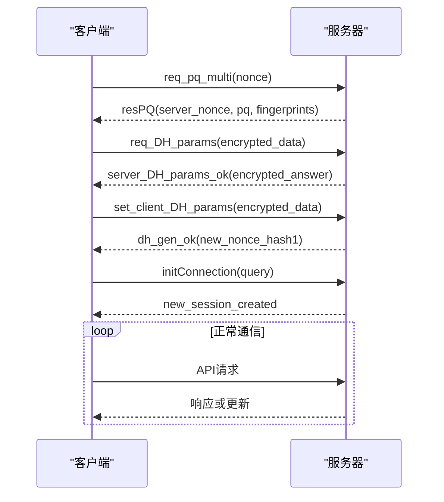
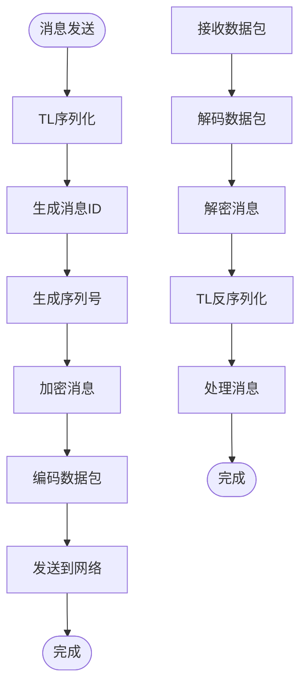
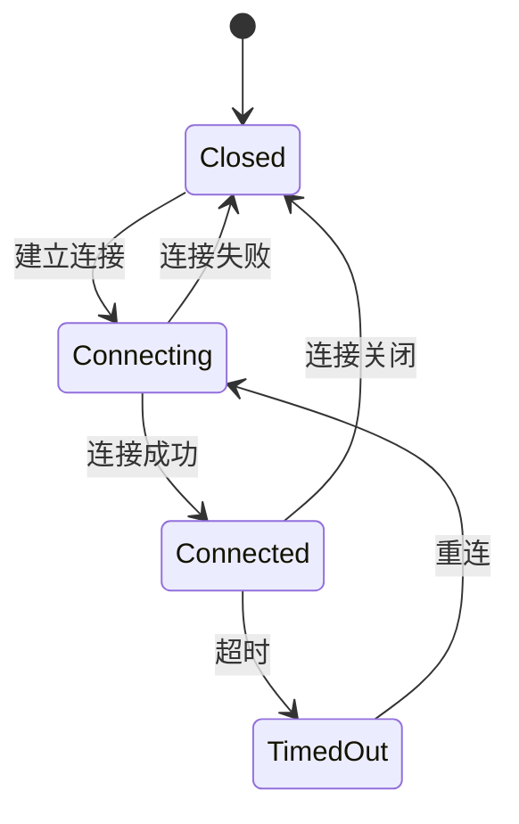
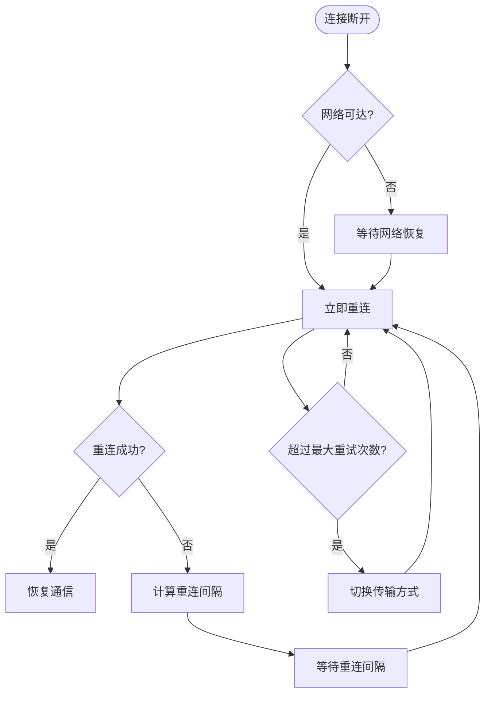
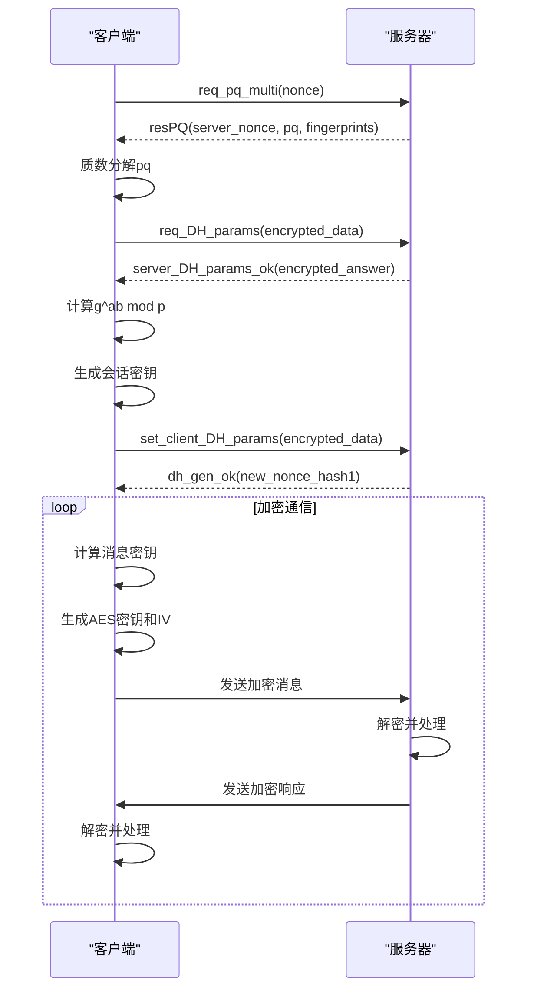
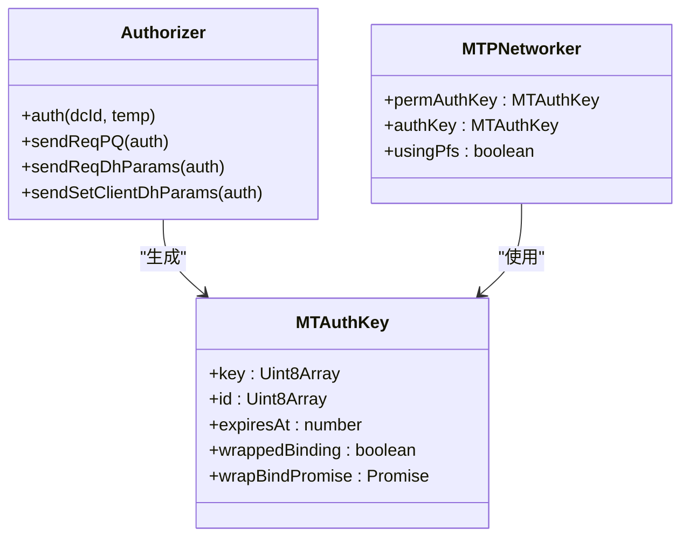
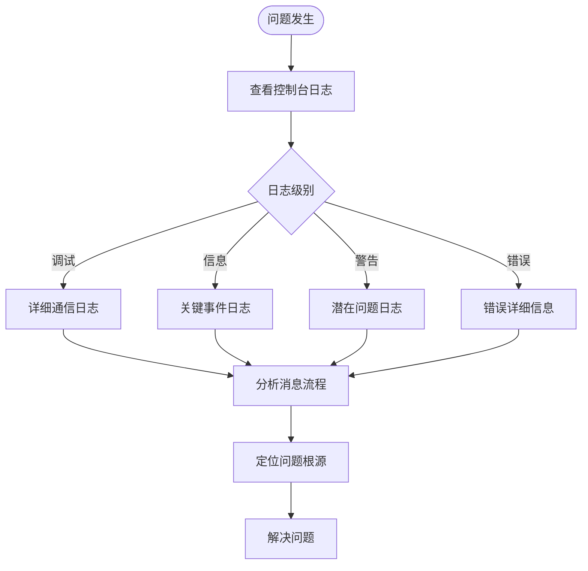

# MTProto通信

<cite>
**本文档引用的文件**   
- [networker.ts](file://src/lib/mtproto/networker.ts)
- [transport.ts](file://src/lib/mtproto/transports/transport.ts)
- [controller.ts](file://src/lib/mtproto/transports/controller.ts)
- [http.ts](file://src/lib/mtproto/transports/http.ts)
- [websocket.ts](file://src/lib/mtproto/transports/websocket.ts)
- [tcpObfuscated.ts](file://src/lib/mtproto/transports/tcpObfuscated.ts)
- [messageKeyUtils.ts](file://src/lib/mtproto/messageKeyUtils.ts)
- [authorizer.ts](file://src/lib/mtproto/authorizer.ts)
- [codec.ts](file://src/lib/mtproto/transports/codec.ts)
- [abridged.ts](file://src/lib/mtproto/transports/abridged.ts)
- [intermediate.ts](file://src/lib/mtproto/transports/intermediate.ts)
- [padded.ts](file://src/lib/mtproto/transports/padded.ts)
- [networkerFactory.ts](file://src/lib/mtproto/networkerFactory.ts)
- [connectionStatus.ts](file://src/lib/mtproto/connectionStatus.ts)
- [mtproto_config.ts](file://src/lib/mtproto/mtproto_config.ts)
</cite>

## 目录
1. [MTProto协议实现机制](#mtproto协议实现机制)
2. [通信流程](#通信流程)
3. [网络层消息封装与解码](#网络层消息封装与解码)
4. [长连接管理](#长连接管理)
5. [心跳机制](#心跳机制)
6. [断线重连策略](#断线重连策略)
7. [加密通信实现](#加密通信实现)
8. [密钥管理](#密钥管理)
9. [调试工具与日志分析](#调试工具与日志分析)
10. [性能优化建议](#性能优化建议)
11. [常见通信问题解决方案](#常见通信问题解决方案)

## MTProto协议实现机制

tweb项目实现了MTProto协议的核心通信机制，通过分层架构实现了安全、可靠的通信。系统主要由网络层、传输层和加密层组成，各层协同工作完成消息的封装、传输和解码。

MTProto协议的实现基于Telegram的官方协议规范，采用了双层加密机制和消息确认机制，确保通信的安全性和可靠性。协议的核心特点包括消息序号管理、时间戳同步、消息确认和重发机制。

在tweb项目中，MTProto协议的实现主要集中在`src/lib/mtproto`目录下，包含了网络通信、加密处理、消息封装等核心组件。系统通过`MTPNetworker`类管理网络连接和消息传输，通过`Authorizer`类处理身份验证和密钥交换。

**Section sources**
- [networker.ts](file://src/lib/mtproto/networker.ts#L1-L1998)
- [authorizer.ts](file://src/lib/mtproto/authorizer.ts#L1-L662)

## 通信流程

MTProto通信流程从客户端初始化开始，经过身份验证、密钥交换、连接建立等步骤，最终进入正常的消息收发状态。整个流程严格按照MTProto协议规范执行，确保通信的安全性和可靠性。

通信流程的第一步是身份验证，客户端通过`Authorizer`类发起`req_pq_multi`请求，获取服务器的公钥指纹和质数分解信息。随后进行DH密钥交换，生成会话密钥。这个过程确保了通信双方能够安全地协商出共享密钥，防止中间人攻击。

身份验证成功后，客户端建立到指定DC（数据中心）的连接。系统支持多种传输方式，包括WebSocket和HTTP长轮询，根据网络环境自动选择最优的传输方式。连接建立后，客户端发送`initConnection`请求，完成会话初始化。

正常通信阶段，所有API调用都通过`wrapApiCall`方法封装成MTProto消息发送。系统实现了消息序号管理、消息确认、重发机制等，确保消息的可靠传输。对于重要消息，系统会等待服务器确认后才认为发送成功。



**Diagram sources **
- [authorizer.ts](file://src/lib/mtproto/authorizer.ts#L215-L662)
- [networker.ts](file://src/lib/mtproto/networker.ts#L368-L416)

## 网络层消息封装与解码

MTProto网络层负责消息的封装和解码，确保数据能够正确传输。系统实现了多种消息封装格式，包括普通消息、内容相关消息、容器消息等，满足不同场景的需求。

消息封装过程从`wrapMtpCall`和`wrapApiCall`方法开始。这些方法将API调用或MTProto方法转换为TL序列化数据，然后添加消息头信息，包括消息ID、序列号、消息体长度等。消息ID由`TimeManager`生成，确保全局唯一性。

在`tweb`项目中，消息封装的核心逻辑位于`MTPNetworker`类中。系统通过`TLSerialization`类进行TL对象的序列化，生成二进制数据。然后创建`MTMessage`对象，包含消息ID、序列号、消息体等信息。消息ID是64位整数，高52位表示时间戳，低12位表示毫秒内的序列号。

消息解码过程在接收到数据后进行。系统首先解析消息头，验证消息ID的有效性，然后根据序列号判断消息的顺序。对于加密消息，需要先进行解密处理，然后再进行TL反序列化。系统实现了完整的错误处理机制，能够处理各种异常情况。



**Diagram sources **
- [networker.ts](file://src/lib/mtproto/networker.ts#L308-L416)
- [messageKeyUtils.ts](file://src/lib/mtproto/messageKeyUtils.ts#L1-L64)

## 长连接管理

tweb项目实现了高效的长连接管理机制，确保通信的稳定性和可靠性。系统通过`MTPNetworker`类管理网络连接状态，支持WebSocket和HTTP长轮询两种连接方式。

长连接的生命周期由连接状态机管理，包括`Connected`、`Connecting`、`Closed`和`TimedOut`四种状态。系统通过`setConnectionStatus`方法更新连接状态，并触发相应的事件处理。当连接状态发生变化时，系统会通知上层应用，以便进行相应的UI更新。

连接管理的核心是传输层的切换机制。系统通过`transportController`管理多种传输方式，根据网络环境和服务器支持情况自动选择最优的传输方式。当WebSocket连接不可用时，系统会自动降级到HTTP长轮询；当网络恢复时，又会自动升级到WebSocket。

为了优化资源使用，系统实现了连接的按需创建和销毁机制。对于文件上传和下载等特定操作，会创建专用的网络连接；对于普通消息通信，则使用主连接。这种设计既保证了性能，又避免了资源浪费。



**Diagram sources **
- [networker.ts](file://src/lib/mtproto/networker.ts#L181-L182)
- [connectionStatus.ts](file://src/lib/mtproto/connectionStatus.ts#L7-L12)
- [controller.ts](file://src/lib/mtproto/transports/controller.ts#L16-L129)

## 心跳机制

tweb项目实现了完善的心跳机制，确保长连接的活跃性和网络状况的实时监测。系统通过`ping_delay_disconnect`方法实现心跳检测，既能保持连接活跃，又能及时发现网络问题。

心跳机制的核心是`sendPingDelayDisconnect`方法。该方法定期向服务器发送`ping_delay_disconnect`请求，同时设置超时时间。如果在超时时间内没有收到响应，系统会认为连接已断开，并触发重连机制。超时时间根据网络延迟动态调整，确保在各种网络环境下都能正常工作。

心跳间隔和超时时间根据连接类型有所不同。对于普通客户端连接，心跳间隔为2秒，超时时间为5秒；对于文件传输连接，心跳间隔为3秒，超时时间为7秒。这种差异化设置既保证了普通消息的实时性，又考虑了文件传输的特殊需求。

系统还实现了HTTP长轮询的心跳机制。通过定期发送`http_wait`请求，既能保持连接活跃，又能及时获取服务器推送的消息。长轮询的等待时间为25秒，确保在没有消息时也能及时返回，避免连接超时。

```mermaid
sequenceDiagram
participant Client as "客户端"
participant Server as "服务器"
loop 心跳检测
Client->>Server : ping_delay_disconnect(ping_id, disconnect_delay)
alt 网络正常
Server-->>Client : pong_delay_disconnect(ping_id)
Note over Client,Server : 连接保持活跃
else 网络异常
Note over Client : 超时未收到响应
Client->>Client : 触发重连机制
end
pause 2000
end
```

**Diagram sources **
- [networker.ts](file://src/lib/mtproto/networker.ts#L595-L671)
- [http.ts](file://src/lib/mtproto/transports/http.ts#L673-L742)

## 断线重连策略

tweb项目实现了智能的断线重连策略，确保在网络不稳定的情况下仍能保持通信的连续性。系统通过多种机制检测连接状态，并采取相应的重连措施。

断线检测主要通过心跳机制实现。当`ping_delay_disconnect`请求超时未收到响应时，系统会认为连接已断开。此外，网络层的`onClose`事件也会触发断线检测。系统会记录断线时间，用于计算重连间隔。

重连策略采用指数退避算法，避免在网络恢复时产生大量并发连接。初始重连间隔为7-20秒（客户端连接）或10-24秒（文件连接），每次重连失败后间隔时间乘以1.5倍，最大不超过15秒。这种策略既能快速恢复连接，又能避免对服务器造成过大压力。

系统还实现了传输方式的自动切换。当WebSocket连接频繁断开时，系统会自动切换到HTTP长轮询；当网络环境改善时，又会自动切换回WebSocket。这种智能切换机制确保了在各种网络环境下都能获得最佳的通信体验。



**Diagram sources **
- [networker.ts](file://src/lib/mtproto/networker.ts#L527-L541)
- [tcpObfuscated.ts](file://src/lib/mtproto/transports/tcpObfuscated.ts#L117-L138)
- [networkerFactory.ts](file://src/lib/mtproto/networkerFactory.ts#L90-L104)

## 加密通信实现

tweb项目实现了MTProto协议的双层加密机制，确保通信内容的机密性和完整性。系统采用RSA和Diffie-Hellman相结合的密钥交换方式，生成会话密钥，然后使用AES加密实际通信数据。

加密通信的第一步是密钥交换。客户端通过`req_pq_multi`请求获取服务器的公钥指纹，然后进行质数分解。接着使用服务器公钥加密`p_q_inner_data`结构，发送给服务器。服务器解密后，双方通过Diffie-Hellman算法协商出共享密钥。

会话密钥生成后，系统使用该密钥对通信数据进行AES加密。加密过程包括消息密钥计算、AES密钥和IV生成、数据加密等步骤。消息密钥通过SHA256算法计算，确保即使相同的明文也会产生不同的密文。

对于临时会话，系统还实现了PFS（完美前向保密）机制。通过`bind_auth_key_inner`方法将临时会话密钥绑定到永久会话密钥，确保即使临时密钥泄露，也不会影响历史通信的安全性。



**Diagram sources **
- [authorizer.ts](file://src/lib/mtproto/authorizer.ts#L215-L662)
- [messageKeyUtils.ts](file://src/lib/mtproto/messageKeyUtils.ts#L1-L64)

## 密钥管理

tweb项目实现了完整的密钥管理机制，包括会话密钥的生成、存储、更新和销毁。系统通过`MTAuthKey`类管理认证密钥，确保密钥的安全性和有效性。

会话密钥的生成过程在身份验证阶段完成。客户端和服务器通过Diffie-Hellman算法协商出共享密钥，然后计算密钥ID。密钥ID是密钥的SHA1哈希值的后8字节，用于标识会话密钥。系统还会计算服务器盐值，用于消息ID的验证。

密钥存储采用分层结构，包括永久密钥和临时密钥。永久密钥用于长期身份验证，临时密钥用于短期会话。系统通过`permAuthKey`和`authKey`两个属性分别管理这两种密钥。当使用临时密钥时，系统会自动将其绑定到永久密钥。

密钥更新机制确保了长期通信的安全性。系统会定期检查密钥的有效期，当密钥即将过期时，会自动发起新的身份验证流程。对于临时密钥，有效期通常为24小时；对于永久密钥，有效期更长，但也会定期更新。



**Diagram sources **
- [authorizer.ts](file://src/lib/mtproto/authorizer.ts#L111-L127)
- [networker.ts](file://src/lib/mtproto/networker.ts#L134-L135)

## 调试工具与日志分析

tweb项目提供了完善的调试工具和日志分析功能，帮助开发者诊断和解决通信问题。系统通过`logger`类实现分级日志记录，支持调试、信息、警告和错误等多个日志级别。

日志系统的核心是`LogTypes`枚举，定义了不同类型的日志输出。在调试模式下，系统会记录详细的通信日志，包括消息发送、接收、加密、解密等各个环节。日志信息包含时间戳、消息ID、序列号等关键信息，便于问题追踪。

系统还实现了网络统计功能，通过`networkStats`类记录发送和接收的数据量。这些统计数据可用于性能分析和问题诊断。开发者可以通过浏览器的开发者工具查看网络请求，分析通信性能。

对于复杂的通信问题，系统提供了消息跟踪功能。通过`pendingMessages`和`sentMessages`等数据结构，可以跟踪每条消息的生命周期，从发送到确认的全过程。这对于诊断消息丢失、重复等问题非常有帮助。



**Diagram sources **
- [networker.ts](file://src/lib/mtproto/networker.ts#L16-L17)
- [logger.ts](file://src/lib/logger.ts)

## 性能优化建议

tweb项目的MTProto实现经过了多项性能优化，确保在各种网络环境下都能提供流畅的通信体验。以下是一些关键的性能优化建议：

1. **消息批处理**：系统实现了消息容器机制，可以将多条消息打包成一个容器消息发送。这减少了网络往返次数，提高了通信效率。对于连续发送的多条消息，建议使用容器机制。

2. **连接复用**：系统通过连接池管理网络连接，避免频繁创建和销毁连接。对于频繁的API调用，建议复用现有的网络连接，而不是创建新的连接。

3. **智能传输选择**：系统会根据网络环境自动选择最优的传输方式。在稳定的网络环境下，优先使用WebSocket；在网络不稳定时，自动切换到HTTP长轮询。开发者应确保服务器支持多种传输方式。

4. **心跳间隔优化**：心跳间隔和超时时间应根据实际网络状况进行调整。在网络延迟较大的情况下，可以适当增加心跳间隔，减少不必要的网络流量。

5. **消息压缩**：对于大尺寸的消息，建议在应用层进行压缩后再发送。虽然MTProto协议本身不提供压缩功能，但应用层压缩可以显著减少传输数据量。

6. **缓存机制**：系统实现了多种缓存机制，包括DC配置缓存、RSA公钥缓存等。开发者应充分利用这些缓存，避免重复的身份验证和密钥交换。

**Section sources**
- [networker.ts](file://src/lib/mtproto/networker.ts#L101-L124)
- [controller.ts](file://src/lib/mtproto/transports/controller.ts#L44-L88)

## 常见通信问题解决方案

在使用tweb项目的MTProto通信时，可能会遇到一些常见问题。以下是这些问题的解决方案：

1. **连接频繁断开**：这通常是由于网络不稳定或防火墙限制导致的。解决方案是检查网络连接，确保防火墙允许WebSocket连接。如果问题持续存在，系统会自动切换到HTTP长轮询。

2. **消息发送失败**：可能是由于会话密钥过期或服务器盐值不匹配导致的。系统会自动重新进行身份验证和密钥交换。开发者应确保`TimeManager`的时间同步准确。

3. **身份验证失败**：这可能是由于RSA公钥不匹配或质数分解失败导致的。解决方案是检查服务器配置，确保RSA公钥正确。系统内置了公钥验证机制，可以防止中间人攻击。

4. **消息延迟**：在网络延迟较大的情况下，可能会出现消息延迟。解决方案是调整心跳间隔和超时时间，或者切换到更稳定的网络环境。

5. **内存泄漏**：如果发现内存使用持续增长，可能是由于未正确清理已确认的消息。系统会自动清理已确认的消息，但如果消息确认机制出现问题，可能会导致内存泄漏。

6. **跨域问题**：在某些浏览器环境下，可能会遇到跨域限制。解决方案是确保服务器正确配置CORS头，或者使用代理服务器。

**Section sources**
- [networker.ts](file://src/lib/mtproto/networker.ts#L744-L783)
- [authorizer.ts](file://src/lib/mtproto/authorizer.ts#L230-L232)