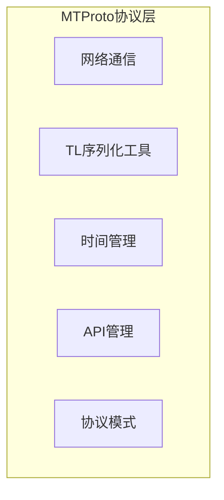
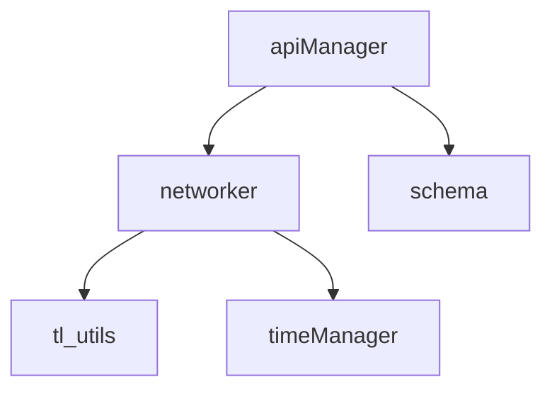
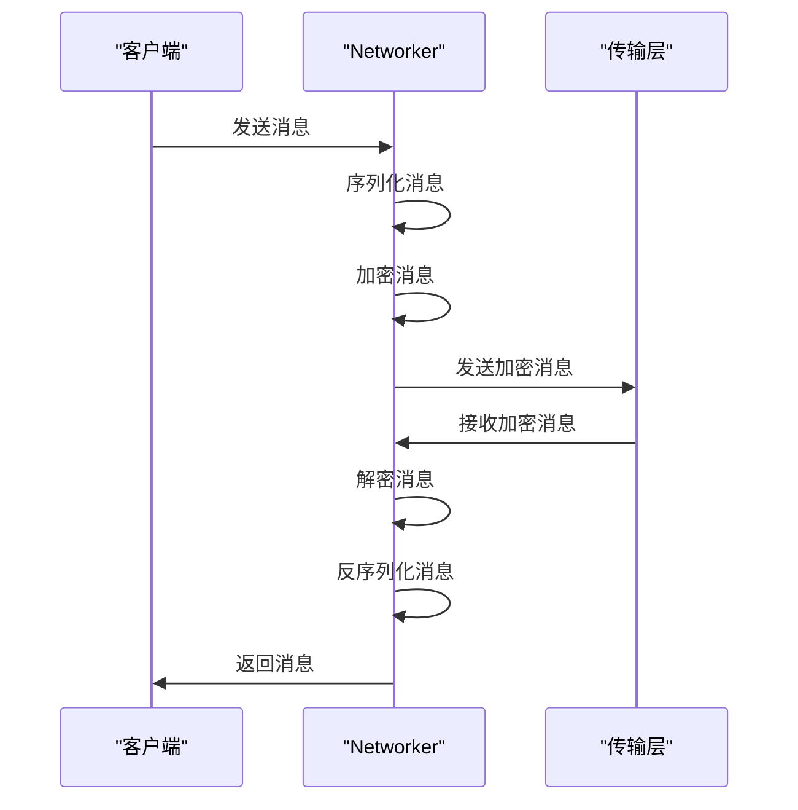
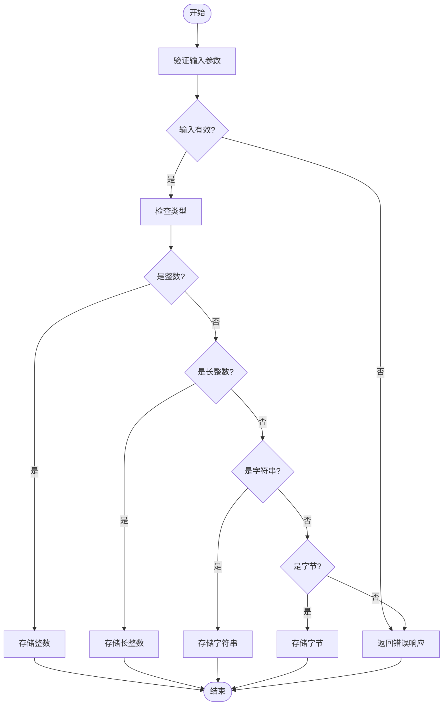
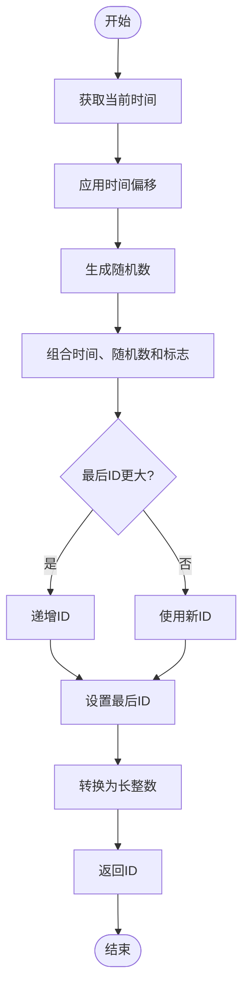
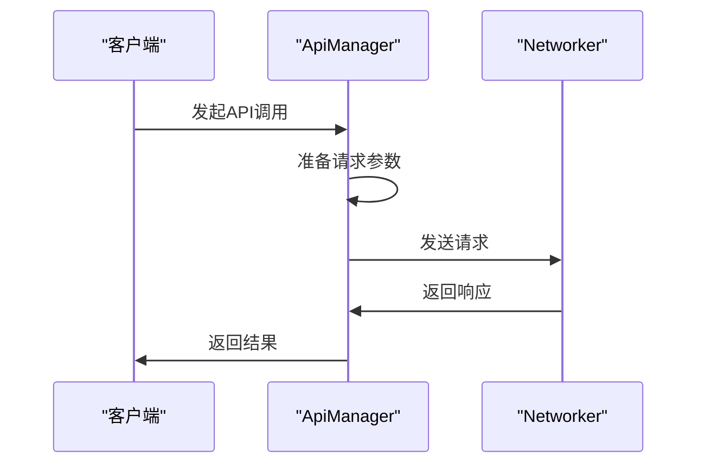
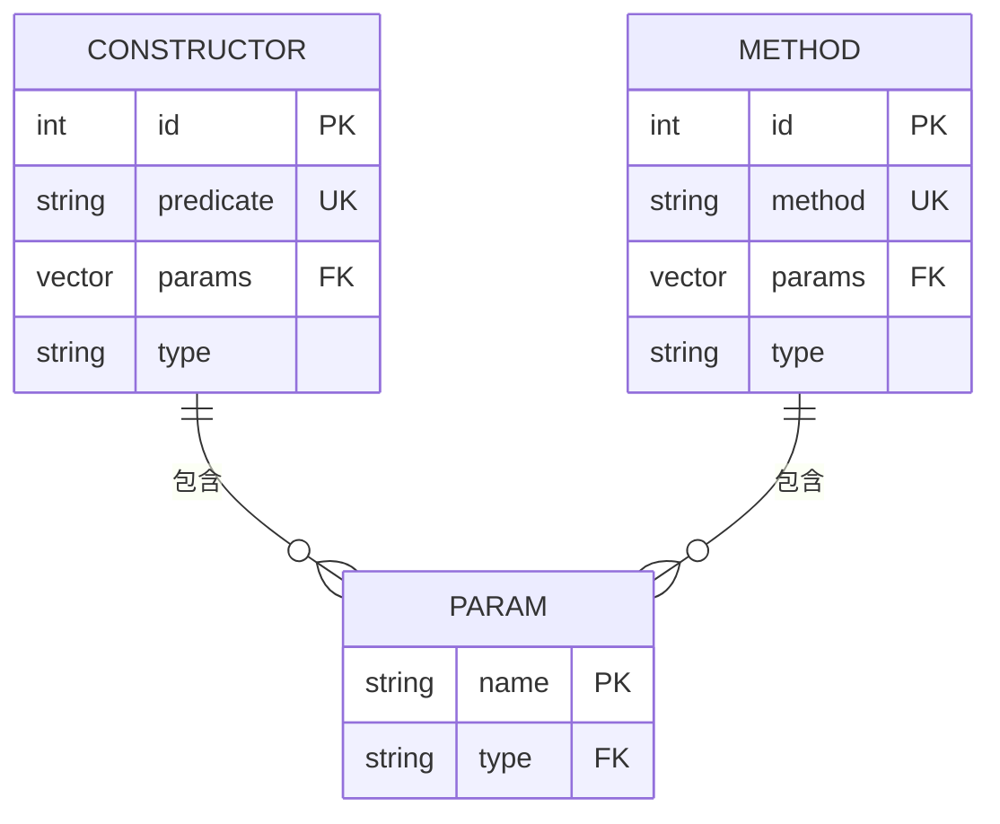
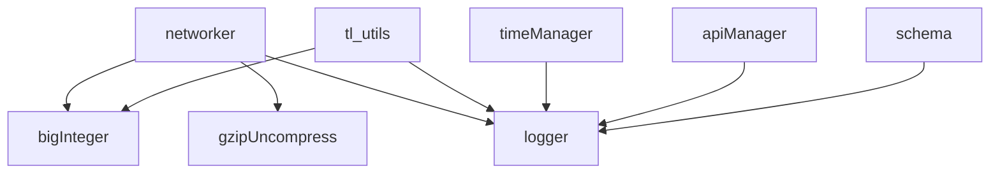

# 协议层实现

<cite>
**本文档中引用的文件**
- [networker.ts](file://src\lib\mtproto\networker.ts)
- [tl_utils.ts](file://src\lib\mtproto\tl_utils.ts)
- [timeManager.ts](file://src\lib\mtproto\timeManager.ts)
- [apiManager.ts](file://src\lib\mtproto\apiManager.ts)
- [schema.ts](file://src\lib\mtproto\schema.ts)
</cite>

## 目录
1. [介绍](#介绍)
2. [项目结构](#项目结构)
3. [核心组件](#核心组件)
4. [架构概述](#架构概述)
5. [详细组件分析](#详细组件分析)
6. [依赖分析](#依赖分析)
7. [性能考虑](#性能考虑)
8. [故障排除指南](#故障排除指南)
9. [结论](#结论)
10. [附录](#附录) (如有必要)

## 介绍
本文档详细解析tweb项目中MTProto协议层的实现，重点分析MTProto协议消息的编码和解码机制，包括TL（Type Language）序列化格式的处理。文档将深入探讨消息ID生成、序列号管理和消息确认机制的实现细节，阐述RPC调用的请求-响应模式，包括异步调用的处理和超时机制。此外，文档还将解释消息队列的管理策略和优先级处理，并提供协议层的调试方法和常见序列化错误的排查指南。

## 项目结构
tweb项目的MTProto协议层主要位于`src\lib\mtproto`目录下，包含多个核心文件，如`networker.ts`、`tl_utils.ts`、`timeManager.ts`、`apiManager.ts`和`schema.ts`。这些文件共同实现了MTProto协议的核心功能，包括消息的序列化与反序列化、网络通信、时间管理、API调用等。

**Diagram sources**
- [networker.ts](file://src\lib\mtproto\networker.ts)
- [tl_utils.ts](file://src\lib\mtproto\tl_utils.ts)
- [timeManager.ts](file://src\lib\mtproto\timeManager.ts)
- [apiManager.ts](file://src\lib\mtproto\apiManager.ts)
- [schema.ts](file://src\lib\mtproto\schema.ts)

**Section sources**
- [networker.ts](file://src\lib\mtproto\networker.ts)
- [tl_utils.ts](file://src\lib\mtproto\tl_utils.ts)
- [timeManager.ts](file://src\lib\mtproto\timeManager.ts)
- [apiManager.ts](file://src\lib\mtproto\apiManager.ts)
- [schema.ts](file://src\lib\mtproto\schema.ts)

## 核心组件
tweb项目的MTProto协议层由多个核心组件构成，每个组件负责不同的功能。`networker.ts`负责网络通信，`tl_utils.ts`提供TL序列化和反序列化工具，`timeManager.ts`管理时间相关的功能，`apiManager.ts`处理API调用，`schema.ts`定义了协议的模式。

**Section sources**
- [networker.ts](file://src\lib\mtproto\networker.ts)
- [tl_utils.ts](file://src\lib\mtproto\tl_utils.ts)
- [timeManager.ts](file://src\lib\mtproto\timeManager.ts)
- [apiManager.ts](file://src\lib\mtproto\apiManager.ts)
- [schema.ts](file://src\lib\mtproto\schema.ts)

## 架构概述
tweb项目的MTProto协议层采用模块化设计，各组件之间通过清晰的接口进行通信。`networker.ts`作为网络通信的核心，负责发送和接收消息，`tl_utils.ts`提供序列化和反序列化功能，`timeManager.ts`确保时间同步，`apiManager.ts`处理API调用，`schema.ts`定义了协议的模式。

**Diagram sources**
- [networker.ts](file://src\lib\mtproto\networker.ts)
- [tl_utils.ts](file://src\lib\mtproto\tl_utils.ts)
- [timeManager.ts](file://src\lib\mtproto\timeManager.ts)
- [apiManager.ts](file://src\lib\mtproto\apiManager.ts)
- [schema.ts](file://src\lib\mtproto\schema.ts)

## 详细组件分析
### Networker组件分析
`networker.ts`是MTProto协议层的核心组件，负责网络通信。它实现了消息的发送和接收，包括消息的序列化、加密、发送、接收、解密和反序列化。

#### 网络通信流程

**Diagram sources**
- [networker.ts](file://src\lib\mtproto\networker.ts)

**Section sources**
- [networker.ts](file://src\lib\mtproto\networker.ts)

### TLUtils组件分析
`tl_utils.ts`提供了TL序列化和反序列化工具，用于处理MTProto协议中的消息。

#### TL序列化流程

**Diagram sources**
- [tl_utils.ts](file://src\lib\mtproto\tl_utils.ts)

**Section sources**
- [tl_utils.ts](file://src\lib\mtproto\tl_utils.ts)

### TimeManager组件分析
`timeManager.ts`负责管理时间相关的功能，包括消息ID的生成和服务器时间的同步。

#### 消息ID生成流程

**Diagram sources**
- [timeManager.ts](file://src\lib\mtproto\timeManager.ts)

**Section sources**
- [timeManager.ts](file://src\lib\mtproto\timeManager.ts)

### ApiManager组件分析
`apiManager.ts`负责处理API调用，包括请求的发送和响应的处理。

#### API调用流程

**Diagram sources**
- [apiManager.ts](file://src\lib\mtproto\apiManager.ts)

**Section sources**
- [apiManager.ts](file://src\lib\mtproto\apiManager.ts)

### Schema组件分析
`schema.ts`定义了MTProto协议的模式，包括构造函数和方法的定义。

#### 协议模式定义

**Diagram sources**
- [schema.ts](file://src\lib\mtproto\schema.ts)

**Section sources**
- [schema.ts](file://src\lib\mtproto\schema.ts)

## 依赖分析
tweb项目的MTProto协议层依赖于多个外部库和内部模块，如`big-integer`用于处理大整数，`gzip-uncompress`用于解压缩数据，`logger`用于日志记录等。

**Diagram sources**
- [networker.ts](file://src\lib\mtproto\networker.ts)
- [tl_utils.ts](file://src\lib\mtproto\tl_utils.ts)
- [timeManager.ts](file://src\lib\mtproto\timeManager.ts)
- [apiManager.ts](file://src\lib\mtproto\apiManager.ts)
- [schema.ts](file://src\lib\mtproto\schema.ts)

**Section sources**
- [networker.ts](file://src\lib\mtproto\networker.ts)
- [tl_utils.ts](file://src\lib\mtproto\tl_utils.ts)
- [timeManager.ts](file://src\lib\mtproto\timeManager.ts)
- [apiManager.ts](file://src\lib\mtproto\apiManager.ts)
- [schema.ts](file://src\lib\mtproto\schema.ts)

## 性能考虑
在实现MTProto协议层时，性能是一个重要的考虑因素。`networker.ts`通过批量发送消息和优化序列化过程来提高性能，`tl_utils.ts`通过高效的序列化和反序列化算法来减少处理时间，`timeManager.ts`通过精确的时间管理来确保消息的正确性。

## 故障排除指南
在使用MTProto协议层时，可能会遇到一些常见问题，如消息ID冲突、序列化错误、网络连接问题等。以下是一些常见的排查方法：

1. **消息ID冲突**：检查`timeManager.ts`中的时间偏移是否正确，确保消息ID的生成是唯一的。
2. **序列化错误**：检查`tl_utils.ts`中的序列化和反序列化逻辑，确保数据类型和格式正确。
3. **网络连接问题**：检查`networker.ts`中的网络连接状态，确保网络通信正常。

**Section sources**
- [networker.ts](file://src\lib\mtproto\networker.ts)
- [tl_utils.ts](file://src\lib\mtproto\tl_utils.ts)
- [timeManager.ts](file://src\lib\mtproto\timeManager.ts)

## 结论
tweb项目的MTProto协议层通过模块化设计和高效的实现，提供了稳定可靠的网络通信功能。通过对核心组件的深入分析，我们可以更好地理解其工作原理和实现细节，为后续的开发和维护提供有力支持。

## 附录
无