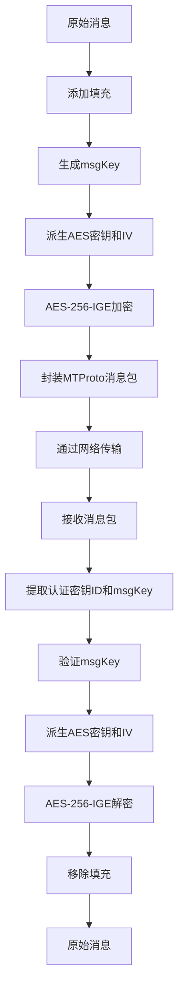

# 安全通信机制

<cite>
**本文档引用的文件**   
- [authorizer.ts](file://src/lib/mtproto/authorizer.ts)
- [networker.ts](file://src/lib/mtproto/networker.ts)
- [messageKeyUtils.ts](file://src/lib/mtproto/messageKeyUtils.ts)
- [obfuscation.ts](file://src/lib/mtproto/transports/obfuscation.ts)
- [cryptoMessagePort.ts](file://src/lib/crypto/cryptoMessagePort.ts)
- [crypto_methods.ts](file://src/lib/crypto/crypto_methods.ts)
- [srp.ts](file://src/lib/crypto/srp.ts)
- [aesLocal.ts](file://src/lib/crypto/utils/aesLocal.ts)
</cite>

## 目录
1. [引言](#引言)
2. [密钥交换协议](#密钥交换协议)
3. [消息加密与解密机制](#消息加密与解密机制)
4. [会话密钥管理](#会话密钥管理)
5. [身份验证流程](#身份验证流程)
6. [安全通信审计与漏洞防范](#安全通信审计与漏洞防范)
7. [结论](#结论)

## 引言

tweb项目基于MTProto协议实现安全通信，该协议是Telegram为确保通信安全而设计的专有协议。本项目通过Diffie-Hellman密钥交换、AES对称加密、RSA非对称加密以及SHA系列哈希算法构建了端到端的安全通信机制。系统在客户端与服务器之间建立加密通道，确保消息的机密性、完整性和身份真实性。整个安全架构分为三个主要阶段：授权认证、密钥协商和加密通信。在授权阶段，客户端通过RSA公钥加密传输临时密钥；在密钥协商阶段，采用Diffie-Hellman算法生成共享密钥；在通信阶段，使用AES-IGE模式对消息进行加密。此外，系统还实现了流量混淆、会话管理、二次验证等安全特性，全面保护用户通信安全。

## 密钥交换协议

tweb项目采用MTProto协议的密钥交换机制，基于Diffie-Hellman算法实现安全的密钥协商。该过程分为三个主要步骤：PQ分解、DH参数交换和客户端密钥生成。首先，客户端生成16字节的随机数作为nonce，并向服务器发送`req_pq_multi`请求。服务器返回包含PQ乘积和服务器nonce的响应。客户端随后对PQ进行质因数分解，得到质数p和q。这一过程通过`sendReqPQ`方法实现，其中使用`CryptoWorker.invokeCrypto('factorize', auth.pq)`调用质因数分解算法。

在获得p和q后，客户端构造`p_q_inner_data_dc`对象，包含PQ、p、q、nonce、服务器nonce、新生成的32字节客户端nonce以及目标DC标识。该对象使用SHA256哈希与临时密钥进行AES加密，然后通过RSA公钥加密传输。服务器验证后返回`server_DH_params_ok`响应，其中包含加密的DH参数。客户端使用`decryptServerDhDataAnswer`方法解密该响应，获取g（生成元）、dh_prime（大质数）和g_a（服务器的公钥）。

客户端随后验证DH参数的安全性，包括检查dh_prime是否为已知的安全质数、验证g_a是否在有效范围内等。验证通过后，客户端生成256字节的随机数b作为私钥，计算g_b = g^b mod dh_prime，并构造`client_DH_inner_data`对象。该对象包含nonce、服务器nonce、重试ID和g_b，经过SHA1哈希和AES加密后发送给服务器。服务器验证后返回`dh_gen_ok`响应，客户端最终通过`authKey = g_a^b mod dh_prime`计算出共享密钥。整个密钥交换过程通过`Authorizer`类的`sendReqPQ`、`sendReqDhParams`和`sendSetClientDhParams`方法实现，确保了前向安全性。

**Section sources**
- [authorizer.ts](file://src/lib/mtproto/authorizer.ts#L215-L578)

## 消息加密与解密机制

tweb项目的消息加密基于MTProto 2.0协议，采用AES-256-IGE（Infinite Garble Extension）模式进行对称加密。消息加密过程由`networker.ts`中的`getEncryptedMessage`方法实现。首先，系统根据消息内容生成消息密钥（msgKey），该密钥通过`MessageKeyUtils.getMsgKey`方法计算，使用SHA256算法对认证密钥和填充后的数据进行哈希运算。然后，系统使用`MessageKeyUtils.getAesKeyIv`方法派生AES加密所需的密钥和初始化向量（IV）。

AES密钥和IV的派生过程采用SHA256算法，通过两个并行的哈希计算实现。第一个哈希计算`sha256a`将msgKey与认证密钥的前36字节连接后进行SHA256运算；第二个哈希计算`sha256b`将认证密钥的第40-76字节与msgKey连接后进行SHA256运算。最终的AES密钥由`sha256a`的前8字节、`sha256b`的第8-24字节和`sha256a`的后8字节拼接而成；IV由`sha256b`的前8字节、`sha256a`的第8-24字节和`sha256b`的后8字节拼接而成。这种设计确保了密钥和IV的强随机性。

消息加密前需要进行填充处理，填充长度为16的倍数，且随机增加16-80字节的额外填充，以防止流量分析。加密后的数据与认证密钥ID、msgKey等信息封装成MTProto消息包。解密过程则完全相反，首先验证msgKey的正确性，然后使用相同的密钥派生方法获取AES密钥和IV，最后进行AES解密。整个加密解密过程通过`CryptoWorker.invokeCrypto('aes-encrypt')`和`CryptoWorker.invokeCrypto('aes-decrypt')`调用底层加密模块实现，确保了消息的机密性和完整性。

**Diagram sources **
- [networker.ts](file://src/lib/mtproto/networker.ts#L1248-L1290)
- [messageKeyUtils.ts](file://src/lib/mtproto/messageKeyUtils.ts#L4-L48)

**Section sources**
- [networker.ts](file://src/lib/mtproto/networker.ts#L1248-L1290)
- [messageKeyUtils.ts](file://src/lib/mtproto/messageKeyUtils.ts#L4-L48)

## 会话密钥管理

tweb项目的会话密钥管理机制确保了通信的持续安全性和前向保密性。系统使用`MTAuthKey`类管理认证密钥，该类包含256字节的密钥数据、8字节的密钥ID和过期时间戳。会话密钥通过Diffie-Hellman密钥交换生成，并在`Authorizer`类的`sendSetClientDhParams`方法中完成最终计算。生成的共享密钥经过SHA1哈希运算，后8字节作为认证密钥ID，前8字节作为辅助哈希值，用于后续的密钥验证。

为了实现前向保密，系统支持临时认证密钥（temp auth key）和永久认证密钥（perm auth key）的绑定。当使用临时密钥时，客户端在首次API调用前会自动执行`wrapBindAuthKeyCall`，将临时密钥绑定到永久密钥上。绑定过程通过`auth.bindTempAuthKey`方法实现，其中包含nonce、临时密钥ID、永久密钥ID、会话ID和过期时间等信息，并使用永久密钥进行加密。这种设计允许客户端在不同设备间安全地迁移会话，同时保持长期身份的一致性。

会话管理还包括服务器盐值（server salt）和会话ID（session id）的维护。服务器盐值用于防止重放攻击，每次会话更新时通过`updateSession`方法生成新的8字节会话ID。系统还维护前一个会话ID，用于处理会话切换期间的遗留消息。当收到的消息包含无效的会话ID时，系统会抛出错误并重新初始化会话。此外，系统通过`ping_delay_disconnect`机制监控连接状态，当网络延迟超过阈值时自动断开连接，防止潜在的安全风险。

**Section sources**
- [authorizer.ts](file://src/lib/mtproto/authorizer.ts#L111-L127)
- [networker.ts](file://src/lib/mtproto/networker.ts#L247-L255)

## 身份验证流程

tweb项目的身份验证流程包含密码验证和二次验证两个层次。密码验证采用安全的远程密码认证（SRP）协议，避免在任何环节传输明文密码。当用户输入密码时，系统通过`computeSRP`函数执行SRP协议。首先，使用PBKDF2算法对密码进行密钥派生，结合客户端盐值和服务器盐值生成密码哈希。然后，客户端生成随机私钥a，计算公钥A = g^a mod p，并与服务器的公钥B进行交互。

SRP协议的核心是计算共享密钥S = (B - k*g^x)^(a + u*x) mod p，其中x是密码哈希的整数表示，u是A和B的哈希值。客户端使用S生成会话密钥K，并计算证据消息M1作为身份证明。M1的计算包含p、g、盐值、A、B和K的哈希，确保了消息的完整性和不可伪造性。服务器验证M1正确后，返回自己的证据消息M2，完成双向认证。整个过程通过`inputCheckPasswordSRP`对象传输A和M1，确保密码永远不会以明文形式出现在网络中。

二次验证（2FA）通过`AppTwoStepVerificationEnterPasswordTab`组件实现。当账户启用了两步验证时，用户在密码验证后需要输入额外的密码。系统通过`passwordInputField`组件收集密码输入，并通过`managers.passwordManager.check`方法验证。二次验证密码同样使用SRP协议进行安全传输，确保即使密码被截获也无法被利用。此外，系统还支持通过电子邮件重置密码，通过`resendPasswordEmail`方法发送重置链接，为用户提供安全的账户恢复途径。

**Section sources**
- [srp.ts](file://src/lib/crypto/srp.ts#L17-L167)
- [enterPassword.ts](file://src/components/sidebarLeft/tabs/2fa/enterPassword.ts#L188-L295)

## 安全通信审计与漏洞防范

tweb项目通过多层次的安全机制防范潜在漏洞，确保通信的完整性和安全性。系统实现了严格的参数验证机制，在Diffie-Hellman密钥交换过程中，客户端会对服务器返回的dh_prime进行严格验证，确保其为已知的安全质数。同时，系统验证g_a的值是否在1和dh_prime-1之间，且不小于2^(2048-64)，防止小指数攻击和边界值攻击。这些验证通过`verifyDhParams`方法实现，任何验证失败都会导致认证过程终止。

消息完整性通过msgKey机制保障。每个加密消息都包含一个msgKey，该密钥是消息内容的密码学哈希。接收方在解密前会重新计算msgKey并与接收到的值进行比较，任何不匹配都会导致消息被拒绝。这种设计有效防止了中间人攻击和消息篡改。此外，系统通过会话ID和服务器盐值防止重放攻击，确保每个消息只能被处理一次。

为了防范流量分析，系统实现了数据混淆机制。在TCP连接建立初期，客户端和服务器通过`Obfuscation`类交换初始化载荷，其中包含随机生成的加密密钥和IV。该载荷经过AES-CTR模式加密，使得网络流量呈现出随机数据的特征，难以被识别和拦截。混淆标签的使用进一步增强了隐蔽性，使得MTProto流量与普通HTTPS流量难以区分。

系统还实现了完善的错误处理和审计机制。所有安全相关的操作都有详细的日志记录，但敏感信息如密钥和密码不会被记录。当检测到潜在的安全问题时，系统会主动断开连接并重新初始化会话，如在msgKey不匹配时调用`updateSession`方法。此外，项目遵循安全开发生命周期，通过`SECURITY.md`文档提供漏洞报告渠道，鼓励安全研究人员发现和报告潜在问题。

**Section sources**
- [authorizer.ts](file://src/lib/mtproto/authorizer.ts#L454-L498)
- [networker.ts](file://src/lib/mtproto/networker.ts#L1403-L1410)
- [obfuscation.ts](file://src/lib/mtproto/transports/obfuscation.ts#L32-L123)
- [SECURITY.md](file://SECURITY.md#L15-L22)

## 结论

tweb项目通过MTProto协议构建了全面的安全通信体系，涵盖了密钥交换、消息加密、会话管理和身份验证等关键安全组件。系统采用Diffie-Hellman密钥交换实现前向保密，使用AES-256-IGE模式确保消息机密性，并通过SRP协议实现安全的密码验证。会话密钥管理机制支持临时密钥和永久密钥的绑定，既保证了安全性又提供了良好的用户体验。多层次的身份验证流程，包括密码验证和二次验证，有效防止了账户被盗。通过严格的参数验证、消息完整性检查和流量混淆技术，系统能够有效防范各种网络攻击。整体安全架构设计合理，符合现代安全通信的标准，为用户提供了一个安全可靠的通信环境。