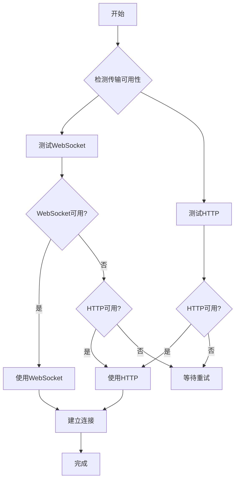
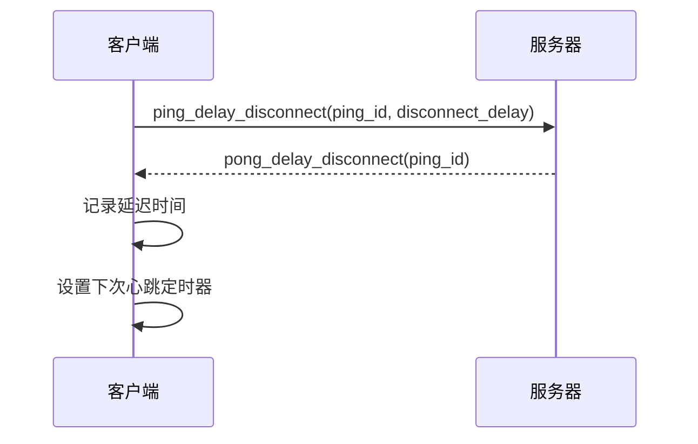
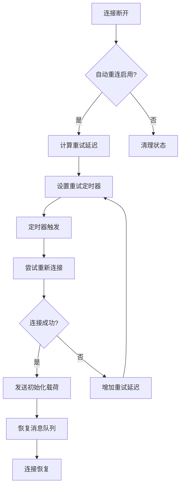
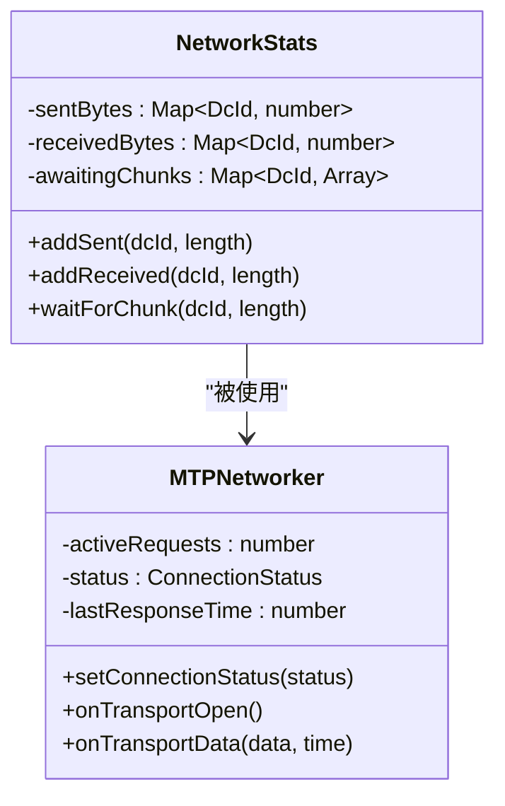

# 网络传输管理

<cite>
**本文档引用的文件**  
- [tcpObfuscated.ts](file://src/lib/mtproto/transports/tcpObfuscated.ts)
- [http.ts](file://src/lib/mtproto/transports/http.ts)
- [websocket.ts](file://src/lib/mtproto/transports/websocket.ts)
- [controller.ts](file://src/lib/mtproto/transports/controller.ts)
- [dcConfigurator.ts](file://src/lib/mtproto/dcConfigurator.ts)
- [networker.ts](file://src/lib/mtproto/networker.ts)
- [obfuscation.ts](file://src/lib/mtproto/transports/obfuscation.ts)
- [abridged.ts](file://src/lib/mtproto/transports/abridged.ts)
- [connectionStatus.ts](file://src/lib/mtproto/connectionStatus.ts)
- [networkStats.ts](file://src/lib/mtproto/networkStats.ts)
</cite>

## 目录
1. [网络连接建立](#网络连接建立)
2. [传输协议实现与切换](#传输协议实现与切换)
3. [心跳包与网络状态监控](#心跳包与网络状态监控)
4. [断线检测与自动重连](#断线检测与自动重连)
5. [连接恢复与状态同步](#连接恢复与状态同步)
6. [网络性能监控与诊断](#网络性能监控与诊断)

## 网络连接建立

tweb项目通过MTProto协议实现网络连接管理，连接建立过程包括DC（数据中心）选择和连接初始化。系统首先通过`DcConfigurator`类选择合适的DC服务器，然后初始化相应的传输连接。

DC选择基于预定义的服务器列表，根据DC ID选择对应的主机和端口。对于WebSocket连接，系统会构造特定的URL格式，如`wss://suffixws{dcId}{suffix}.web.telegram.org/apiws`。连接初始化时，系统会创建相应的传输实例，如`TcpObfuscated`用于WebSocket连接，`HTTP`用于HTTP连接。

连接建立后，系统会发送初始化载荷，包含特定的混淆标签和协议标识。对于TCP连接，使用Abridged协议进行数据包编码，该协议通过在数据前添加长度头来实现高效传输。

**Section sources**
- [dcConfigurator.ts](file://src/lib/mtproto/dcConfigurator.ts#L58-L70)
- [tcpObfuscated.ts](file://src/lib/mtproto/transports/tcpObfuscated.ts#L68-L73)
- [abridged.ts](file://src/lib/mtproto/transports/abridged.ts#L10-L42)

## 传输协议实现与切换

tweb项目支持多种传输协议，包括TCP、WebSocket和HTTP，通过灵活的切换策略确保连接的稳定性和效率。

### TCP/Obfuscated传输
TCP传输通过`TcpObfuscated`类实现，使用混淆技术增强安全性。该实现基于WebSocket连接，通过`Socket`类建立底层连接。数据传输前会经过混淆处理，使用AES-CTR模式进行加密。混淆初始化时生成随机的密钥和IV，确保每次连接的安全性。

### HTTP传输
HTTP传输通过`HTTP`类实现，使用标准的HTTP POST请求进行数据交换。该传输方式适用于网络环境受限的场景，能够穿透大多数防火墙和代理。HTTP传输支持长轮询机制，通过`http_wait`方法保持连接活跃。

### 传输切换策略
系统通过`MTTransportController`实现传输协议的智能切换。控制器会定期检测不同传输方式的可用性，优先选择WebSocket连接。当WebSocket不可用时，自动切换到HTTP连接。切换过程对上层应用透明，确保服务的连续性。

**Diagram sources**
- [controller.ts](file://src/lib/mtproto/transports/controller.ts#L44-L88)
- [http.ts](file://src/lib/mtproto/transports/http.ts#L18-L138)
- [tcpObfuscated.ts](file://src/lib/mtproto/transports/tcpObfuscated.ts#L21-L351)

**Section sources**
- [controller.ts](file://src/lib/mtproto/transports/controller.ts#L16-L129)
- [http.ts](file://src/lib/mtproto/transports/http.ts#L18-L138)
- [tcpObfuscated.ts](file://src/lib/mtproto/transports/tcpObfuscated.ts#L21-L351)

## 心跳包与网络状态监控

系统通过定期发送心跳包来维持连接活跃并监控网络状态。心跳机制分为两种：`ping`和`ping_delay_disconnect`。

`ping`操作定期发送，用于测量网络延迟。系统通过`wrapMtpCall`方法调用`ping` API，记录请求和响应的时间差，计算往返时间（RTT）。延迟信息用于调整后续的连接策略。

`ping_delay_disconnect`是更高级的心跳机制，不仅测量延迟，还设置断开连接的延迟时间。服务器在收到此请求后，会在指定的延迟时间内保持会话活跃，即使客户端暂时失去连接。这种机制有效避免了短暂网络波动导致的连接中断。

网络状态通过`ConnectionStatus`枚举进行管理，包含`Connected`、`Connecting`、`Closed`和`TimedOut`四种状态。状态变化时，系统会通知相关的监听器，触发相应的处理逻辑。

**Diagram sources**
- [networker.ts](file://src/lib/mtproto/networker.ts#L559-L582)
- [connectionStatus.ts](file://src/lib/mtproto/connectionStatus.ts#L7-L12)

**Section sources**
- [networker.ts](file://src/lib/mtproto/networker.ts#L552-L637)
- [connectionStatus.ts](file://src/lib/mtproto/connectionStatus.ts#L7-L24)

## 断线检测与自动重连

系统实现了完善的断线检测和自动重连机制，确保网络连接的可靠性。

### 断线检测
断线检测通过多种方式实现：
1. WebSocket的`close`事件监听
2. HTTP请求的超时和错误处理
3. 心跳包的响应超时检测

当检测到连接断开时，系统会根据当前状态决定是否进行重连。对于临时断开，系统会立即尝试重连；对于频繁断开的情况，会采用指数退避策略，逐渐增加重试间隔。

### 自动重连
自动重连由`TcpObfuscated`类的`reconnect`方法实现。重连过程包括：
1. 清理当前连接状态
2. 设置重新连接定时器
3. 重新建立WebSocket连接
4. 发送初始化载荷
5. 恢复待发送的消息队列

重连过程中，系统会保持待发送消息的队列，确保在网络恢复后能够继续发送未完成的请求。对于重要的内容相关消息，系统会保留其状态，等待服务器确认。

**Diagram sources**
- [tcpObfuscated.ts](file://src/lib/mtproto/transports/tcpObfuscated.ts#L117-L185)
- [networker.ts](file://src/lib/mtproto/networker.ts#L975-L983)

**Section sources**
- [tcpObfuscated.ts](file://src/lib/mtproto/transports/tcpObfuscated.ts#L117-L238)
- [networker.ts](file://src/lib/mtproto/networker.ts#L956-L983)

## 连接恢复与状态同步

连接恢复时，系统需要进行状态同步，确保客户端和服务器的状态一致。

### 状态同步机制
当连接重新建立后，系统会执行以下同步操作：
1. 清理已发送但未确认的消息
2. 重新发送重要的未确认请求
3. 恢复心跳机制
4. 通知上层应用连接状态变化

对于文件传输等长时间操作，系统会检查传输进度，决定是从断点继续还是重新开始。这种机制确保了大文件传输的可靠性。

### 消息重发策略
系统对不同类型的消息采用不同的重发策略：
- **内容相关消息**：必须收到服务器确认，否则定期重发
- **非内容相关消息**：如心跳包，不需要确认，发送后即丢弃
- **容器消息**：包含多个子消息，需要确保所有子消息都被处理

消息重发通过`pushResend`方法实现，该方法会将消息重新放入发送队列，并设置适当的延迟。

**Section sources**
- [networker.ts](file://src/lib/mtproto/networker.ts#L992-L1013)
- [tcpObfuscated.ts](file://src/lib/mtproto/transports/tcpObfuscated.ts#L270-L348)

## 网络性能监控与诊断

系统提供了全面的网络性能监控和诊断功能，帮助识别和解决网络问题。

### 性能监控指标
系统监控以下关键性能指标：
- **发送/接收字节数**：通过`networkStats`对象统计各DC的数据传输量
- **网络延迟**：通过心跳包测量往返时间
- **连接状态变化**：记录连接建立、断开等事件
- **请求成功率**：统计API调用的成功和失败次数

### 诊断方法
系统提供了多种诊断工具和方法：
1. **日志记录**：详细的连接和传输日志，包含时间戳和操作详情
2. **连接测试**：通过`pingTransports`方法测试不同传输方式的可用性
3. **超时控制**：为各种操作设置合理的超时时间，避免无限等待
4. **错误处理**：捕获和处理各种网络错误，提供有意义的错误信息

开发者可以通过启用调试模式获取更详细的网络活动信息，帮助诊断复杂的网络问题。

**Diagram sources**
- [networkStats.ts](file://src/lib/mtproto/networkStats.ts#L1-L62)
- [networker.ts](file://src/lib/mtproto/networker.ts#L132-L200)

**Section sources**
- [networkStats.ts](file://src/lib/mtproto/networkStats.ts#L1-L62)
- [networker.ts](file://src/lib/mtproto/networker.ts#L946-L955)