# 事件处理模式

<cite>
**本文档中引用的文件**  
- [appMessagesManager.ts](file://src/lib/appManagers/appMessagesManager.ts)
- [sortedList.ts](file://src/helpers/sortedList.ts)
- [middleware.ts](file://src/helpers/middleware.ts)
- [middlewarePromise.ts](file://src/helpers/middlewarePromise.ts)
- [eventListenerBase.ts](file://src/helpers/eventListenerBase.ts)
- [cancellablePromise.ts](file://src/helpers/cancellablePromise.ts)
- [throttle.ts](file://src/helpers/schedulers/throttle.ts)
- [throttleWith.ts](file://src/helpers/schedulers/throttleWith.ts)
- [dispatchEvent.ts](file://src/helpers/dom/dispatchEvent.ts)
- [useGlobalDocumentEvent.ts](file://src/helpers/useGlobalDocumentEvent.ts)
- [makeAction.ts](file://src/components/makeAction.ts)
</cite>

## 目录
1. [简介](#简介)
2. [项目结构](#项目结构)
3. [核心组件](#核心组件)
4. [架构概述](#架构概述)
5. [详细组件分析](#详细组件分析)
6. [依赖分析](#依赖分析)
7. [性能考虑](#性能考虑)
8. [故障排除指南](#故障排除指南)
9. [结论](#结论)

## 简介
tweb项目实现了一套完整的事件处理系统，支持同步处理、异步处理和批量处理等多种模式。该系统通过中间件机制、批处理器和事件监听器基类等组件，提供了灵活的事件处理能力。文档将详细介绍这些模式的实现原理、适用场景和性能特征。

## 项目结构
tweb项目的事件处理相关代码主要分布在`src/helpers`和`src/lib/appManagers`目录中。核心的事件处理逻辑位于`src/helpers`目录下的多个工具类中，而具体的业务事件处理则在`src/lib/appManagers`中的管理器类中实现。

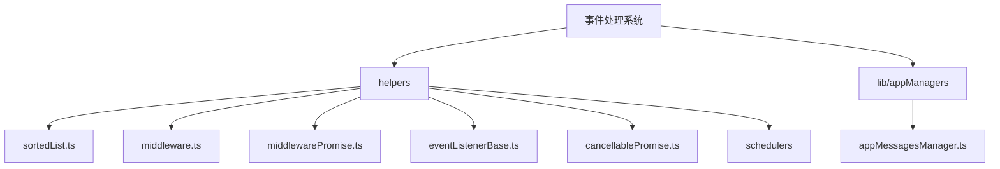

**图示来源**  
- [sortedList.ts](file://src/helpers/sortedList.ts)
- [middleware.ts](file://src/helpers/middleware.ts)
- [appMessagesManager.ts](file://src/lib/appManagers/appMessagesManager.ts)

**本节来源**  
- [src/helpers](file://src/helpers)
- [src/lib/appManagers](file://src/lib/appManagers)

## 核心组件
tweb项目的事件处理系统由多个核心组件构成，包括批处理器（BatchProcessor）、中间件（Middleware）、事件监听器基类（EventListenerBase）和可取消的Promise等。这些组件共同协作，实现了灵活的事件处理机制。

**本节来源**  
- [sortedList.ts](file://src/helpers/sortedList.ts#L21-L42)
- [middleware.ts](file://src/helpers/middleware.ts#L10-L15)
- [eventListenerBase.ts](file://src/helpers/eventListenerBase.ts#L65-L66)

## 架构概述
tweb项目的事件处理架构采用分层设计，底层是事件监听器基类提供基本的事件订阅和发布功能，中间层是中间件系统处理事件的生命周期和取消逻辑，上层是批处理器实现批量事件处理。这种分层架构使得事件处理既灵活又高效。

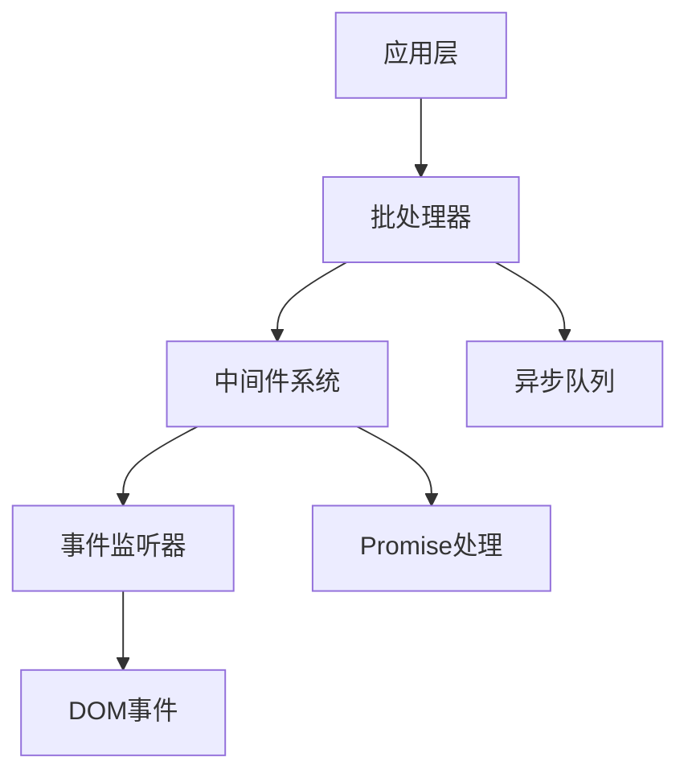

**图示来源**  
- [sortedList.ts](file://src/helpers/sortedList.ts#L21-L42)
- [middleware.ts](file://src/helpers/middleware.ts#L10-L15)
- [eventListenerBase.ts](file://src/helpers/eventListenerBase.ts#L65-L66)

## 详细组件分析

### 批处理模式分析
tweb项目中的批处理模式通过`Batcher`类和`BatchProcessor`类实现。`Batcher`类用于将多个事件合并为一个批次进行处理，而`BatchProcessor`类则负责处理队列中的批处理任务。

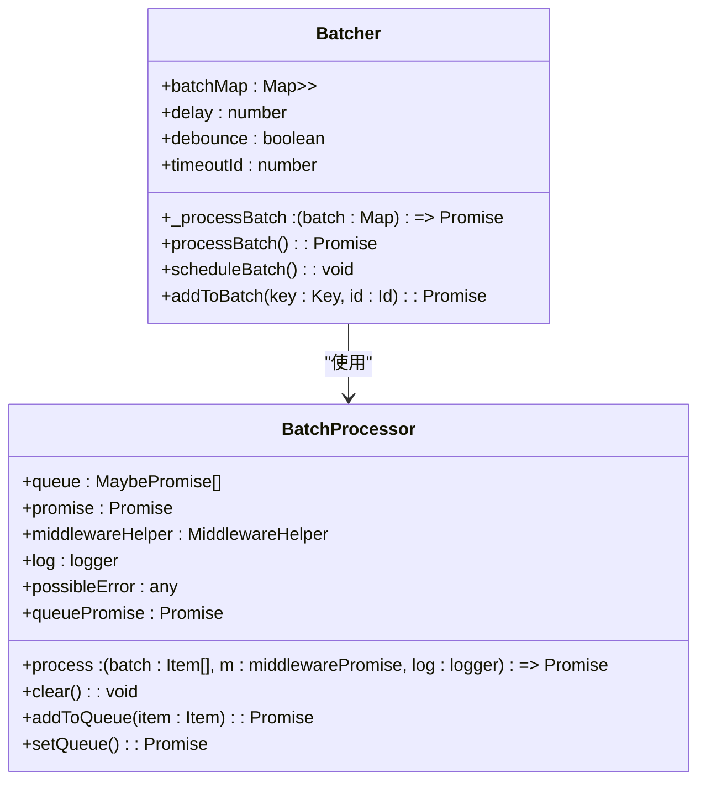

**图示来源**  
- [appMessagesManager.ts](file://src/lib/appManagers/appMessagesManager.ts#L10075-L10132)
- [sortedList.ts](file://src/helpers/sortedList.ts#L21-L42)

#### 批处理工作流程
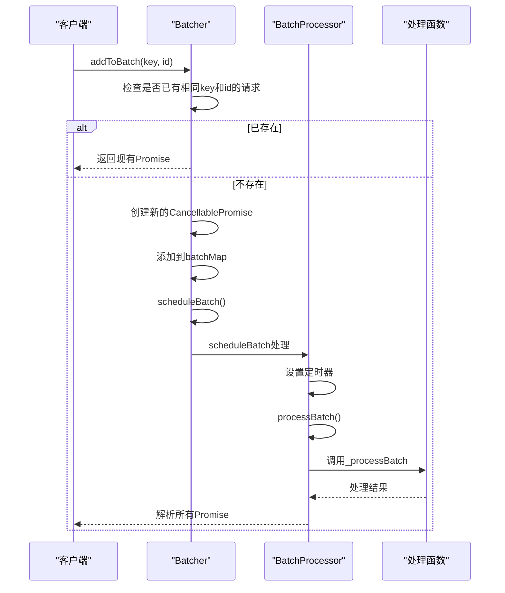

**图示来源**  
- [appMessagesManager.ts](file://src/lib/appManagers/appMessagesManager.ts#L10093-L10129)
- [sortedList.ts](file://src/helpers/sortedList.ts#L67-L129)

**本节来源**  
- [appMessagesManager.ts](file://src/lib/appManagers/appMessagesManager.ts#L10075-L10132)
- [sortedList.ts](file://src/helpers/sortedList.ts#L21-L132)

### 同步与异步处理分析
tweb项目通过`EventListenerBase`类实现了事件的同步和异步处理机制。该基类提供了事件订阅、发布和处理的基本功能，支持一次性事件监听和结果收集。

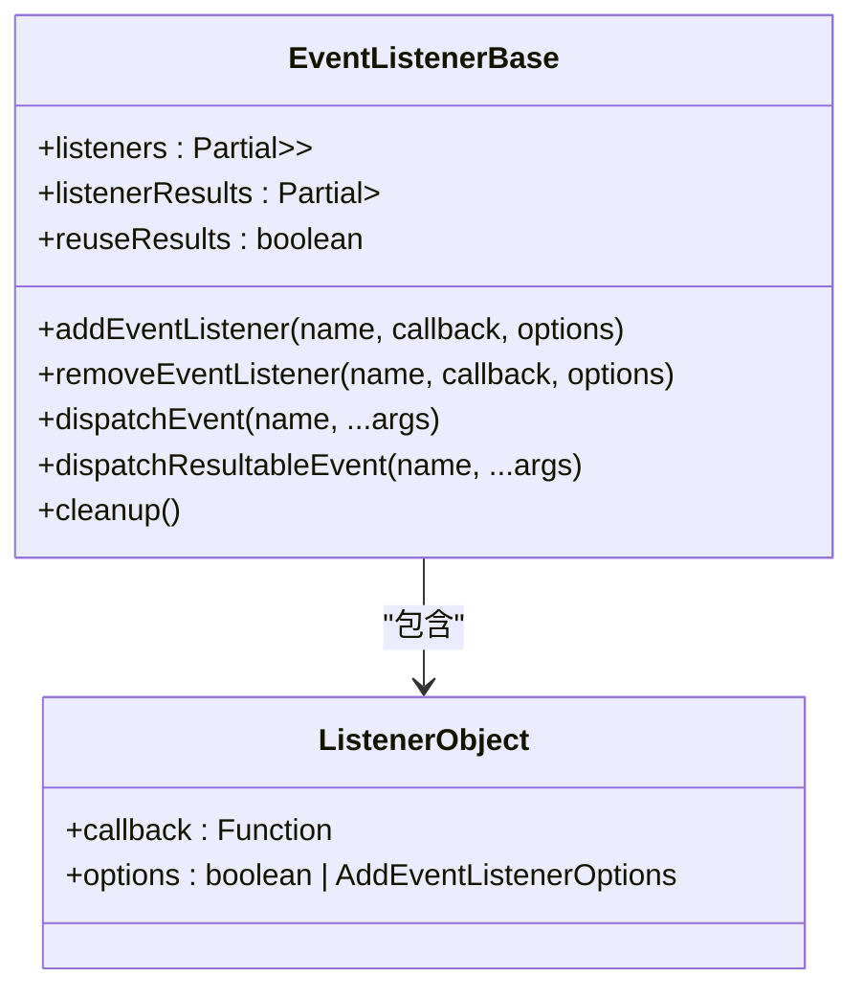

**图示来源**  
- [eventListenerBase.ts](file://src/helpers/eventListenerBase.ts#L65-L66)

#### 事件处理流程
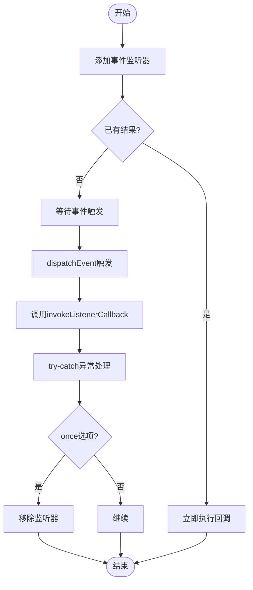

**图示来源**  
- [eventListenerBase.ts](file://src/helpers/eventListenerBase.ts#L85-L188)

**本节来源**  
- [eventListenerBase.ts](file://src/helpers/eventListenerBase.ts#L65-L195)

### 错误处理与异常恢复机制
tweb项目通过中间件系统和可取消的Promise实现了完善的错误处理和异常恢复机制。`middlewarePromise`函数包装Promise，确保在中间件条件不满足时抛出异常。

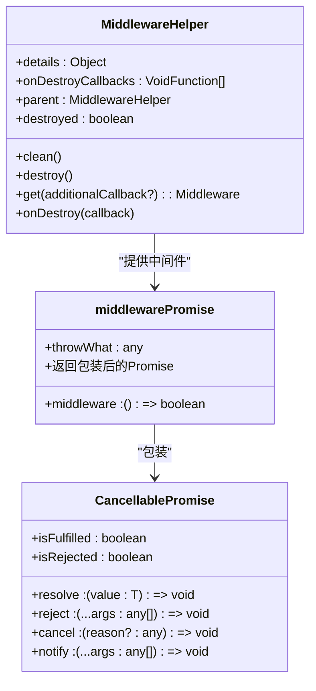

**图示来源**  
- [middleware.ts](file://src/helpers/middleware.ts#L32-L103)
- [middlewarePromise.ts](file://src/helpers/middlewarePromise.ts#L10-L28)
- [cancellablePromise.ts](file://src/helpers/cancellablePromise.ts#L9-L26)

#### 错误处理流程
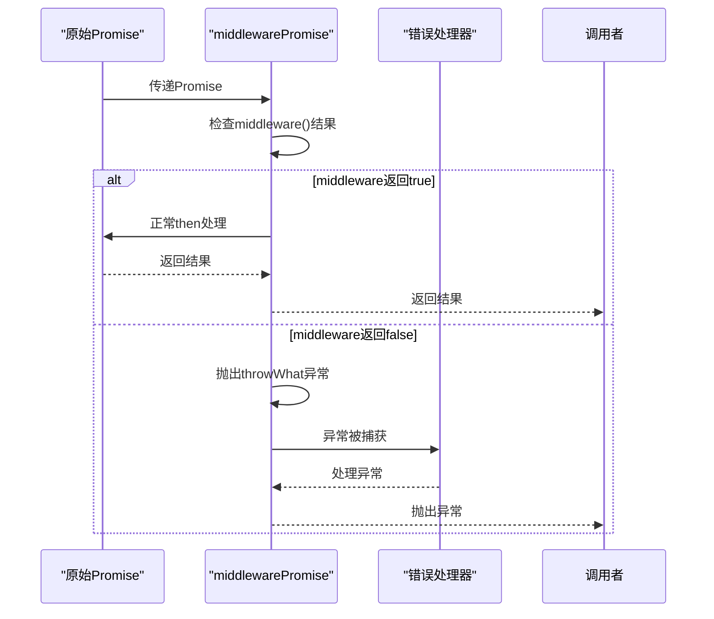

**图示来源**  
- [middlewarePromise.ts](file://src/helpers/middlewarePromise.ts#L10-L28)

**本节来源**  
- [middleware.ts](file://src/helpers/middleware.ts#L32-L103)
- [middlewarePromise.ts](file://src/helpers/middlewarePromise.ts#L10-L28)
- [cancellablePromise.ts](file://src/helpers/cancellablePromise.ts#L1-L89)

### 事件处理链与过滤器实现
tweb项目通过`throttle`和`throttleWith`函数实现了事件处理链和过滤器，可以控制事件的触发频率，避免过于频繁的事件处理。

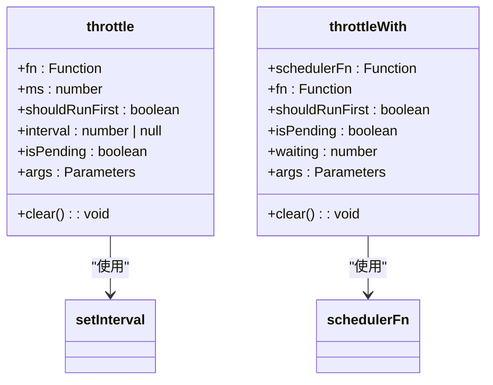

**图示来源**  
- [throttle.ts](file://src/helpers/schedulers/throttle.ts#L5-L46)
- [throttleWith.ts](file://src/helpers/schedulers/throttleWith.ts#L5-L50)

#### 节流处理流程
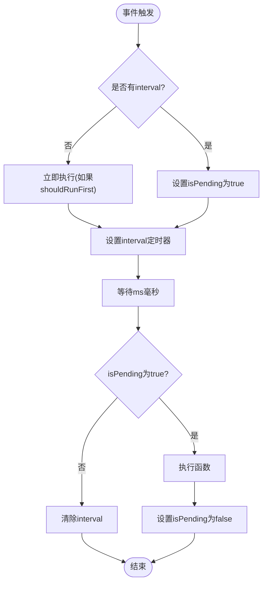

**图示来源**  
- [throttle.ts](file://src/helpers/schedulers/throttle.ts#L5-L46)

**本节来源**  
- [throttle.ts](file://src/helpers/schedulers/throttle.ts#L1-L47)
- [throttleWith.ts](file://src/helpers/schedulers/throttleWith.ts#L1-L51)

## 依赖分析
tweb项目的事件处理系统具有清晰的依赖关系，各组件之间通过接口和组合的方式进行协作，避免了紧密耦合。

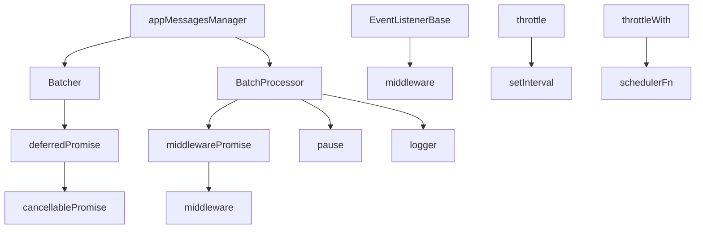

**图示来源**  
- [appMessagesManager.ts](file://src/lib/appManagers/appMessagesManager.ts#L10075-L10132)
- [sortedList.ts](file://src/helpers/sortedList.ts#L21-L132)
- [eventListenerBase.ts](file://src/helpers/eventListenerBase.ts#L65-L66)

**本节来源**  
- [appMessagesManager.ts](file://src/lib/appManagers/appMessagesManager.ts)
- [sortedList.ts](file://src/helpers/sortedList.ts)
- [middleware.ts](file://src/helpers/middleware.ts)

## 性能考虑
tweb项目的事件处理系统在设计时充分考虑了性能因素。批处理模式减少了重复的网络请求和计算，节流函数避免了过于频繁的事件处理，中间件系统提供了高效的取消机制。

**本节来源**  
- [appMessagesManager.ts](file://src/lib/appManagers/appMessagesManager.ts#L10093-L10112)
- [throttle.ts](file://src/helpers/schedulers/throttle.ts#L5-L46)

## 故障排除指南
当遇到事件处理相关问题时，可以检查以下方面：
1. 确认中间件状态是否正常，避免因中间件清理导致的事件处理中断
2. 检查批处理的延迟设置是否合理，避免过长的延迟影响用户体验
3. 验证事件监听器是否正确添加和移除，避免内存泄漏
4. 确认节流函数的时间间隔设置是否合适，避免过于频繁或稀疏的事件处理

**本节来源**  
- [middleware.ts](file://src/helpers/middleware.ts#L38-L45)
- [appMessagesManager.ts](file://src/lib/appManagers/appMessagesManager.ts#L10102-L10112)

## 结论
tweb项目的事件处理系统通过批处理、中间件、事件监听器基类和节流函数等多种模式，实现了灵活高效的事件处理机制。该系统不仅支持同步和异步处理，还提供了完善的错误处理和异常恢复能力，适用于各种复杂的事件处理场景。