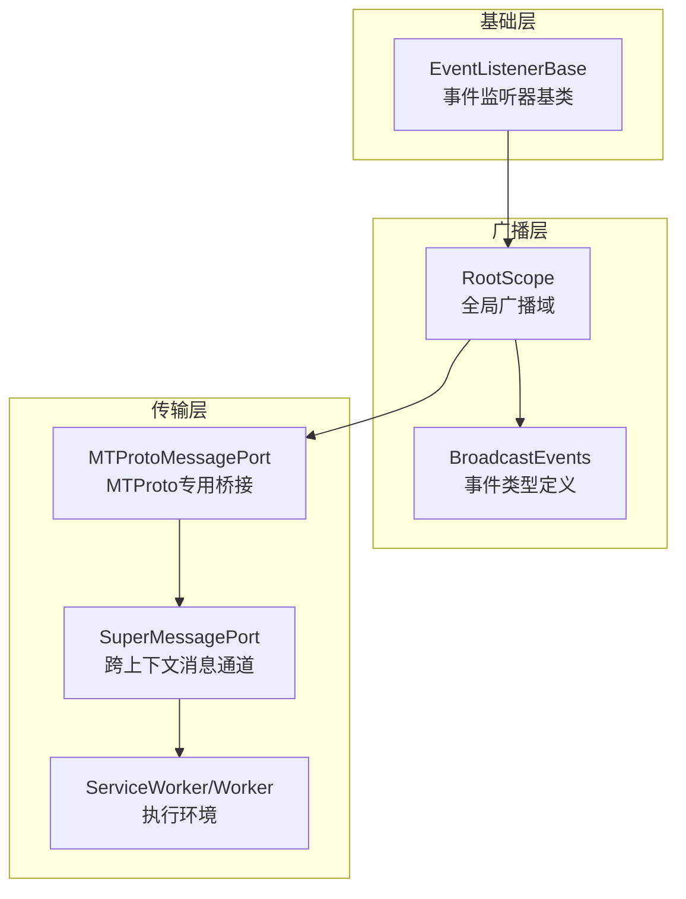
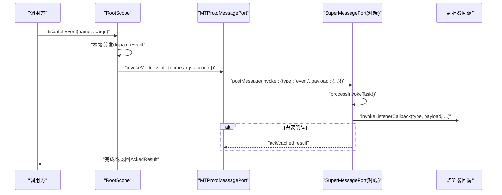
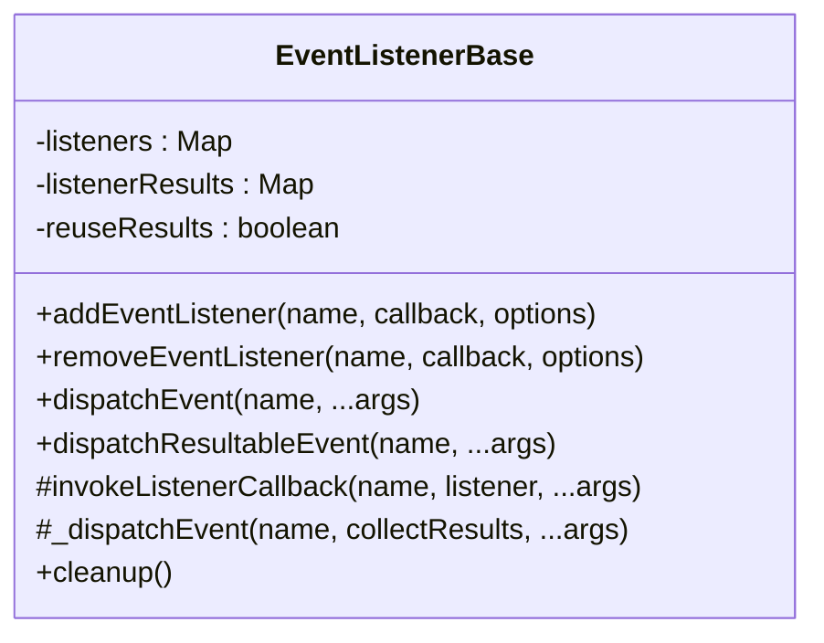
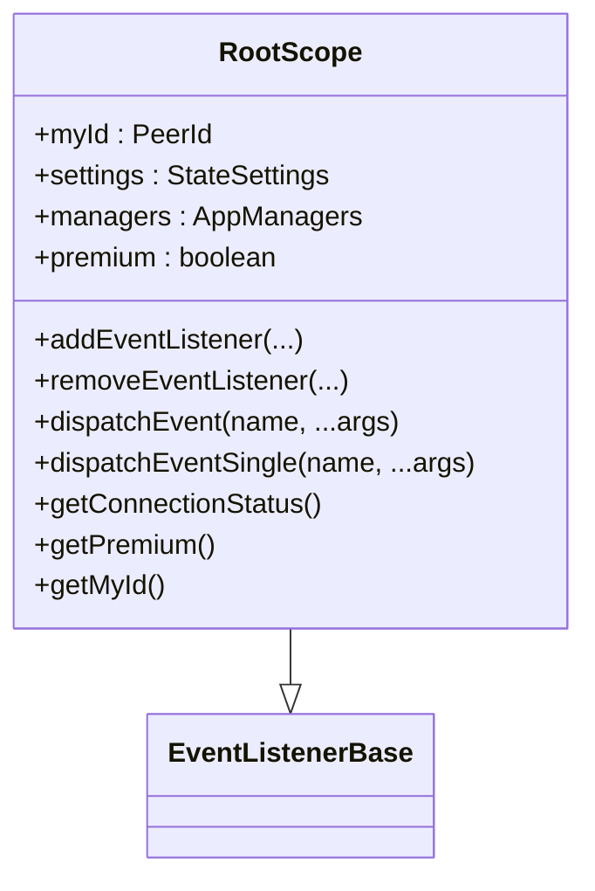
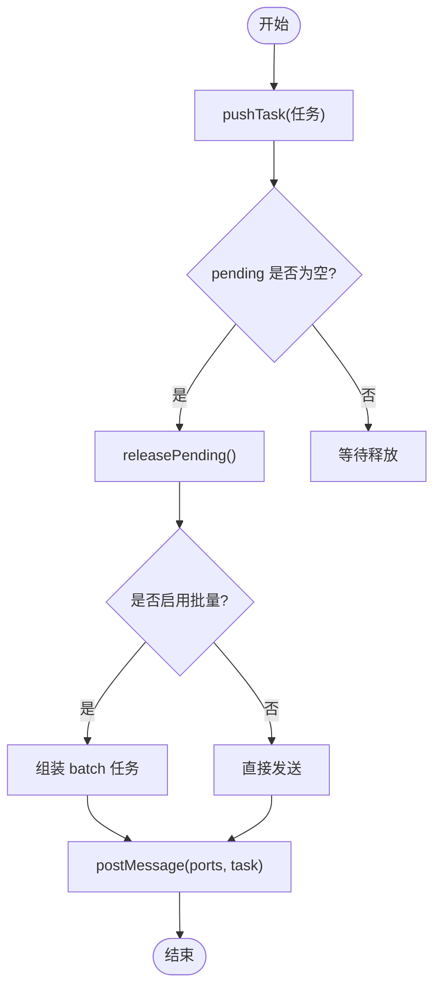
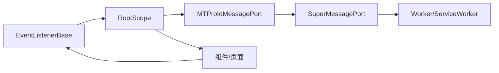

# 事件总线设计

<cite>
**本文引用的文件**
- [eventListenerBase.ts](file://src/helpers/eventListenerBase.ts)
- [rootScope.ts](file://src/lib/rootScope.ts)
- [superMessagePort.ts](file://src/lib/mtproto/superMessagePort.ts)
- [mtprotoMessagePort.ts](file://src/lib/mtproto/mtprotoMessagePort.ts)
- [mtprotoworker.ts](file://src/lib/mtproto/mtprotoworker.ts)
- [subscribeOn.ts](file://src/helpers/solid/subscribeOn.ts)
- [listenerSetter.ts](file://src/helpers/listenerSetter.ts)
- [idleController.ts](file://src/helpers/idleController.ts)
- [throttleWith.ts](file://src/helpers/schedulers/throttleWith.ts)
- [heavyQueue.ts](file://src/helpers/heavyQueue.ts)
</cite>

## 目录
1. [引言](#引言)
2. [项目结构](#项目结构)
3. [核心组件](#核心组件)
4. [架构总览](#架构总览)
5. [详细组件分析](#详细组件分析)
6. [依赖关系分析](#依赖关系分析)
7. [性能考量](#性能考量)
8. [故障排查指南](#故障排查指南)
9. [结论](#结论)
10. [附录：使用示例与最佳实践](#附录使用示例与最佳实践)

## 引言
本设计文档聚焦于 tweb 项目的事件总线体系，系统性解析其核心实现机制与运行流程，涵盖事件注册、分发与订阅的完整链路；阐述组件间解耦与通信方式；详解事件队列管理与优先级处理策略；并给出性能优化建议（内存管理、事件去重等）以及在实际应用中的使用示例与最佳实践。

## 项目结构
事件总线相关能力由三层构成：
- 基础事件监听器：通用的事件注册/分发/订阅基础设施。
- 广播域根作用域：面向全局广播的事件类型定义与跨标签页/Worker 的事件桥接。
- 跨端消息通道：基于 MessagePort/SharedWorker 的跨上下文事件传递与任务编排。

图表来源
- [eventListenerBase.ts](file://src/helpers/eventListenerBase.ts#L65-L195)
- [rootScope.ts](file://src/lib/rootScope.ts#L35-L245)
- [superMessagePort.ts](file://src/lib/mtproto/superMessagePort.ts#L104-L163)
- [mtprotoMessagePort.ts](file://src/lib/mtproto/mtprotoMessagePort.ts#L35-L90)

章节来源
- [eventListenerBase.ts](file://src/helpers/eventListenerBase.ts#L65-L195)
- [rootScope.ts](file://src/lib/rootScope.ts#L35-L245)
- [superMessagePort.ts](file://src/lib/mtproto/superMessagePort.ts#L104-L163)
- [mtprotoMessagePort.ts](file://src/lib/mtproto/mtprotoMessagePort.ts#L35-L90)

## 核心组件
- 事件监听器基类（EventListenerBase）
  - 提供 addEventListener/removeEventListener/dispachEvent 等通用能力。
  - 支持一次性监听选项、结果复用与回调异常隔离。
- 全局广播域（RootScope）
  - 定义丰富的广播事件类型集合，并在分发时同步通过 MTProtoMessagePort 广播到其他标签页或 Worker。
  - 提供 dispatchEventSingle 用于仅本地触发。
- 跨上下文消息通道（SuperMessagePort/MTProtoMessagePort）
  - 将事件封装为任务，支持批量、确认、超时、锁与传输可转移对象。
  - 在 Worker/ServiceWorker 与主线程之间建立可靠的消息通路。

章节来源
- [eventListenerBase.ts](file://src/helpers/eventListenerBase.ts#L65-L195)
- [rootScope.ts](file://src/lib/rootScope.ts#L250-L310)
- [superMessagePort.ts](file://src/lib/mtproto/superMessagePort.ts#L565-L662)
- [mtprotoMessagePort.ts](file://src/lib/mtproto/mtprotoMessagePort.ts#L35-L90)

## 架构总览
事件从 RootScope 发出后，先在当前上下文本地分发，再通过 MTProtoMessagePort 将“事件”任务广播至其他端。接收端由 SuperMessagePort 解析任务类型，定位到对应监听器并调用回调，必要时返回结果或确认信息。

图表来源
- [rootScope.ts](file://src/lib/rootScope.ts#L279-L289)
- [mtprotoMessagePort.ts](file://src/lib/mtproto/mtprotoMessagePort.ts#L35-L90)
- [superMessagePort.ts](file://src/lib/mtproto/superMessagePort.ts#L490-L564)

## 详细组件分析

### 组件一：事件监听器基类（EventListenerBase）
- 设计要点
  - 使用受保护的 listeners 结构存储事件名到监听器集合的映射，避免在遍历过程中修改集合。
  - 支持 options.once 一次性监听，回调抛错时被捕获并抛出，确保不影响其他监听器。
  - 提供 dispatchEvent 与 dispatchResultableEvent 两种分发模式，后者收集所有监听器返回值。
  - 支持 reuseResults 以在添加监听器时回放最近一次事件参数，保证新监听者能及时获得状态。
- 关键流程
  - 注册：addEventListener 将监听器对象加入集合；若已存在最近结果且 options.once 未设置，则立即回放一次。
  - 分发：遍历监听器集合，逐个调用回调；若回调抛错且收集结果模式下，直接抛出错误；否则继续下一个监听器。
  - 移除：removeEventListener 按回调函数匹配删除，避免重复移除。
- 复杂度
  - 单次分发时间复杂度 O(N)，N 为该事件监听器数量；内存占用与监听器数量线性相关。

图表来源
- [eventListenerBase.ts](file://src/helpers/eventListenerBase.ts#L65-L195)

章节来源
- [eventListenerBase.ts](file://src/helpers/eventListenerBase.ts#L65-L195)

### 组件二：全局广播域（RootScope）
- 设计要点
  - 定义了大量广播事件类型（如用户更新、对话列表变化、消息历史变更、媒体播放、通知计数等），统一管理。
  - 重写 dispatchEvent，在本地分发后，异步通过 MTProtoMessagePort 向其他标签页/Worker 广播事件。
  - 提供 dispatchEventSingle 仅在本地触发，不进行跨端广播。
- 使用场景
  - UI 组件订阅特定广播事件，响应全局状态变化。
  - 状态管理模块通过 RootScope 发布事件，驱动多组件联动。

图表来源
- [rootScope.ts](file://src/lib/rootScope.ts#L250-L310)

章节来源
- [rootScope.ts](file://src/lib/rootScope.ts#L35-L245)
- [rootScope.ts](file://src/lib/rootScope.ts#L250-L310)

### 组件三：跨上下文消息通道（SuperMessagePort/MTProtoMessagePort）
- 设计要点
  - 将事件封装为任务（invoke/result/ack/batch/lock/close 等），通过 postMessage 发送。
  - 支持批量发送（batch），减少消息开销；支持锁（locks）保障同一资源的串行访问。
  - invoke 支持 withAck 返回缓存结果或延迟结果；支持超时与调试日志。
  - 提供 invokeVoid/invoke/invokeExceptSource/invokeExceptSourceAsync 等便捷方法。
- 关键流程
  - 发送端：pushTask -> releasePending -> postMessage，必要时合并为 batch。
  - 接收端：processInvokeTask 解析任务，定位监听器，调用回调，按需返回 ack 或 result。
  - 断连处理：detachPort 清理等待的任务并拒绝对应 Promise。

图表来源
- [superMessagePort.ts](file://src/lib/mtproto/superMessagePort.ts#L318-L382)
- [superMessagePort.ts](file://src/lib/mtproto/superMessagePort.ts#L338-L353)

章节来源
- [superMessagePort.ts](file://src/lib/mtproto/superMessagePort.ts#L104-L163)
- [superMessagePort.ts](file://src/lib/mtproto/superMessagePort.ts#L318-L382)
- [superMessagePort.ts](file://src/lib/mtproto/superMessagePort.ts#L384-L564)
- [mtprotoMessagePort.ts](file://src/lib/mtproto/mtprotoMessagePort.ts#L35-L90)

### 组件四：事件在应用中的使用
- 本地事件
  - 组件通过 this.addEventListener 订阅 RootScope 广播事件，实现 UI 与业务逻辑解耦。
  - 示例路径：组件中对 RootScope.addEventListener 的调用与 dispatchEvent 的使用。
- 跨端事件
  - RootScope 通过 MTProtoMessagePort 将事件广播到其他标签页/Worker，实现多标签页状态同步。
  - 示例路径：RootScope 重写的 dispatchEvent 与 MTProtoMessagePort 的 invokeVoid。

章节来源
- [rootScope.ts](file://src/lib/rootScope.ts#L279-L289)
- [mtprotoMessagePort.ts](file://src/lib/mtproto/mtprotoMessagePort.ts#L35-L90)
- [mtprotoworker.ts](file://src/lib/mtproto/mtprotoworker.ts#L1-L120)

## 依赖关系分析
- 组件耦合
  - RootScope 依赖 EventListenerBase 与 MTProtoMessagePort，负责事件类型定义与跨端广播。
  - SuperMessagePort 作为通用消息通道，被 MTProtoMessagePort 扩展为 MTProto 专用桥接。
  - 组件通过继承 EventListenerBase 或直接使用 RootScope 实现事件订阅与发布。
- 外部依赖
  - 浏览器/Worker 的 MessagePort/BroadcastChannel/navigator.locks 等原生能力。
  - SolidJS 的生命周期钩子（onCleanup）用于自动清理订阅。

图表来源
- [eventListenerBase.ts](file://src/helpers/eventListenerBase.ts#L65-L195)
- [rootScope.ts](file://src/lib/rootScope.ts#L250-L310)
- [mtprotoMessagePort.ts](file://src/lib/mtproto/mtprotoMessagePort.ts#L35-L90)
- [superMessagePort.ts](file://src/lib/mtproto/superMessagePort.ts#L104-L163)

章节来源
- [eventListenerBase.ts](file://src/helpers/eventListenerBase.ts#L65-L195)
- [rootScope.ts](file://src/lib/rootScope.ts#L250-L310)
- [mtprotoMessagePort.ts](file://src/lib/mtproto/mtprotoMessagePort.ts#L35-L90)
- [superMessagePort.ts](file://src/lib/mtproto/superMessagePort.ts#L104-L163)

## 性能考量
- 事件队列与批处理
  - SuperMessagePort 在 releasePending 中使用 Promise.resolve 进行微任务调度，并将同类任务合并为 batch，降低消息往返次数。
  - 建议：对高频事件（如滚动、输入）采用节流/防抖策略，避免瞬时大量任务堆积。
- 一次性监听与内存回收
  - 使用 options.once 可在回调触发后自动移除监听器，避免长期持有闭包导致的内存泄漏。
  - 对不再需要的监听器，显式调用 removeEventListener 清理。
- 结果复用与回放
  - EventListenerBase 的 reuseResults 可在新增监听器时回放最近一次事件参数，减少状态同步成本；但需注意参数对象的生命周期与不可变性。
- 传输可转移对象
  - SuperMessagePort 支持 transfer 参数，结合 TransferableResult 减少数据复制开销，适合大对象传输。
- 锁与串行化
  - 使用 navigator.locks 为共享资源请求互斥锁，避免并发冲突；断连时及时释放锁。
- 调度与节流
  - 使用 throttleWith 对高频事件进行调度，避免阻塞主线程。
  - heavyQueue 用于重任务分片执行，避免长时间阻塞渲染。

章节来源
- [superMessagePort.ts](file://src/lib/mtproto/superMessagePort.ts#L318-L382)
- [eventListenerBase.ts](file://src/helpers/eventListenerBase.ts#L85-L100)
- [throttleWith.ts](file://src/helpers/schedulers/throttleWith.ts#L1-L51)
- [heavyQueue.ts](file://src/helpers/heavyQueue.ts#L40-L88)

## 故障排查指南
- 事件未触发
  - 检查是否正确使用 addEventListener，确认事件名拼写与类型定义一致。
  - 若使用 reuseResults，确认监听器注册时机早于首次事件发生。
- 回调抛错导致后续监听器中断
  - EventListenerBase 已捕获单个监听器异常并继续下一个监听器；若需要整体失败，可在收集结果模式下由上层处理。
- 跨端事件不同步
  - 确认 RootScope.dispatchEvent 是否被调用，以及 MTProtoMessagePort 是否成功向对端发送。
  - 检查对端 SuperMessagePort 的 processInvokeTask 是否正确解析任务类型并找到监听器。
- 断连与超时
  - 对端断开时会清理等待中的任务并拒绝 Promise；检查 detachPort 的错误处理。
  - invoke 支持超时，注意超时错误的区分与重试策略。
- 内存泄漏
  - 确保使用 once 或手动 removeEventListener；避免闭包持有大型对象。

章节来源
- [eventListenerBase.ts](file://src/helpers/eventListenerBase.ts#L125-L147)
- [rootScope.ts](file://src/lib/rootScope.ts#L279-L289)
- [superMessagePort.ts](file://src/lib/mtproto/superMessagePort.ts#L261-L283)
- [superMessagePort.ts](file://src/lib/mtproto/superMessagePort.ts#L600-L645)

## 结论
tweb 的事件总线以 EventListenerBase 为基础，RootScope 为广播域，SuperMessagePort/MTProtoMessagePort 为跨端传输通道，形成“本地事件 + 全局广播 + 跨端同步”的完整闭环。通过批处理、锁、一次性监听、结果复用与传输可转移对象等机制，兼顾了性能与可靠性。在实际开发中，应遵循“高频事件节流/防抖、明确生命周期清理、合理使用一次性监听与结果复用”的最佳实践，以获得稳定高效的事件通信体验。

## 附录：使用示例与最佳实践
- 订阅广播事件
  - 在组件构造或初始化阶段，使用 RootScope.addEventListener 订阅所需事件。
  - 示例路径参考：组件对 RootScope.addEventListener 的调用位置。
- 触发本地事件
  - 使用 this.dispatchEvent 或 RootScope.dispatchEventSingle 发布事件，避免跨端广播。
  - 示例路径参考：组件内部对 dispatchEvent 的调用。
- 跨端广播事件
  - 使用 RootScope.dispatchEvent 发布事件，由 MTProtoMessagePort 自动广播到其他标签页/Worker。
  - 示例路径参考：RootScope 重写的 dispatchEvent。
- 一次性监听
  - 传入 {once: true} 选项，确保回调执行后自动移除监听器。
  - 示例路径参考：EventListenerBase 的 addEventListener 与 removeEventListener。
- 高频事件优化
  - 使用 throttleWith 对高频事件进行调度，减少任务数量。
  - 示例路径参考：throttleWith 的实现与使用。
- 重任务分片
  - 对耗时任务采用分片执行策略，避免阻塞渲染。
  - 示例路径参考：heavyQueue 的实现与使用。
- 自动清理订阅
  - 在 SolidJS 生命周期中使用 onCleanup 调用 removeEventListener，避免内存泄漏。
  - 示例路径参考：subscribeOn 与 listenerSetter 的集成。

章节来源
- [rootScope.ts](file://src/lib/rootScope.ts#L279-L310)
- [subscribeOn.ts](file://src/helpers/solid/subscribeOn.ts#L1-L14)
- [listenerSetter.ts](file://src/helpers/listenerSetter.ts#L34-L78)
- [throttleWith.ts](file://src/helpers/schedulers/throttleWith.ts#L1-L51)
- [heavyQueue.ts](file://src/helpers/heavyQueue.ts#L40-L88)
- [idleController.ts](file://src/helpers/idleController.ts#L44-L75)