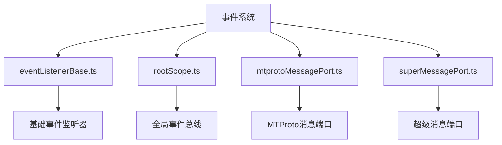
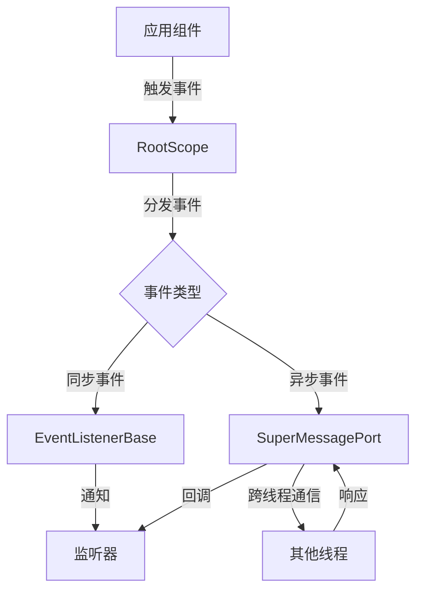
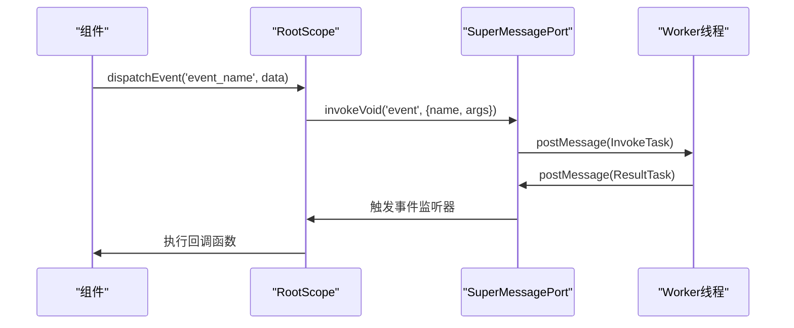
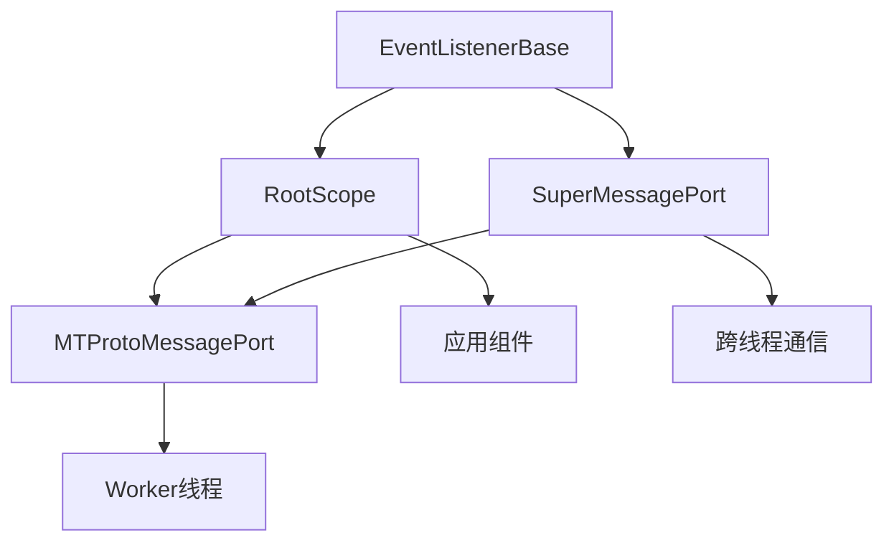

# 事件驱动架构

<cite>
**本文档引用的文件**
- [eventListenerBase.ts](file://src\helpers\eventListenerBase.ts)
- [rootScope.ts](file://src\lib\rootScope.ts)
- [mtprotoMessagePort.ts](file://src\lib\mtproto\mtprotoMessagePort.ts)
- [superMessagePort.ts](file://src\lib\mtproto\superMessagePort.ts)
- [logger.ts](file://src\lib\logger.ts)
- [appMediaPlaybackController.ts](file://src\components\appMediaPlaybackController.ts)
</cite>

## 目录
1. [项目结构](#项目结构)
2. [核心组件](#核心组件)
3. [架构概述](#架构概述)
4. [详细组件分析](#详细组件分析)
5. [依赖分析](#依赖分析)
6. [性能考虑](#性能考虑)
7. [故障排除指南](#故障排除指南)
8. [结论](#结论)

## 项目结构

tweb项目的事件驱动架构主要基于事件监听器模式实现，核心文件分布在`src/helpers`和`src/lib`目录下。事件系统通过`eventListenerBase.ts`提供基础功能，`rootScope.ts`作为全局事件总线，`mtprotoMessagePort.ts`和`superMessagePort.ts`处理跨线程通信。



**Diagram sources**
- [eventListenerBase.ts](file://src\helpers\eventListenerBase.ts#L1-L195)
- [rootScope.ts](file://src\lib\rootScope.ts#L1-L315)
- [mtprotoMessagePort.ts](file://src\lib\mtproto\mtprotoMessagePort.ts#L1-L91)
- [superMessagePort.ts](file://src\lib\mtproto\superMessagePort.ts#L1-L673)

**Section sources**
- [eventListenerBase.ts](file://src\helpers\eventListenerBase.ts#L1-L195)
- [rootScope.ts](file://src\lib\rootScope.ts#L1-L315)

## 核心组件

tweb项目的事件驱动架构由多个核心组件构成。`EventListenerBase`类提供了事件监听和分发的基础功能，`RootScope`类作为全局事件总线管理所有事件的注册和分发，`SuperMessagePort`类处理跨线程的事件通信。

**Section sources**
- [eventListenerBase.ts](file://src\helpers\eventListenerBase.ts#L65-L194)
- [rootScope.ts](file://src\lib\rootScope.ts#L250-L314)
- [superMessagePort.ts](file://src\lib\mtproto\superMessagePort.ts#L104-L672)

## 架构概述

tweb项目的事件驱动架构采用分层设计，底层是`EventListenerBase`提供的基础事件机制，中层是`RootScope`实现的全局事件总线，上层是`SuperMessagePort`处理的跨线程通信。这种设计实现了事件的同步和异步处理，支持组件间的松耦合。



**Diagram sources**
- [eventListenerBase.ts](file://src\helpers\eventListenerBase.ts#L65-L194)
- [rootScope.ts](file://src\lib\rootScope.ts#L250-L314)
- [superMessagePort.ts](file://src\lib\mtproto\superMessagePort.ts#L104-L672)

## 详细组件分析

### EventListenerBase 分析

`EventListenerBase`是事件系统的基础类，提供了事件监听、分发和清理的核心功能。它使用泛型约束确保类型安全，支持一次性事件监听器。

```mermaid
classDiagram
class EventListenerBase {
+listeners : Partial<Set<ListenerObject>>
+listenerResults : Partial<ArgumentTypes>
-reuseResults : boolean
+_constructor(reuseResults : boolean)
+addEventListener(name : T, callback : Listeners[T], options : boolean | AddEventListenerOptions)
+addMultipleEventsListeners(obj : {[name in keyof Listeners]? : Listeners[name]})
+removeEventListener(name : T, callback : Listeners[T], options : boolean | AddEventListenerOptions)
+dispatchEvent(name : T, ...args : ArgumentTypes[Listeners[T]])
+dispatchResultableEvent(name : T, ...args : ArgumentTypes[Listeners[T]])
+cleanup()
}
class ListenerObject {
+callback : T
+options : boolean | AddEventListenerOptions
}
EventListenerBase <|-- RootScope : "继承"
EventListenerBase <|-- SuperMessagePort : "继承"
```

**Diagram sources**
- [eventListenerBase.ts](file://src\helpers\eventListenerBase.ts#L65-L194)

**Section sources**
- [eventListenerBase.ts](file://src\helpers\eventListenerBase.ts#L65-L194)

### RootScope 分析

`RootScope`是全局事件总线的实现，继承自`EventListenerBase`，管理所有全局事件的生命周期。它定义了`BroadcastEvents`类型，明确了所有可能的事件类型及其参数。

```mermaid
classDiagram
class RootScope {
+myId : PeerId
-connectionStatus : {[name : string] : ConnectionStatusChange}
+settings : StateSettings
+managers : AppManagers
+premium : boolean
+getMyId() : PeerId
+getConnectionStatus() : {[name : string] : ConnectionStatusChange}
+getPremium() : boolean
+dispatchEventSingle(name : T, ...args : ArgumentTypes[L[T]])
}
class BroadcastEvents {
+chat_full_update : ChatId
+chat_update : ChatId
+user_update : UserId
+peer_pinned_messages : {peerId : PeerId, mids? : number[], pinned? : boolean, unpinAll? : true}
+dialog_draft : {peerId : PeerId, dialog : Dialog | ForumTopic, drop : boolean, draft : MyDraftMessage | undefined}
+history_append : {storageKey : MessagesStorageKey, message : MyMessage}
+message_edit : {storageKey : MessagesStorageKey, peerId : PeerId, mid : number, message : MyMessage}
+story_update : {peerId : PeerId, story : StoryItem, modifiedPinned? : boolean, modifiedArchive? : boolean, modifiedPinnedToTop? : boolean}
+group_call_update : GroupCall
+call_update : PhoneCall
+rtmp_call_update : RtmpCallInstance
+premium_toggle : boolean
+stars_balance : {balance : Long, fulfilledReservedStars? : number, ton : boolean}
}
EventListenerBase <|-- RootScope
```

**Diagram sources**
- [rootScope.ts](file://src\lib\rootScope.ts#L250-L314)

**Section sources**
- [rootScope.ts](file://src\lib\rootScope.ts#L35-L244)

### SuperMessagePort 分析

`SuperMessagePort`处理跨线程的事件通信，支持消息的批量发送和确认机制。它使用`MessagePort` API实现线程间通信，确保事件在不同执行上下文间的可靠传递。



**Diagram sources**
- [superMessagePort.ts](file://src\lib\mtproto\superMessagePort.ts#L104-L672)
- [mtprotoMessagePort.ts](file://src\lib\mtproto\mtprotoMessagePort.ts#L35-L90)

**Section sources**
- [superMessagePort.ts](file://src\lib\mtproto\superMessagePort.ts#L104-L672)

## 依赖分析

事件驱动架构的组件间存在明确的依赖关系。`RootScope`依赖`EventListenerBase`提供基础事件功能，`SuperMessagePort`依赖`EventListenerBase`处理内部事件，同时`RootScope`通过`MTProtoMessagePort`与`SuperMessagePort`交互。



**Diagram sources**
- [eventListenerBase.ts](file://src\helpers\eventListenerBase.ts#L65-L194)
- [rootScope.ts](file://src\lib\rootScope.ts#L250-L314)
- [superMessagePort.ts](file://src\lib\mtproto\superMessagePort.ts#L104-L672)

**Section sources**
- [eventListenerBase.ts](file://src\helpers\eventListenerBase.ts#L65-L194)
- [rootScope.ts](file://src\lib\rootScope.ts#L250-L314)
- [superMessagePort.ts](file://src\lib\mtproto\superMessagePort.ts#L104-L672)

## 性能考虑

事件驱动架构在性能方面有多个优化点。`EventListenerBase`使用`Set`存储监听器确保唯一性，`SuperMessagePort`支持批量发送减少通信开销，`RootScope`的事件类型定义使用联合类型提高类型检查效率。

**Section sources**
- [eventListenerBase.ts](file://src\helpers\eventListenerBase.ts#L65-L194)
- [superMessagePort.ts](file://src\lib\mtproto\superMessagePort.ts#L104-L672)

## 故障排除指南

事件系统可能出现的问题包括事件未触发、监听器重复注册、跨线程通信失败等。调试时应检查事件名称拼写、监听器注册时机、线程连接状态等。

**Section sources**
- [eventListenerBase.ts](file://src\helpers\eventListenerBase.ts#L65-L194)
- [superMessagePort.ts](file://src\lib\mtproto\superMessagePort.ts#L104-L672)
- [logger.ts](file://src\lib\logger.ts#L1-L184)

## 结论

tweb项目的事件驱动架构设计合理，通过分层架构实现了事件系统的灵活性和可扩展性。`EventListenerBase`提供基础功能，`RootScope`作为全局事件总线，`SuperMessagePort`处理跨线程通信，三者协同工作，支持复杂的事件处理需求。