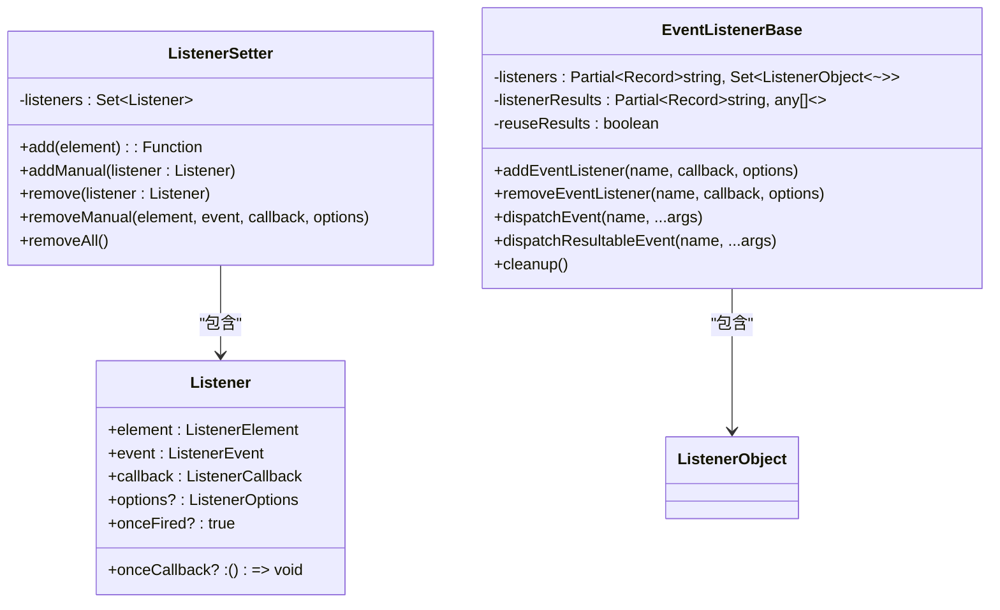
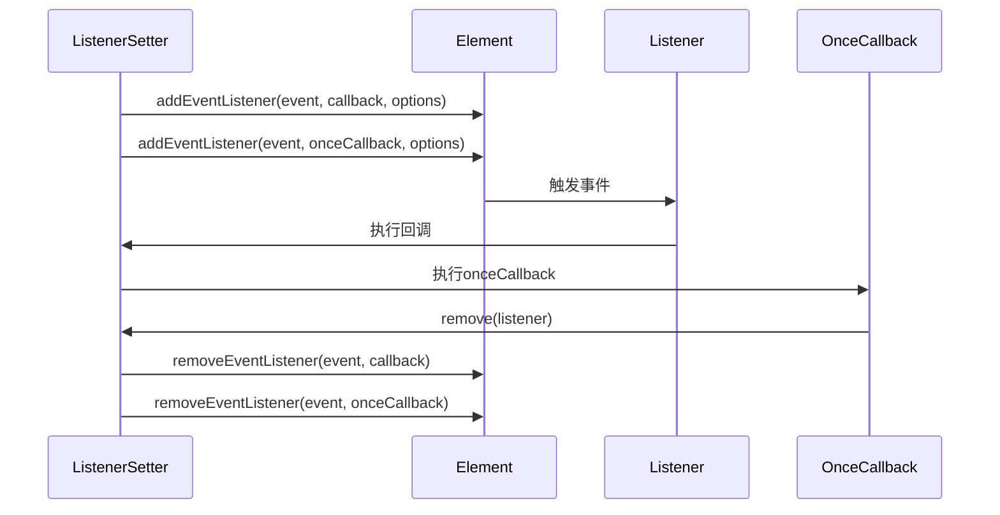
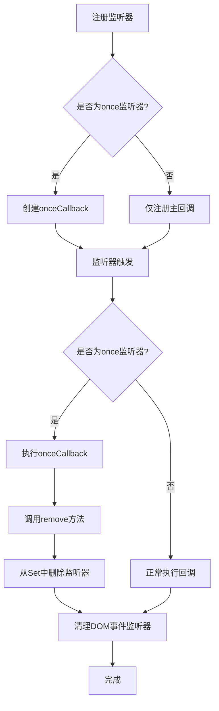
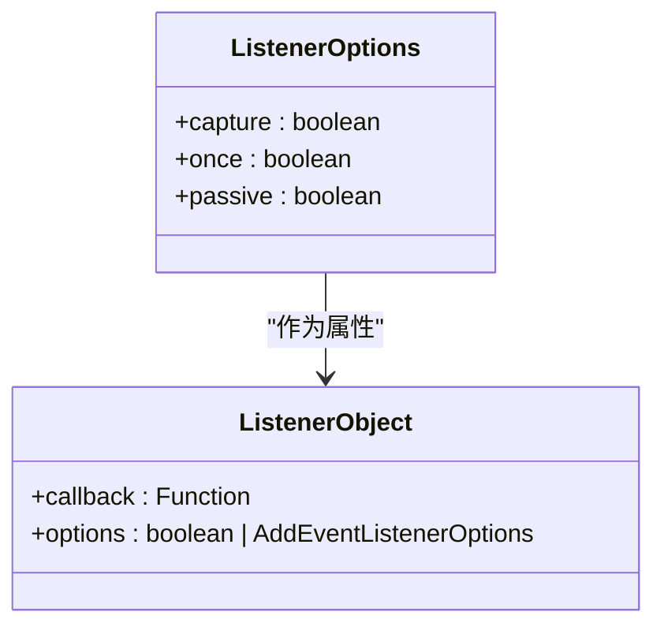
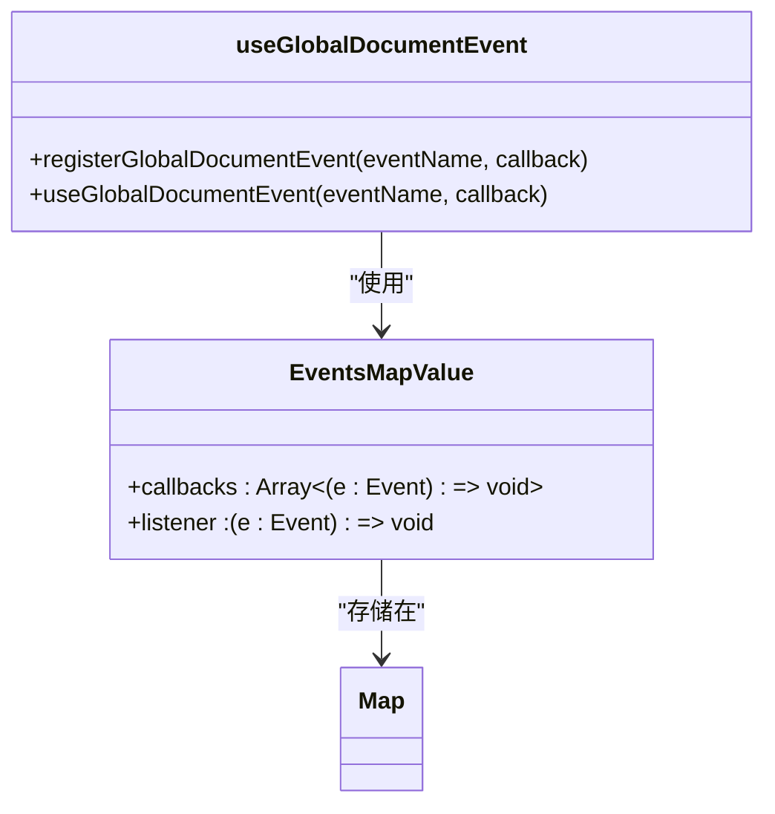
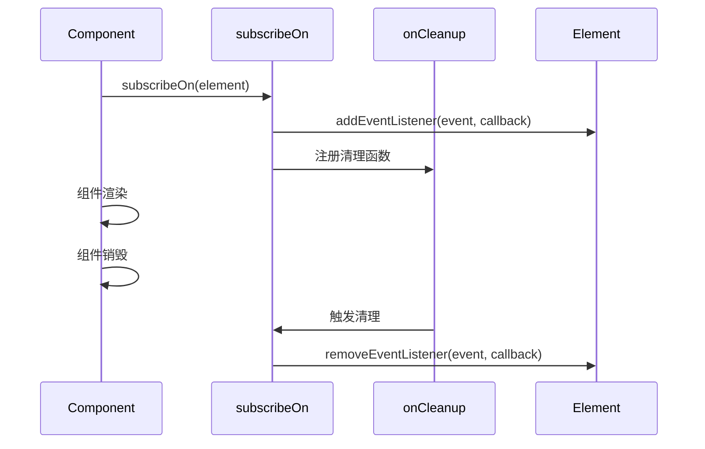
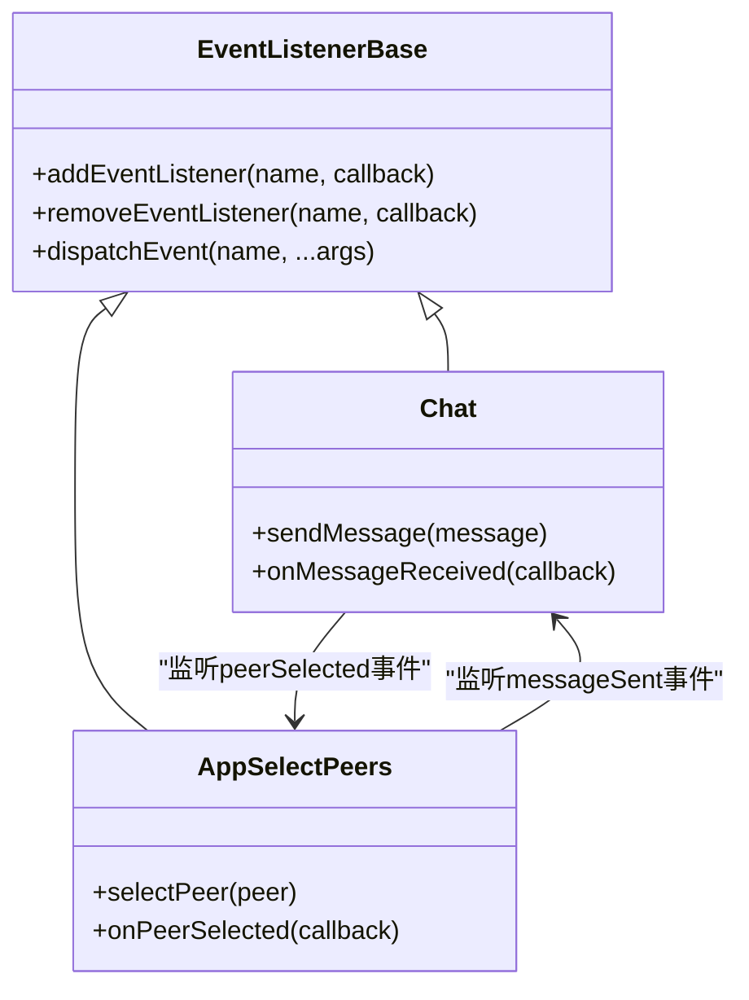
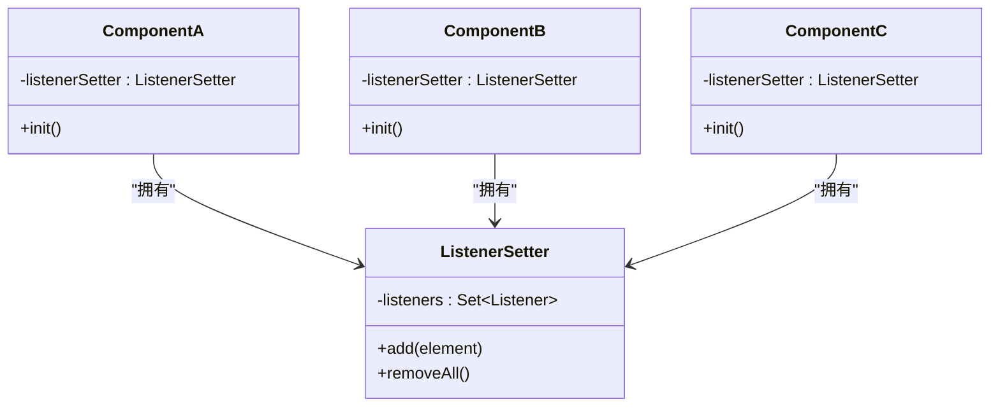

# 监听器管理

<cite>
**本文档中引用的文件**  
- [listenerSetter.ts](file://src/helpers/listenerSetter.ts)
- [eventListenerBase.ts](file://src/helpers/eventListenerBase.ts)
- [useGlobalDocumentEvent.ts](file://src/helpers/useGlobalDocumentEvent.ts)
- [subscribeOn.ts](file://src/helpers/solid/subscribeOn.ts)
- [appMediaPlaybackController.ts](file://src/components/appMediaPlaybackController.ts)
- [chat.ts](file://src/components/chat/chat.ts)
- [appSelectPeers.ts](file://src/components/appSelectPeers.ts)
- [useSwipe.ts](file://src/helpers/useSwipe.ts)
- [rtmp/hooks.ts](file://src/components/rtmp/hooks.ts)
</cite>

## 目录
1. [简介](#简介)
2. [监听器注册与管理机制](#监听器注册与管理机制)
3. [监听器生命周期管理](#监听器生命周期管理)
4. [监听器优先级与执行顺序](#监听器优先级与执行顺序)
5. [性能监控与调试工具](#性能监控与调试工具)
6. [组件间监听器共享与复用](#组件间监听器共享与复用)
7. [最佳实践示例](#最佳实践示例)
8. [总结](#总结)

## 简介
tweb项目采用了一套完整的事件监听器管理系统，用于处理DOM事件、自定义事件和组件间通信。该系统通过多个核心类和工具函数实现，确保了事件监听器的高效注册、管理和销毁，同时防止内存泄漏。本文档详细阐述了监听器的注册、生命周期管理、优先级控制、性能监控以及在不同组件间的共享复用机制。

## 监听器注册与管理机制

tweb项目提供了多种监听器注册方式，主要通过`ListenerSetter`类和`EventListenerBase`基类实现。`ListenerSetter`用于管理DOM元素和事件目标的监听器，而`EventListenerBase`则用于实现自定义事件系统。

`ListenerSetter`类通过`add`方法注册监听器，将监听器信息存储在内部的`Set`集合中，并调用原生的`addEventListener`方法。当监听器被触发时，如果设置了`once`选项，系统会自动清理该监听器。



**图源**  
- [listenerSetter.ts](file://src/helpers/listenerSetter.ts#L34-L109)
- [eventListenerBase.ts](file://src/helpers/eventListenerBase.ts#L65-L194)

**本节来源**  
- [listenerSetter.ts](file://src/helpers/listenerSetter.ts#L1-L109)
- [eventListenerBase.ts](file://src/helpers/eventListenerBase.ts#L1-L194)

## 监听器生命周期管理

tweb项目的监听器生命周期管理策略旨在确保资源的正确释放，防止内存泄漏。系统通过自动清理机制和手动销毁方法相结合的方式管理监听器的生命周期。

### 自动清理机制
当监听器的`options.once`设置为`true`时，系统会在监听器首次触发后自动将其移除。`ListenerSetter`类通过为`once`监听器创建一个额外的`onceCallback`来实现这一功能，该回调在执行后会调用`remove`方法清理监听器。



**图源**  
- [listenerSetter.ts](file://src/helpers/listenerSetter.ts#L51-L66)

### 内存泄漏预防
系统通过以下机制预防内存泄漏：
1. 所有通过`ListenerSetter`注册的监听器都会被存储在`Set`中，确保可以被统一管理
2. 提供`removeAll()`方法批量清理所有监听器
3. 在组件销毁时调用`cleanup()`方法重置监听器状态



**图源**  
- [listenerSetter.ts](file://src/helpers/listenerSetter.ts#L51-L80)

**本节来源**  
- [listenerSetter.ts](file://src/helpers/listenerSetter.ts#L51-L80)
- [eventListenerBase.ts](file://src/helpers/eventListenerBase.ts#L190-L193)

## 监听器优先级与执行顺序

tweb项目通过多种机制控制监听器的执行顺序和优先级：

### 执行顺序控制
1. **注册顺序**：监听器按照注册的先后顺序执行
2. **事件冒泡**：遵循DOM事件的冒泡机制
3. **自定义事件**：通过`dispatchEvent`方法按注册顺序调用所有监听器

### 优先级设置
系统通过`options`参数支持标准的事件监听器选项：
- `capture`：设置为`true`时在捕获阶段执行
- `once`：设置为`true`时只执行一次
- `passive`：设置为`true`时不会调用`preventDefault()`



**图源**  
- [listenerSetter.ts](file://src/helpers/listenerSetter.ts#L22)
- [eventListenerBase.ts](file://src/helpers/eventListenerBase.ts#L61)

**本节来源**  
- [listenerSetter.ts](file://src/helpers/listenerSetter.ts#L22)
- [eventListenerBase.ts](file://src/helpers/eventListenerBase.ts#L61)

## 性能监控与调试工具

tweb项目提供了一系列工具用于监听器的性能监控和调试：

### 全局文档事件管理
`useGlobalDocumentEvent`函数用于管理全局文档事件，避免重复注册和内存泄漏：



**图源**  
- [useGlobalDocumentEvent.ts](file://src/helpers/useGlobalDocumentEvent.ts#L10-L36)

### 调试工具
1. **Solid.js集成**：通过`subscribeOn`函数与Solid.js的`onCleanup`钩子集成，确保在组件销毁时自动清理监听器
2. **错误处理**：在`invokeListenerCallback`方法中捕获并处理监听器执行时的异常
3. **结果收集**：`dispatchResultableEvent`方法可以收集所有监听器的返回值



**图源**  
- [subscribeOn.ts](file://src/helpers/solid/subscribeOn.ts#L4-L13)
- [useGlobalDocumentEvent.ts](file://src/helpers/useGlobalDocumentEvent.ts#L38-L41)

**本节来源**  
- [useGlobalDocumentEvent.ts](file://src/helpers/useGlobalDocumentEvent.ts#L1-L42)
- [subscribeOn.ts](file://src/helpers/solid/subscribeOn.ts#L1-L14)

## 组件间监听器共享与复用

tweb项目通过多种模式实现监听器在不同组件间的共享和复用：

### 基于EventListenerBase的事件总线
通过继承`EventListenerBase`类，组件可以成为事件总线，实现组件间的通信：



**图源**  
- [chat.ts](file://src/components/chat/chat.ts#L95)
- [appSelectPeers.ts](file://src/components/appSelectPeers.ts#L458)

### ListenerSetter复用模式
多个组件可以共享同一个`ListenerSetter`实例，或者在组件内部创建独立的实例进行管理：



**图源**  
- [appMediaPlaybackController.ts](file://src/components/appMediaPlaybackController.ts#L1004)
- [appSelectPeers.ts](file://src/components/appSelectPeers.ts#L458)
- [chat/bubbles.ts](file://src/components/chat/bubbles.ts#L591)

**本节来源**  
- [chat.ts](file://src/components/chat/chat.ts#L95)
- [appSelectPeers.ts](file://src/components/appSelectPeers.ts#L458)
- [appMediaPlaybackController.ts](file://src/components/appMediaPlaybackController.ts#L1004)

## 最佳实践示例

以下是tweb项目中监听器管理的最佳实践示例：

### 1. 使用ListenerSetter管理DOM事件
```typescript
// 在组件中创建ListenerSetter实例
this.listenerSetter = new ListenerSetter();

// 使用add方法注册事件监听器
const addEventListener = this.listenerSetter.add(element);
addEventListener('click', this.handleClick);
addEventListener('mouseover', this.handleMouseOver);

// 组件销毁时，ListenerSetter会自动清理所有监听器
```

**本节来源**  
- [appSelectPeers.ts](file://src/components/appSelectPeers.ts#L458)

### 2. 使用EventListenerBase实现组件通信
```typescript
// 组件继承EventListenerBase
export default class Chat extends EventListenerBase<{
  messageSent: (message: Message) => void;
  messageReceived: (message: Message) => void;
}> {
  // 发送消息时触发事件
  public sendMessage(message: Message) {
    this.dispatchEvent('messageSent', message);
  }
  
  // 接收消息时触发事件
  public receiveMessage(message: Message) {
    this.dispatchEvent('messageReceived', message);
  }
}

// 其他组件可以监听这些事件
chat.addEventListener('messageSent', (message) => {
  console.log('消息已发送:', message);
});
```

**本节来源**  
- [chat.ts](file://src/components/chat/chat.ts#L95)

### 3. 使用useGlobalDocumentEvent管理全局事件
```typescript
// 注册全局文档事件
useGlobalDocumentEvent('keydown', (e) => {
  if(e.key === 'Escape') {
    closeModal();
  }
});

// 该事件会在组件销毁时自动清理
```

**本节来源**  
- [useGlobalDocumentEvent.ts](file://src/helpers/useGlobalDocumentEvent.ts#L38-L41)

### 4. 使用subscribeOn与Solid.js集成
```typescript
// 在Solid.js组件中使用subscribeOn
const subscribe = subscribeOn(element);
subscribe('click', handleClick);
subscribe('input', handleInput);

// 当组件销毁时，onCleanup会自动清理所有事件监听器
```

**本节来源**  
- [subscribeOn.ts](file://src/helpers/solid/subscribeOn.ts#L4-L13)

## 总结
tweb项目的监听器管理系统通过`ListenerSetter`和`EventListenerBase`两个核心类，提供了完整的事件监听器注册、管理和销毁机制。系统通过自动清理、内存泄漏预防、执行顺序控制等策略确保了事件系统的稳定性和性能。同时，通过与Solid.js框架的深度集成，实现了组件生命周期与事件监听器生命周期的同步管理。开发者可以根据具体需求选择合适的监听器管理方式，遵循最佳实践确保代码的可维护性和性能。

**本节来源**  
- [listenerSetter.ts](file://src/helpers/listenerSetter.ts)
- [eventListenerBase.ts](file://src/helpers/eventListenerBase.ts)
- [useGlobalDocumentEvent.ts](file://src/helpers/useGlobalDocumentEvent.ts)
- [subscribeOn.ts](file://src/helpers/solid/subscribeOn.ts)