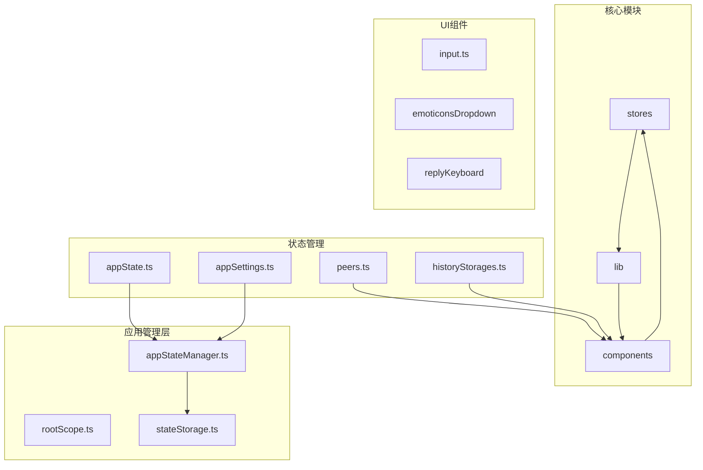
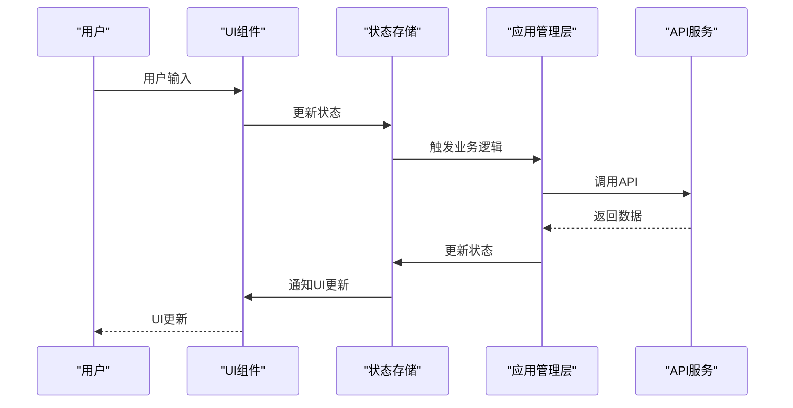
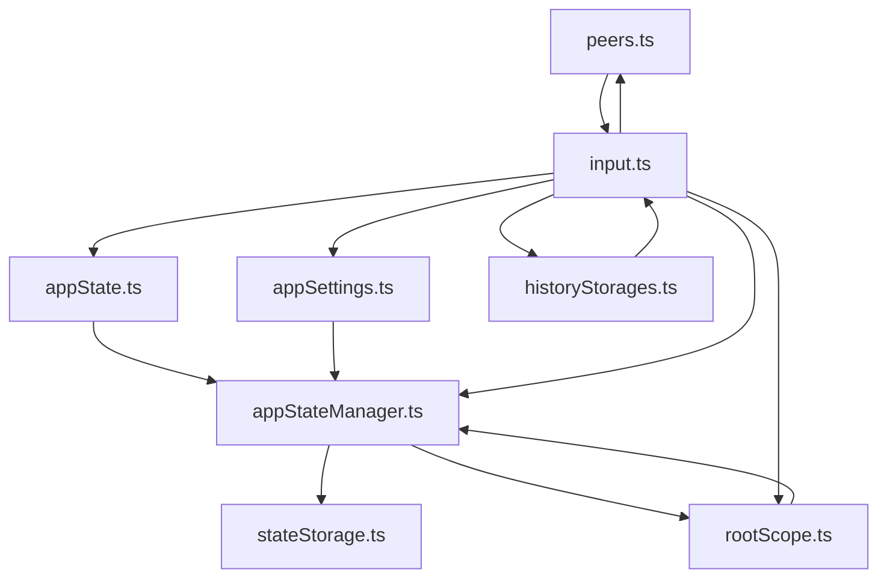

# 客户端数据流

<cite>
**本文档引用的文件**
- [index.ts](file://src/index.ts)
- [appState.ts](file://src/stores/appState.ts)
- [appStateManager.ts](file://src/lib/appManagers/appStateManager.ts)
- [rootScope.ts](file://src/lib/rootScope.ts)
- [appSettings.ts](file://src/stores/appSettings.ts)
- [peers.ts](file://src/stores/peers.ts)
- [historyStorages.ts](file://src/stores/historyStorages.ts)
- [input.ts](file://src/components/chat/input.ts)
- [stateStorage.ts](file://src/lib/stateStorage.ts)
</cite>

## 目录
1. [简介](#简介)
2. [项目结构](#项目结构)
3. [核心组件](#核心组件)
4. [架构概述](#架构概述)
5. [详细组件分析](#详细组件分析)
6. [依赖分析](#依赖分析)
7. [性能考虑](#性能考虑)
8. [故障排除指南](#故障排除指南)
9. [结论](#结论)
10. [附录](#附录)（如有必要）

## 简介
本文档详细描述了tweb项目的客户端数据流架构。我们将深入分析从用户输入到UI更新的完整数据流路径，解释状态存储（stores）如何与UI组件进行响应式绑定，说明应用管理层如何处理业务逻辑并更新状态，阐述数据流的中间处理过程，包括数据转换、验证和缓存策略，并提供客户端数据流的调试方法和性能优化建议。

## 项目结构
tweb项目采用模块化架构，将代码组织为清晰的目录结构。核心组件包括stores（状态管理）、components（UI组件）、lib（应用管理器和工具库）等。这种结构使得数据流的管理和追踪更加清晰。



**图表来源**
- [appState.ts](file://src/stores/appState.ts)
- [appSettings.ts](file://src/stores/appSettings.ts)
- [peers.ts](file://src/stores/peers.ts)
- [historyStorages.ts](file://src/stores/historyStorages.ts)
- [appStateManager.ts](file://src/lib/appManagers/appStateManager.ts)
- [stateStorage.ts](file://src/lib/stateStorage.ts)
- [input.ts](file://src/components/chat/input.ts)

**章节来源**
- [src/index.ts](file://src/index.ts#L1-L682)
- [src/stores](file://src/stores)

## 核心组件
tweb项目的核心组件包括状态存储（stores）、应用管理层（app managers）和UI组件。这些组件协同工作，实现了从用户输入到UI更新的完整数据流。

**章节来源**
- [appState.ts](file://src/stores/appState.ts#L1-L39)
- [appSettings.ts](file://src/stores/appSettings.ts#L1-L45)
- [peers.ts](file://src/stores/peers.ts#L1-L28)
- [historyStorages.ts](file://src/stores/historyStorages.ts#L1-L29)

## 架构概述
tweb项目的客户端数据流遵循单向数据流模式，从用户输入开始，经过应用管理层处理，最终更新到UI组件。状态存储（stores）作为数据的单一来源，确保了数据的一致性和可预测性。



**图表来源**
- [appState.ts](file://src/stores/appState.ts#L1-L39)
- [appStateManager.ts](file://src/lib/appManagers/appStateManager.ts#L1-L133)
- [input.ts](file://src/components/chat/input.ts#L1-L800)

## 详细组件分析
本节将深入分析tweb项目中的关键组件，包括状态存储、应用管理层和UI组件，以及它们之间的交互。

### 状态存储分析
tweb项目使用SolidJS的store机制来管理应用状态。状态存储作为数据的单一来源，确保了数据的一致性和可预测性。

```mermaid
classDiagram
class AppState {
+appState : State
+useAppState() : [State, SetStoreFunction]
+setAppState(key : string, value : any) : Promise~void~
+setAppStateSilent(key : any, value? : any) : void
}
class AppSettings {
+appSettings : StateSettings
+useAppSettings() : [StateSettings, SetStoreFunction]
+setAppSettings(key : string, value : any) : Promise~void~
+setAppSettingsSilent(key : string, value : any) : void
}
class Peers {
+state : {[peerId : PeerId] : NotEmptyPeer}
+usePeer(peerId : PeerId) : NotEmptyPeer
+useChat(chatId : ChatId) : Chat
+useUser(userId : UserId) : User
+reconcilePeer(peerId : PeerId, peer : NotEmptyPeer) : void
+reconcilePeers(peers : {[peerId : PeerId] : NotEmptyPeer}) : void
}
class HistoryStorages {
+cache : {[key in HistoryStorageKey] : ReturnType<typeof createStore~HistoryStorage~>}
+useHistoryStorage(key : HistoryStorageKey) : HistoryStorage
+_useHistoryStorage(key : HistoryStorageKey) : [HistoryStorage, SetStoreFunction]
+_deleteHistoryStorage(key : HistoryStorageKey) : void
+_changeHistoryStorageKey(key : HistoryStorageKey, newKey : HistoryStorageKey) : void
}
AppState --> AppStateManager : "依赖"
AppSettings --> AppStateManager : "依赖"
Peers --> UIComponents : "提供数据"
HistoryStorages --> UIComponents : "提供数据"
```

**图表来源**
- [appState.ts](file://src/stores/appState.ts#L1-L39)
- [appSettings.ts](file://src/stores/appSettings.ts#L1-L45)
- [peers.ts](file://src/stores/peers.ts#L1-L28)
- [historyStorages.ts](file://src/stores/historyStorages.ts#L1-L29)

**章节来源**
- [appState.ts](file://src/stores/appState.ts#L1-L39)
- [appSettings.ts](file://src/stores/appSettings.ts#L1-L45)
- [peers.ts](file://src/stores/peers.ts#L1-L28)
- [historyStorages.ts](file://src/stores/historyStorages.ts#L1-L29)

### 应用管理层分析
应用管理层负责处理业务逻辑，与API服务交互，并更新状态存储。它是连接UI组件和后端服务的桥梁。

```mermaid
classDiagram
class AppStateManager {
-state : State
-storage : StateStorage
+newVersion : string
+oldVersion : string
+userId : UserId
+onSettingsUpdate : (value : StateSettings) => void
+resetStoragesPromise : ResetStoragesPromise
+constructor(accountNumber : ActiveAccountNumber)
+getState() : Promise~State~
+setByKey(key : string, value : any) : Promise~void~
+pushToState~T~(key : T, value : State~T~, direct = true, onlyLocal? : boolean) : Promise~void~
+updateLocalState~T~(key : T, value : State~T~) : Promise~void~
+setKeyValueToStorage~T~(key : T, value : State~T~ = this.state~key~, onlyLocal? : boolean) : Promise~void~
+getSomethingCached~T~({key, defaultValue, getValue, overwrite} : {key : T, defaultValue : State~T~~value~, getValue : () => Promise~State~T~~value~~, overwrite? : boolean}) : Promise~State~T~~value~~
}
class RootScope {
+myId : PeerId
-connectionStatus : {[name : string] : ConnectionStatusChange}
+settings : StateSettings
+managers : AppManagers
+premium : boolean
+constructor()
+getConnectionStatus() : {[name : string] : ConnectionStatusChange}
+getPremium() : boolean
+getMyId() : PeerId
+dispatchEventSingle~L, T~(name : T, ...args : ArgumentTypes~L~T~~) : void
}
class StateStorage {
-db : AccountDatabase
-table : string
+constructor(accountNumber : ActiveAccountNumber | 'old')
+set(data : Partial~{chatPositions : {[peerId_threadId : string] : ChatSavedPosition}, drafts : AppDraftsManager~drafts~} & State~, onlyLocal? : boolean) : Promise~void~
+get(key : keyof ({chatPositions : {[peerId_threadId : string] : ChatSavedPosition}, drafts : AppDraftsManager~drafts~} & State)) : Promise~any~
+delete(key : keyof ({chatPositions : {[peerId_threadId : string] : ChatSavedPosition}, drafts : AppDraftsManager~drafts~} & State)) : Promise~void~
}
AppStateManager --> StateStorage : "使用"
AppStateManager --> RootScope : "使用"
RootScope --> AppStateManager : "通知"
```

**图表来源**
- [appStateManager.ts](file://src/lib/appManagers/appStateManager.ts#L1-L133)
- [rootScope.ts](file://src/lib/rootScope.ts#L1-L315)
- [stateStorage.ts](file://src/lib/stateStorage.ts#L1-L28)

**章节来源**
- [appStateManager.ts](file://src/lib/appManagers/appStateManager.ts#L1-L133)
- [rootScope.ts](file://src/lib/rootScope.ts#L1-L315)
- [stateStorage.ts](file://src/lib/stateStorage.ts#L1-L28)

### UI组件分析
UI组件负责接收用户输入，显示数据，并与状态存储和应用管理层交互。它们通过响应式绑定自动更新UI。

```mermaid
classDiagram
class ChatInput {
-messageInput : HTMLElement
-messageInputField : InputFieldAnimated
-fileInput : HTMLInputElement
-inputMessageContainer : HTMLDivElement
-btnSend : HTMLButtonElement
-btnCancelRecord : HTMLButtonElement
-btnReaction : HTMLButtonElement
-lastUrl : string
-lastTimeType : number
-noRipple : boolean
-chatInput : HTMLElement
-inputContainer : HTMLElement
-rowsWrapper : HTMLDivElement
-newMessageWrapper : HTMLDivElement
-btnToggleEmoticons : HTMLButtonElement
-btnToggleReplyMarkup : HTMLButtonElement
-btnSendContainer : HTMLDivElement
-replyKeyboard : ReplyKeyboard
-attachMenu : HTMLElement
-attachMenuButtons : ButtonMenuItemOptionsVerifiable[]
-btnSuggestPost : HTMLElement
-sendMenu : SendMenu
-replyElements : {container : HTMLElement, cancelBtn : HTMLButtonElement, iconBtn : HTMLButtonElement, menuContainer : HTMLElement, replyInAnother : ButtonMenuItemOptions, doNotReply : ButtonMenuItemOptions, doNotQuote : ButtonMenuItemOptions}
-forwardElements : {changePeer : ButtonMenuItemOptions, showSender : ButtonMenuItemOptions, hideSender : ButtonMenuItemOptions, showCaption : ButtonMenuItemOptions, hideCaption : ButtonMenuItemOptions, container : HTMLElement, modifyArgs? : ButtonMenuItemOptions[]}
-webPageElements : {above : ButtonMenuItemOptions, below : ButtonMenuItemOptions, larger : ButtonMenuItemOptions, smaller : ButtonMenuItemOptions, container : HTMLElement}
-forwardHover : DropdownHover
-webPageHover : DropdownHover
-replyHover : DropdownHover
-currentHover : DropdownHover
-forwardWasDroppingAuthor : boolean
-getWebPagePromise : Promise~void~
-willSendWebPage : WebPage
-webPageOptions : Parameters~AppMessagesManager~sendText~~~0~~~webPageOptions~
-forwarding : {[fromPeerId : PeerId] : number[]}
-replyToMsgId : MessageSendingParams~replyToMsgId~
-replyToStoryId : MessageSendingParams~replyToStoryId~
-replyToQuote : MessageSendingParams~replyToQuote~
-replyToPeerId : MessageSendingParams~replyToPeerId~
-replyToMonoforumPeerId : MessageSendingParams~replyToMonoforumPeerId~
-editMsgId : number
-editMessage : Message.message
-noWebPage : true
-scheduleDate : number
-sendSilent : true
-startParam : string
-invertMedia : boolean
-effect : Accessor~DocId~
-setEffect : Setter~DocId~
-recorder : any
-recording : boolean
-recordCanceled : boolean
-recordTimeEl : HTMLElement
-recordRippleEl : HTMLElement
-recordStartTime : number
-recordingOverlayListener : Listener
-recordingNavigationItem : NavigationItem
-helperType : Exclude~ChatInputHelperType, 'webpage'~
-helperFunc : () => void | Promise~void~
-helperWaitingForward : boolean
-helperWaitingReply : boolean
-willAttachType : 'document' | 'media'
-autocompleteHelperController : AutocompleteHelperController
-stickersHelper : StickersHelper
-emojiHelper : EmojiHelper
-commandsHelper : CommandsHelper
-mentionsHelper : MentionsHelper
-inlineHelper : InlineHelper
-listenerSetter : ListenerSetter
-hoverListenerSetter : ListenerSetter
-pinnedControlBtn : HTMLButtonElement
-openChatBtn : HTMLButtonElement
-goDownBtn : HTMLButtonElement
-goDownUnreadBadge : HTMLElement
-goMentionBtn : HTMLButtonElement
-goMentionUnreadBadge : HTMLSpanElement
-goReactionBtn : HTMLButtonElement
-goReactionUnreadBadge : HTMLElement
-btnScheduled : HTMLButtonElement
-btnPreloader : HTMLButtonElement
-saveDraftDebounced : () => void
-fakeRowsWrapper : HTMLDivElement
-previousQuery : string
-releaseMediaPlayback : () => void
-botStartBtn : HTMLButtonElement
-unblockBtn : HTMLButtonElement
-onlyPremiumBtn : HTMLButtonElement
-onlyPremiumBtnText : I18n.IntlElement
-frozenBtn : HTMLButtonElement
-joinBtn : HTMLButtonElement
-rowsWrapperWrapper : HTMLDivElement
-controlContainer : HTMLElement
-fakeSelectionWrapper : HTMLDivElement
-starsBadge : HTMLElement
-starsBadgeStars : HTMLElement
-fakeWrapperTo : HTMLElement
-toggleControlButtonDisability : () => void
-botCommandsToggle : HTMLElement
-botCommands : ChatBotCommands
-botCommandsIcon : HTMLElement
-botCommandsView : HTMLElement
-botMenuButton : BotMenuButton.botMenuButton
-hasBotCommands : boolean
-sendAs : ChatSendAs
-sendAsPeerId : PeerId
-replyInTopicOverlay : HTMLDivElement
-restoreInputLock : () => void
-isFocused : boolean
-freezedFocused : boolean
-onFocusChange : (isFocused : boolean) => void
-onMenuToggle : (isOpen : boolean) => void
-onRecording : (isRecording : boolean) => void
-onUpdateSendBtn : (icon : ChatSendBtnIcon) => void
-onMessageSent2 : () => void
-forwardStoryCallback : (e : MouseEvent) => void
-emoticonsDropdown : EmoticonsDropdown
-excludeParts : Partial~{scheduled : boolean, replyMarkup : boolean, downButton : boolean, reply : boolean, forwardOptions : boolean, mentionButton : boolean, botCommands : boolean, attachMenu : boolean, commandsHelper : boolean, emoticons : boolean}~
-globalMentions : boolean
-onFileSelection : (promise : Promise~File[]~) => void
-hasOffset : {type : 'commands' | 'as', forwards : boolean}
-canForwardStory : boolean
-processingDraftMessage : DraftMessage.draftMessage
-fileSelectionPromise : CancellablePromise~File[]~
-paidMessageInterceptor : PaidMessagesInterceptor
-starsState : ReturnType~ChatInput~createStarsState~~
-directMessagesHandler : ReturnType~ChatInput~createDirectMessagesHandler~~
-suggestedPost : SuggestedPostPayload
+constructor(chat : Chat, appImManager : AppImManager, managers : AppManagers, className : string)
+construct() : void
+freezeFocused(focused : boolean) : void
+createButtonIcon(...args : Parameters~typeof ButtonIcon~) : HTMLButtonElement
+constructGoDownButton() : void
+constructReplyElements() : void
+constructForwardElements() : void
+constructWebPageElements() : void
+constructMentionButton(isReaction? : boolean) : void
+constructScheduledButton() : void
+constructReplyMarkup() : void
}
ChatInput --> AppState : "依赖"
ChatInput --> AppSettings : "依赖"
ChatInput --> Peers : "依赖"
ChatInput --> HistoryStorages : "依赖"
ChatInput --> AppStateManager : "依赖"
ChatInput --> RootScope : "依赖"
```

**图表来源**
- [input.ts](file://src/components/chat/input.ts#L1-L800)

**章节来源**
- [input.ts](file://src/components/chat/input.ts#L1-L800)

## 依赖分析
tweb项目的组件之间存在明确的依赖关系。状态存储作为数据的单一来源，被应用管理层和UI组件共同依赖。应用管理层负责处理业务逻辑，与API服务交互，并更新状态存储。UI组件通过响应式绑定自动更新UI。



**图表来源**
- [appState.ts](file://src/stores/appState.ts#L1-L39)
- [appSettings.ts](file://src/stores/appSettings.ts#L1-L45)
- [peers.ts](file://src/stores/peers.ts#L1-L28)
- [historyStorages.ts](file://src/stores/historyStorages.ts#L1-L29)
- [appStateManager.ts](file://src/lib/appManagers/appStateManager.ts#L1-L133)
- [rootScope.ts](file://src/lib/rootScope.ts#L1-L315)
- [stateStorage.ts](file://src/lib/stateStorage.ts#L1-L28)
- [input.ts](file://src/components/chat/input.ts#L1-L800)

**章节来源**
- [appState.ts](file://src/stores/appState.ts#L1-L39)
- [appSettings.ts](file://src/stores/appSettings.ts#L1-L45)
- [peers.ts](file://src/stores/peers.ts#L1-L28)
- [historyStorages.ts](file://src/stores/historyStorages.ts#L1-L29)
- [appStateManager.ts](file://src/lib/appManagers/appStateManager.ts#L1-L133)
- [rootScope.ts](file://src/lib/rootScope.ts#L1-L315)
- [stateStorage.ts](file://src/lib/stateStorage.ts#L1-L28)
- [input.ts](file://src/components/chat/input.ts#L1-L800)

## 性能考虑
tweb项目在性能方面做了多项优化，包括使用SolidJS的响应式系统来最小化DOM更新，使用debounce和throttle来优化频繁的事件处理，以及使用caching来减少重复的API调用。

## 故障排除指南
在调试tweb项目的客户端数据流时，可以使用以下方法：
1. 使用浏览器的开发者工具检查状态存储的当前值。
2. 在关键的事件处理函数中添加console.log语句，以跟踪数据流。
3. 使用SolidJS的开发工具来检查组件的响应式依赖关系。
4. 检查网络请求，确保API调用按预期工作。

**章节来源**
- [appState.ts](file://src/stores/appState.ts#L1-L39)
- [appStateManager.ts](file://src/lib/appManagers/appStateManager.ts#L1-L133)
- [input.ts](file://src/components/chat/input.ts#L1-L800)

## 结论
tweb项目的客户端数据流设计良好，遵循单向数据流模式，使用状态存储作为数据的单一来源，确保了数据的一致性和可预测性。应用管理层负责处理业务逻辑，与API服务交互，并更新状态存储。UI组件通过响应式绑定自动更新UI。这种架构使得代码易于理解和维护，同时也便于调试和性能优化。

## 附录
本文档中提到的所有文件路径均为相对于项目根目录的相对路径。所有代码示例均来自tweb项目的实际代码库，确保了文档的准确性和实用性。