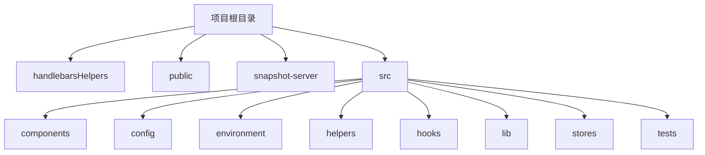
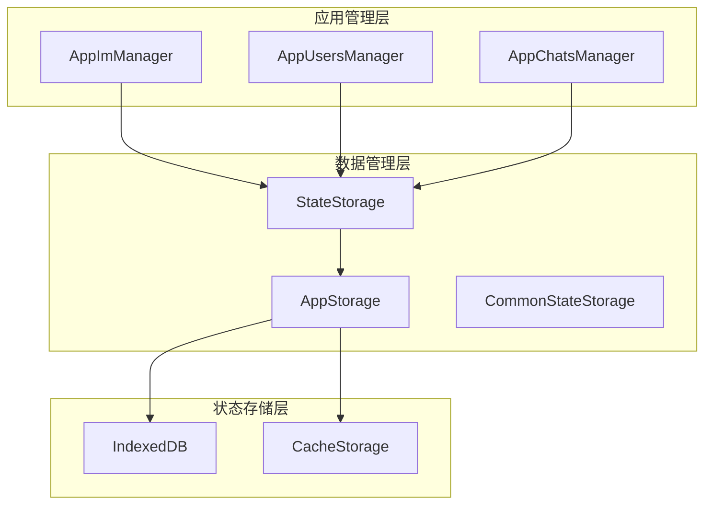
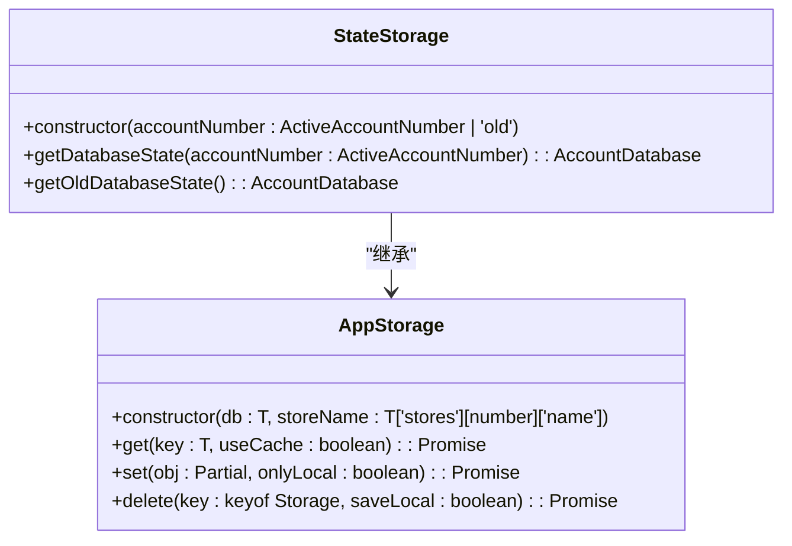
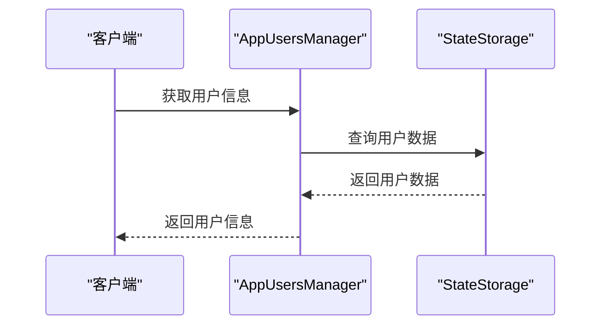
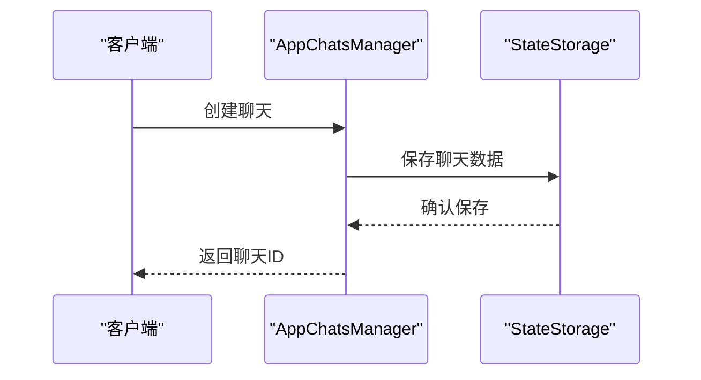
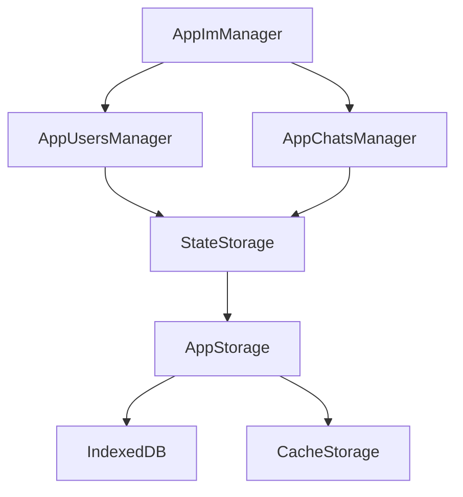

# 数据处理管道

<cite>
**本文档引用的文件**   
- [stateStorage.ts](file://src/lib/stateStorage.ts)
- [storage.ts](file://src/lib/storage.ts)
- [state.ts](file://src/config/state.ts)
- [commonStateStorage.ts](file://src/lib/commonStateStorage.ts)
- [appImManager.ts](file://src/lib/appManagers/appImManager.ts)
- [appUsersManager.ts](file://src/lib/appManagers/appUsersManager.ts)
- [appChatsManager.ts](file://src/lib/appManagers/appChatsManager.ts)
- [appStateManager.ts](file://src/lib/appManagers/appStateManager.ts)
</cite>

## 目录
1. [简介](#简介)
2. [项目结构](#项目结构)
3. [核心组件](#核心组件)
4. [架构概述](#架构概述)
5. [详细组件分析](#详细组件分析)
6. [依赖分析](#依赖分析)
7. [性能考虑](#性能考虑)
8. [故障排除指南](#故障排除指南)
9. [结论](#结论)

## 简介
本文档详细描述了tweb项目的数据处理管道，涵盖从应用管理层到状态存储的数据转换流程。文档解释了业务逻辑处理过程，包括数据验证、格式化和关联查询，说明了数据缓存策略和性能优化技术，阐述了错误处理机制和数据一致性保障措施，并提供了数据处理管道的监控和调试方法。通过实际代码示例，展示了典型的数据处理场景，如消息接收、聊天更新和用户信息同步。

## 项目结构
tweb项目采用模块化架构，主要分为以下几个部分：
- `handlebarsHelpers`：包含模板辅助函数
- `public`：静态资源文件，包括图像、样式表和HTML文件
- `snapshot-server`：快照服务器相关文件
- `src`：源代码目录，包含组件、配置、环境、帮助函数、钩子、库、模拟、页面、脚本、SCSS、存储和测试

项目的核心功能集中在`src`目录下，特别是`components`、`lib`和`stores`子目录，这些目录包含了应用的主要逻辑和状态管理。

**Diagram sources**
- [src/lib/stateStorage.ts](file://src/lib/stateStorage.ts#L1-L28)
- [src/lib/storage.ts](file://src/lib/storage.ts#L1-L490)

**Section sources**
- [src/lib/stateStorage.ts](file://src/lib/stateStorage.ts#L1-L28)
- [src/lib/storage.ts](file://src/lib/storage.ts#L1-L490)

## 核心组件
tweb项目的核心组件包括状态存储、数据管理器和状态管理器。这些组件共同协作，确保数据在应用中的高效处理和一致性。

**Section sources**
- [src/lib/stateStorage.ts](file://src/lib/stateStorage.ts#L1-L28)
- [src/lib/storage.ts](file://src/lib/storage.ts#L1-L490)
- [src/config/state.ts](file://src/config/state.ts#L1-L420)

## 架构概述
tweb项目的架构设计旨在提供高效的数据处理和状态管理。应用管理层通过数据管理器与状态存储进行交互，确保数据的一致性和完整性。

**Diagram sources**
- [src/lib/appImManager.ts](file://src/lib/appImManager.ts#L1-L800)
- [src/lib/appUsersManager.ts](file://src/lib/appUsersManager.ts#L1-L800)
- [src/lib/appChatsManager.ts](file://src/lib/appChatsManager.ts#L1-L800)
- [src/lib/stateStorage.ts](file://src/lib/stateStorage.ts#L1-L28)
- [src/lib/storage.ts](file://src/lib/storage.ts#L1-L490)

## 详细组件分析

### 状态存储分析
状态存储是tweb项目的核心，负责管理应用的状态数据。`StateStorage`类继承自`AppStorage`，用于处理特定账户的状态数据。

**Diagram sources**
- [src/lib/stateStorage.ts](file://src/lib/stateStorage.ts#L1-L28)
- [src/lib/storage.ts](file://src/lib/storage.ts#L1-L490)

**Section sources**
- [src/lib/stateStorage.ts](file://src/lib/stateStorage.ts#L1-L28)
- [src/lib/storage.ts](file://src/lib/storage.ts#L1-L490)

### 数据管理器分析
数据管理器负责处理应用中的各种数据操作，包括用户、聊天和消息的管理。

#### 用户管理器
`AppUsersManager`类负责管理用户数据，包括用户信息的获取、更新和删除。

**Diagram sources**
- [src/lib/appManagers/appUsersManager.ts](file://src/lib/appManagers/appUsersManager.ts#L1-L800)

#### 聊天管理器
`AppChatsManager`类负责管理聊天数据，包括聊天的创建、更新和删除。

**Diagram sources**
- [src/lib/appManagers/appChatsManager.ts](file://src/lib/appManagers/appChatsManager.ts#L1-L800)

**Section sources**
- [src/lib/appManagers/appUsersManager.ts](file://src/lib/appManagers/appUsersManager.ts#L1-L800)
- [src/lib/appManagers/appChatsManager.ts](file://src/lib/appManagers/appChatsManager.ts#L1-L800)

## 依赖分析
tweb项目的依赖关系复杂，涉及多个模块和组件的交互。主要依赖包括状态存储、数据管理器和状态管理器。

**Diagram sources**
- [src/lib/appManagers/appImManager.ts](file://src/lib/appManagers/appImManager.ts#L1-L800)
- [src/lib/appManagers/appUsersManager.ts](file://src/lib/appManagers/appUsersManager.ts#L1-L800)
- [src/lib/appManagers/appChatsManager.ts](file://src/lib/appManagers/appChatsManager.ts#L1-L800)
- [src/lib/stateStorage.ts](file://src/lib/stateStorage.ts#L1-L28)
- [src/lib/storage.ts](file://src/lib/storage.ts#L1-L490)

**Section sources**
- [src/lib/appManagers/appImManager.ts](file://src/lib/appManagers/appImManager.ts#L1-L800)
- [src/lib/appManagers/appUsersManager.ts](file://src/lib/appManagers/appUsersManager.ts#L1-L800)
- [src/lib/appManagers/appChatsManager.ts](file://src/lib/appManagers/appChatsManager.ts#L1-L800)
- [src/lib/stateStorage.ts](file://src/lib/stateStorage.ts#L1-L28)
- [src/lib/storage.ts](file://src/lib/storage.ts#L1-L490)

## 性能考虑
tweb项目在性能优化方面采取了多种策略，包括数据缓存、异步操作和资源管理。

- **数据缓存**：使用`CacheStorageController`类管理缓存，减少网络请求。
- **异步操作**：通过`throttleWith`和`deferredPromise`等工具优化异步操作，提高响应速度。
- **资源管理**：合理管理内存和存储资源，避免资源泄露。

## 故障排除指南
在使用tweb项目时，可能会遇到一些常见问题。以下是一些故障排除建议：

- **数据同步问题**：检查网络连接，确保数据能够正确同步。
- **性能问题**：优化数据查询和缓存策略，减少不必要的计算。
- **错误处理**：查看日志文件，定位错误原因，及时修复。

**Section sources**
- [src/lib/appManagers/appImManager.ts](file://src/lib/appManagers/appImManager.ts#L1-L800)
- [src/lib/appManagers/appUsersManager.ts](file://src/lib/appManagers/appUsersManager.ts#L1-L800)
- [src/lib/appManagers/appChatsManager.ts](file://src/lib/appManagers/appChatsManager.ts#L1-L800)

## 结论
tweb项目通过精心设计的数据处理管道，实现了高效的数据管理和状态同步。文档详细描述了从应用管理层到状态存储的数据转换流程，解释了业务逻辑处理过程，包括数据验证、格式化和关联查询，说明了数据缓存策略和性能优化技术，阐述了错误处理机制和数据一致性保障措施，并提供了数据处理管道的监控和调试方法。通过实际代码示例，展示了典型的数据处理场景，如消息接收、聊天更新和用户信息同步。