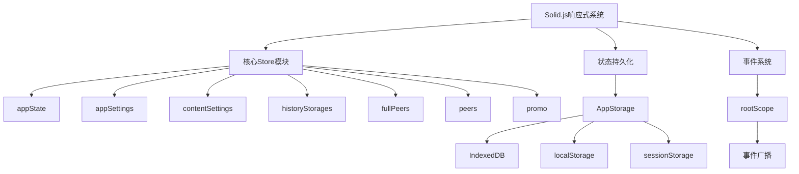
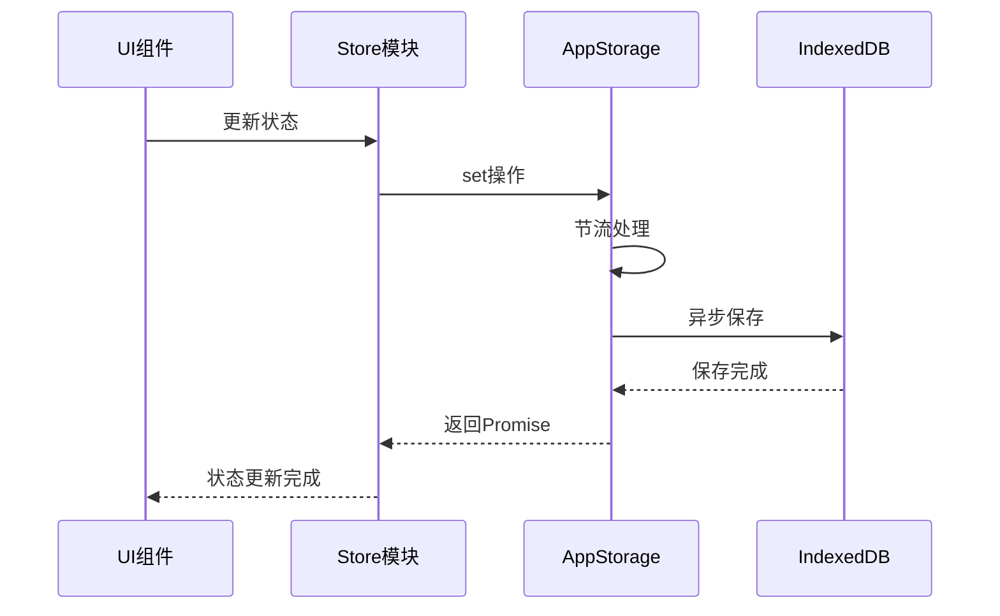
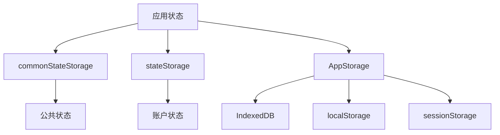
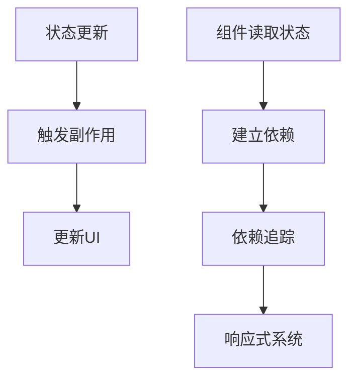
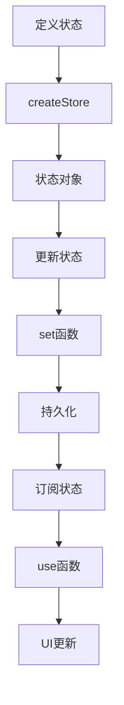

# 状态管理

<cite>
**本文档引用的文件**  
- [appState.ts](file://src/stores/appState.ts)
- [appSettings.ts](file://src/stores/appSettings.ts)
- [contentSettings.ts](file://src/stores/contentSettings.ts)
- [historyStorages.ts](file://src/stores/historyStorages.ts)
- [fullPeers.ts](file://src/stores/fullPeers.ts)
- [peers.ts](file://src/stores/peers.ts)
- [promo.ts](file://src/stores/promo.ts)
- [state.ts](file://src/config/state.ts)
- [storage.ts](file://src/lib/storage.ts)
- [localStorage.ts](file://src/lib/localStorage.ts)
- [sessionStorage.ts](file://src/lib/sessionStorage.ts)
- [commonStateStorage.ts](file://src/lib/commonStateStorage.ts)
- [stateStorage.ts](file://src/lib/stateStorage.ts)
- [rootScope.ts](file://src/lib/rootScope.ts)
</cite>

## 目录
1. [简介](#简介)
2. [状态管理架构](#状态管理架构)
3. [核心Store模块](#核心store模块)
4. [状态持久化机制](#状态持久化机制)
5. [响应式系统与依赖追踪](#响应式系统与依赖追踪)
6. [状态管理最佳实践](#状态管理最佳实践)
7. [总结](#总结)

## 简介

tweb项目采用基于Solid.js的状态管理系统，实现了高效、响应式的前端状态管理。该系统通过多个专门的store模块来组织和管理不同类型的应用状态，包括应用状态、用户设置、对话历史等。状态管理系统与IndexedDB和localStorage等浏览器存储机制深度集成，确保了状态的持久化和跨会话保持。系统还实现了精细的响应式更新机制，能够高效地追踪状态依赖并自动更新相关UI组件。

## 状态管理架构

tweb项目的状态管理架构基于Solid.js的响应式系统构建，采用分层设计模式。系统核心由多个专门的store模块组成，每个模块负责管理特定类型的状态数据。这些store模块通过createStore函数创建，实现了状态的响应式更新。状态管理系统与底层存储机制（如IndexedDB和localStorage）紧密集成，通过AppStorage类提供统一的持久化接口。整个架构通过rootScope进行事件广播，实现了跨组件的状态同步和通信。

**Diagram sources**
- [appState.ts](file://src/stores/appState.ts)
- [appSettings.ts](file://src/stores/appSettings.ts)
- [storage.ts](file://src/lib/storage.ts)
- [rootScope.ts](file://src/lib/rootScope.ts)

**Section sources**
- [appState.ts](file://src/stores/appState.ts)
- [appSettings.ts](file://src/stores/appSettings.ts)
- [storage.ts](file://src/lib/storage.ts)
- [rootScope.ts](file://src/lib/rootScope.ts)

## 核心Store模块

tweb项目定义了多个专门的store模块来管理不同类型的应用状态。每个store模块都封装了特定领域的状态数据和操作逻辑，实现了关注点分离和模块化设计。

### appState模块

appState模块是应用的核心状态存储，管理着应用级别的全局状态。该模块使用Solid.js的createStore创建响应式状态，并提供了setAppState函数用于更新状态。当状态更新时，系统会自动将变更持久化到后端存储中。

**Section sources**
- [appState.ts](file://src/stores/appState.ts)

### appSettings模块

appSettings模块专门管理用户的应用设置，包括消息文本大小、距离单位、发送快捷键等。该模块通过setAppSettings函数更新设置，并将变更同步到持久化存储中。模块还提供了setAppSettingsSilent函数用于静默更新，避免不必要的持久化操作。

**Section sources**
- [appSettings.ts](file://src/stores/appSettings.ts)

### contentSettings模块

contentSettings模块处理内容相关的设置，如敏感内容过滤、年龄验证等。该模块使用createMemo创建计算属性，根据应用配置和用户状态动态计算内容显示策略。模块还通过createEffect实现副作用，当设置变更时自动更新相关系统参数。

**Section sources**
- [contentSettings.ts](file://src/stores/contentSettings.ts)

### historyStorages模块

historyStorages模块管理对话历史记录的存储。该模块使用缓存机制存储不同对话的历史记录，避免重复创建。模块提供了useHistoryStorage函数用于获取特定对话的历史存储，并通过_createHistoryStorage函数创建新的历史存储实例。

**Section sources**
- [historyStorages.ts](file://src/stores/historyStorages.ts)

### fullPeers模块

fullPeers模块管理用户和群组的完整信息。该模块使用createStore存储完整的用户和群组信息，并通过requestFullPeer函数从服务器获取最新数据。模块还实现了过期机制，定期刷新过期的完整信息。

**Section sources**
- [fullPeers.ts](file://src/stores/fullPeers.ts)

### peers模块

peers模块管理用户和群组的基本信息。该模块使用createStore存储用户和群组的基本信息，并提供了usePeer、useChat和useUser等便捷函数用于访问特定用户或群组的信息。模块还提供了reconcilePeer函数用于更新单个用户或群组的信息。

**Section sources**
- [peers.ts](file://src/stores/peers.ts)

### promo模块

promo模块管理推广活动相关的数据。该模块使用createStore存储推广活动数据，并通过usePendingSuggestions函数提供对未处理推广建议的访问。模块在首次使用时自动加载推广数据，并监听promo_data_update事件以保持数据同步。

**Section sources**
- [promo.ts](file://src/stores/promo.ts)

## 状态持久化机制

tweb项目的状态持久化机制基于IndexedDB和localStorage构建，通过AppStorage类提供统一的存储接口。系统根据数据的重要性和使用频率选择合适的存储方式，确保数据的安全性和访问性能。

### IndexedDB存储

IndexedDB用于存储大量结构化数据，如对话历史、用户信息等。AppStorage类封装了IndexedDB的访问逻辑，提供了get、set、delete等方法用于数据操作。系统使用throttleWith对存储操作进行节流，避免频繁的磁盘I/O操作影响性能。

**Diagram sources**
- [storage.ts](file://src/lib/storage.ts)
- [appState.ts](file://src/stores/appState.ts)

### localStorage存储

localStorage用于存储较小的、频繁访问的数据，如用户设置、会话信息等。LocalStorageController类封装了localStorage的访问逻辑，并支持数据加密。系统通过prefix机制隔离不同环境的数据，避免测试数据污染生产环境。

**Section sources**
- [localStorage.ts](file://src/lib/localStorage.ts)

### sessionStorage存储

sessionStorage用于存储会话级别的临时数据，如当前登录账户、服务器时间偏移等。系统通过LocalStorageController实现sessionStorage的访问，并对敏感数据（如账户信息）提供加密存储支持。

**Section sources**
- [sessionStorage.ts](file://src/lib/sessionStorage.ts)

### 状态存储分层

系统实现了多层状态存储架构，根据数据的特性和使用场景选择合适的存储方式。commonStateStorage用于存储跨账户的公共状态，stateStorage用于存储账户特定的状态，而AppStorage则作为底层存储抽象层。

**Diagram sources**
- [commonStateStorage.ts](file://src/lib/commonStateStorage.ts)
- [stateStorage.ts](file://src/lib/stateStorage.ts)
- [storage.ts](file://src/lib/storage.ts)

## 响应式系统与依赖追踪

tweb项目基于Solid.js的响应式系统实现高效的状态管理和UI更新。系统通过细粒度的依赖追踪，确保只有受影响的UI组件才会重新渲染，大大提升了应用性能。

### 响应式状态创建

系统使用Solid.js的createStore创建响应式状态对象。createStore返回状态对象和更新函数，任何对状态的读取都会自动建立依赖关系，而状态更新则会触发相应的副作用。

**Diagram sources**
- [appState.ts](file://src/stores/appState.ts)
- [appSettings.ts](file://src/stores/appSettings.ts)

### 计算属性

系统使用createMemo创建计算属性，这些属性会自动追踪其依赖的状态，并在依赖变化时重新计算。计算属性是惰性的，只有在被访问时才会计算，避免了不必要的计算开销。

**Section sources**
- [contentSettings.ts](file://src/stores/contentSettings.ts)

### 副作用管理

系统使用createEffect管理副作用，如状态持久化、事件监听等。createEffect函数会在其依赖的状态变化时重新执行，确保副作用与状态保持同步。

**Section sources**
- [contentSettings.ts](file://src/stores/contentSettings.ts)

### 依赖追踪原理

Solid.js的依赖追踪基于编译时分析和运行时收集。在编译阶段，系统分析组件的依赖关系；在运行时，当组件读取状态时，系统记录当前执行的副作用作为依赖。当状态更新时，系统通知所有依赖该状态的副作用重新执行。

## 状态管理最佳实践

tweb项目在状态管理方面遵循了一系列最佳实践，确保了系统的可维护性和性能。

### 状态分割

系统将状态按功能领域进行分割，每个store模块负责管理特定类型的状态。这种分割方式实现了关注点分离，使代码更易于理解和维护。例如，appState管理应用核心状态，appSettings管理用户设置，而historyStorages则专门管理对话历史。

**Section sources**
- [appState.ts](file://src/stores/appState.ts)
- [appSettings.ts](file://src/stores/appSettings.ts)
- [historyStorages.ts](file://src/stores/historyStorages.ts)

### 更新性能优化

系统通过多种方式优化状态更新性能。首先，使用throttleWith对存储操作进行节流，避免频繁的磁盘I/O。其次，使用reconcile函数进行状态合并，减少不必要的状态更新。最后，通过静默更新函数（如setAppSettingsSilent）避免不必要的持久化操作。

**Section sources**
- [appState.ts](file://src/stores/appState.ts)
- [appSettings.ts](file://src/stores/appSettings.ts)
- [storage.ts](file://src/lib/storage.ts)

### 内存管理

系统实现了精细的内存管理机制。通过缓存机制避免重复创建store实例，通过过期机制及时清理不再需要的状态数据。系统还使用onCleanup注册清理函数，在组件卸载时自动清理相关资源，防止内存泄漏。

**Section sources**
- [fullPeers.ts](file://src/stores/fullPeers.ts)
- [historyStorages.ts](file://src/stores/historyStorages.ts)

### 状态定义、更新和订阅流程

系统提供了清晰的状态定义、更新和订阅流程。状态定义通过createStore完成，状态更新通过专门的set函数进行，而状态订阅则通过use前缀的hook函数实现。这种一致的模式使开发者能够快速理解和使用状态管理系统。

**Diagram sources**
- [appState.ts](file://src/stores/appState.ts)
- [appSettings.ts](file://src/stores/appSettings.ts)

## 总结

tweb项目的状态管理系统是一个基于Solid.js的高效、可扩展的解决方案。系统通过分层架构和模块化设计，实现了关注点分离和代码复用。响应式系统和依赖追踪机制确保了UI的高效更新，而多层持久化机制则保证了数据的安全性和一致性。通过遵循状态分割、性能优化和内存管理等最佳实践，系统在复杂应用场景下仍能保持良好的性能和可维护性。整体而言，该状态管理系统为tweb项目提供了坚实的基础，支持了丰富的功能和良好的用户体验。