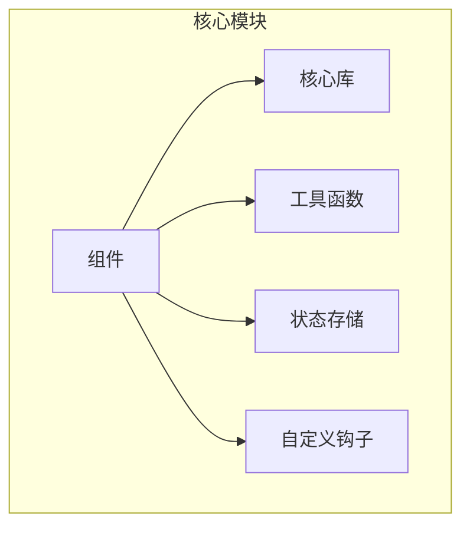
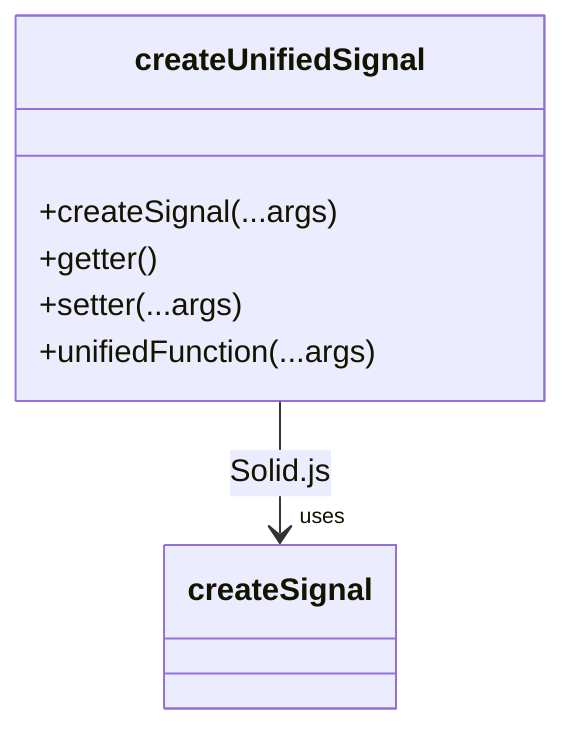
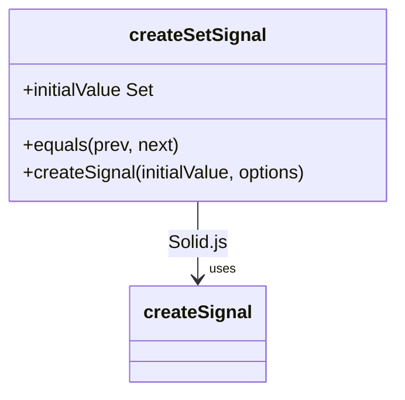
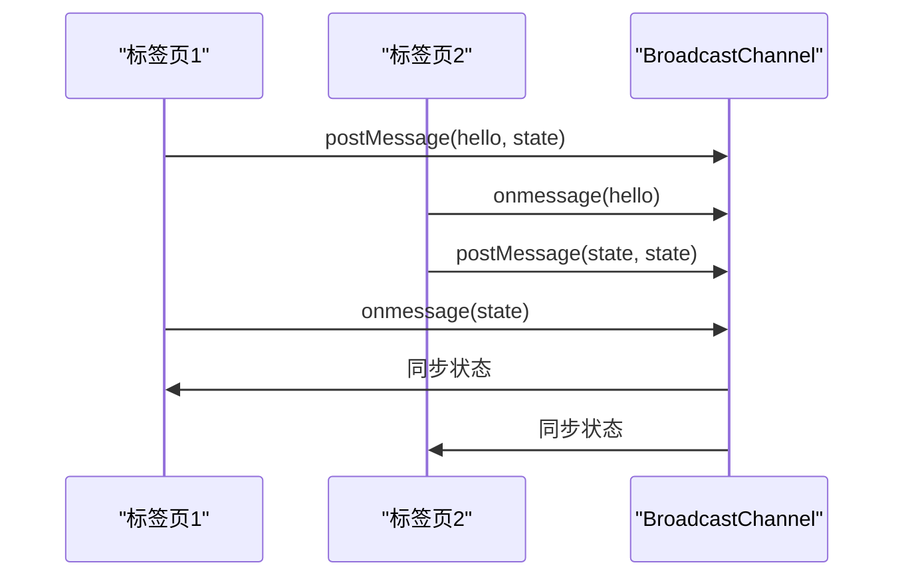
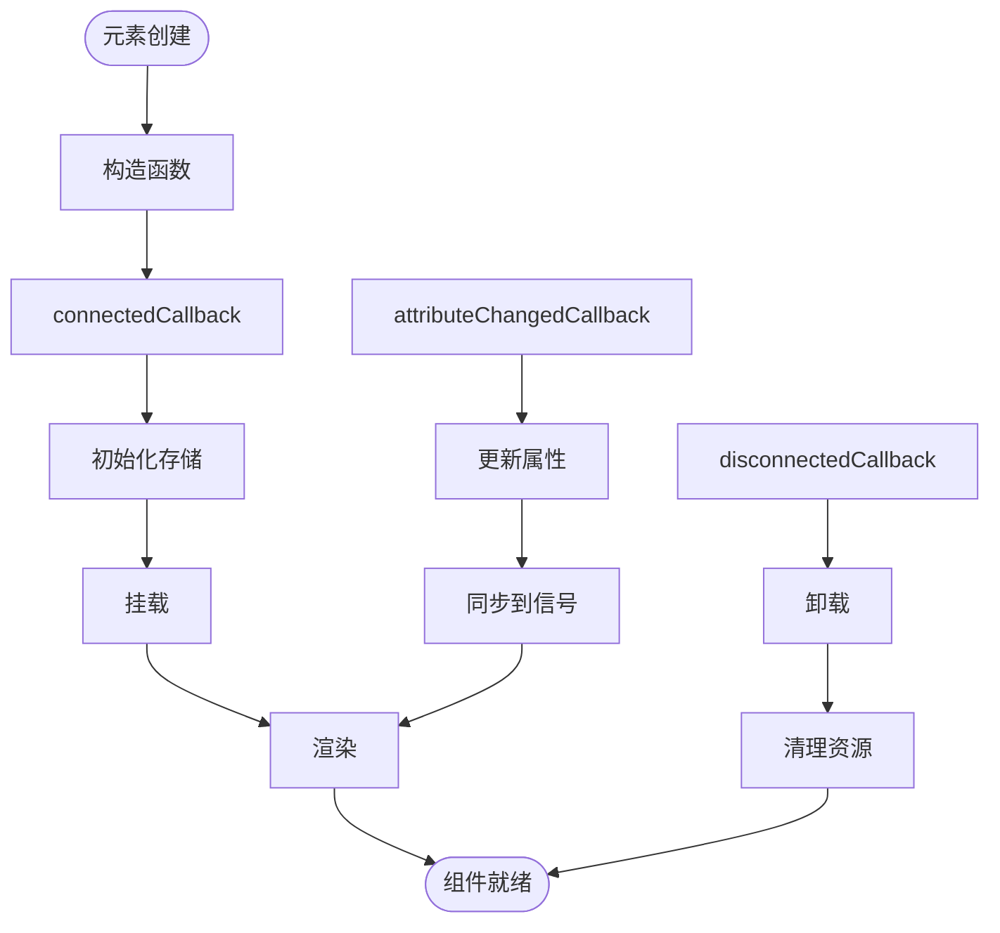
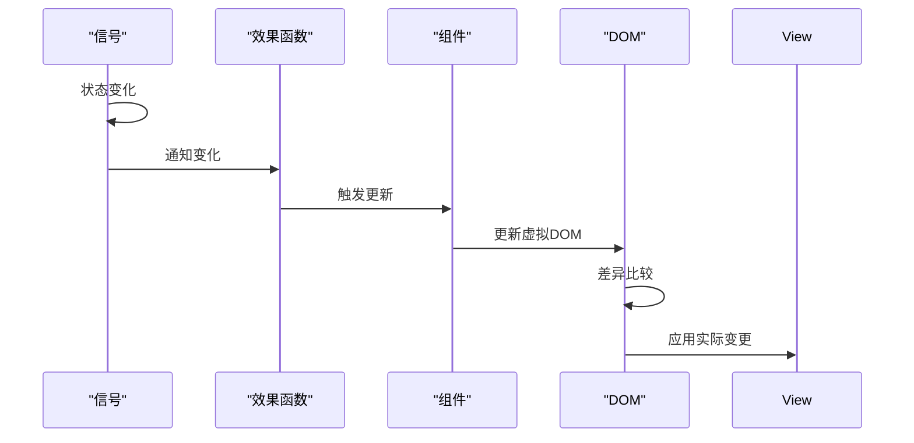
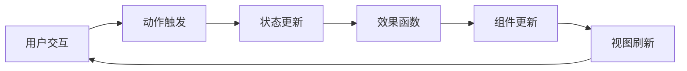
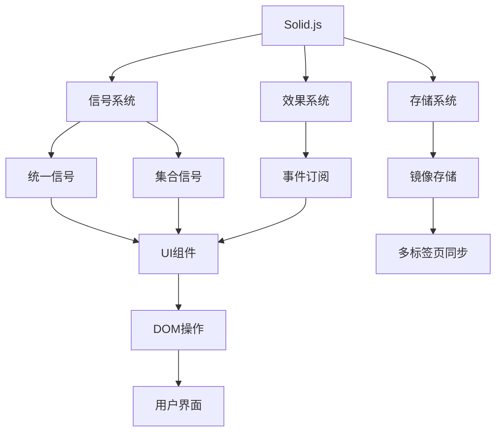

# 组件响应式更新

<cite>
**本文档中引用的文件**  
- [index.ts](file://src/index.ts)
- [createUnifiedSignal.ts](file://src/helpers/solid/createUnifiedSignal.ts)
- [createSetSignal.ts](file://src/helpers/solid/createSetSignal.ts)
- [createMirroredStore.ts](file://src/helpers/solid/createMirroredStore.ts)
- [subscribeOn.ts](file://src/helpers/solid/subscribeOn.ts)
- [defineSolidElement.tsx](file://src/lib/solidjs/defineSolidElement.tsx)
- [topbar.ts](file://src/components/chat/topbar.ts)
- [buttonTsx.tsx](file://src/components/buttonTsx.tsx)
- [appState.ts](file://src/stores/appState.ts)
- [useCurrentChat.ts](file://src/hooks/useCurrentChat.ts)
- [renderProgressCircle.tsx](file://src/components/mediaEditor/renderProgressCircle.tsx)
</cite>

## 目录
1. [引言](#引言)
2. [项目结构](#项目结构)
3. [核心组件](#核心组件)
4. [架构概述](#架构概述)
5. [详细组件分析](#详细组件分析)
6. [依赖分析](#依赖分析)
7. [性能考虑](#性能考虑)
8. [故障排除指南](#故障排除指南)
9. [结论](#结论)

## 引言
本文档详细描述了tweb项目中基于Solid.js的组件响应式更新机制。我们将深入探讨状态变化如何通过信号（signals）和效果（effects）传播到UI组件，分析组件的生命周期管理，包括挂载、更新和卸载过程。同时，文档将阐述虚拟DOM更新策略和渲染性能优化技术，并提供调试技巧和常见问题解决方案。

## 项目结构
tweb项目采用模块化的文件组织结构，主要分为以下几个核心目录：

- `src/components`：包含所有UI组件，采用功能模块化组织
- `src/lib`：核心库和管理器，包括状态管理、API通信等
- `src/helpers`：实用工具函数和辅助方法
- `src/stores`：应用状态存储
- `src/hooks`：自定义Solid.js钩子

这种结构清晰地分离了关注点，使得响应式系统能够高效地管理组件状态和更新。



**图源**  
- [src/index.ts](file://src/index.ts#L1-L682)

**本节来源**  
- [src/index.ts](file://src/index.ts#L1-L682)

## 核心组件
tweb项目的核心响应式机制建立在Solid.js的信号系统之上。通过`createSignal`、`createStore`等原语，实现了高效的状态管理和UI更新。项目中的`createUnifiedSignal`和`createSetSignal`等自定义工具进一步增强了信号系统的功能，提供了更灵活的状态管理方案。

**本节来源**  
- [src/helpers/solid/createUnifiedSignal.ts](file://src/helpers/solid/createUnifiedSignal.ts#L1-L18)
- [src/helpers/solid/createSetSignal.ts](file://src/helpers/solid/createSetSignal.ts#L1-L6)

## 架构概述
tweb项目的响应式架构采用分层设计，从底层信号系统到上层UI组件形成完整的更新链路。状态变化首先在信号层被捕获，然后通过效果（effects）触发相应的UI更新。这种架构确保了数据流的单向性和可预测性。


**图源**  
- [src/lib/solidjs/defineSolidElement.tsx](file://src/lib/solidjs/defineSolidElement.tsx#L1-L239)
- [src/helpers/solid/createMirroredStore.ts](file://src/helpers/solid/createMirroredStore.ts#L1-L82)

## 详细组件分析

### 信号系统分析
tweb项目对Solid.js的信号系统进行了深度定制和扩展，实现了更高效的状态管理。

#### 信号统一接口
`createUnifiedSignal`提供了一个统一的信号访问接口，允许通过函数调用的方式同时进行读取和写入操作，简化了信号的使用模式。



**图源**  
- [src/helpers/solid/createUnifiedSignal.ts](file://src/helpers/solid/createUnifiedSignal.ts#L1-L18)

#### 集合信号
`createSetSignal`为Set类型数据提供了专门的信号实现，通过自定义的equals函数优化了集合的比较逻辑，避免了不必要的重新渲染。



**图源**  
- [src/helpers/solid/createSetSignal.ts](file://src/helpers/solid/createSetSignal.ts#L1-L6)

#### 镜像存储
`createMirroredStore`实现了跨标签页的状态同步，通过BroadcastChannel在多个实例间共享状态，确保了应用状态的一致性。



**图源**  
- [src/helpers/solid/createMirroredStore.ts](file://src/helpers/solid/createMirroredStore.ts#L1-L82)

**本节来源**  
- [src/helpers/solid/createUnifiedSignal.ts](file://src/helpers/solid/createUnifiedSignal.ts#L1-L18)
- [src/helpers/solid/createSetSignal.ts](file://src/helpers/solid/createSetSignal.ts#L1-L6)
- [src/helpers/solid/createMirroredStore.ts](file://src/helpers/solid/createMirroredStore.ts#L1-L82)

### 组件生命周期分析
tweb项目中的组件生命周期管理遵循Solid.js的标准模式，同时通过自定义元素封装提供了更灵活的控制。

#### 自定义元素生命周期
`defineSolidElement`实现了完整的自定义元素生命周期，包括连接、断开连接和属性变化的处理。



**图源**  
- [src/lib/solidjs/defineSolidElement.tsx](file://src/lib/solidjs/defineSolidElement.tsx#L1-L239)

#### 组件更新机制
组件更新通过信号依赖自动触发，确保了高效的重渲染。



**图源**  
- [src/components/chat/topbar.ts](file://src/components/chat/topbar.ts#L1-L800)
- [src/components/buttonTsx.tsx](file://src/components/buttonTsx.tsx#L1-L74)

**本节来源**  
- [src/lib/solidjs/defineSolidElement.tsx](file://src/lib/solidjs/defineSolidElement.tsx#L1-L239)
- [src/components/chat/topbar.ts](file://src/components/chat/topbar.ts#L1-L800)

### 状态管理分析
tweb项目采用分层的状态管理策略，结合全局状态和局部状态实现高效的数据流控制。

#### 全局状态管理
`appState`提供了一个全局可访问的状态存储，通过`createStore`实现响应式更新。

```mermaid
classDiagram
class appState {
+createStore<State>({})
+setAppState(...)
+setAppStateSilent(...)
+useAppState()
+useAppConfig()
+useIsFrozen()
}
appState --> "uses" createStore : Solid.js
appState --> "uses" rootScope : 根作用域
```

**图源**  
- [src/stores/appState.ts](file://src/stores/appState.ts#L1-L39)

#### 状态更新流程
状态更新遵循严格的单向数据流原则，确保了应用的可预测性。



**图源**  
- [src/stores/appState.ts](file://src/stores/appState.ts#L1-L39)
- [src/hooks/useCurrentChat.ts](file://src/hooks/useCurrentChat.ts#L1-L22)

**本节来源**  
- [src/stores/appState.ts](file://src/stores/appState.ts#L1-L39)
- [src/hooks/useCurrentChat.ts](file://src/hooks/useCurrentChat.ts#L1-L22)

## 依赖分析
tweb项目的响应式系统依赖于多个核心模块和外部库，形成了一个完整的生态系统。



**图源**  
- [src/helpers/solid](file://src/helpers/solid)
- [src/lib/solidjs](file://src/lib/solidjs)

**本节来源**  
- [src/helpers/solid](file://src/helpers/solid)
- [src/lib/solidjs](file://src/lib/solidjs)

## 性能考虑
tweb项目在响应式更新方面采用了多种性能优化策略：

1. **批量更新**：通过`batch`函数将多个状态更新合并为一次渲染
2. **智能比较**：自定义equals函数避免不必要的重新渲染
3. **资源清理**：在组件卸载时及时清理订阅和定时器
4. **懒加载**：按需加载组件和数据，减少初始加载时间

这些优化确保了即使在复杂的应用场景下，UI更新也能保持流畅和高效。

## 故障排除指南
在开发和调试过程中，可能会遇到以下常见问题：

1. **状态未更新**：检查信号是否正确订阅，确保在正确的上下文中访问信号
2. **过度渲染**：使用`untrack`或`on`函数优化依赖跟踪，避免不必要的重新计算
3. **内存泄漏**：确保在组件卸载时清理所有事件监听器和定时器
4. **多标签页同步问题**：检查BroadcastChannel的通信是否正常，确保状态序列化正确

通过使用Solid.js的开发工具和适当的调试技巧，可以快速定位和解决这些问题。

## 结论
tweb项目的组件响应式更新系统基于Solid.js的强大响应式能力，通过精心设计的架构和优化策略，实现了高效、可预测的状态管理和UI更新。该系统不仅提供了良好的开发体验，还确保了应用的高性能和可维护性。通过深入理解信号、效果和组件生命周期的交互机制，开发者可以充分利用这一系统构建复杂而流畅的用户界面。