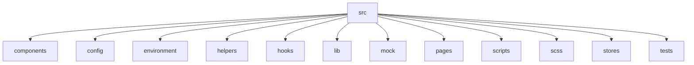
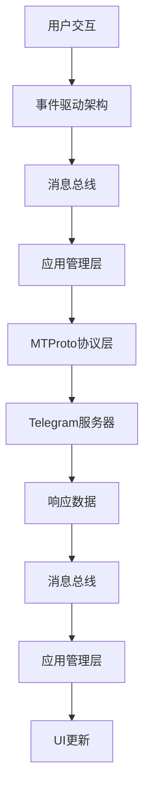
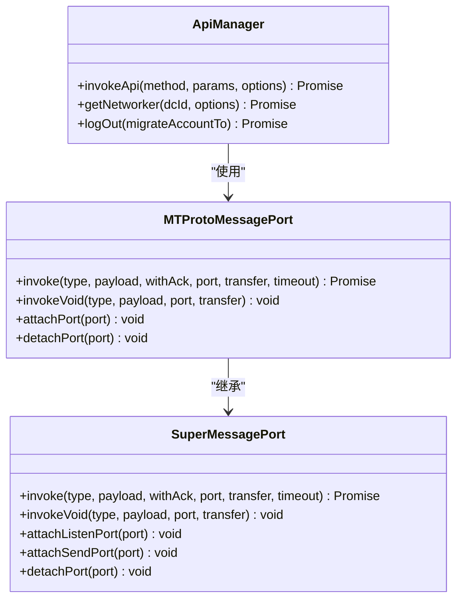
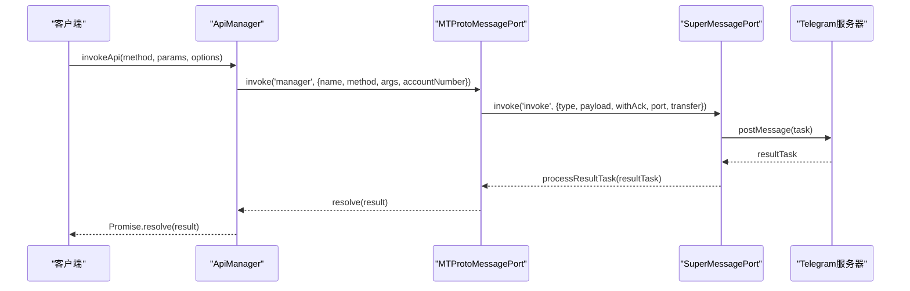
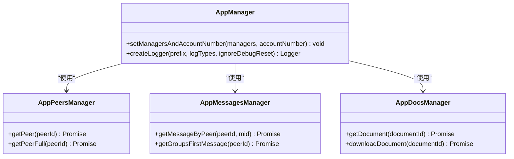
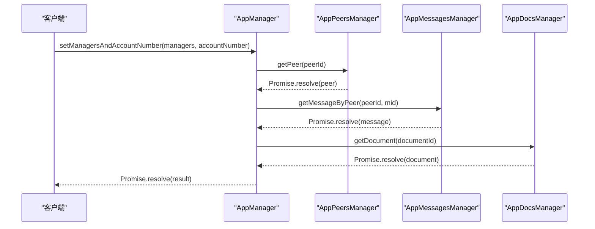
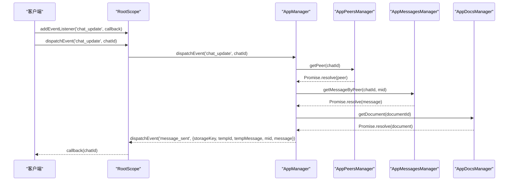
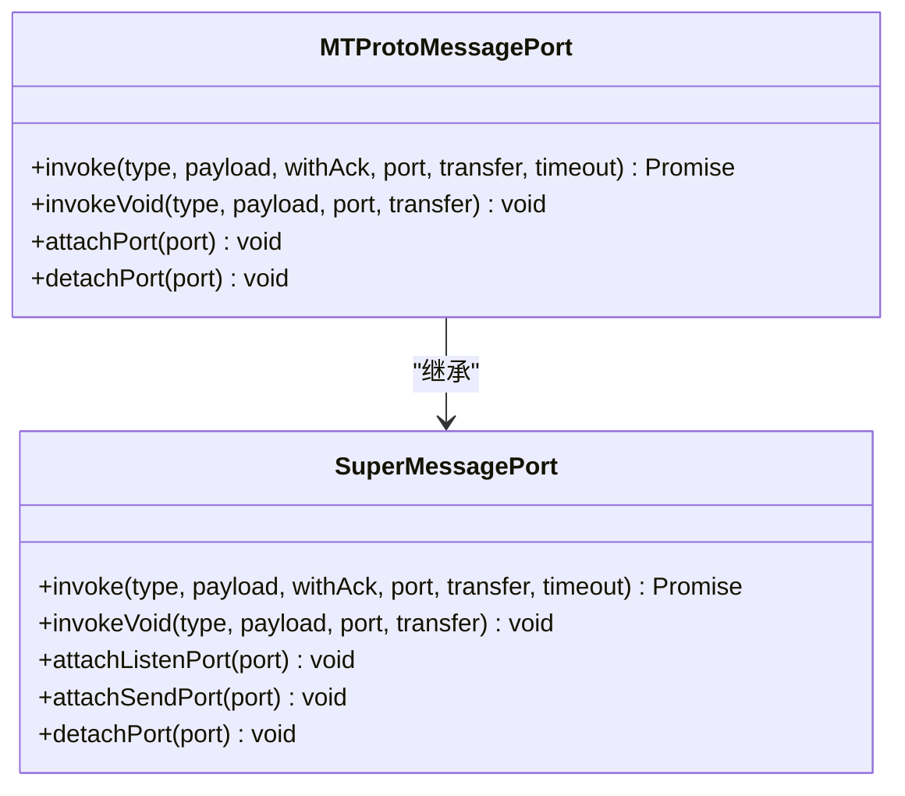
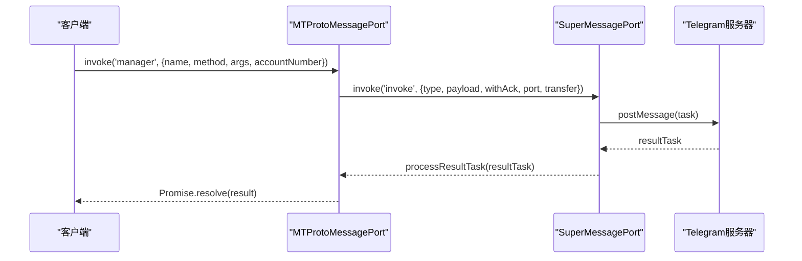
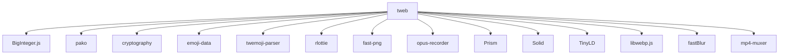

# 数据流

<cite>
**本文档引用的文件**   
- [index.ts](file://src/index.ts)
- [mtprotoworker.ts](file://src/lib/mtproto/mtprotoworker.ts)
- [apiManager.ts](file://src/lib/mtproto/apiManager.ts)
- [rootScope.ts](file://src/lib/rootScope.ts)
- [mtprotoMessagePort.ts](file://src/lib/mtproto/mtprotoMessagePort.ts)
- [superMessagePort.ts](file://src/lib/mtproto/superMessagePort.ts)
- [getProxiedManagers.ts](file://src/lib/appManagers/getProxiedManagers.ts)
- [manager.ts](file://src/lib/appManagers/manager.ts)
</cite>

## 目录
1. [简介](#简介)
2. [项目结构](#项目结构)
3. [核心组件](#核心组件)
4. [架构概述](#架构概述)
5. [详细组件分析](#详细组件分析)
6. [依赖分析](#依赖分析)
7. [性能考虑](#性能考虑)
8. [故障排除指南](#故障排除指南)
9. [结论](#结论)
10. [附录](#附录)（如有必要）

## 简介
本文档详细描述了tweb项目的数据流，从用户交互到UI更新的完整路径。文档解释了MTProto协议层如何与应用管理层交互，说明了API请求的处理流程和响应数据的分发机制。此外，文档还记录了事件驱动架构的实现方式和消息总线的设计，阐述了数据流的错误处理和重试策略，并提供了数据流监控和调试工具的使用指南。最后，文档包含性能瓶颈分析和优化建议。

## 项目结构
tweb项目是一个基于Webogram的Telegram Web客户端，经过修补和改进。项目结构清晰，主要分为以下几个部分：
- `handlebarsHelpers`：包含Handlebars模板助手函数。
- `public`：包含静态资源文件，如图片、CSS、JavaScript等。
- `snapshot-server`：用于本地存储快照的服务器。
- `src`：源代码目录，包含组件、配置、环境、帮助函数、钩子、库、模拟、页面、脚本、SCSS、存储和测试。



**图表来源**
- [src/index.ts](file://src/index.ts#L1-L682)

**章节来源**
- [src/index.ts](file://src/index.ts#L1-L682)

## 核心组件
tweb项目的核心组件包括MTProto协议层、应用管理层、事件驱动架构和消息总线。这些组件共同协作，确保数据流的高效和可靠。

**章节来源**
- [src/index.ts](file://src/index.ts#L1-L682)
- [src/lib/mtproto/mtprotoworker.ts](file://src/lib/mtproto/mtprotoworker.ts#L1-L1169)

## 架构概述
tweb项目的架构基于事件驱动和消息总线设计，确保了数据流的高效和可靠。MTProto协议层负责与Telegram服务器通信，应用管理层负责处理业务逻辑，事件驱动架构负责处理用户交互和系统事件，消息总线负责在不同组件之间传递消息。



**图表来源**
- [src/lib/mtproto/mtprotoworker.ts](file://src/lib/mtproto/mtprotoworker.ts#L1-L1169)
- [src/lib/mtproto/apiManager.ts](file://src/lib/mtproto/apiManager.ts#L1-L818)

## 详细组件分析

### MTProto协议层分析
MTProto协议层是tweb项目与Telegram服务器通信的核心。它负责处理所有API请求和响应，确保数据的安全和高效传输。

#### 类图


**图表来源**
- [src/lib/mtproto/apiManager.ts](file://src/lib/mtproto/apiManager.ts#L1-L818)
- [src/lib/mtproto/mtprotoMessagePort.ts](file://src/lib/mtproto/mtprotoMessagePort.ts#L1-L91)
- [src/lib/mtproto/superMessagePort.ts](file://src/lib/mtproto/superMessagePort.ts#L1-L673)

#### 序列图


**图表来源**
- [src/lib/mtproto/apiManager.ts](file://src/lib/mtproto/apiManager.ts#L1-L818)
- [src/lib/mtproto/mtprotoMessagePort.ts](file://src/lib/mtproto/mtprotoMessagePort.ts#L1-L91)
- [src/lib/mtproto/superMessagePort.ts](file://src/lib/mtproto/superMessagePort.ts#L1-L673)

**章节来源**
- [src/lib/mtproto/apiManager.ts](file://src/lib/mtproto/apiManager.ts#L1-L818)
- [src/lib/mtproto/mtprotoMessagePort.ts](file://src/lib/mtproto/mtprotoMessagePort.ts#L1-L91)
- [src/lib/mtproto/superMessagePort.ts](file://src/lib/mtproto/superMessagePort.ts#L1-L673)

### 应用管理层分析
应用管理层负责处理业务逻辑，包括用户认证、消息管理、文件管理等。它通过事件驱动架构和消息总线与MTProto协议层和UI层交互。

#### 类图


**图表来源**
- [src/lib/appManagers/manager.ts](file://src/lib/appManagers/manager.ts#L1-L148)
- [src/lib/appManagers/appPeersManager.ts](file://src/lib/appManagers/appPeersManager.ts)
- [src/lib/appManagers/appMessagesManager.ts](file://src/lib/appManagers/appMessagesManager.ts)
- [src/lib/appManagers/appDocsManager.ts](file://src/lib/appManagers/appDocsManager.ts)

#### 序列图


**图表来源**
- [src/lib/appManagers/manager.ts](file://src/lib/appManagers/manager.ts#L1-L148)
- [src/lib/appManagers/appPeersManager.ts](file://src/lib/appManagers/appPeersManager.ts)
- [src/lib/appManagers/appMessagesManager.ts](file://src/lib/appManagers/appMessagesManager.ts)
- [src/lib/appManagers/appDocsManager.ts](file://src/lib/appManagers/appDocsManager.ts)

**章节来源**
- [src/lib/appManagers/manager.ts](file://src/lib/appManagers/manager.ts#L1-L148)
- [src/lib/appManagers/appPeersManager.ts](file://src/lib/appManagers/appPeersManager.ts)
- [src/lib/appManagers/appMessagesManager.ts](file://src/lib/appManagers/appMessagesManager.ts)
- [src/lib/appManagers/appDocsManager.ts](file://src/lib/appManagers/appDocsManager.ts)

### 事件驱动架构分析
事件驱动架构是tweb项目的核心，负责处理用户交互和系统事件。它通过消息总线在不同组件之间传递消息，确保数据流的高效和可靠。

#### 类图
```mermaid
classDiagram
class RootScope {
+addEventListener(name, callback) void
+dispatchEvent(name, ...args) void
+dispatchEventSingle(name, ...args) void
}
class BroadcastEvents {
+chat_full_update : ChatId
+chat_update : ChatId
+user_update : UserId
+user_auth : UserAuth
+peer_pinned_messages : {peerId : PeerId, mids? : number[], pinned? : boolean, unpinAll? : true}
+peer_typings : {peerId : PeerId, threadId? : number, typings : UserTyping[]}
+dialog_draft : {peerId : PeerId, dialog : Dialog | ForumTopic, drop : boolean, draft : MyDraftMessage | undefined}
+history_append : {storageKey : MessagesStorageKey, message : MyMessage}
+message_edit : {storageKey : MessagesStorageKey, peerId : PeerId, mid : number, message : MyMessage}
+message_sent : {storageKey : MessagesStorageKey, tempId : number, tempMessage : any, mid : number, message : MyMessage}
+message_error : {storageKey : MessagesStorageKey, peerId : PeerId, tempId : number, error : ApiError}
+story_update : {peerId : PeerId, story : StoryItem, modifiedPinned? : boolean, modifiedArchive? : boolean, modifiedPinnedToTop? : boolean}
+story_deleted : {peerId : PeerId, id : number}
+story_expired : {peerId : PeerId, id : number}
+story_new : {peerId : PeerId, story : StoryItem, cacheType : StoriesCacheType, maxReadId : number}
+stories_stories : PeerStories
+stories_read : {peerId : PeerId, maxReadId : number}
+stories_downloaded : {peerId : PeerId, ids : number[]}
+stories_position : {peerId : PeerId, position : StoriesListPosition}
+replies_updated : Message.message
+replies_short_update : Message.message
+scheduled_new : Message.message
+scheduled_delete : {peerId : PeerId, mids : number[]}
+grouped_edit : {peerId : PeerId, groupedId : string, deletedMids : number[], messages : Message.message[]}
+stickers_installed : StickerSet.stickerSet
+stickers_deleted : StickerSet.stickerSet
+stickers_updated : {type : 'recent' | 'faved', stickers : MyDocument[]}
+stickers_top : Long
+stickers_order : {type : 'masks' | 'emojis' | 'stickers', order : Long[]}
+sticker_updated : {type : 'recent' | 'faved', document : MyDocument, faved : boolean}
+gifs_updated : MyDocument[]
+gif_updated : {document : MyDocument, saved : boolean}
+state_cleared : void
+state_synchronized : void
+state_synchronizing : void
+contacts_update : UserId
+avatar_update : {peerId : PeerId, threadId? : number}
+poll_update : {poll : Poll, results : PollResults}
+invalidate_participants : ChatId
+webpage_updated : {id : WebPage.webPage['id'], msgs : {peerId : PeerId, mid : number, isScheduled : boolean}[]}
+connection_status_change : ConnectionStatusChange
+settings_updated : {key : string, value : any, settings : StateSettings}
+draft_updated : {peerId : PeerId, threadId? : number, monoforumThreadId? : PeerId, draft : MyDraftMessage | undefined, force? : boolean}
+background_change : void
+privacy_update : Update.updatePrivacy
+notify_settings : Update.updateNotifySettings
+notify_peer_type_settings : {key : Exclude<NotifyPeer['_'], 'notifyPeer'>, settings : PeerNotifySettings}
+notification_reset : string
+notification_cancel : `msg_${ActiveAccountNumber}_${PeerId}_${number}`
+notification_count_update : void
+language_change : string
+language_apply : void
+langpack_update : {difference : LangPackDifference}
+langpack_update_too_long : {lang_code : string}
+theme_change : {x : number, y : number} | void
+theme_changed : void
+media_play : void
+emoji_recent : {emoji : AppEmoji, deleted? : boolean}
+download_progress : Progress
+document_downloading : DocId
+document_downloaded : DocId
+choosing_sticker : boolean
+group_call_update : GroupCall
+group_call_participant : {groupCallId : GroupCallId, participant : GroupCallParticipant}
+call_update : PhoneCall
+call_signaling : {callId : CallId, data : Uint8Array}
+rtmp_call_update : RtmpCallInstance
+quick_reaction : Reaction
+service_notification : Update.updateServiceNotification
+logging_out : {accountNumber? : ActiveAccountNumber, migrateTo? : ActiveAccountNumber}
+payment_sent : {peerId : PeerId, mid : number, receiptMessage : Message.messageService}
+web_view_result_sent : Long
+premium_toggle : boolean
+premium_toggle_private : {isNew : boolean, isPremium : boolean}
+saved_tags : {savedPeerId : PeerId, tags : SavedReactionTag[]}
+saved_tags_clear : void
+stars_balance : {balance : Long, fulfilledReservedStars? : number, ton : boolean}
+file_speed_limited : {increaseTimes : number, isUpload : boolean}
+config : Config
+app_config : MTAppConfig
+managers_ready : void
+account_logged_in : {accountNumber : ActiveAccountNumber, userId : UserId}
+resizing_left_sidebar : void
+right_sidebar_toggle : boolean
+chat_background_set : void
+toggle_using_passcode : boolean
+toggle_locked : boolean
+star_gift_update : {input : InputSavedStarGift, resalePrice? : StarsAmount[], unsaved? : boolean, converted? : boolean, wearing? : boolean}
+my_pinned_stargifts : {gifts : InputSavedStarGift[]}
+star_gift_list_update : {peerId : PeerId}
+star_gift_upgrade : {gift : MyStarGift, savedId? : Long, fromMsgId? : number}
+insufficent_stars_for_message : {messageCount : number, requestId : number, invokeApiArgs : Parameters<ApiManager['invokeApi']>, reservedStars? : number}
+fulfill_repaid_message : {requestId : number}
+monoforum_dialogs_update : {dialogs : MonoforumDialog[]}
+monoforum_dialogs_drop : {parentPeerId : PeerId, ids : PeerId[]}
+monoforum_draft_update : {dialog : MonoforumDialog}
+botforum_pending_topic_created : {peerId : PeerId, tempId : number, newId? : number}
+promo_data_update : MyPromoData
}
RootScope --> BroadcastEvents : "定义"
```

**图表来源**
- [src/lib/rootScope.ts](file://src/lib/rootScope.ts#L1-L315)

#### 序列图


**图表来源**
- [src/lib/rootScope.ts](file://src/lib/rootScope.ts#L1-L315)

**章节来源**
- [src/lib/rootScope.ts](file://src/lib/rootScope.ts#L1-L315)

### 消息总线设计分析
消息总线是tweb项目中不同组件之间传递消息的核心机制。它通过`SuperMessagePort`和`MTProtoMessagePort`实现，确保消息的高效和可靠传递。

#### 类图


**图表来源**
- [src/lib/mtproto/superMessagePort.ts](file://src/lib/mtproto/superMessagePort.ts#L1-L673)
- [src/lib/mtproto/mtprotoMessagePort.ts](file://src/lib/mtproto/mtprotoMessagePort.ts#L1-L91)

#### 序列图


**图表来源**
- [src/lib/mtproto/mtprotoMessagePort.ts](file://src/lib/mtproto/mtprotoMessagePort.ts#L1-L91)
- [src/lib/mtproto/superMessagePort.ts](file://src/lib/mtproto/superMessagePort.ts#L1-L673)

**章节来源**
- [src/lib/mtproto/mtprotoMessagePort.ts](file://src/lib/mtproto/mtprotoMessagePort.ts#L1-L91)
- [src/lib/mtproto/superMessagePort.ts](file://src/lib/mtproto/superMessagePort.ts#L1-L673)

## 依赖分析
tweb项目依赖于多个外部库和内部模块，确保了功能的完整性和性能的优化。主要依赖包括：
- `BigInteger.js`：用于大整数运算。
- `pako`：用于数据压缩和解压。
- `cryptography`：用于加密和解密。
- `emoji-data`：用于表情符号数据。
- `twemoji-parser`：用于解析和显示表情符号。
- `rlottie`：用于播放Lottie动画。
- `fast-png`：用于PNG图像处理。
- `opus-recorder`：用于Opus音频录制。
- `Prism`：用于代码高亮。
- `Solid`：用于构建用户界面。
- `TinyLD`：用于轻量级数据处理。
- `libwebp.js`：用于WebP图像处理。
- `fastBlur`：用于图像模糊处理。
- `mp4-muxer`：用于MP4文件处理。



**图表来源**
- [README.md](file://README.md#L48-L62)

**章节来源**
- [README.md](file://README.md#L48-L62)

## 性能考虑
tweb项目在性能方面进行了多项优化，确保了用户体验的流畅和高效。主要性能优化措施包括：
- **懒加载**：通过`lazyLoadQueue`和`lazyLoadQueueBase`等模块实现资源的懒加载，减少初始加载时间。
- **缓存**：通过`cacheCallback`和`cacheFunctionPolyfill`等模块实现函数结果的缓存，减少重复计算。
- **异步处理**：通过`cancellablePromise`和`pause`等模块实现异步操作的管理，避免阻塞主线程。
- **资源优化**：通过`fixChromiumMp4`和`fixFirefoxSvg`等模块修复特定浏览器的资源加载问题，提高兼容性。

## 故障排除指南
tweb项目提供了详细的故障排除指南，帮助开发者和用户解决常见问题。主要故障排除措施包括：
- **调试模式**：通过`debug=1`参数启用额外的日志记录，帮助定位问题。
- **共享工作线程禁用**：通过`noSharedWorker=1`参数禁用共享工作线程，便于调试。
- **HTTPS强制**：通过`http=1`参数强制使用HTTPS传输，确保连接安全。
- **本地存储快照**：通过`./snapshot-server`迷你应用获取和加载本地存储快照，方便调试和恢复。

**章节来源**
- [README.md](file://README.md#L68-L76)

## 结论
tweb项目通过MTProto协议层、应用管理层、事件驱动架构和消息总线的协同工作，实现了高效、可靠的数据流。项目结构清晰，依赖管理合理，性能优化到位，故障排除指南详尽，为用户提供了一个流畅、安全的Telegram Web客户端体验。

## 附录
### API请求处理流程
1. 用户发起API请求。
2. 请求通过`AppManager`传递到`ApiManager`。
3. `ApiManager`通过`MTProtoMessagePort`将请求发送到`SuperMessagePort`。
4. `SuperMessagePort`通过`postMessage`将请求发送到Telegram服务器。
5. Telegram服务器处理请求并返回响应。
6. `SuperMessagePort`接收响应并传递给`MTProtoMessagePort`。
7. `MTProtoMessagePort`处理响应并传递给`ApiManager`。
8. `ApiManager`将响应结果返回给`AppManager`。
9. `AppManager`更新UI。

### 数据流错误处理和重试策略
1. **错误处理**：
   - 当API请求失败时，`ApiManager`会捕获错误并根据错误类型进行处理。
   - 对于401错误（会话撤销），`ApiManager`会调用`logOut`方法注销用户。
   - 对于406错误（认证密钥重复），`ApiManager`会忽略错误并继续执行。
   - 对于其他错误，`ApiManager`会显示错误提示并记录日志。

2. **重试策略**：
   - 对于500错误（服务器内部错误），`ApiManager`会在1秒后重试请求，最多重试60秒。
   - 对于420错误（洪水等待），`ApiManager`会根据错误类型中的等待时间进行重试。
   - 对于303错误（电话迁移），`ApiManager`会更新DC ID并重新发送请求。

### 数据流监控和调试工具
1. **日志记录**：通过`logger`模块记录详细的日志信息，帮助开发者定位问题。
2. **性能监控**：通过`performance.now()`和`console.timeLog`等方法监控性能瓶颈。
3. **调试工具**：通过`debug=1`参数启用额外的日志记录，帮助调试。
4. **本地存储快照**：通过`./snapshot-server`迷你应用获取和加载本地存储快照，方便调试和恢复。

### 性能瓶颈分析和优化建议
1. **网络延迟**：通过懒加载和缓存减少网络请求次数，降低网络延迟。
2. **资源加载**：通过`fixChromiumMp4`和`fixFirefoxSvg`等模块修复特定浏览器的资源加载问题，提高兼容性。
3. **内存使用**：通过`cancellablePromise`和`pause`等模块管理异步操作，避免内存泄漏。
4. **UI渲染**：通过`lazyLoadQueue`和`lazyLoadQueueBase`等模块实现资源的懒加载，减少初始加载时间。