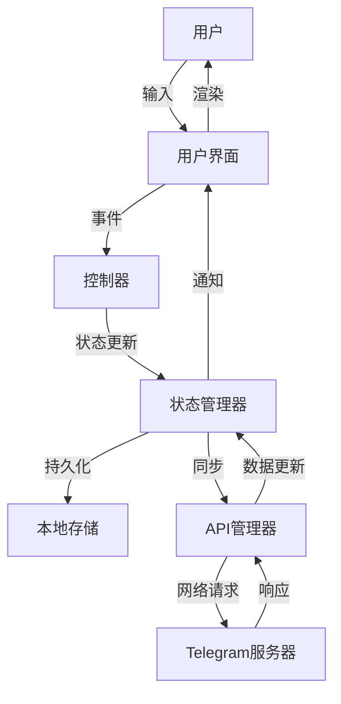
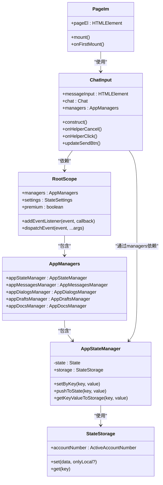

# 核心架构

<cite>
**本文档中引用的文件**  
- [index.ts](file://src/index.ts)
- [appState.ts](file://src/stores/appState.ts)
- [appStateManager.ts](file://src/lib/appManagers/appStateManager.ts)
- [rootScope.ts](file://src/lib/rootScope.ts)
- [pageIm.ts](file://src/pages/pageIm.ts)
- [input.ts](file://src/components/chat/input.ts)
- [package.json](file://package.json)
</cite>

## 目录
1. [引言](#引言)
2. [项目结构](#项目结构)
3. [组件化架构与MVC模式](#组件化架构与mvc模式)
4. [Solid.js响应式系统与状态管理集成](#solidjs响应式系统与状态管理集成)
5. [appManagers设计模式与职责划分](#appmanagers设计模式与职责划分)
6. [数据流路径分析](#数据流路径分析)
7. [系统上下文图](#系统上下文图)
8. [组件关系图](#组件关系图)
9. [架构决策权衡与约束](#架构决策权衡与约束)
10. [可扩展性与维护性指导原则](#可扩展性与维护性指导原则)
11. [关键设计模式与最佳实践](#关键设计模式与最佳实践)

## 引言
tweb项目是一个基于Solid.js的Telegram Web客户端实现，采用组件化架构和MVC模式构建。该项目通过精心设计的架构实现了复杂的即时通讯功能，同时保持了良好的可维护性和扩展性。核心架构围绕状态管理、组件通信和数据流控制展开，利用Solid.js的响应式系统实现高效的UI更新。项目采用分层设计，将业务逻辑、状态管理和UI组件分离，确保代码的清晰性和可测试性。

## 项目结构
tweb项目的目录结构体现了清晰的分层和模块化设计。项目根目录包含构建配置、环境设置和静态资源。`src`目录是项目的核心，包含以下主要子目录：

- `components`：存放所有UI组件，按功能组织
- `config`：应用配置和常量定义
- `environment`：环境检测和特性支持检查
- `helpers`：通用工具函数和辅助方法
- `hooks`：Solid.js自定义hooks
- `lib`：核心库和管理器
- `pages`：页面级组件
- `scripts`：构建和自动化脚本
- `scss`：样式表和主题配置
- `stores`：状态存储和管理
- `tests`：测试代码

这种结构化的组织方式使得项目易于导航和维护，每个模块都有明确的职责边界。

**Section sources**
- [package.json](file://package.json)

## 组件化架构与MVC模式
tweb项目采用了组件化架构与MVC模式的混合设计。组件化架构体现在UI层的组织上，所有界面元素都被分解为可重用的组件，这些组件位于`src/components`目录下。每个组件负责特定的UI功能，如聊天输入框、消息气泡、侧边栏等。

MVC模式主要体现在应用的架构设计中：
- **Model**：由`appManagers`中的各种管理器实现，负责数据获取、状态管理和业务逻辑
- **View**：由Solid.js组件构成，负责UI渲染和用户交互
- **Controller**：由事件系统和状态管理器充当，处理用户输入并协调Model和View之间的通信

这种架构通过`rootScope`事件系统实现组件间的松耦合通信，同时利用Solid.js的响应式特性确保数据变化能自动反映到UI上。

**Section sources**
- [index.ts](file://src/index.ts)
- [pageIm.ts](file://src/pages/pageIm.ts)

## Solid.js响应式系统与状态管理集成
tweb项目深度集成了Solid.js的响应式系统来管理应用状态。状态管理的核心是`appState`和`appStateManager`，它们与Solid.js的响应式机制紧密结合。

在`src/stores/appState.ts`中，使用`createStore`创建了响应式状态存储：
```typescript
const [appState, _setAppState] = createRoot(() => createStore<State>({} as any));
```

状态更新通过`setAppState`函数进行，该函数不仅更新本地状态，还同步到持久化存储：
```typescript
const setAppState: SetStoreFunction<State, Promise<void>> = (...args: any[]) => {
  const key = args[0];
  _setAppState(...args);
  return rootScope.managers.appStateManager.setByKey(key, unwrap(appState[key]));
};
```

这种设计确保了状态变更的响应式传播，当状态改变时，所有依赖该状态的组件会自动重新渲染。同时，通过`unwrap`函数将响应式状态转换为普通对象进行持久化存储，实现了响应式系统与状态持久化的无缝集成。

**Section sources**
- [appState.ts](file://src/stores/appState.ts)
- [appStateManager.ts](file://src/lib/appManagers/appStateManager.ts)

## appManagers设计模式与职责划分
`appManagers`是tweb项目的核心架构组件，采用单例模式和依赖注入模式设计。它位于`src/lib/appManagers`目录下，包含多个专门的管理器，每个管理器负责特定领域的业务逻辑。

主要管理器包括：
- `appStateManager`：负责应用状态管理
- `appMessagesManager`：处理消息相关逻辑
- `appDialogsManager`：管理对话列表
- `appDraftsManager`：处理草稿保存
- `appDocsManager`：管理文档和媒体

这些管理器通过`getProxiedManagers`函数创建并注入到`rootScope`中：
```typescript
rootScope.managers = getProxiedManagers();
```

每个管理器都有明确的职责划分，遵循单一职责原则。它们通过事件系统与UI组件通信，避免了直接依赖，实现了高内聚低耦合的设计。管理器之间通过`rootScope.managers`相互引用，形成一个协调工作的管理器网络。

**Section sources**
- [index.ts](file://src/index.ts)
- [appStateManager.ts](file://src/lib/appManagers/appStateManager.ts)
- [rootScope.ts](file://src/lib/rootScope.ts)

## 数据流路径分析
tweb项目的数据流遵循清晰的单向数据流模式，从用户输入到UI更新的完整路径如下：

1. **用户输入**：用户在聊天输入框中输入文本
2. **事件捕获**：`ChatInput`组件捕获输入事件
3. **状态更新**：调用`setAppState`更新本地状态
4. **持久化存储**：`appStateManager`将状态变更保存到`StateStorage`
5. **事件广播**：通过`rootScope.dispatchEvent`广播状态变更事件
6. **UI响应**：依赖该状态的Solid.js组件自动重新渲染
7. **异步同步**：状态变更通过`MTProtoMessagePort`同步到后端

在`ChatInput`类中，这一流程体现为：
```typescript
public setByKey(key: string, value: any) {
  setDeepProperty(this.state, key, value);
  const first = splitDeepPath(key)[0] as keyof State;
  if(first === 'settings') {
    rootScope.dispatchEvent('settings_updated', {key, value, settings: this.state.settings});
  }
  return this.pushToState(first, this.state[first]);
}
```

这种设计确保了数据流的可预测性和可调试性，所有状态变更都有明确的来源和去向。

**Section sources**
- [input.ts](file://src/components/chat/input.ts)
- [appStateManager.ts](file://src/lib/appManagers/appStateManager.ts)
- [rootScope.ts](file://src/lib/rootScope.ts)

## 系统上下文图


**Diagram sources**
- [index.ts](file://src/index.ts)
- [appStateManager.ts](file://src/lib/appManagers/appStateManager.ts)
- [rootScope.ts](file://src/lib/rootScope.ts)

## 组件关系图


**Diagram sources**
- [index.ts](file://src/index.ts)
- [appStateManager.ts](file://src/lib/appManagers/appStateManager.ts)
- [rootScope.ts](file://src/lib/rootScope.ts)
- [input.ts](file://src/components/chat/input.ts)
- [pageIm.ts](file://src/pages/pageIm.ts)

## 架构决策权衡与约束
tweb项目的架构设计体现了多个重要的权衡和约束考虑：

**性能与复杂性权衡**：
- 采用Solid.js的细粒度响应式系统，避免了虚拟DOM的开销，但增加了状态管理的复杂性
- 使用`deferredPromise`和`cancellablePromise`来优化异步操作，平衡了响应性和资源消耗

**可维护性与灵活性权衡**：
- 通过`appManagers`的模块化设计提高了可维护性，但增加了组件间的间接依赖
- 事件系统提供了灵活的通信机制，但需要谨慎管理事件命名和生命周期

**技术约束**：
- 必须兼容多种浏览器环境，导致需要大量的环境检测代码
- 需要处理复杂的Telegram MTProto协议，限制了架构的简化空间
- 移动端和桌面端的不同行为需要特殊的适配处理

**安全约束**：
- 状态持久化需要考虑数据安全，特别是敏感信息的存储
- 与后端的通信需要严格的类型检查和错误处理

这些权衡和约束共同塑造了当前的架构设计，使其在性能、可维护性和功能性之间达到了平衡。

**Section sources**
- [index.ts](file://src/index.ts)
- [appStateManager.ts](file://src/lib/appManagers/appStateManager.ts)
- [helpers](file://src/helpers)

## 可扩展性与维护性指导原则
tweb项目的架构设计遵循以下可扩展性和维护性原则：

**模块化原则**：
- 每个功能模块独立封装，通过明确的接口通信
- 管理器按业务领域划分，便于功能扩展和维护

**单一职责原则**：
- 每个管理器只负责特定领域的业务逻辑
- 组件只关注UI渲染，不包含业务逻辑

**松耦合原则**：
- 通过事件系统实现组件间通信，减少直接依赖
- 使用依赖注入模式，便于测试和替换实现

**可测试性原则**：
- 核心逻辑与UI分离，便于单元测试
- 管理器可以独立于UI进行测试

**向后兼容性**：
- 状态管理支持版本迁移和数据格式变更
- 事件系统设计考虑了未来扩展的可能性

**文档化**：
- 关键组件和接口都有详细的类型定义
- 架构决策有清晰的记录和说明

这些原则确保了项目能够持续演进，同时保持代码质量和可维护性。

**Section sources**
- [index.ts](file://src/index.ts)
- [appManagers](file://src/lib/appManagers)
- [helpers](file://src/helpers)

## 关键设计模式与最佳实践
tweb项目采用了多种关键设计模式和最佳实践：

**观察者模式**：
- 通过`EventListenerBase`实现事件系统
- `rootScope`作为全局事件中心，管理组件间的通信

**代理模式**：
- `getProxiedManagers`创建管理器代理，提供额外的功能如日志记录和错误处理
- 状态管理中的代理层处理持久化和同步

**单例模式**：
- `rootScope`作为全局单例，提供应用级别的服务
- 各种管理器在应用生命周期内保持单一实例

**工厂模式**：
- `createRoot`和`createStore`用于创建响应式状态
- 组件工厂方法统一创建UI元素

**最佳实践**：
- 类型安全：广泛使用TypeScript类型定义
- 响应式编程：充分利用Solid.js的响应式特性
- 异步处理：使用`Promise`和`async/await`处理异步操作
- 错误处理：全面的错误捕获和处理机制
- 性能优化：使用`debounce`、`throttle`等技术优化性能
- 代码组织：清晰的目录结构和模块划分

这些设计模式和最佳实践共同构成了tweb项目稳健的架构基础。

**Section sources**
- [rootScope.ts](file://src/lib/rootScope.ts)
- [appManagers](file://src/lib/appManagers)
- [helpers](file://src/helpers)
- [index.ts](file://src/index.ts)