# 状态同步机制

<cite>
**本文档引用的文件**   
- [appMessagesManager.ts](file://src\lib\appManagers\appMessagesManager.ts)
- [appChatsManager.ts](file://src\lib\appManagers\appChatsManager.ts)
- [appUsersManager.ts](file://src\lib\appManagers\appUsersManager.ts)
- [apiUpdatesManager.ts](file://src\lib\appManagers\apiUpdatesManager.ts)
- [apiManager.ts](file://src\lib\mtproto\apiManager.ts)
- [networker.ts](file://src\lib\mtproto\networker.ts)
</cite>

## 目录
1. [引言](#引言)
2. [状态同步架构](#状态同步架构)
3. [核心管理器分析](#核心管理器分析)
4. [增量更新与全量同步](#增量更新与全量同步)
5. [实时状态同步](#实时状态同步)
6. [数据同步策略](#数据同步策略)
7. [性能优化技巧](#性能优化技巧)
8. [常见问题与调试](#常见问题与调试)
9. [结论](#结论)

## 引言
本文档详细描述了tweb项目中通过MTProto协议与Telegram服务器进行状态同步的实现机制。重点分析了appMessagesManager、appChatsManager和appUsersManager等管理器如何处理增量更新和全量同步，以及apiUpdatesManager在实时状态同步中的核心作用。文档还阐述了消息、聊天和用户数据的同步策略和冲突解决机制，并提供了状态同步的性能优化技巧。

## 状态同步架构
tweb项目的状态同步机制基于MTProto协议实现，通过apiUpdatesManager作为核心组件协调各个管理器的状态同步。系统采用分层架构，将网络通信、状态管理和数据存储分离，确保了系统的可维护性和扩展性。

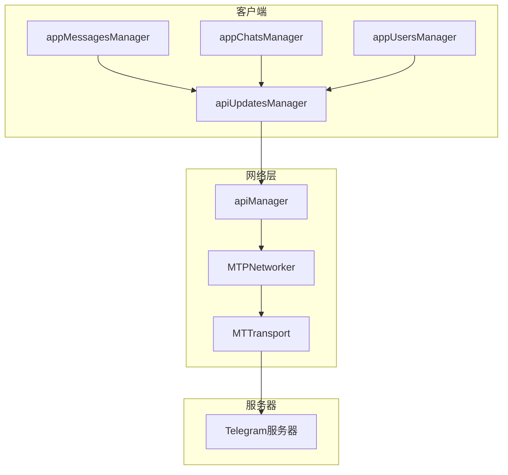

**Diagram sources**
- [apiUpdatesManager.ts](file://src\lib\appManagers\apiUpdatesManager.ts)
- [apiManager.ts](file://src\lib\mtproto\apiManager.ts)
- [networker.ts](file://src\lib\mtproto\networker.ts)

**Section sources**
- [apiUpdatesManager.ts](file://src\lib\appManagers\apiUpdatesManager.ts)
- [apiManager.ts](file://src\lib\mtproto\apiManager.ts)

## 核心管理器分析
### appMessagesManager分析
appMessagesManager负责管理消息的同步，包括消息的接收、发送和状态更新。它通过维护消息存储和历史记录来确保消息的完整性和一致性。

#### 消息存储结构
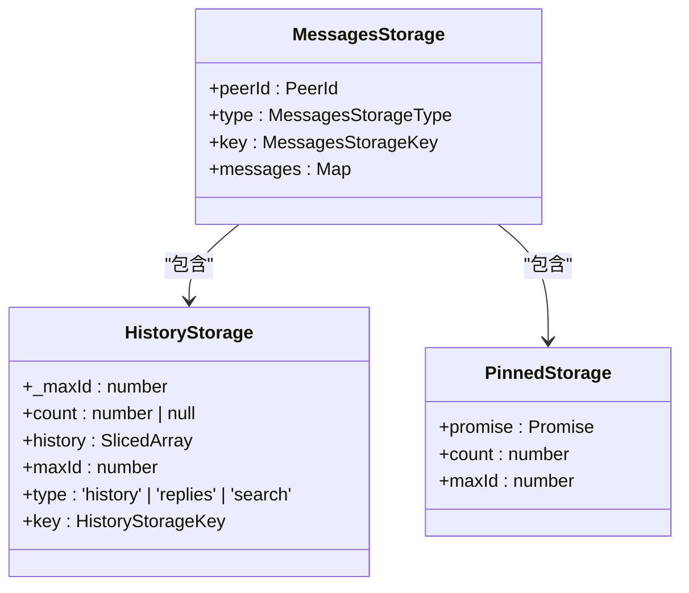

**Diagram sources**
- [appMessagesManager.ts](file://src\lib\appManagers\appMessagesManager.ts)

**Section sources**
- [appMessagesManager.ts](file://src\lib\appManagers\appMessagesManager.ts)

### appChatsManager分析
appChatsManager负责管理聊天的同步，包括聊天的创建、更新和删除。它通过维护聊天存储和参与者信息来确保聊天的完整性和一致性。

#### 聊天管理功能
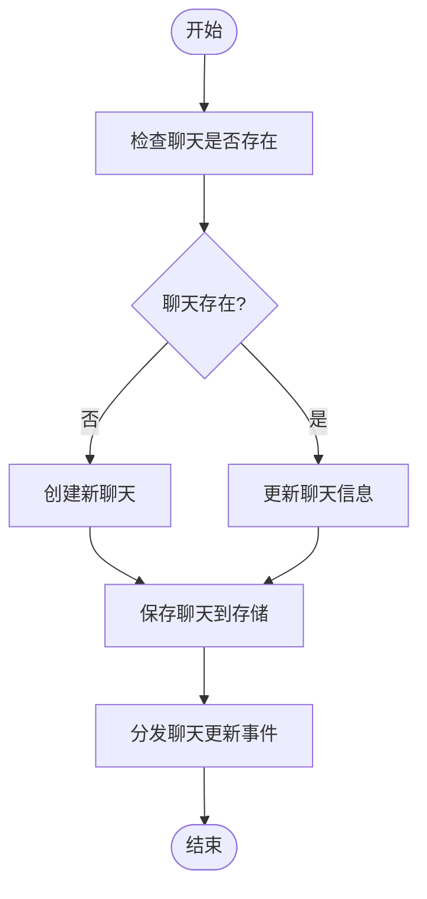

**Diagram sources**
- [appChatsManager.ts](file://src\lib\appManagers\appChatsManager.ts)

**Section sources**
- [appChatsManager.ts](file://src\lib\appManagers\appChatsManager.ts)

### appUsersManager分析
appUsersManager负责管理用户的同步，包括用户的创建、更新和删除。它通过维护用户存储和联系人信息来确保用户的完整性和一致性。

#### 用户状态管理
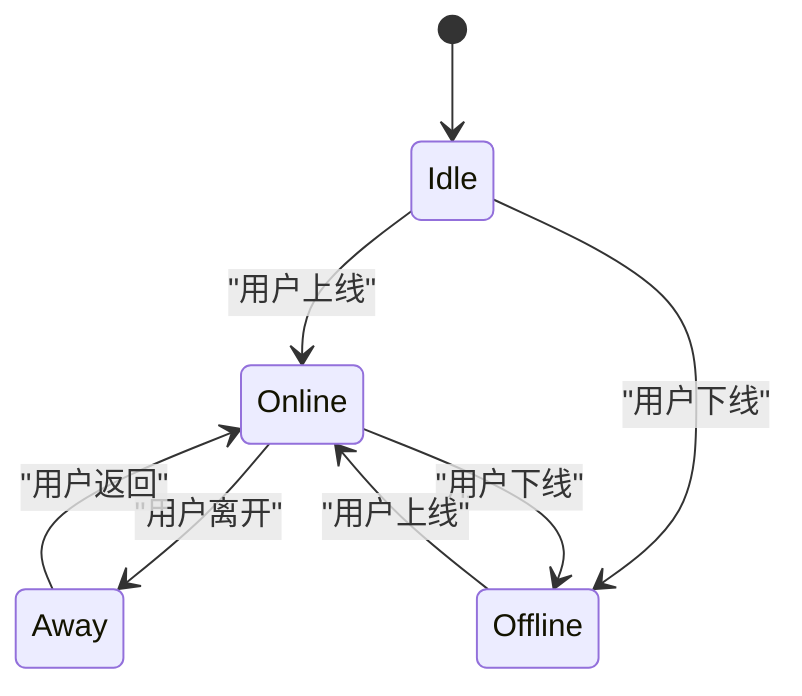

**Diagram sources**
- [appUsersManager.ts](file://src\lib\appManagers\appUsersManager.ts)

**Section sources**
- [appUsersManager.ts](file://src\lib\appManagers\appUsersManager.ts)

## 增量更新与全量同步
### 增量更新机制
增量更新通过apiUpdatesManager监听服务器的更新事件，实时处理各种更新类型。系统维护了pendingPtsUpdates和pendingSeqUpdates队列来处理未完成的更新。

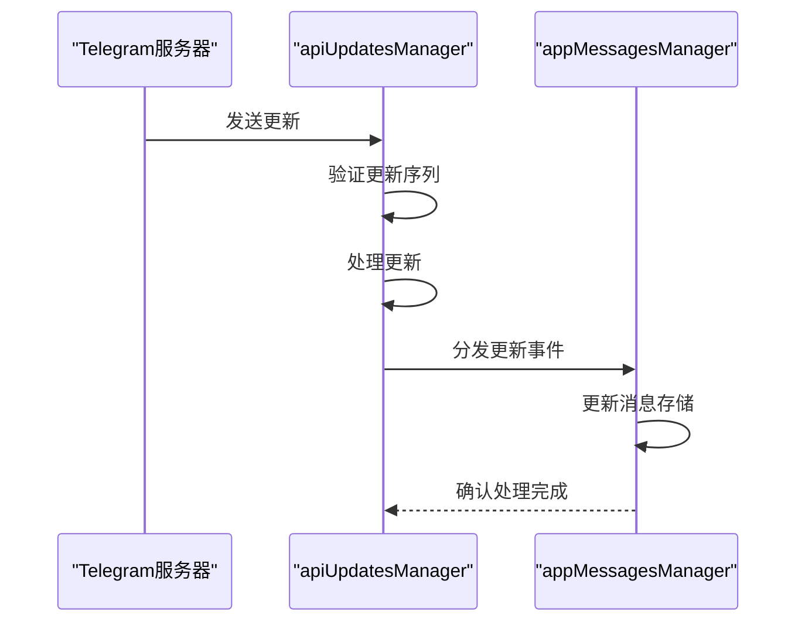

**Diagram sources**
- [apiUpdatesManager.ts](file://src\lib\appManagers\apiUpdatesManager.ts)
- [appMessagesManager.ts](file://src\lib\appManagers\appMessagesManager.ts)

**Section sources**
- [apiUpdatesManager.ts](file://src\lib\appManagers\apiUpdatesManager.ts)

### 全量同步机制
全量同步通过getDifference方法实现，当客户端状态与服务器状态不一致时，会请求完整的状态差异。系统通过维护updatesState来跟踪当前的同步状态。

#### 全量同步流程
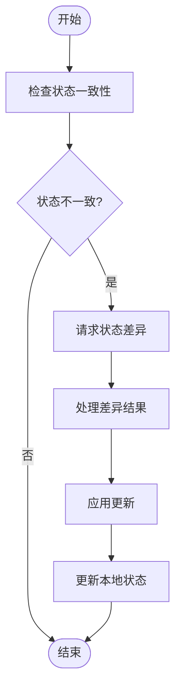

**Diagram sources**
- [apiUpdatesManager.ts](file://src\lib\appManagers\apiUpdatesManager.ts)

**Section sources**
- [apiUpdatesManager.ts](file://src\lib\appManagers\apiUpdatesManager.ts)

## 实时状态同步
### apiUpdatesManager核心作用
apiUpdatesManager是实时状态同步的核心组件，负责处理所有来自服务器的更新事件。它通过维护更新队列和状态同步机制，确保客户端状态与服务器状态保持一致。

#### 更新处理流程
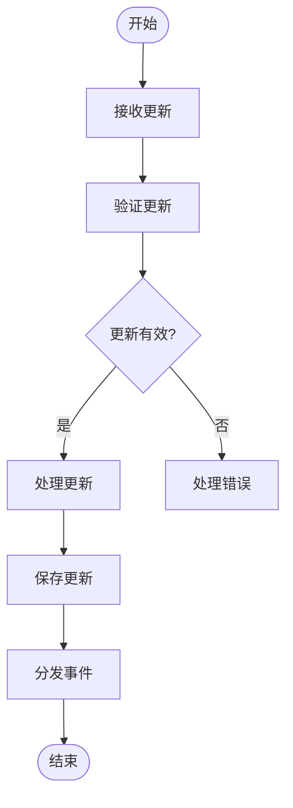

**Diagram sources**
- [apiUpdatesManager.ts](file://src\lib\appManagers\apiUpdatesManager.ts)

**Section sources**
- [apiUpdatesManager.ts](file://src\lib\appManagers\apiUpdatesManager.ts)

## 数据同步策略
### 消息同步策略
消息同步采用增量更新为主、全量同步为辅的策略。系统通过维护消息ID和序列号来确保消息的顺序性和完整性。

#### 消息同步机制
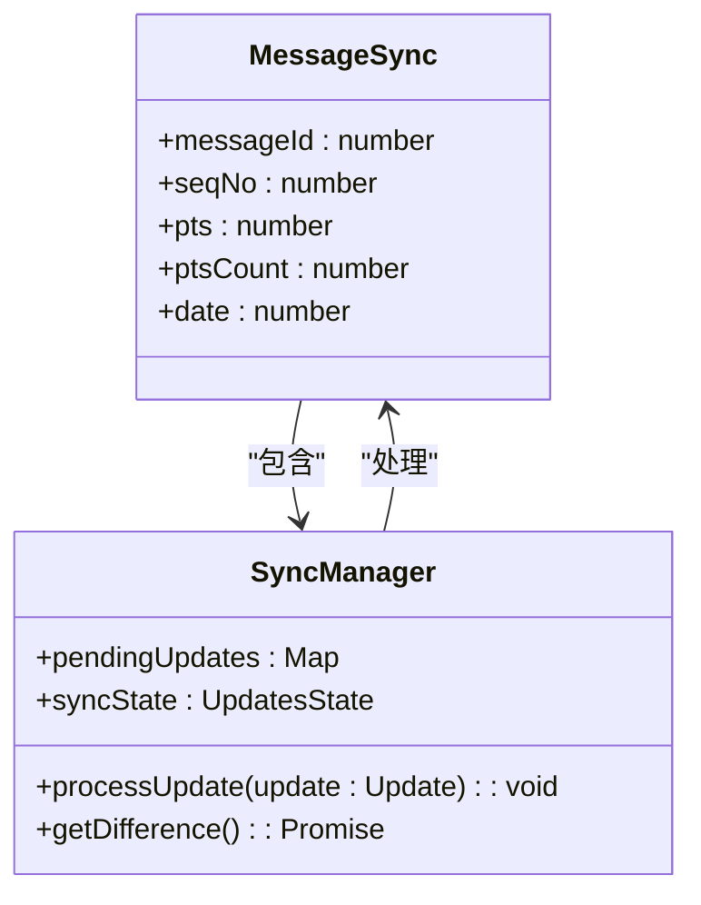

**Diagram sources**
- [appMessagesManager.ts](file://src\lib\appManagers\appMessagesManager.ts)
- [apiUpdatesManager.ts](file://src\lib\appManagers\apiUpdatesManager.ts)

**Section sources**
- [appMessagesManager.ts](file://src\lib\appManagers\appMessagesManager.ts)

### 冲突解决机制
当客户端和服务器状态发生冲突时，系统采用时间戳和序列号来解决冲突。较新的状态会覆盖较旧的状态，确保数据的一致性。

#### 冲突解决流程
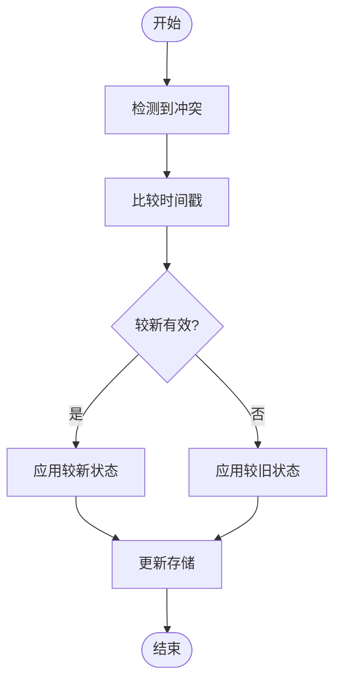

**Diagram sources**
- [apiUpdatesManager.ts](file://src\lib\appManagers\apiUpdatesManager.ts)

**Section sources**
- [apiUpdatesManager.ts](file://src\lib\appManagers\apiUpdatesManager.ts)

## 性能优化技巧
### 批量处理更新
系统采用批量处理机制来优化更新处理性能。通过debounce和batchUpdates机制，将多个更新合并为一个批次处理，减少事件分发次数。

#### 批量处理实现
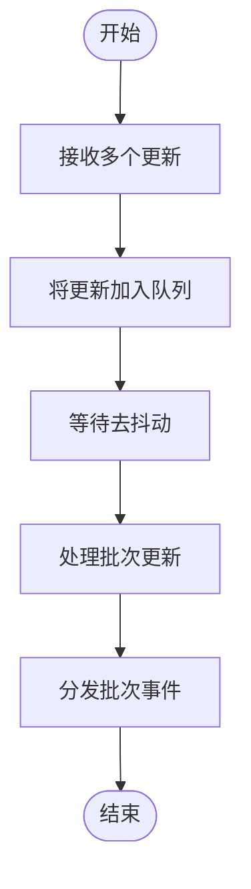

**Diagram sources**
- [appMessagesManager.ts](file://src\lib\appManagers\appMessagesManager.ts)

**Section sources**
- [appMessagesManager.ts](file://src\lib\appManagers\appMessagesManager.ts)

### 网络错误恢复
系统实现了完善的网络错误恢复机制，包括自动重连、请求重试和状态恢复。当网络连接中断时，系统会自动尝试重新连接并恢复同步状态。

#### 网络恢复流程
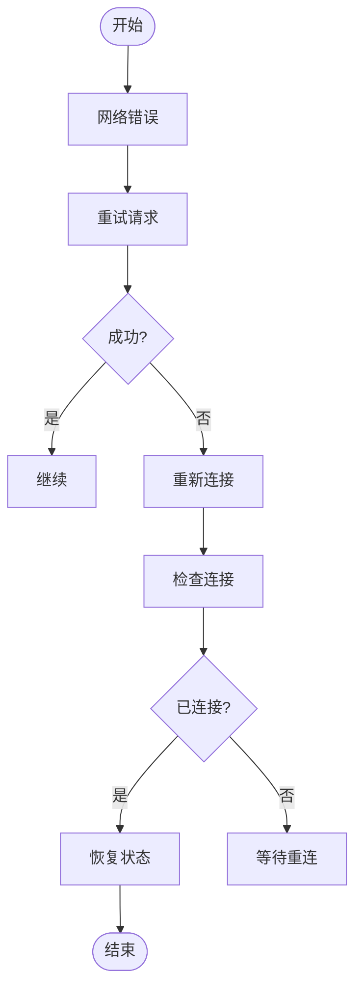

**Diagram sources**
- [apiManager.ts](file://src\lib\mtproto\apiManager.ts)
- [networker.ts](file://src\lib\mtproto\networker.ts)

**Section sources**
- [apiManager.ts](file://src\lib\mtproto\apiManager.ts)

## 常见问题与调试
### 常见同步问题
1. **状态不一致**：客户端和服务器状态不一致，需要执行全量同步
2. **更新丢失**：由于网络问题导致更新丢失，需要重新获取差异
3. **序列号错误**：序列号不匹配，需要重新初始化连接

### 调试方法
1. **日志分析**：通过详细的日志记录分析同步过程
2. **状态检查**：定期检查客户端和服务器状态的一致性
3. **网络监控**：监控网络连接状态和请求响应时间

## 结论
tweb项目的状态同步机制通过MTProto协议实现了高效、可靠的状态同步。系统采用分层架构和批量处理机制，确保了同步的性能和可靠性。通过完善的错误恢复机制，系统能够在网络不稳定的情况下保持数据的一致性。未来可以进一步优化批量处理算法和网络重试策略，提升系统的整体性能。