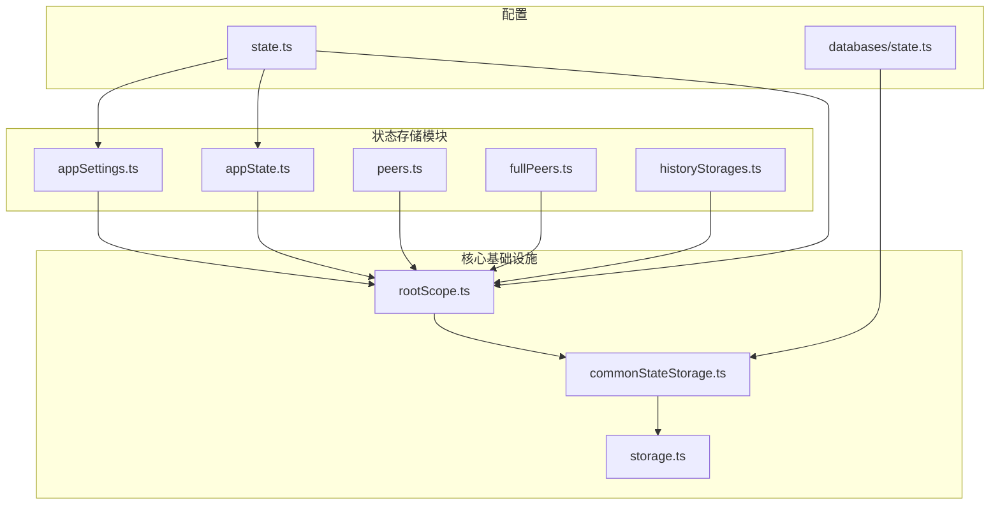
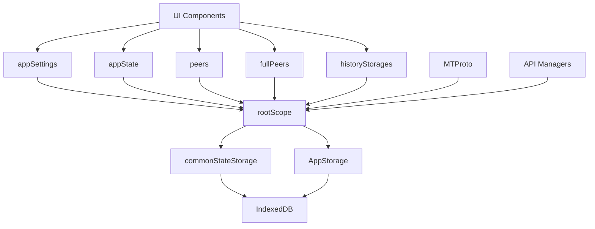
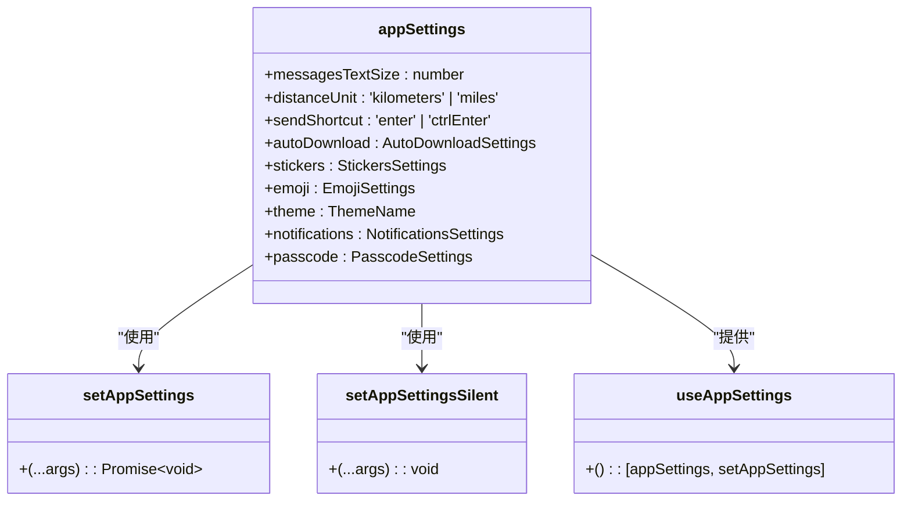
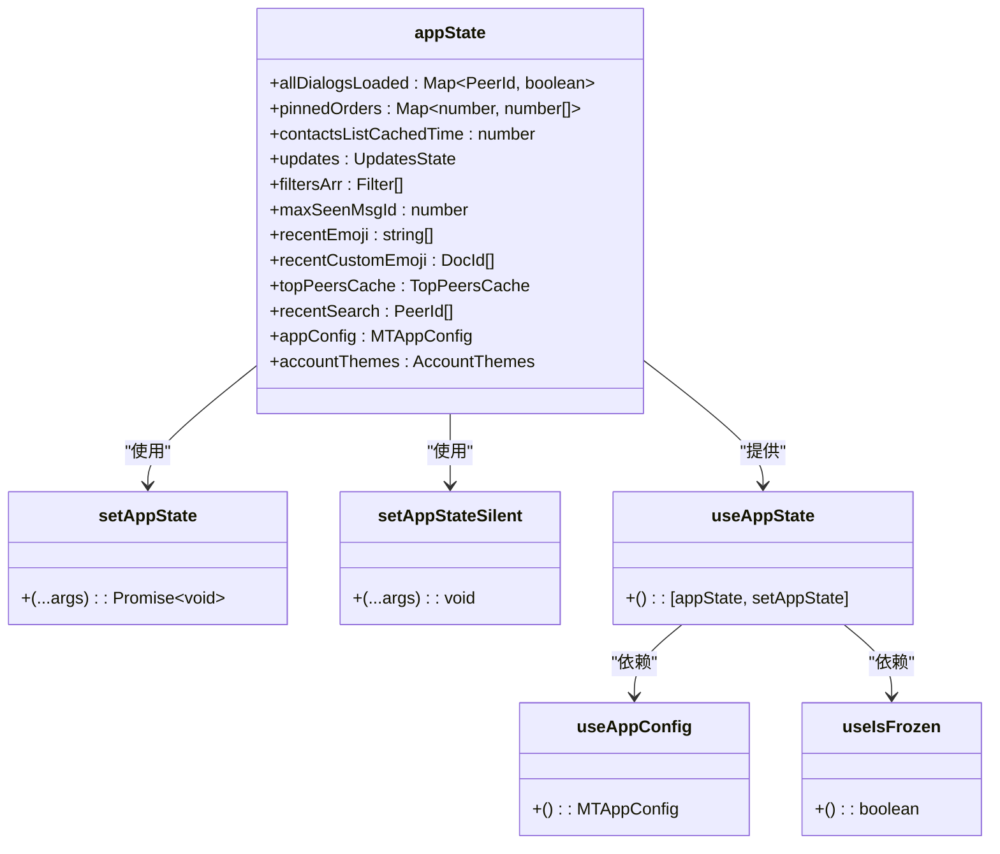
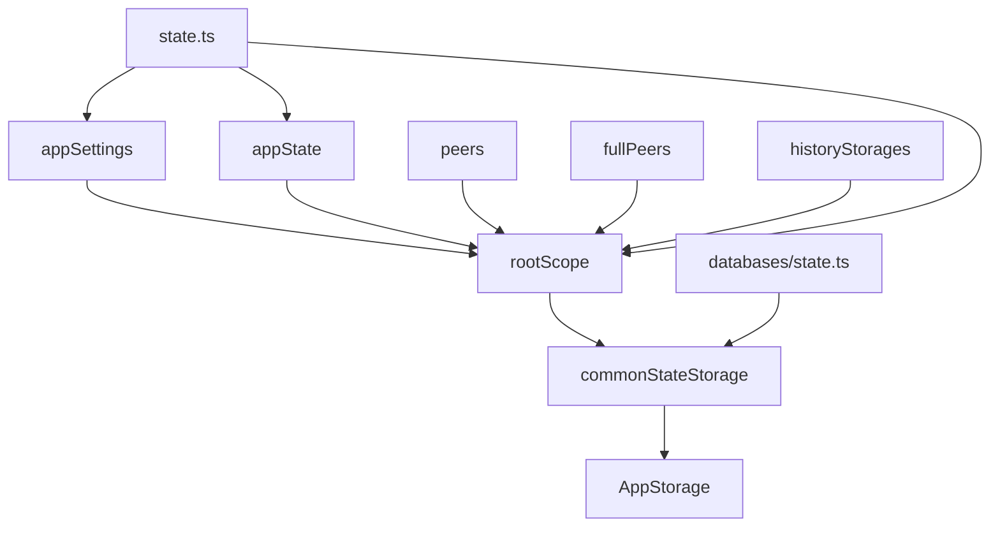

# 状态存储架构

<cite>
**本文档中引用的文件**  
- [appSettings.ts](file://src/stores/appSettings.ts)
- [appState.ts](file://src/stores/appState.ts)
- [peers.ts](file://src/stores/peers.ts)
- [fullPeers.ts](file://src/stores/fullPeers.ts)
- [historyStorages.ts](file://src/stores/historyStorages.ts)
- [rootScope.ts](file://src/lib/rootScope.ts)
- [state.ts](file://src/config/state.ts)
- [commonStateStorage.ts](file://src/lib/commonStateStorage.ts)
- [storage.ts](file://src/lib/storage.ts)
</cite>

## 目录
1. [简介](#简介)
2. [项目结构](#项目结构)
3. [核心组件](#核心组件)
4. [架构概述](#架构概述)
5. [详细组件分析](#详细组件分析)
6. [依赖分析](#依赖分析)
7. [性能考虑](#性能考虑)
8. [故障排除指南](#故障排除指南)
9. [结论](#结论)

## 简介
tweb项目采用基于Solid.js响应式系统的状态存储架构，实现了高效、可维护的状态管理。该架构通过rootScope作为全局状态容器，协调多个专用store（如appSettings、appState、peers等）之间的数据流和依赖关系。系统利用Solid.js的响应式特性，确保UI组件能够自动响应状态变化，同时通过合理的状态分割和订阅机制优化性能。本文档详细描述了该状态存储架构的设计原理、实现机制和最佳实践。

## 项目结构
tweb项目的状态存储相关文件主要分布在`src/stores`和`src/lib`目录下。`src/stores`目录包含各个专用状态存储模块，如appSettings、appState、peers等，每个模块负责管理特定领域的状态数据。`src/lib`目录包含核心状态管理基础设施，如rootScope和commonStateStorage。配置文件位于`src/config`目录下，定义了状态数据结构和初始值。这种分层结构实现了关注点分离，使状态管理逻辑清晰且易于维护。



**Diagram sources**
- [src/stores/appSettings.ts](file://src/stores/appSettings.ts)
- [src/stores/appState.ts](file://src/stores/appState.ts)
- [src/stores/peers.ts](file://src/stores/peers.ts)
- [src/stores/fullPeers.ts](file://src/stores/fullPeers.ts)
- [src/stores/historyStorages.ts](file://src/stores/historyStorages.ts)
- [src/lib/rootScope.ts](file://src/lib/rootScope.ts)
- [src/lib/commonStateStorage.ts](file://src/lib/commonStateStorage.ts)
- [src/lib/storage.ts](file://src/lib/storage.ts)
- [src/config/state.ts](file://src/config/state.ts)
- [src/config/databases/state.ts](file://src/config/databases/state.ts)

## 核心组件
tweb项目的状态存储架构由多个核心组件构成，包括appSettings、appState、peers等专用store，以及rootScope作为全局状态容器。这些组件协同工作，实现了高效的状态管理和数据流控制。appSettings store管理用户界面设置，appState store管理应用运行时状态，peers store管理用户和聊天对象数据。rootScope作为中央事件总线，协调各store之间的通信和数据同步。

**Section sources**
- [src/stores/appSettings.ts](file://src/stores/appSettings.ts)
- [src/stores/appState.ts](file://src/stores/appState.ts)
- [src/stores/peers.ts](file://src/stores/peers.ts)
- [src/lib/rootScope.ts](file://src/lib/rootScope.ts)

## 架构概述
tweb项目的状态存储架构基于Solid.js响应式系统构建，采用分层设计模式。在架构顶层，rootScope作为全局状态容器和事件总线，负责协调各专用store之间的通信。各专用store（如appSettings、appState、peers等）通过订阅rootScope事件来响应状态变化，并通过dispatchEvent方法发布状态更新。状态数据持久化通过commonStateStorage和AppStorage实现，利用IndexedDB进行本地存储，并支持数据加密。这种架构实现了关注点分离，提高了代码的可维护性和可测试性。



**Diagram sources**
- [src/lib/rootScope.ts](file://src/lib/rootScope.ts)
- [src/stores/appSettings.ts](file://src/stores/appSettings.ts)
- [src/stores/appState.ts](file://src/stores/appState.ts)
- [src/stores/peers.ts](file://src/stores/peers.ts)
- [src/stores/fullPeers.ts](file://src/stores/fullPeers.ts)
- [src/stores/historyStorages.ts](file://src/stores/historyStorages.ts)
- [src/lib/commonStateStorage.ts](file://src/lib/commonStateStorage.ts)
- [src/lib/storage.ts](file://src/lib/storage.ts)

## 详细组件分析

### appSettings Store分析
appSettings store负责管理用户界面设置，如消息文本大小、距离单位、发送快捷键等。该store基于Solid.js的createStore实现，提供响应式状态管理。通过setAppSettings函数更新状态时，不仅会更新本地状态，还会通过rootScope.managers.appStateManager同步到服务器。setAppSettingsSilent函数用于静默更新状态，避免触发不必要的服务器同步。useAppSettings钩子提供了一种便捷的方式来在组件中使用appSettings状态。



**Diagram sources**
- [src/stores/appSettings.ts](file://src/stores/appSettings.ts)
- [src/config/state.ts](file://src/config/state.ts)

**Section sources**
- [src/stores/appSettings.ts](file://src/stores/appSettings.ts)
- [src/config/state.ts](file://src/config/state.ts)

### appState Store分析
appState store管理应用的运行时状态，包括对话列表、过滤器、最近表情符号、顶部联系人缓存等。与appSettings不同，appState存储的是临时的运行时数据，不直接与服务器同步。该store同样基于Solid.js的createStore实现，提供响应式状态管理。setAppState函数用于更新状态，并通过rootScope.managers.appStateManager持久化到本地存储。useAppState钩子提供了一种便捷的方式来在组件中使用appState状态。useAppConfig和useIsFrozen是基于appState的计算属性，用于获取应用配置和检查应用是否被冻结。



**Diagram sources**
- [src/stores/appState.ts](file://src/stores/appState.ts)
- [src/config/state.ts](file://src/config/state.ts)

**Section sources**
- [src/stores/appState.ts](file://src/stores/appState.ts)
- [src/config/state.ts](file://src/config/state.ts)

### peers Store分析
peers store负责管理用户和聊天对象的基本信息，如头像、用户名、状态等。该store基于Solid.js的createStore实现，使用reconcile函数进行高效的状态更新。usePeer、useChat和useUser是三个核心钩子函数，用于在组件中订阅特定peer的状态变化。reconcilePeer和reconcilePeers函数用于更新store中的peer数据，确保UI能够及时反映最新的状态。这种设计模式实现了数据的集中管理和高效更新，避免了重复的网络请求和数据不一致问题。

```mermaid
classDiagram
class peers {
+[peerId : PeerId] : NotEmptyPeer
}
class usePeer {
+<T extends ValueOrGetter~PeerId~>(peerId : T) : T extends Accessor~any~ ? Accessor~NotEmptyPeer~ : NotEmptyPeer
}
class useChat {
+<T extends ValueOrGetter~ChatId~>(chatId : T) : T extends Accessor~any~ ? Accessor~Chat~ : Chat
}
class useUser {
+<T extends ValueOrGetter~UserId~>(userId : T) : T extends Accessor~any~ ? Accessor~User~ : User
}
class reconcilePeer {
+(peerId : PeerId, peer : NotEmptyPeer) : void
}
class reconcilePeers {
+(peers : {[peerId : PeerId] : NotEmptyPeer}) : void
}
peers --> usePeer : "提供"
peers --> useChat : "提供"
peers --> useUser : "提供"
peers --> reconcilePeer : "使用"
peers --> reconcilePeers : "使用"
```

**Diagram sources**
- [src/stores/peers.ts](file://src/stores/peers.ts)

**Section sources**
- [src/stores/peers.ts](file://src/stores/peers.ts)

### rootScope分析
rootScope是tweb项目的核心状态容器和事件总线，负责协调各组件之间的通信和数据同步。它继承自EventListenerBase，提供了事件订阅和发布的机制。myId、settings、managers和premium是rootScope的核心属性，分别存储当前用户ID、应用设置、管理器实例和高级用户状态。getConnectionStatus、getPremium和getMyId是三个核心getter函数，用于获取rootScope的状态。dispatchEventSingle函数用于在单个实例中分发事件，避免跨实例传播。rootScope通过addEventListener方法订阅各种状态变化事件，并通过dispatchEvent方法发布状态更新，实现了全局状态的统一管理。

```mermaid
classDiagram
class RootScope {
+myId : PeerId
+settings : StateSettings
+managers : AppManagers
+premium : boolean
}
class getConnectionStatus {
+() : {[name : string] : ConnectionStatusChange}
}
class getPremium {
+() : boolean
}
class getMyId {
+() : PeerId
}
class dispatchEventSingle {
+<L extends EventListenerListeners = BroadcastEventsListeners, T extends keyof L = keyof L>(name : T, ...args : ArgumentTypes~L[T]~) : void
}
RootScope --> getConnectionStatus : "提供"
RootScope --> getPremium : "提供"
RootScope --> getMyId : "提供"
RootScope --> dispatchEventSingle : "提供"
```

**Diagram sources**
- [src/lib/rootScope.ts](file://src/lib/rootScope.ts)

**Section sources**
- [src/lib/rootScope.ts](file://src/lib/rootScope.ts)

## 依赖分析
tweb项目的状态存储架构中，各组件之间存在明确的依赖关系。rootScope作为核心依赖，被所有专用store（appSettings、appState、peers等）所依赖，用于事件通信和状态同步。appSettings和appState依赖于state.ts中定义的状态数据结构和初始值。commonStateStorage依赖于storage.ts中的AppStorage实现，用于数据持久化。各store之间通过rootScope的事件机制进行通信，而不是直接相互依赖，这种设计降低了组件间的耦合度，提高了系统的可维护性和可扩展性。



**Diagram sources**
- [src/stores/appSettings.ts](file://src/stores/appSettings.ts)
- [src/stores/appState.ts](file://src/stores/appState.ts)
- [src/stores/peers.ts](file://src/stores/peers.ts)
- [src/stores/fullPeers.ts](file://src/stores/fullPeers.ts)
- [src/stores/historyStorages.ts](file://src/stores/historyStorages.ts)
- [src/lib/rootScope.ts](file://src/lib/rootScope.ts)
- [src/lib/commonStateStorage.ts](file://src/lib/commonStateStorage.ts)
- [src/lib/storage.ts](file://src/lib/storage.ts)
- [src/config/state.ts](file://src/config/state.ts)
- [src/config/databases/state.ts](file://src/config/databases/state.ts)

**Section sources**
- [src/stores/appSettings.ts](file://src/stores/appSettings.ts)
- [src/stores/appState.ts](file://src/stores/appState.ts)
- [src/stores/peers.ts](file://src/stores/peers.ts)
- [src/stores/fullPeers.ts](file://src/stores/fullPeers.ts)
- [src/stores/historyStorages.ts](file://src/stores/historyStorages.ts)
- [src/lib/rootScope.ts](file://src/lib/rootScope.ts)
- [src/lib/commonStateStorage.ts](file://src/lib/commonStateStorage.ts)
- [src/lib/storage.ts](file://src/lib/storage.ts)
- [src/config/state.ts](file://src/config/state.ts)
- [src/config/databases/state.ts](file://src/config/databases/state.ts)

## 性能考虑
tweb项目的状态存储架构在设计时充分考虑了性能优化。通过使用Solid.js的细粒度响应式系统，确保只有依赖特定状态的组件才会重新渲染，避免了不必要的UI更新。throttleWith函数用于节流状态保存操作，减少对IndexedDB的频繁写入。reconcile函数用于高效地比较和更新复杂对象，最小化DOM操作。commonStateStorage和AppStorage实现了缓存机制，减少对持久化存储的访问次数。此外，通过将状态分为appSettings（用户设置）和appState（运行时状态），实现了不同生命周期状态的分离管理，进一步优化了性能。

## 故障排除指南
在使用tweb项目的状态存储架构时，可能会遇到一些常见问题。如果状态更新没有触发UI重新渲染，应检查是否正确使用了Solid.js的响应式API，如createStore和createMemo。如果状态持久化失败，应检查IndexedDB的访问权限和存储空间。如果出现内存泄漏，应确保在组件卸载时正确清理事件订阅。如果状态同步出现问题，应检查rootScope的事件分发机制是否正常工作。对于复杂的调试需求，可以利用MOUNT_CLASS_TO在开发环境中暴露关键对象，便于检查和修改状态。

**Section sources**
- [src/lib/rootScope.ts](file://src/lib/rootScope.ts)
- [src/stores/appSettings.ts](file://src/stores/appSettings.ts)
- [src/stores/appState.ts](file://src/stores/appState.ts)
- [src/stores/peers.ts](file://src/stores/peers.ts)
- [src/lib/storage.ts](file://src/lib/storage.ts)

## 结论
tweb项目的状态存储架构通过基于Solid.js响应式系统的分层设计，实现了高效、可维护的状态管理。rootScope作为全局状态容器和事件总线，协调各专用store之间的通信和数据同步。appSettings、appState、peers等专用store负责管理特定领域的状态数据，通过合理的状态分割和订阅机制优化性能。该架构充分利用了Solid.js的响应式特性，确保UI组件能够自动响应状态变化，同时通过缓存、节流等技术优化性能。这种设计模式为大型Web应用的状态管理提供了一个可扩展、高性能的解决方案。