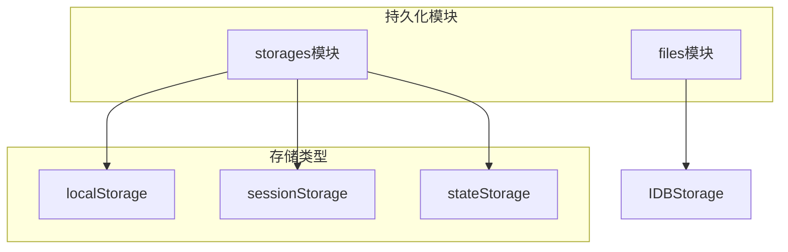
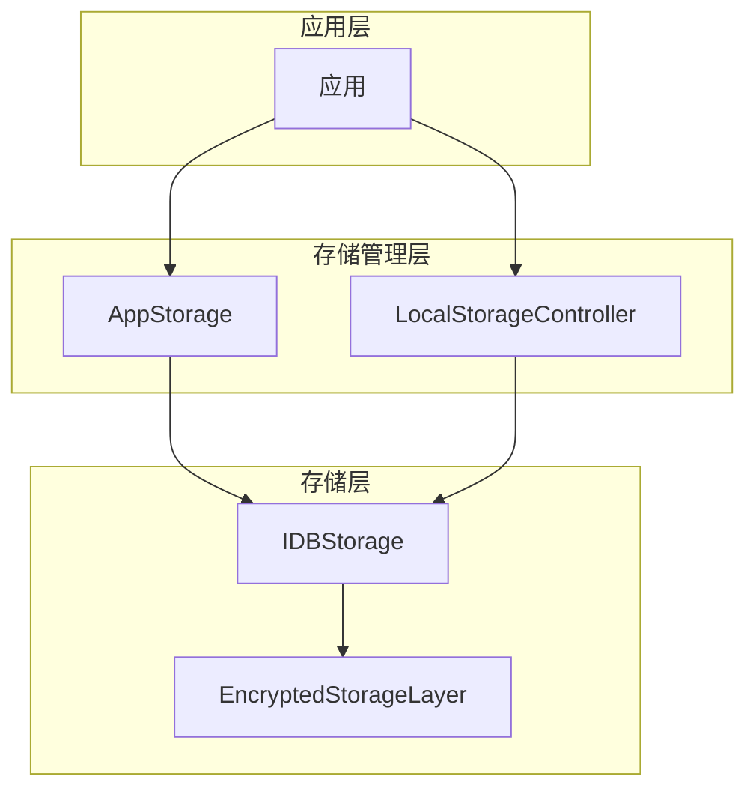
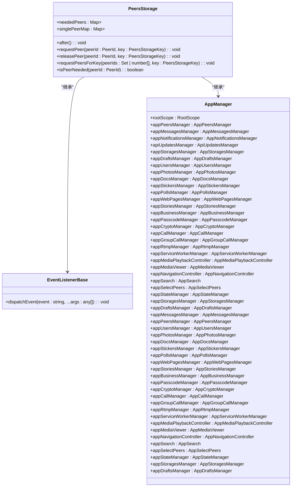
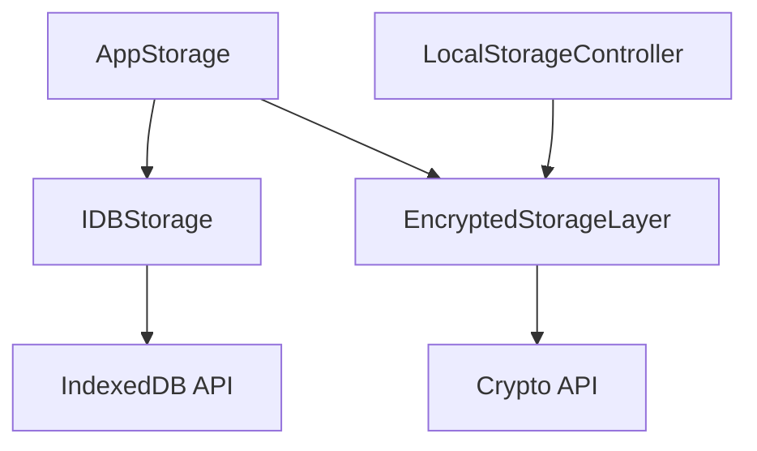

# 状态持久化

<cite>
**本文档引用的文件**   
- [storage.ts](file://src/lib/storage.ts)
- [localStorage.ts](file://src/lib/localStorage.ts)
- [sessionStorage.ts](file://src/lib/sessionStorage.ts)
- [stateStorage.ts](file://src/lib/stateStorage.ts)
- [dialogs.ts](file://src/lib/storages/dialogs.ts)
- [peers.ts](file://src/lib/storages/peers.ts)
- [thumbs.ts](file://src/lib/storages/thumbs.ts)
- [encryptedStorageLayer.ts](file://src/lib/encryptedStorageLayer.ts)
- [idb.ts](file://src/lib/files/idb.ts)
- [state.ts](file://src/config/databases/state.ts)
- [commonStateStorage.ts](file://src/lib/commonStateStorage.ts)
</cite>

## 目录
1. [简介](#简介)
2. [项目结构](#项目结构)
3. [核心组件](#核心组件)
4. [架构概述](#架构概述)
5. [详细组件分析](#详细组件分析)
6. [依赖分析](#依赖分析)
7. [性能考虑](#性能考虑)
8. [故障排除指南](#故障排除指南)
9. [结论](#结论)

## 简介
本文档详细描述了tweb项目中基于IndexedDB和Web Storage的状态持久化实现。文档涵盖了storages模块中dialogs、peers和thumbs等存储器的设计原理和使用场景，解释了localStorage、sessionStorage和stateStorage的分层持久化策略。此外，还阐述了数据序列化、版本迁移和清理机制，并提供了持久化性能优化技巧，如批量写入和索引优化。最后，记录了常见的持久化问题及其解决方案。

## 项目结构
tweb项目的持久化功能主要集中在`src/lib/storages`和`src/lib/files`目录下。`storages`模块包含了各种存储器的实现，如dialogs、peers和thumbs，而`files`模块则负责底层的文件存储和IndexedDB操作。`localStorage`、`sessionStorage`和`stateStorage`分别用于不同的持久化需求，形成了一个分层的持久化策略。



**图表来源**
- [storage.ts](file://src/lib/storage.ts)
- [localStorage.ts](file://src/lib/localStorage.ts)
- [sessionStorage.ts](file://src/lib/sessionStorage.ts)
- [stateStorage.ts](file://src/lib/stateStorage.ts)
- [idb.ts](file://src/lib/files/idb.ts)

**章节来源**
- [storage.ts](file://src/lib/storage.ts)
- [localStorage.ts](file://src/lib/localStorage.ts)
- [sessionStorage.ts](file://src/lib/sessionStorage.ts)
- [stateStorage.ts](file://src/lib/stateStorage.ts)
- [idb.ts](file://src/lib/files/idb.ts)

## 核心组件
tweb项目的核心持久化组件包括`AppStorage`、`LocalStorageController`、`IDBStorage`和`EncryptedStorageLayer`。这些组件共同实现了基于IndexedDB和Web Storage的状态持久化功能。

**章节来源**
- [storage.ts](file://src/lib/storage.ts)
- [localStorage.ts](file://src/lib/localStorage.ts)
- [idb.ts](file://src/lib/files/idb.ts)
- [encryptedStorageLayer.ts](file://src/lib/encryptedStorageLayer.ts)

## 架构概述
tweb项目的持久化架构采用了分层设计，结合了IndexedDB和Web Storage的优势。`AppStorage`作为核心存储类，提供了统一的接口来操作不同的存储后端。`LocalStorageController`负责管理localStorage的读写操作，并支持加密存储。`IDBStorage`实现了对IndexedDB的封装，提供了异步的存储操作。`EncryptedStorageLayer`则在IndexedDB的基础上增加了数据加密功能，确保敏感数据的安全性。



**图表来源**
- [storage.ts](file://src/lib/storage.ts)
- [localStorage.ts](file://src/lib/localStorage.ts)
- [idb.ts](file://src/lib/files/idb.ts)
- [encryptedStorageLayer.ts](file://src/lib/encryptedStorageLayer.ts)

## 详细组件分析

### dialogs存储器分析
dialogs存储器负责管理对话列表的持久化。它通过`DialogsStorage`类实现了对话的增删改查操作，并利用IndexedDB进行数据存储。对话数据包括对话的元信息、消息列表和未读状态等。

```mermaid
classDiagram
class DialogsStorage {
+dialogs : {[peerId : PeerId] : Dialog}
+savedDialogs : {[peerId : PeerId] : SavedDialog}
+folders : {[folderId : number] : Folder}
+allDialogsLoaded : {[folder_id : number] : boolean}
+dialogsOffsetDate : {[folder_id : number] : number}
+pinnedOrders : {[folder_id : number] : PeerId[]}
+dialogsNum : number
+dialogsIndex : SearchIndex<PeerId>
+cachedResults : {query : string, count : number, dialogs : (Dialog | ForumTopic)[], folderId : number}
+forumTopics : Map<PeerId, {topics : Map<number, ForumTopic>, temporaryTopics : Map<number, ForumTopic>, deletedTopics : Set<number>, getTopicPromises : Map<number, CancellablePromise<ForumTopic>>, index : SearchIndex<ForumTopic['id']>, getTopicsPromise? : Promise<any>}>
+savedDialogsPromises : Map<PeerId, Promise<SavedDialog>>
+after() : Promise~void~
+indexMyDialog() : void
+setDialogsFromState(dialogs : Dialog[]) : void
+isDialogsLoaded(folderId : number) : boolean
+setDialogsLoaded(folderId : number, loaded : boolean) : void
+clear(init? : boolean) : void
+createSearchIndex~T~() : SearchIndex~T~
+handleDialogUnpinning(dialog : AnyDialog, folderId : number) : void
+savePinnedOrders() : void
+resetPinnedOrder(folderId : number) : void
+getPinnedOrders(folderId : number) : PeerId[]
+isDialogPinned(peerId : PeerId, folderId : number) : boolean
+getOffsetDate(folderId : number) : number
+generateFolder(id : number) : Folder
+getFolder(id : number) : Folder
+isVirtualFilter(filterId : number) : boolean
+getFilterType(filterId : number) : FilterType
+isFilterIdForForum(filterId : number) : boolean
+getFilterIdForForum(forumTopic : ForumTopic) : number
+getFolderDialogs(id : number, skipMigrated? : boolean) : Folder['dialogs']
+getNextDialog(currentPeerId : PeerId, next : boolean, filterId : number) : Folder['dialogs'][0]
+getDialogIndexKeyByFilterId(filterId : number) : ReturnType~typeof getDialogIndexKey~
+isDialogUnmuted(dialog : Dialog | ForumTopic) : boolean
+getFolderUnreadCount(filterId : number) : {unreadUnmutedCount : number, unreadCount : number}
+getCachedDialogs(skipMigrated? : boolean) : Dialog[]
+setDialogIndexInFilter(dialog : AnyDialog, indexKey : ReturnType~typeof getDialogIndexKey~, filter? : MyDialogFilter) : number
+getDialog(peerId : PeerId, folderId? : number, topicOrSavedId? : number, skipMigrated? : boolean) : [Folder['dialogs'][0], number] | []
+getDialogOnly(peerId : PeerId) : Dialog
+getAnyDialog(peerId : PeerId, topicOrSavedId? : number) : AnyDialog
+getDialogIndex(peerId : PeerId | Parameters~typeof getDialogIndex~[0], indexKey : ReturnType~typeof getDialogIndexKey~, topicOrSavedId? : number) : number
+generateDialogIndex(date? : number, isPinned? : boolean) : number
+getDialogFilterId(dialog : AnyDialog) : number
+getPinnedOrdersByDialog(dialog : AnyDialog) : PeerId[]
+processDialogForFilters(dialog : AnyDialog, noIndex? : boolean) : void
+processDialogForFilter(dialog : AnyDialog, filter? : MyDialogFilter, noIndex? : boolean) : boolean
+prepareDialogUnreadCountModifying(dialog : AnyDialog, toggle? : boolean) : NoneToVoidFunction
+prepareFolderUnreadCountModifyingByDialog(folderId : number, dialog : AnyDialog, toggle? : boolean) : NoneToVoidFunction
+modifyFolderUnreadCount(folderId : number, addMessagesCount : number, toggleDialog : boolean, toggleUnmuted : boolean, dialog : Dialog | ForumTopic) : void
}
class Folder {
+dialogs : AnyDialog[]
+id : number
+count : number
+unreadMessagesCount : number
+unreadPeerIds : Set<PeerId>
+unreadUnmutedPeerIds : Set<PeerId>
+dispatchUnreadTimeout? : number
}
class AnyDialog {
+dialog : Dialog
+index : number
}
DialogsStorage --> Folder : "包含"
DialogsStorage --> AnyDialog : "包含"
```

**图表来源**
- [dialogs.ts](file://src/lib/storages/dialogs.ts)

**章节来源**
- [dialogs.ts](file://src/lib/storages/dialogs.ts)

### peers存储器分析
peers存储器负责管理用户和群组的持久化。它通过`PeersStorage`类实现了对用户和群组信息的缓存和管理，确保在需要时能够快速获取相关数据。



**图表来源**
- [peers.ts](file://src/lib/storages/peers.ts)

**章节来源**
- [peers.ts](file://src/lib/storages/peers.ts)

### thumbs存储器分析
thumbs存储器负责管理缩略图的持久化。它通过`ThumbsStorage`类实现了对缩略图的缓存和管理，确保在需要时能够快速获取相关缩略图。

```mermaid
classDiagram
class ThumbsStorage {
+thumbsCache : ThumbsCache
+stickerCachedThumbs : StickerCachedThumbs
+getCacheContext(media : ThumbStorageMedia, thumbSize? : string, key? : string) : ThumbCache
+mirrorCacheContext(key : string, thumbSize : string, value? : ThumbCache) : void
+mirrorStickerThumb(key : string, value? : StickerCachedThumb) : void
+mirrorAll(port? : MessageEventSource) : void
+setCacheContextURL(media : ThumbStorageMedia, thumbSize? : string, url : string, downloaded? : number, key? : string) : ThumbCache
+deleteCacheContext(media : ThumbStorageMedia, thumbSize? : string, key? : string) : void
+getStickerCachedThumb(docId : DocId, toneIndex : number | string) : StickerCachedThumb
+saveStickerPreview(docId : DocId, blob : Blob, width : number, height : number, toneIndex : number | string) : void
+clearColoredStickerThumbs() : void
}
class ThumbCache {
+downloaded : number
+url : string
+type : string
}
class ThumbsCache {
+[key : string] : {[size : string] : ThumbCache}
}
class StickerCachedThumbs {
+[docIdAndToneIndex : DocId] : StickerCachedThumb
}
class StickerCachedThumb {
+url : string
+w : number
+h : number
}
ThumbsStorage --> ThumbCache : "包含"
ThumbsStorage --> ThumbsCache : "包含"
ThumbsStorage --> StickerCachedThumbs : "包含"
ThumbsStorage --> StickerCachedThumb : "包含"
```

**图表来源**
- [thumbs.ts](file://src/lib/storages/thumbs.ts)

**章节来源**
- [thumbs.ts](file://src/lib/storages/thumbs.ts)

## 依赖分析
tweb项目的持久化功能依赖于多个核心组件和模块。`AppStorage`依赖于`IDBStorage`和`EncryptedStorageLayer`来实现数据的存储和加密。`LocalStorageController`依赖于`EncryptedStorageLayer`来实现加密存储。`IDBStorage`依赖于浏览器的IndexedDB API来实现数据的持久化存储。



**图表来源**
- [storage.ts](file://src/lib/storage.ts)
- [localStorage.ts](file://src/lib/localStorage.ts)
- [idb.ts](file://src/lib/files/idb.ts)
- [encryptedStorageLayer.ts](file://src/lib/encryptedStorageLayer.ts)

**章节来源**
- [storage.ts](file://src/lib/storage.ts)
- [localStorage.ts](file://src/lib/localStorage.ts)
- [idb.ts](file://src/lib/files/idb.ts)
- [encryptedStorageLayer.ts](file://src/lib/encryptedStorageLayer.ts)

## 性能考虑
为了优化持久化性能，tweb项目采用了多种策略。首先，通过`throttleWith`和`asyncThrottle`函数对存储操作进行节流，避免频繁的I/O操作。其次，使用`deferredPromise`来延迟执行存储操作，减少主线程的阻塞。此外，通过`getAllEntries`和`getAllKeys`方法批量获取数据，减少数据库查询次数。

**章节来源**
- [storage.ts](file://src/lib/storage.ts)
- [idb.ts](file://src/lib/files/idb.ts)
- [encryptedStorageLayer.ts](file://src/lib/encryptedStorageLayer.ts)

## 故障排除指南
在使用tweb项目的持久化功能时，可能会遇到一些常见问题。例如，存储空间不足、数据损坏等。对于存储空间不足的问题，可以通过清理不必要的数据或增加存储空间来解决。对于数据损坏的问题，可以通过重新初始化存储或从备份中恢复数据来解决。

**章节来源**
- [storage.ts](file://src/lib/storage.ts)
- [idb.ts](file://src/lib/files/idb.ts)
- [encryptedStorageLayer.ts](file://src/lib/encryptedStorageLayer.ts)

## 结论
tweb项目通过结合IndexedDB和Web Storage，实现了高效、安全的状态持久化功能。通过分层的持久化策略和多种优化技巧，确保了数据的可靠性和性能。未来可以进一步优化存储结构，提高数据访问速度，并增强数据的安全性。