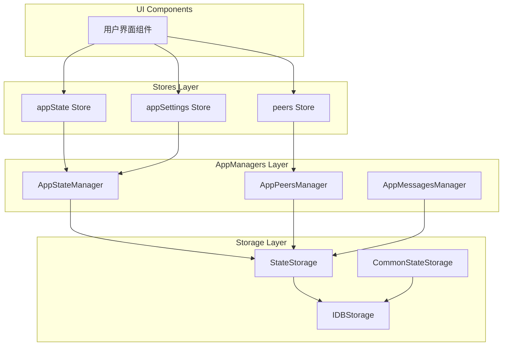
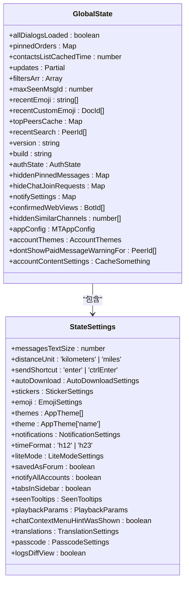
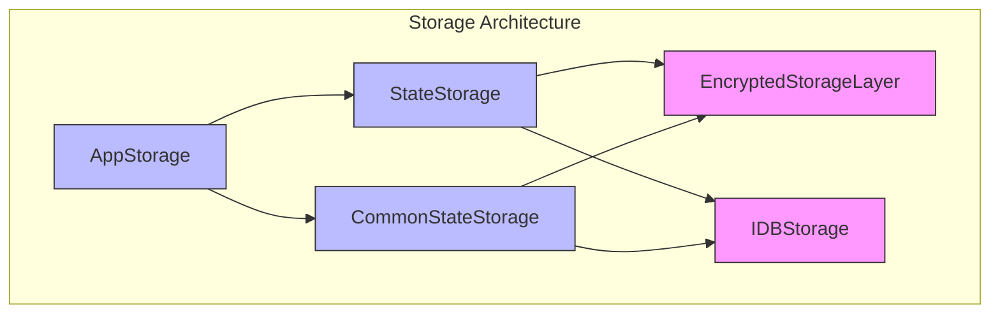
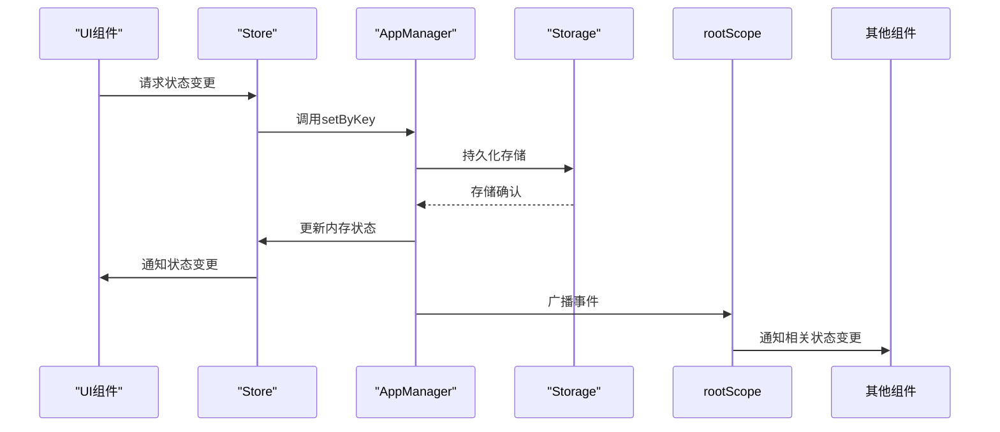
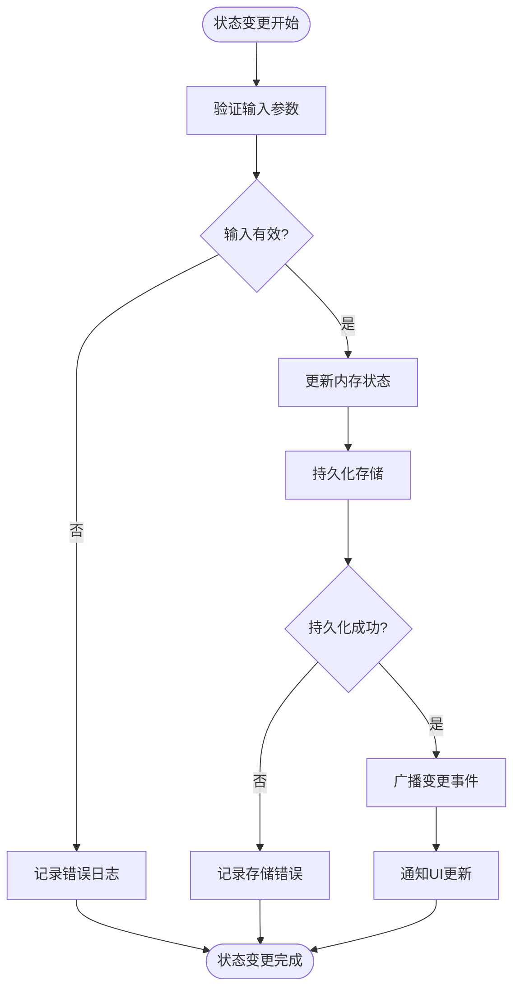
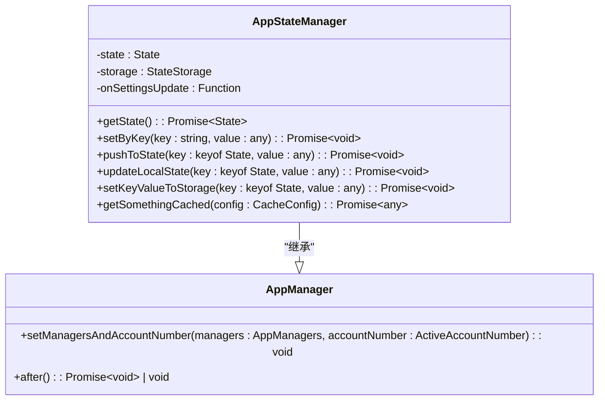
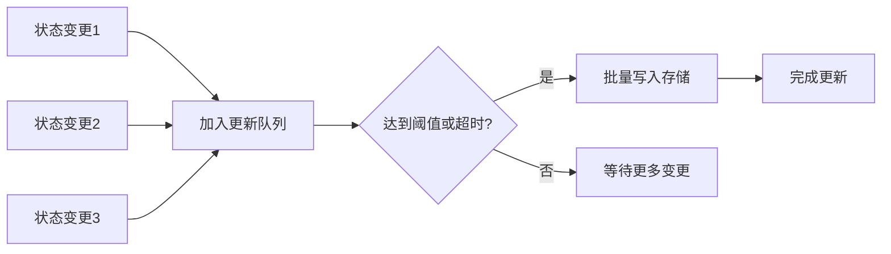

# 状态管理

<cite>
**本文档中引用的文件**  
- [appState.ts](file://src/stores/appState.ts)
- [rootScope.ts](file://src/lib/rootScope.ts)
- [stateStorage.ts](file://src/lib/stateStorage.ts)
- [commonStateStorage.ts](file://src/lib/commonStateStorage.ts)
- [state.ts](file://src/config/state.ts)
- [appStateManager.ts](file://src/lib/appManagers/appStateManager.ts)
- [storage.ts](file://src/lib/storage.ts)
</cite>

## 目录
1. [简介](#简介)
2. [分层状态管理架构](#分层状态管理架构)
3. [全局状态与局部状态划分](#全局状态与局部状态划分)
4. [状态持久化机制](#状态持久化机制)
5. [状态同步策略](#状态同步策略)
6. [状态变更跟踪与调试](#状态变更跟踪与调试)
7. [状态管理器设计模式](#状态管理器设计模式)
8. [状态订阅与更新最佳实践](#状态订阅与更新最佳实践)
9. [性能优化技巧](#性能优化技巧)
10. [常见问题解决方案](#常见问题解决方案)

## 简介
tweb项目采用基于stores和appManagers的分层状态管理架构，实现了高效、可维护的状态管理方案。该架构通过将状态分为全局状态和局部状态，结合持久化存储和同步机制，确保了应用状态的一致性和可靠性。状态管理的核心组件包括基于SolidJS的响应式stores和负责业务逻辑处理的appManagers，二者协同工作，提供了完整的状态管理解决方案。

**Section sources**
- [appState.ts](file://src/stores/appState.ts#L1-L39)
- [rootScope.ts](file://src/lib/rootScope.ts#L1-L315)

## 分层状态管理架构
tweb项目的状态管理架构采用分层设计，主要由stores层和appManagers层构成。stores层负责提供响应式状态访问，而appManagers层负责处理业务逻辑和状态变更。

**Diagram sources**
- [appState.ts](file://src/stores/appState.ts#L1-L39)
- [appStateManager.ts](file://src/lib/appManagers/appStateManager.ts#L1-L133)
- [stateStorage.ts](file://src/lib/stateStorage.ts#L1-L28)

**Section sources**
- [appState.ts](file://src/stores/appState.ts#L1-L39)
- [appStateManager.ts](file://src/lib/appManagers/appStateManager.ts#L1-L133)

## 全局状态与局部状态划分
tweb项目根据状态的使用范围和生命周期，将状态划分为全局状态和局部状态，遵循明确的划分原则。

### 全局状态
全局状态是指在整个应用生命周期内需要持久化存储且可能被多个组件共享的状态。这些状态通常包括用户配置、会话信息和全局设置等。

**Diagram sources**
- [state.ts](file://src/config/state.ts#L122-L420)

**Section sources**
- [state.ts](file://src/config/state.ts#L122-L420)

### 局部状态
局部状态是指在特定组件或功能模块内部使用的临时状态，通常不需要持久化存储或跨组件共享。这些状态包括UI组件的临时状态、表单输入状态等。

## 状态持久化机制
tweb项目采用多层次的持久化机制，确保不同类型的状态能够以最合适的方式进行存储和恢复。

### 存储架构
状态持久化基于IndexedDB实现，通过AppStorage抽象层提供统一的访问接口。系统根据状态的敏感程度和使用场景，将状态存储在不同的数据库中。

**Diagram sources**
- [storage.ts](file://src/lib/storage.ts#L46-L490)
- [stateStorage.ts](file://src/lib/stateStorage.ts#L1-L28)
- [commonStateStorage.ts](file://src/lib/commonStateStorage.ts#L1-L50)

### 加密存储
对于敏感信息如密码、认证信息等，系统采用加密存储机制。通过EncryptedStorageLayer包装器，在数据写入存储前进行加密，读取时进行解密，确保用户数据的安全性。

**Section sources**
- [storage.ts](file://src/lib/storage.ts#L46-L490)
- [stateStorage.ts](file://src/lib/stateStorage.ts#L1-L28)
- [commonStateStorage.ts](file://src/lib/commonStateStorage.ts#L1-L50)

## 状态同步策略
tweb项目采用事件驱动的状态同步策略，确保状态变更能够及时、准确地传播到所有相关组件。

### 状态同步流程
状态同步通过AppStateManager协调，当状态发生变更时，系统会触发相应的事件，通知所有订阅者进行状态更新。

**Diagram sources**
- [appStateManager.ts](file://src/lib/appManagers/appStateManager.ts#L47-L91)
- [appState.ts](file://src/stores/appState.ts#L8-L13)

### 事件广播机制
系统通过rootScope的事件广播机制实现跨组件的状态同步。当状态发生重要变更时，会触发相应的广播事件，允许其他组件监听并响应这些变更。

**Section sources**
- [appStateManager.ts](file://src/lib/appManagers/appStateManager.ts#L47-L91)
- [rootScope.ts](file://src/lib/rootScope.ts#L350-L315)

## 状态变更跟踪与调试
tweb项目提供了完善的状态变更跟踪和调试机制，帮助开发者理解和诊断状态变化。

### 状态变更日志
系统通过日志记录状态变更的关键信息，包括变更时间、变更内容和变更来源，便于问题排查和性能分析。

**Diagram sources**
- [appStateManager.ts](file://src/lib/appManagers/appStateManager.ts#L47-L91)
- [storage.ts](file://src/lib/storage.ts#L121-L161)

### 调试工具
系统提供了多种调试工具，包括状态快照、变更历史记录和性能监控，帮助开发者深入了解应用状态的变化过程。

**Section sources**
- [appStateManager.ts](file://src/lib/appManagers/appStateManager.ts#L47-L91)
- [storage.ts](file://src/lib/storage.ts#L121-L161)

## 状态管理器设计模式
tweb项目中的状态管理器（appManagers）采用特定的设计模式，确保了代码的可维护性和扩展性。

### 单例模式
每个状态管理器实例在应用中都是唯一的，通过createManagers函数统一创建和管理，确保了状态的一致性。

**Diagram sources**
- [appStateManager.ts](file://src/lib/appManagers/appStateManager.ts#L25-L133)
- [createManagers.ts](file://src/lib/appManagers/createManagers.ts#L73-L129)

### 职责边界
状态管理器严格遵循单一职责原则，每个管理器负责特定领域的状态管理，如AppPeersManager负责用户和联系人状态，AppMessagesManager负责消息状态等。

**Section sources**
- [appStateManager.ts](file://src/lib/appManagers/appStateManager.ts#L25-L133)
- [createManagers.ts](file://src/lib/appManagers/createManagers.ts#L73-L129)

## 状态订阅与更新最佳实践
为了确保状态管理的高效性和可靠性，tweb项目推荐以下最佳实践。

### 订阅最佳实践
- 使用useAppState等Hook函数进行状态订阅，确保组件能够响应状态变化
- 避免过度订阅，只订阅必要的状态属性
- 在组件卸载时正确清理订阅，防止内存泄漏

### 更新最佳实践
- 通过AppStateManager的setByKey方法进行状态更新，确保变更被正确记录和同步
- 对于批量状态更新，使用pushToState方法减少不必要的事件触发
- 敏感状态更新应通过专门的API方法，确保安全性和一致性

**Section sources**
- [appState.ts](file://src/stores/appState.ts#L25-L38)
- [appStateManager.ts](file://src/lib/appManagers/appStateManager.ts#L47-L91)

## 性能优化技巧
tweb项目通过多种技术手段优化状态管理的性能，确保应用的流畅运行。

### 批量更新
系统采用throttleWith进行批量更新，将短时间内多次状态变更合并为一次存储操作，减少I/O开销。

**Diagram sources**
- [storage.ts](file://src/lib/storage.ts#L99-L101)
- [appStateManager.ts](file://src/lib/appManagers/appStateManager.ts#L123-L131)

### 缓存策略
系统采用多级缓存策略，包括内存缓存和存储缓存，减少重复读取的开销，提高状态访问速度。

**Section sources**
- [storage.ts](file://src/lib/storage.ts#L78-L80)
- [appStateManager.ts](file://src/lib/appManagers/appStateManager.ts#L26-L27)

## 常见问题解决方案
针对状态管理中常见的问题，tweb项目提供了相应的解决方案。

### 状态不一致问题
当出现状态不一致时，可以通过以下步骤进行排查和修复：
1. 检查状态变更是否通过正确的API方法进行
2. 验证事件广播是否正常触发
3. 确认持久化存储是否成功
4. 使用状态快照进行对比分析

### 性能瓶颈问题
对于状态管理导致的性能瓶颈，可以采取以下优化措施：
- 减少不必要的状态订阅
- 优化状态变更的频率和批量处理
- 使用选择性更新避免全量重渲染
- 监控存储I/O性能并进行调优

**Section sources**
- [storage.ts](file://src/lib/storage.ts#L121-L161)
- [appStateManager.ts](file://src/lib/appManagers/appStateManager.ts#L47-L91)