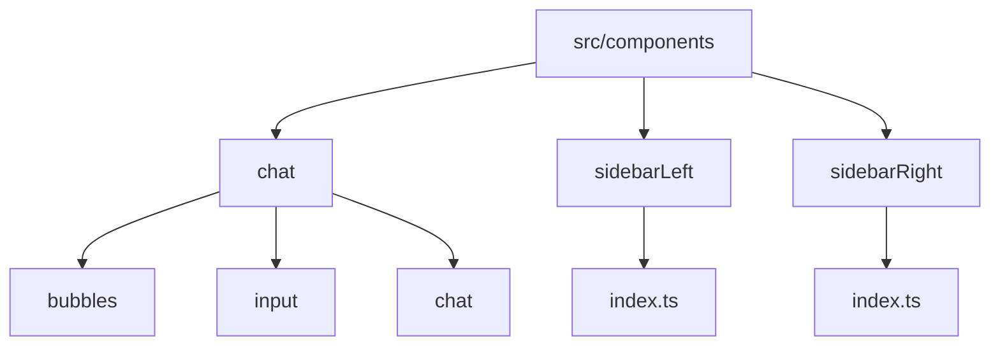
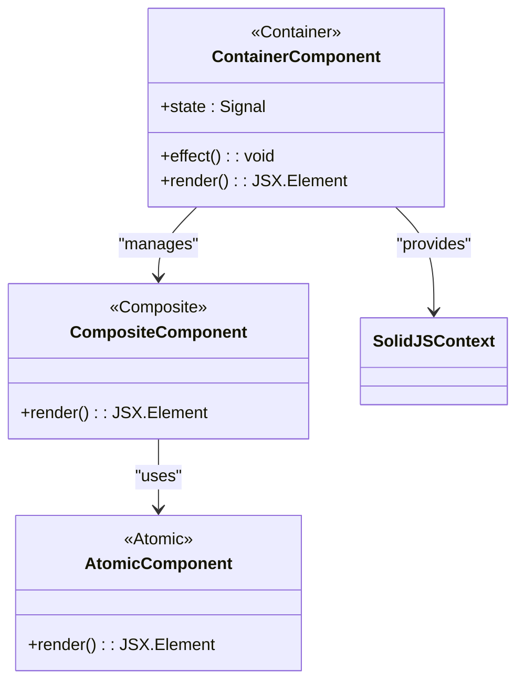
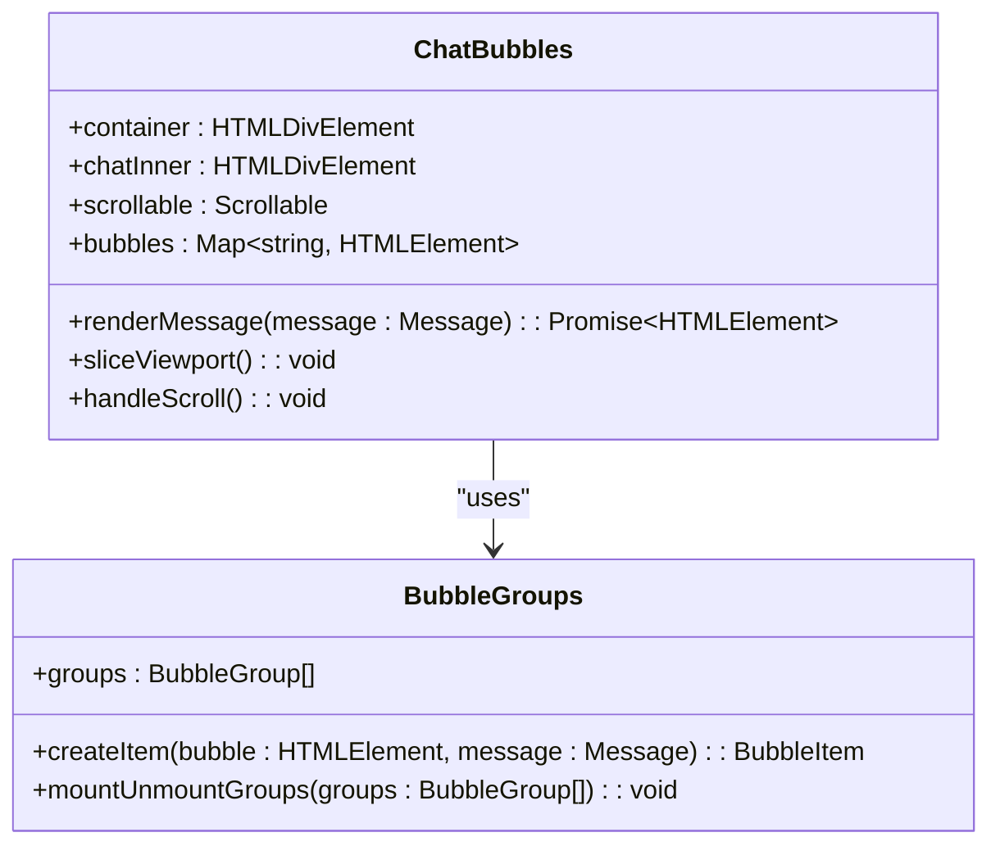
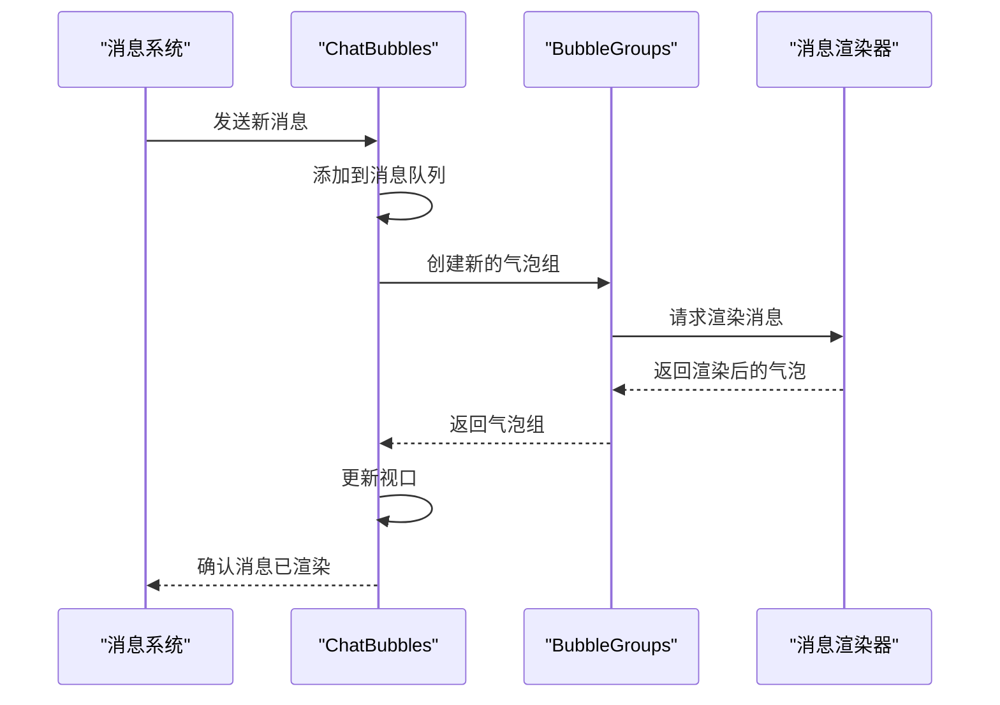
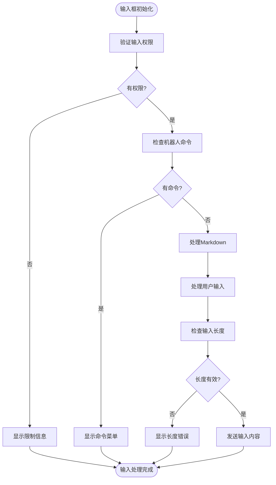
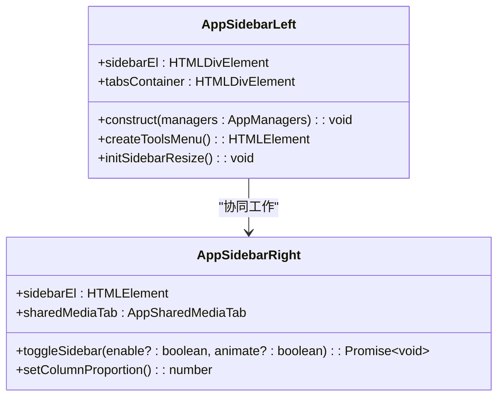
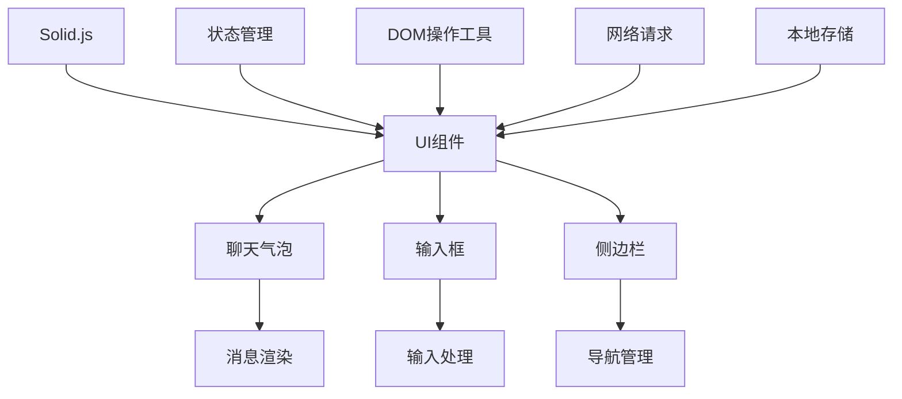

# UI组件架构

<cite>
**本文档引用的文件**   
- [bubbles.ts](file://src/components/chat/bubbles.ts)
- [input.ts](file://src/components/chat/input.ts)
- [chat.ts](file://src/components/chat/chat.ts)
- [sidebarLeft/index.ts](file://src/components/sidebarLeft/index.ts)
- [sidebarRight/index.ts](file://src/components/sidebarRight/index.ts)
- [hotReloadGuardProvider.tsx](file://src/lib/solidjs/hotReloadGuardProvider.tsx)
</cite>

## 目录
1. [简介](#简介)
2. [项目结构](#项目结构)
3. [核心组件](#核心组件)
4. [架构概述](#架构概述)
5. [详细组件分析](#详细组件分析)
6. [依赖关系分析](#依赖关系分析)
7. [性能考虑](#性能考虑)
8. [故障排除指南](#故障排除指南)
9. [结论](#结论)

## 简介
本文档详细描述了tweb项目的UI组件架构，重点分析基于Solid.js的组件层次结构。文档涵盖了原子组件、复合组件和容器组件的分类与实现，解释了组件间的父子关系和兄弟关系，以及通过props和context进行数据传递的模式。同时记录了组件复用机制和高阶组件设计，说明了组件生命周期管理策略，包括挂载、更新和卸载过程中的性能优化。提供了组件开发规范，包括命名约定、文件组织和测试策略，并分析了关键组件如聊天气泡、输入框、侧边栏等的实现细节和交互逻辑。

## 项目结构
tweb项目的UI组件主要位于`src/components`目录下，采用基于Solid.js的组件化架构。项目结构清晰地分离了不同类型的UI组件，包括聊天相关组件、侧边栏组件、输入组件等。组件被组织成原子组件、复合组件和容器组件的层次结构，通过props和context进行数据传递。

**Diagram sources**
- [bubbles.ts](file://src/components/chat/bubbles.ts#L1-L100)
- [input.ts](file://src/components/chat/input.ts#L1-L100)
- [chat.ts](file://src/components/chat/chat.ts#L1-L100)
- [sidebarLeft/index.ts](file://src/components/sidebarLeft/index.ts#L1-L100)
- [sidebarRight/index.ts](file://src/components/sidebarRight/index.ts#L1-L100)

**Section sources**
- [bubbles.ts](file://src/components/chat/bubbles.ts#L1-L100)
- [input.ts](file://src/components/chat/input.ts#L1-L100)
- [chat.ts](file://src/components/chat/chat.ts#L1-L100)
- [sidebarLeft/index.ts](file://src/components/sidebarLeft/index.ts#L1-L100)
- [sidebarRight/index.ts](file://src/components/sidebarRight/index.ts#L1-L100)

## 核心组件
tweb项目的核心UI组件包括聊天气泡、输入框、侧边栏等。这些组件基于Solid.js构建，采用了响应式编程模式，通过信号(Signal)和效果(Effect)来管理组件状态和副作用。组件间通过props传递数据，通过context提供全局状态访问。

**Section sources**
- [bubbles.ts](file://src/components/chat/bubbles.ts#L1-L100)
- [input.ts](file://src/components/chat/input.ts#L1-L100)
- [chat.ts](file://src/components/chat/chat.ts#L1-L100)

## 架构概述
tweb项目的UI架构采用分层设计，将组件分为原子组件、复合组件和容器组件三个层次。原子组件是最基本的UI元素，如按钮、输入框等；复合组件由多个原子组件组合而成，实现特定功能；容器组件负责管理状态和数据流，协调多个复合组件的工作。

**Diagram sources**
- [hotReloadGuardProvider.tsx](file://src/lib/solidjs/hotReloadGuardProvider.tsx#L1-L50)

## 详细组件分析

### 聊天气泡组件分析
聊天气泡组件是tweb项目中最复杂的UI组件之一，负责渲染和管理聊天消息的显示。组件采用了虚拟列表技术来优化大量消息的渲染性能，通过Intersection Observer来实现消息的懒加载。

#### 对象导向组件

**Diagram sources**
- [bubbles.ts](file://src/components/chat/bubbles.ts#L442-L500)

#### API/服务组件

**Diagram sources**
- [bubbles.ts](file://src/components/chat/bubbles.ts#L616-L724)

**Section sources**
- [bubbles.ts](file://src/components/chat/bubbles.ts#L1-L1000)

### 输入框组件分析
输入框组件负责处理用户输入，包括文本输入、表情选择、文件上传等功能。组件实现了复杂的输入处理逻辑，支持Markdown格式、自动完成、表情插入等特性。

#### 复杂逻辑组件

**Diagram sources**
- [input.ts](file://src/components/chat/input.ts#L169-L800)

**Section sources**
- [input.ts](file://src/components/chat/input.ts#L1-L1000)

### 侧边栏组件分析
侧边栏组件提供了应用的主要导航功能，包括聊天列表、联系人、设置等。组件采用了滑动标签页设计，支持多种视图模式的切换。

#### 对象导向组件

**Diagram sources**
- [sidebarLeft/index.ts](file://src/components/sidebarLeft/index.ts#L113-L200)
- [sidebarRight/index.ts](file://src/components/sidebarRight/index.ts#L19-L30)

**Section sources**
- [sidebarLeft/index.ts](file://src/components/sidebarLeft/index.ts#L1-L1000)
- [sidebarRight/index.ts](file://src/components/sidebarRight/index.ts#L1-L300)

## 依赖关系分析
tweb项目的UI组件之间存在复杂的依赖关系，通过Solid.js的context机制和props传递来实现数据共享和通信。核心依赖包括Solid.js运行时、状态管理工具、DOM操作工具等。

**Diagram sources**
- [hotReloadGuardProvider.tsx](file://src/lib/solidjs/hotReloadGuardProvider.tsx#L58-L120)

**Section sources**
- [hotReloadGuardProvider.tsx](file://src/lib/solidjs/hotReloadGuardProvider.tsx#L1-L123)

## 性能考虑
tweb项目在UI性能优化方面采用了多种策略，包括虚拟列表、懒加载、防抖和节流等技术。组件的渲染性能通过Solid.js的细粒度响应式系统得到优化，减少了不必要的重渲染。

## 故障排除指南
当遇到UI组件问题时，可以按照以下步骤进行排查：
1. 检查组件的props是否正确传递
2. 验证状态信号是否正确更新
3. 检查effect函数是否有无限循环
4. 确认事件监听器是否正确绑定和清理
5. 验证异步操作是否正确处理

**Section sources**
- [bubbles.ts](file://src/components/chat/bubbles.ts#L495-L497)
- [input.ts](file://src/components/chat/input.ts#L495-L497)
- [chat.ts](file://src/components/chat/chat.ts#L238-L240)

## 结论
tweb项目的UI组件架构基于Solid.js构建，采用了分层设计和响应式编程模式。通过原子组件、复合组件和容器组件的合理划分，实现了高内聚低耦合的组件体系。组件间通过props和context进行数据传递，利用Solid.js的信号和效果机制管理状态和副作用。架构设计充分考虑了性能优化，采用了虚拟列表、懒加载等技术来提升用户体验。整体架构具有良好的可维护性和扩展性，为应用的持续发展奠定了坚实基础。