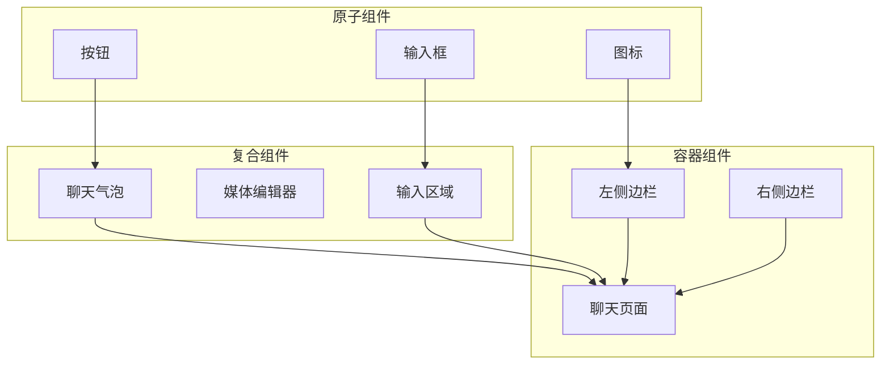
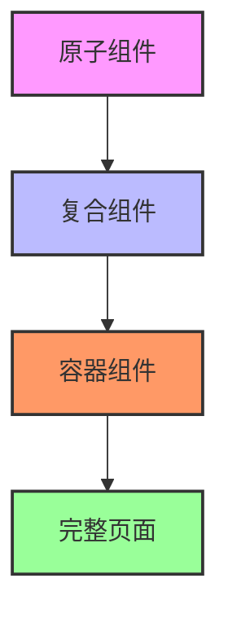
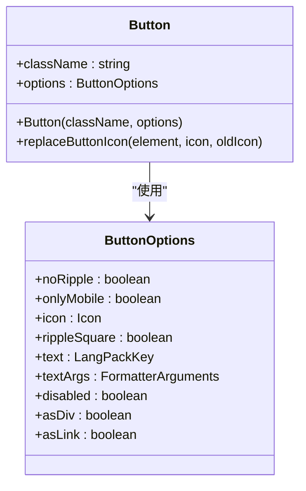
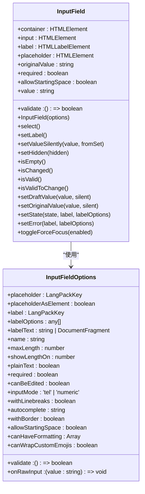
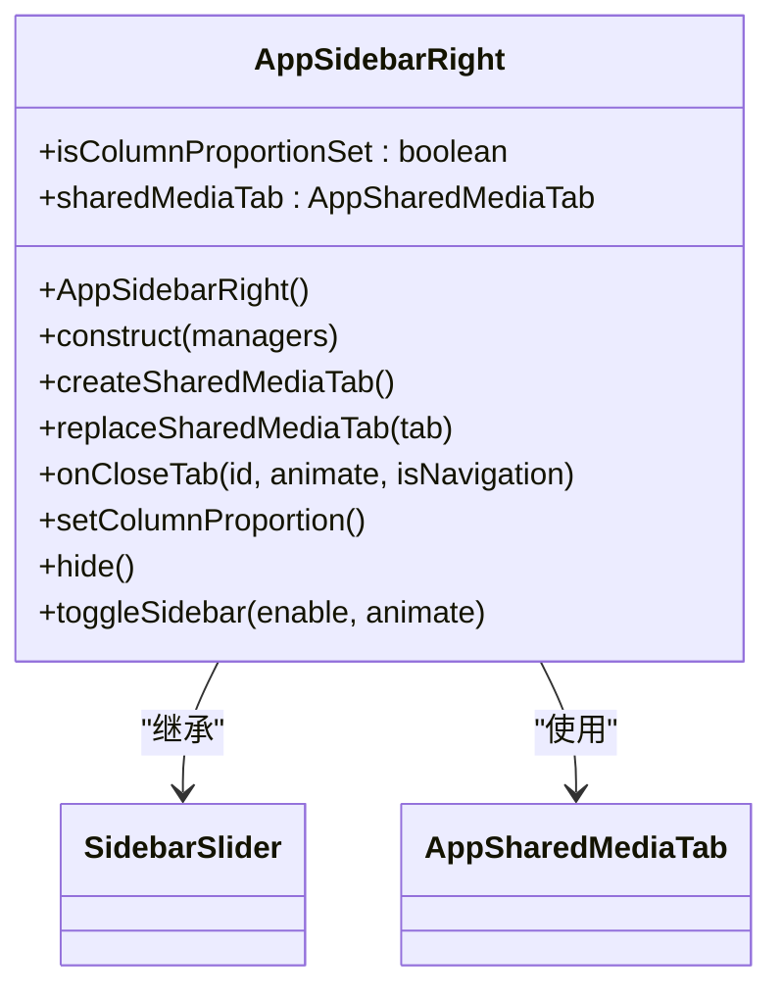
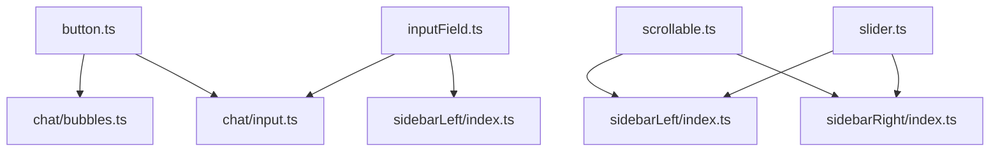

# 组件分类与设计

<cite>
**本文档引用的文件**   
- [button.ts](file://src/components/button.ts)
- [inputField.ts](file://src/components/inputField.ts)
- [scrollable.ts](file://src/components/scrollable.ts)
- [slider.ts](file://src/components/slider.ts)
- [sidebarLeft/index.ts](file://src/components/sidebarLeft/index.ts)
- [sidebarRight/index.ts](file://src/components/sidebarRight/index.ts)
- [chat/bubbles.ts](file://src/components/chat/bubbles.ts)
- [chat/input.ts](file://src/components/chat/input.ts)
</cite>

## 目录
1. [引言](#引言)
2. [项目结构](#项目结构)
3. [核心组件](#核心组件)
4. [架构概述](#架构概述)
5. [详细组件分析](#详细组件分析)
6. [依赖分析](#依赖分析)
7. [性能考虑](#性能考虑)
8. [故障排除指南](#故障排除指南)
9. [结论](#结论)
10. [附录](#附录)（如有必要）

## 引言
本文档旨在系统性地描述tweb项目中UI组件的分类与设计原则。我们将深入分析原子组件（如按钮、输入框）、复合组件（如聊天气泡组、媒体编辑器）和容器组件（如聊天页面、设置面板）的划分标准与实现方式。文档将重点关注聊天气泡、输入区域和侧边栏等核心UI元素的设计思路，并阐述组件接口定义规范、属性验证机制以及样式隔离策略。

## 项目结构
tweb项目的UI组件主要组织在`src/components`目录下，采用功能模块化的方式进行分类管理。核心UI组件被划分为多个子目录，包括原子组件（如button、inputField）、复合组件（如chat/bubbles、mediaEditor）和容器组件（如sidebarLeft、sidebarRight）。这种分层结构有助于实现组件的单一职责、可复用性和可测试性。



**图表来源**
- [button.ts](file://src/components/button.ts)
- [inputField.ts](file://src/components/inputField.ts)
- [chat/bubbles.ts](file://src/components/chat/bubbles.ts)
- [chat/input.ts](file://src/components/chat/input.ts)
- [sidebarLeft/index.ts](file://src/components/sidebarLeft/index.ts)
- [sidebarRight/index.ts](file://src/components/sidebarRight/index.ts)

**章节来源**
- [src/components](file://src/components)

## 核心组件
tweb项目的核心UI组件遵循单一职责原则，每个组件都有明确的功能定位。原子组件作为构建块，提供基础的UI元素；复合组件由多个原子组件组合而成，实现特定的交互功能；容器组件则负责组织和协调多个复合组件，形成完整的用户界面。

**章节来源**
- [button.ts](file://src/components/button.ts#L1-L60)
- [inputField.ts](file://src/components/inputField.ts#L1-L803)
- [scrollable.ts](file://src/components/scrollable.ts#L1-L483)

## 架构概述
tweb项目的UI架构采用分层设计模式，从底层的原子组件到顶层的容器组件，形成清晰的组件层级关系。组件之间的通信主要通过事件机制和状态管理来实现，确保了组件的松耦合和高内聚。



**图表来源**
- [src/components](file://src/components)
- [src/components/chat](file://src/components/chat)

## 详细组件分析
本节将深入分析tweb项目中的关键UI组件，包括其设计原则、实现模式和使用方法。

### 原子组件分析
原子组件是UI系统中最基础的构建块，它们具有高度的可复用性和可测试性。

#### 按钮组件
按钮组件（Button）是典型的原子组件，它封装了按钮的基本样式和交互行为。通过参数化配置，可以轻松创建不同样式和功能的按钮实例。



**图表来源**
- [button.ts](file://src/components/button.ts#L1-L60)

**章节来源**
- [button.ts](file://src/components/button.ts#L1-L60)

#### 输入框组件
输入框组件（InputField）是一个复杂的原子组件，它不仅处理文本输入，还支持富文本格式、自定义表情和输入验证等功能。



**图表来源**
- [inputField.ts](file://src/components/inputField.ts#L1-L803)

**章节来源**
- [inputField.ts](file://src/components/inputField.ts#L1-L803)

### 复合组件分析
复合组件由多个原子组件组合而成，实现更复杂的交互功能。

#### 聊天气泡组件
聊天气泡组件（ChatBubbles）是聊天界面的核心复合组件，它负责渲染和管理单个或多个消息气泡的显示和交互。

**章节来源**
- [chat/bubbles.ts](file://src/components/chat/bubbles.ts)

#### 输入区域组件
输入区域组件（ChatInput）是聊天界面的另一个关键复合组件，它整合了输入框、表情选择器、文件上传等功能，提供完整的消息输入体验。

**章节来源**
- [chat/input.ts](file://src/components/chat/input.ts)

### 容器组件分析
容器组件负责组织和协调多个复合组件，形成完整的用户界面。

#### 左侧边栏组件
左侧边栏组件（AppSidebarLeft）是一个复杂的容器组件，它管理着聊天列表、联系人、设置等多个子页面的切换和显示。

```mermaid
classDiagram
class AppSidebarLeft {
+chatListContainer : HTMLElement
+buttonsContainer : HTMLElement
+toolsBtn : HTMLElement
+backBtn : HTMLButtonElement
+inputSearch : InputSearch
+archivedCount : HTMLSpanElement
+totalNotificationsCount : HTMLSpanElement
+totalNotificationsCountSidebar : HTMLSpanElement
+rect : DOMRect
+newBtnMenu : HTMLElement
+searchGroups : {[k in 'contacts' | 'globalContacts' | 'messages' | 'people' | 'recent'] : SearchGroup}
+searchSuper : AppSearchSuper
+searchInitResult : SearchInitResult
+isSearchActive : boolean
+searchTriggerWhenCollapsed : HTMLElement
+updateBtn : HTMLElement
+hasUpdate : boolean
+onResize : () => void
+foldersSidebarControls : FoldersSidebarControls
+AppSidebarLeft()
+construct(managers)
+isCollapsed()
+hasFoldersSidebar()
+onCollapsedChange(canShowCtrlFTip)
+hasSomethingOpenInside()
+closeEverythingInside()
+onSomethingOpenInsideChange(closingSearch, force)
+showCtrlFTip()
+initSidebarResize()
+createToolsMenu(mountTo)
}
AppSidebarLeft --> SidebarSlider : "继承"
AppSidebarLeft --> InputSearch : "使用"
AppSidebarLeft --> AppSearchSuper : "使用"
AppSidebarLeft --> FoldersSidebarControls : "使用"
```

**图表来源**
- [sidebarLeft/index.ts](file://src/components/sidebarLeft/index.ts#L1-L800)

**章节来源**
- [sidebarLeft/index.ts](file://src/components/sidebarLeft/index.ts#L1-L800)

#### 右侧边栏组件
右侧边栏组件（AppSidebarRight）与左侧边栏类似，但专注于显示当前聊天的附加信息，如共享媒体、联系人详情等。



**图表来源**
- [sidebarRight/index.ts](file://src/components/sidebarRight/index.ts#L1-L216)

**章节来源**
- [sidebarRight/index.ts](file://src/components/sidebarRight/index.ts#L1-L216)

## 依赖分析
tweb项目的UI组件之间存在清晰的依赖关系。原子组件作为基础构建块，被复合组件所依赖；复合组件又被容器组件所依赖。这种分层依赖结构确保了组件的可维护性和可扩展性。



**图表来源**
- [button.ts](file://src/components/button.ts)
- [inputField.ts](file://src/components/inputField.ts)
- [scrollable.ts](file://src/components/scrollable.ts)
- [slider.ts](file://src/components/slider.ts)
- [chat/bubbles.ts](file://src/components/chat/bubbles.ts)
- [chat/input.ts](file://src/components/chat/input.ts)
- [sidebarLeft/index.ts](file://src/components/sidebarLeft/index.ts)
- [sidebarRight/index.ts](file://src/components/sidebarRight/index.ts)

**章节来源**
- [src/components](file://src/components)

## 性能考虑
在设计UI组件时，tweb项目充分考虑了性能优化。例如，滚动组件（Scrollable）采用了节流和防抖技术来优化滚动事件的处理；输入框组件（InputField）通过延迟渲染和批量更新来提高输入响应速度。此外，组件的懒加载和按需加载策略也有效减少了初始加载时间。

## 故障排除指南
当遇到UI组件相关的问题时，建议按照以下步骤进行排查：
1. 检查组件的依赖是否正确导入
2. 验证组件的属性配置是否符合要求
3. 查看浏览器控制台是否有错误或警告信息
4. 确认组件的生命周期方法是否正确执行
5. 检查样式冲突或覆盖问题

**章节来源**
- [src/components](file://src/components)
- [src/components/chat](file://src/components/chat)

## 结论
tweb项目的UI组件设计遵循了现代前端开发的最佳实践，通过清晰的分层结构和模块化设计，实现了组件的高内聚、低耦合。原子组件、复合组件和容器组件的划分标准明确，设计原则一致，为项目的可维护性和可扩展性提供了坚实的基础。未来可以进一步优化组件的性能和可访问性，提升用户体验。